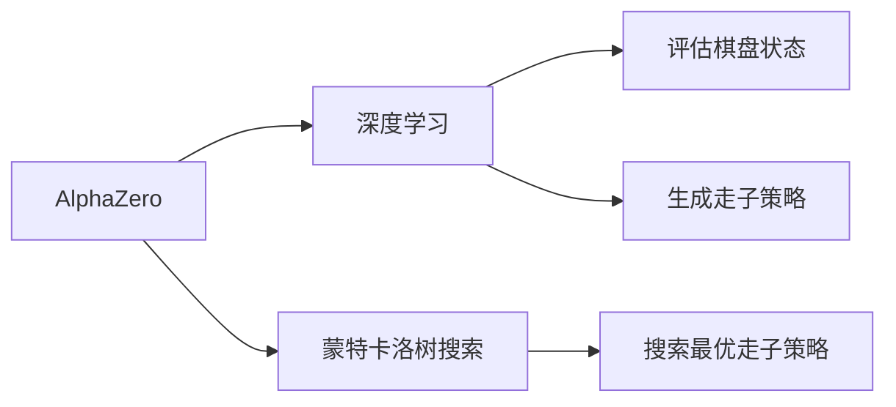

## 1.背景介绍

AlphaZero 是 DeepMind 公司开发的一款人工智能程序，它的出现，开启了一个新的人工智能时代。AlphaZero 通过自我对弈学习，不需要任何人类的先验知识，仅仅几小时的学习，就能达到超越人类的水平。这是一种全新的方法，它打破了传统的人工智能学习方法，为未来的人工智能发展开辟了新的道路。

## 2.核心概念与联系

AlphaZero 是基于强化学习的算法，它将深度学习和蒙特卡洛树搜索（MCTS）相结合，实现了自我对弈学习。其中，深度学习用于评估棋盘的状态和生成走子策略，而 MCTS 则用于搜索最优的走子策略。

## 3.核心算法原理具体操作步骤

AlphaZero 的核心算法原理分为以下几个步骤：

1. **初始化**：随机初始化网络参数，生成初始的策略网络和价值网络。
2. **自我对弈**：使用当前的策略网络进行自我对弈，生成对弈数据。
3. **训练**：使用对弈数据训练策略网络和价值网络，更新网络参数。
4. **迭代**：重复上述步骤，直到网络性能达到预设的标准。

## 4.数学模型和公式详细讲解举例说明

AlphaZero 的数学模型主要包括策