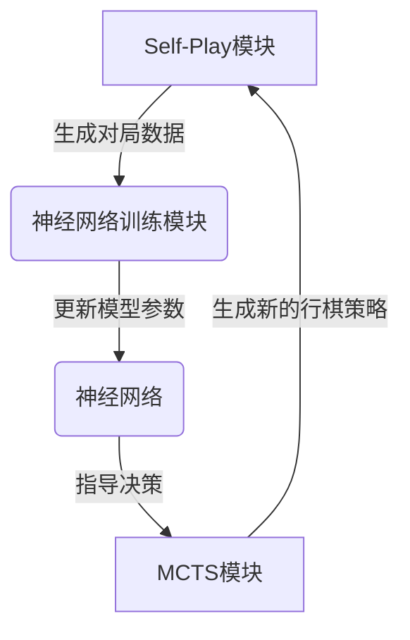

# AlphaZero原理与代码实例讲解

## 1.背景介绍

### 1.1 人工智能发展历程

人工智能(Artificial Intelligence, AI)是当代科技领域最具革命性和颠覆性的技术之一。自20世纪50年代诞生以来,AI不断突破理论和技术瓶颈,在多个领域取得了令人瞩目的成就。

### 1.2 AlphaGo的里程碑意义 

2016年,谷歌DeepMind团队开发的AlphaGo战胜了世界顶级围棋手李世乭,成为AI在复杂决策领域的一个里程碑。AlphaGo的核心是结合深度神经网络和蒙特卡罗树搜索(MCTS)的技术。尽管取得了巨大成功,但AlphaGo存在一些局限性:需要先验知识和大量的人类专家对局数据进行训练。

### 1.3 AlphaZero的诞生

为了突破AlphaGo的局限,DeepMind提出了AlphaZero算法,只依赖于游戏规则,通过自我对弈(Self-Play)的方式自主学习,最终在国际象棋、围棋和日本将棋三个棋类游戏中都展现出超越人类顶尖水平的实力。AlphaZero的出现标志着通过强化学习训练的纯策略迭代算法在复杂决策领域的巨大潜力。

## 2.核心概念与联系

### 2.1 AlphaZero算法概述

AlphaZero算法包含四个核心模块:

1. 神经网络(Neural Network)
2. 蒙特卡罗树搜索(Monte Carlo Tree Search, MCTS)  
3. Self-Play模块
4. 神经网络训练模块

这四个模块相互协作,形成一个自我训练的闭环系统。



### 2.2 神经网络

AlphaZero使用的是一个双头神经网络结构,包括策略头(Policy Head)和价值头(Value Head):

- 策略头预测下一步的最佳移动位置的概率分布
- 价值头预测当前局面对执棋方的胜率评分

神经网络使用的是残差网络(ResNet)结构,可以有效解决梯度消失和梯度爆炸问题,提高了训练的稳定性。

### 2.3 蒙特卡罗树搜索(MCTS)

蒙特卡罗树搜索是一种基于统计的最优决策方法,通过多次随机采样模拟,构建一棵展开树,估计每个可能动作的预期价值,从而选择最优动作。MCTS在AlphaZero中的作用是:

1. 基于神经网络输出的先验概率,通过蒙特卡罗采样模拟对局
2. 利用模拟结果更新展开树的统计数据
3. 基于更新后的统计数据,选择新一轮的最优移动位置

### 2.4 Self-Play模块

Self-Play是AlphaZero训练的核心环节。算法会根据当前的神经网络模型进行自我对弈,生成大量的模拟对局数据,这些数据用于重新训练神经网络,使其不断强化和进化。

### 2.5 神经网络训练

AlphaZero通过监督学习的方式训练神经网络。具体来说,就是将Self-Play生成的对局数据作为训练集,使用策略头对应的移动位置作为监督标签,价值头对应的对局结果作为监督标签,通过反向传播算法优化网络参数,提高预测精度。

## 3.核心算法原理具体操作步骤 

### 3.1 AlphaZero算法流程

AlphaZero算法的工作流程如下:

1. 初始化一个随机的神经网络模型
2. 进入Self-Play循环:
    - 使用当前神经网络模型进行自我对弈,生成模拟对局数据
    - 将对局数据作为训练集,训练新的神经网络模型
    - 用新模型替换旧模型,进入下一轮循环
3. 重复Self-Play循环,直到模型收敛或达到事先设定的训练步数

下面是AlphaZero算法的伪代码:

```python
import random

# 初始化随机神经网络
neural_net = initialize_random_neural_net()

for training_step in range(num_training_steps):
    # Self-Play生成训练数据
    training_data = []
    for game in range(num_self_play_games):
        # 使用当前神经网络模型自我对弈
        game_history = self_play(neural_net)
        training_data.extend(game_history)
    
    # 训练新的神经网络
    new_neural_net = train_network(neural_net, training_data)
    
    # 用新模型替换旧模型
    neural_net = new_neural_net

# 返回训练好的神经网络
return neural_net
```

### 3.2 MCTS具体执行步骤

MCTS在AlphaZero中的执行步骤如下:

1. 选择(Selection)
    - 从根节点开始,递归选择子节点,直到到达一个未展开的节点
    - 选择策略基于上一层节点的访问次数和神经网络输出的先验概率
2. 展开(Expansion)
    - 对未展开的节点,基于神经网络输出计算其子节点的先验概率和价值评分
    - 将这些子节点添加到展开树中
3. 模拟(Simulation)
    - 从展开的新节点出发,通过随机采样模拟对局直到终局
    - 记录模拟的对局结果(胜/负/平)
4. 反向传播(Backpropagation)
    - 将模拟的对局结果反向传播到展开树的各个节点
    - 更新每个节点的访问次数和胜率统计
5. 重复1-4步,直到达到计算资源限制
6. 选择访问次数最多的子节点作为最优移动位置

### 3.3 神经网络训练细节

AlphaZero使用的是监督学习方法训练神经网络,目标是最小化策略头和价值头的损失函数:

$$J = (z-v)^2 - \pi^T\log p + c||\theta||^2$$

其中:
- $z$是Self-Play生成的对局结果(1表示胜利,0表示失败)
- $v$是价值头预测的胜率评分
- $\pi$是Self-Play中的实际移动位置概率分布
- $p$是策略头预测的移动位置概率分布
- $\theta$是神经网络的参数
- $c$是正则化系数,用于防止过拟合

使用随机梯度下降和动量等优化算法,最小化损失函数$J$,从而提高神经网络的预测精度。

## 4.数学模型和公式详细讲解举例说明

### 4.1 Upper Confidence Bounds (UCB)

AlphaZero在MCTS的选择(Selection)阶段使用了UCB公式来权衡exploitation(利用已知的最优选择)和exploration(探索新的可能性):

$$U_i = Q_i + c_{puct} \times P_i \times \frac{\sqrt{\sum_jN_j}}{1+N_i}$$

- $U_i$是对应子节点$i$的UCB值
- $Q_i$是子节点$i$的平均行棋分数(胜率)
- $P_i$是神经网络预测的子节点$i$的先验概率
- $N_i$是子节点$i$的访问次数
- $c_{puct}$是一个调节exploitation和exploration的超参数

UCB值越大,越有可能被选择作为下一步的移动位置。UCB公式平衡了两个目标:
1. 选择历史表现最好的子节点($Q_i$项)
2. 选择神经网络预测的最优移动位置($P_i$项)

### 4.2 价值头和策略头的损失函数

AlphaZero的神经网络使用以下损失函数进行训练:

**价值头损失函数:**
$$l^{(v)} = (z-v)^2$$

其中$z$是Self-Play生成的对局结果(1表示胜利,0表示失败),$v$是价值头预测的胜率评分。

**策略头损失函数:**
$$l^{(\pi)} = -\pi^T\log p$$

其中$\pi$是Self-Play中的实际移动位置概率分布,$p$是策略头预测的移动位置概率分布。

**总损失函数:**

$$J = l^{(v)} + l^{(\pi)} + c||\theta||^2$$

$c$是正则化系数,用于防止过拟合。

通过最小化总损失函数$J$,可以提高神经网络对局面评估和移动选择的准确性。

### 4.3 AlphaZero的时间复杂度分析

AlphaZero算法的时间复杂度主要来自以下几个部分:

1. **Self-Play**:时间复杂度为$O(m\times n\times l)$,其中$m$是自我对弈的游戏数量,$n$是每场对局的平均长度,$l$是MCTS的模拟次数。
2. **神经网络评估**:时间复杂度为$O(n\times l\times f(x))$,其中$f(x)$是神经网络的计算复杂度,与网络结构和输入特征相关。
3. **神经网络训练**:时间复杂度为$O(k\times f(x))$,其中$k$是训练步数。

综合以上三个部分,AlphaZero算法的总时间复杂度约为$O(m\times n\times l\times f(x) + k\times f(x))$。可以看出,MCTS模拟次数$l$和神经网络计算复杂度$f(x)$是算法效率的两个主要瓶颈。

## 5.项目实践:代码实例和详细解释说明

为了更好地理解AlphaZero算法的实现细节,我们将通过一个简化的国际象棋游戏的例子,展示AlphaZero的关键代码模块。

### 5.1 游戏状态表示

我们使用一个8x8的二维数组来表示国际象棋棋盘,其中每个元素的值表示当前位置的棋子类型。例如,1表示白王后,-1表示黑王后,0表示空位置。

```python
# 定义棋子类型
EMPTY = 0
WPAWN = 1  
BPAWN = -1
# ... 其他棋子类型

# 初始化棋盘
board = np.array([
    [BPAWN, BPAWN, BPAWN, BPAWN, BPAWN, BPAWN, BPAWN, BPAWN],
    [BPAWN, EMPTY, EMPTY, EMPTY, EMPTY, EMPTY, EMPTY, BPAWN],
    # ... 其他初始位置
    [WPAWN, WPAWN, WPAWN, WPAWN, WPAWN, WPAWN, WPAWN, WPAWN]
])
```

### 5.2 神经网络结构

我们使用一个简单的全连接神经网络作为AlphaZero的策略头和价值头。输入是当前棋盘状态的一维展平表示,输出是移动位置的概率分布和当前局面的胜率评分。

```python
import torch
import torch.nn as nn

class ChessNet(nn.Module):
    def __init__(self, board_size, num_planes, num_actions):
        super().__init__()
        self.board_size = board_size
        self.num_planes = num_planes
        self.num_actions = num_actions
        
        self.conv_layers = nn.Sequential(
            nn.Conv2d(num_planes, 128, kernel_size=3, padding=1),
            nn.BatchNorm2d(128),
            nn.ReLU(),
            # ... 其他卷积层
        )
        
        self.policy_head = nn.Linear(128 * board_size ** 2, num_actions)
        self.value_head = nn.Linear(128 * board_size ** 2, 1)
        
    def forward(self, x):
        batch_size = x.size(0)
        x = x.view(-1, self.num_planes, self.board_size, self.board_size)
        x = self.conv_layers(x)
        x = x.view(batch_size, -1)
        
        policy = self.policy_head(x)
        value = self.value_head(x)
        
        return policy, value
```

### 5.3 MCTS实现

下面是MCTS模块的核心代码,包括选择(Selection)、展开(Expansion)、模拟(Simulation)和反向传播(Backpropagation)四个步骤。

```python
import math

class Node:
    def __init__(self, state, parent=None):
        self.state = state
        self.parent = parent
        self.children = {}
        self.visit_count = 0
        self.value_sum = 0
        self.untried_