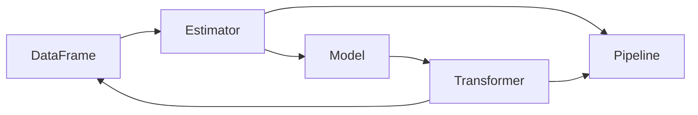

# Apache Spark MLlib

## 1. 背景介绍

Apache Spark 是一个快速、通用的大规模数据处理引擎，具有易用、快速、通用等特点。Spark 在大数据处理领域已经成为事实上的标准。而 MLlib 则是 Spark 的机器学习库，提供了各种常用的机器学习算法的分布式实现，使得在大规模数据集上训练机器学习模型变得更加简单和高效。

### 1.1 Spark 生态系统概述

#### 1.1.1 Spark Core

Spark Core 是整个 Spark 项目的基础，提供了分布式任务调度、内存管理、容错机制等核心功能，并为其他组件提供了基础 API。

#### 1.1.2 Spark SQL

Spark SQL 是 Spark 用于结构化数据处理的组件。它提供了一个名为 DataFrame 的编程抽象，并且可以作为分布式 SQL 查询引擎。

#### 1.1.3 Spark Streaming  

Spark Streaming 是 Spark 平台上针对实时数据流进行流式计算的组件。它支持从 Kafka、Flume、Kinesis 等数据源获取实时数据流，并进行各种流式计算。

#### 1.1.4 GraphX

GraphX 是 Spark 中用于图计算和图挖掘的新组件，可以进行图的 ETL、探索性分析和迭代图计算等。

#### 1.1.5 MLlib  

MLlib 则是 Spark 的分布式机器学习库，提供了常见的机器学习算法和实用程序，包括分类、回归、聚类、协同过滤等。

### 1.2 MLlib 发展历程

MLlib 最初由 AMPLab 的 Spark 团队于 2012 年发起，旨在让 Spark 用户可以简单、快速地在大规模数据集上应用各种机器学习算法。MLlib 在 Spark 1.2 时正式成为 Spark 的一个子项目，而后在不断发展壮大，成为最活跃的开源机器学习库之一。

### 1.3 MLlib 优势

#### 1.3.1 易用性

MLlib 提供了丰富的 API，简化了机器学习工作流程中的各个环节，如数据预处理、特征提取、模型训练、模型评估等。用户可以用很少的代码快速实现一个端到端的机器学习应用。

#### 1.3.2 性能

MLlib 是目前最快的单节点机器学习库，同时 MLlib 支持模型并行和数据并行，可以实现快速的分布式模型训练。

#### 1.3.3 集成性

MLlib 与 Spark 生态系统的其他组件（如 Spark SQL、Spark Streaming）无缝集成，使得用户可以在同一个应用中完成数据预处理、特征工程、模型训练等不同的任务。

## 2. 核心概念与联系

### 2.1 DataFrame

DataFrame 是 Spark SQL 中的分布式数据集合，与关系型数据库中的二维表格类似。它是 MLlib 的基本数据结构。

### 2.2 Transformer

Transformer 是一种可以将一个 DataFrame 转换为另一个 DataFrame 的算法。比如分类模型就是一种 Transformer，它可以将一个不包含预测标签的测试数据集转换为一个包含预测标签的数据集。

### 2.3 Estimator

Estimator 是一种可以根据 DataFrame 训练出一个 Transformer 的算法。比如一个随机森林分类算法就是一个 Estimator，它可以训练出一个随机森林分类模型（Transformer）。

### 2.4 Pipeline

Pipeline 可以将多个 Transformer 和 Estimator 链接起来，形成一个端到端的机器学习工作流水线。

### 2.5 Parameter

Transformer 和 Estimator 都有参数（Parameter），这些参数可以通过 ParamMap 进行设置。

下图展示了这些核心概念之间的联系：



## 3. 核心算法原理具体操作步骤

以下我们以 MLlib 中的随机森林分类算法为例，介绍其核心原理和具体操作步骤。

### 3.1 随机森林分类原理

随机森林是一种集成学习方法，通过构建多个决策树并将它们的结果组合来提高预测准确性和控制过拟合。

#### 3.1.1 决策树构建

随机森林中的每棵决策树都是通过以下步骤构建的：

1. 从原始训练集中采样生成一个新的训练集（Bootstrap Sampling）。
2. 从所有特征中随机选择一个特征子集。
3. 使用选定的特征子集，通过某种决策树算法（如 CART）构建一棵决策树。
4. 重复步骤 1-3，构建多棵决策树形成随机森林。

#### 3.1.2 分类预测

对于一个新的输入样本，随机森林的预测过程如下：

1. 将输入样本输入到每棵决策树中进行预测。
2. 每棵决策树给出一个类别预测结果。
3. 对所有决策树的预测结果进行投票，得票最多的类别作为随机森林的最终预测结果。

### 3.2 使用 MLlib 实现随机森林分类

#### 3.2.1 数据准备

首先需要准备训练数据和测试数据，数据格式为 DataFrame，包含特征列和标签列。

#### 3.2.2 特征工程

对特征进行处理，如特征选择、特征缩放等。MLlib 提供了多种特征转换器，如 VectorAssembler、StringIndexer、OneHotEncoder 等。

#### 3.2.3 模型训练

使用 RandomForestClassifier 进行模型训练，主要参数包括：

- numTrees：随机森林中决策树的数量
- maxDepth：决策树的最大深度
- impurity：决策树节点分裂标准，可选 "gini" 或 "entropy"

```scala
val rf = new RandomForestClassifier()
  .setNumTrees(10)
  .setMaxDepth(5)
  .setImpurity("gini")
  .setLabelCol("label")
  .setFeaturesCol("features")

val model = rf.fit(trainingData)  
```

#### 3.2.4 模型评估

使用训练好的模型对测试集进行预测，并使用 MulticlassClassificationEvaluator 计算评估指标，如准确率、F1 值等。

```scala
val predictions = model.transform(testData)

val evaluator = new MulticlassClassificationEvaluator()
  .setLabelCol("label")
  .setPredictionCol("prediction")
  .setMetricName("accuracy")

val accuracy = evaluator.evaluate(predictions)
println(s"Test accuracy = $accuracy")
```

## 4. 数学模型和公式详细讲解举例说明

### 4.1 Gini 不纯度

在随机森林算法中，决策树节点分裂通常使用基尼不纯度（Gini Impurity）作为分裂标准。假设有 $k$ 个类别，第 $i$ 个类别的概率为 $p_i$，则基尼不纯度定义为：

$$
Gini(p) = \sum_{i=1}^{k} p_i(1-p_i) = 1 - \sum_{i=1}^{k} p_i^2
$$

例如，假设一个二分类问题，正例概率为 0.6，负例概率为 0.4，则其基尼不纯度为：

$$
Gini(p) = 1 - (0.6^2 + 0.4^2) = 0.48
$$

### 4.2 信息增益

除了基尼不纯度，决策树还可以使用信息增益（Information Gain）作为分裂标准。信息增益基于信息熵（Entropy）的概念，信息熵定义为：

$$
H(X) = -\sum_{i=1}^{n} p(x_i) \log_2 p(x_i)
$$

其中，$p(x_i)$ 是事件 $x_i$ 发生的概率。

假设根据特征 A 对数据集 D 进行划分，得到 V 个子集 $\{D_1,D_2,...,D_V\}$，则信息增益定义为：

$$
Gain(D,A) = H(D) - \sum_{v=1}^{V} \frac{|D_v|}{|D|} H(D_v)
$$

其中，$H(D)$ 是数据集 D 的信息熵，$\frac{|D_v|}{|D|}$ 是子集 $D_v$ 占整个数据集的比例。

例如，假设数据集 D 中有 10 个样本，其中 7 个正例，3 个负例，则其信息熵为：

$$
H(D) = -(\frac{7}{10} \log_2 \frac{7}{10} + \frac{3}{10} \log_2 \frac{3}{10}) \approx 0.881
$$

如果根据特征 A 将数据集划分为 $D_1$ 和 $D_2$ 两个子集，其中 $D_1$ 包含 4 个正例和 1 个负例，$D_2$ 包含 3 个正例和 2 个负例，则信息增益为：

$$
\begin{aligned}
Gain(D,A) &= H(D) - (\frac{5}{10} H(D_1) + \frac{5}{10} H(D_2)) \\
          &\approx 0.881 - (\frac{5}{10} \times 0.722 + \frac{5}{10} \times 0.971) \\
          &\approx 0.035
\end{aligned}
$$

## 5. 项目实践：代码实例和详细解释说明

下面我们通过一个完整的代码实例，演示如何使用 MLlib 进行随机森林分类。

### 5.1 数据准备

```scala
import org.apache.spark.ml.classification.RandomForestClassifier
import org.apache.spark.ml.evaluation.MulticlassClassificationEvaluator
import org.apache.spark.ml.feature.{IndexToString, StringIndexer, VectorAssembler}
import org.apache.spark.sql.SparkSession

val spark = SparkSession.builder().getOrCreate()

// 加载数据
val data = spark.read.format("libsvm").load("data/mllib/sample_libsvm_data.txt")

// 划分训练集和测试集
val Array(trainingData, testData) = data.randomSplit(Array(0.7, 0.3))
```

这里我们使用 Spark 自带的 sample_libsvm_data.txt 数据集，并将其划分为训练集和测试集。

### 5.2 特征工程

```scala
// 对标签列进行索引
val labelIndexer = new StringIndexer()
  .setInputCol("label")
  .setOutputCol("indexedLabel")
  .fit(data)

// 对特征列进行向量化
val featureIndexer = new VectorAssembler()
  .setInputCols(Array("features"))
  .setOutputCol("indexedFeatures")
  .fit(data)
```

这里我们对标签列进行索引化处理，并使用 VectorAssembler 将特征列转换为向量格式。

### 5.3 模型训练

```scala
// 训练随机森林模型
val rf = new RandomForestClassifier()
  .setLabelCol("indexedLabel")
  .setFeaturesCol("indexedFeatures")
  .setNumTrees(10)

val model = rf.fit(trainingData)
```

使用 RandomForestClassifier 进行模型训练，设置决策树数量为 10。

### 5.4 模型评估

```scala
// 对测试集进行预测
val predictions = model.transform(testData)

// 评估模型
val evaluator = new MulticlassClassificationEvaluator()
  .setLabelCol("indexedLabel")
  .setPredictionCol("prediction")
  .setMetricName("accuracy")

val accuracy = evaluator.evaluate(predictions)
println(s"Test Error = ${1 - accuracy}")
```

使用训练好的模型对测试集进行预测，并使用 MulticlassClassificationEvaluator 计算准确率。

### 5.5 完整代码

```scala
import org.apache.spark.ml.classification.RandomForestClassifier
import org.apache.spark.ml.evaluation.MulticlassClassificationEvaluator
import org.apache.spark.ml.feature.{IndexToString, StringIndexer, VectorAssembler}
import org.apache.spark.sql.SparkSession

object RandomForestExample {
  def main(args: Array[String]): Unit = {
    val spark = SparkSession.builder().getOrCreate()

    // 加载数据
    val data = spark.read.format("libsvm").load("data/mllib/sample_libsvm_data.txt")

    // 划分训练集和测试集  
    val Array(trainingData, testData) = data.randomSplit(Array(0.7, 0.3))

    // 对标签列进行索引
    val labelIndexer = new StringIndexer()
      .setInputCol("label")
      .setOutputCol("indexedLabel")
      .fit(data)

    // 对特征列进行向量化
    val featureIndexer = new VectorAssembler()
      .setInputCols(Array("features"))
      .setOutputCol("indexedFeatures")
      .fit(data)

    // 