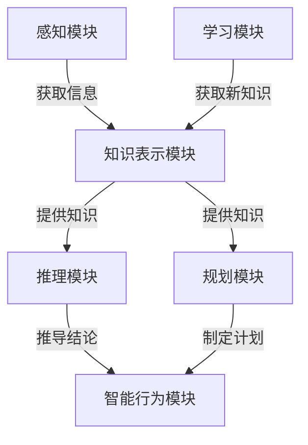

# Artificial Intelligence (AI)原理与代码实例讲解

## 1.背景介绍

### 1.1 人工智能的定义和重要性

人工智能(Artificial Intelligence, AI)是一门致力于研究和开发能够模拟人类智能行为的理论、方法、技术及应用系统的学科。它涉及多个领域,包括计算机科学、数学、心理学、语言学、哲学和神经科学等。人工智能的目标是创造出能够执行需要人类智能才能完成的复杂任务的智能机器。

人工智能已经广泛应用于各个领域,如图像识别、自然语言处理、决策支持系统、机器人控制等,极大地提高了工作效率,优化了资源配置。随着大数据、云计算、物联网等新兴技术的发展,人工智能将在更多领域发挥重要作用。

### 1.2 人工智能的发展历史

人工智能的概念可以追溯到20世纪40年代,当时一些科学家开始探索"智能机器"的可能性。1956年,约翰·麦卡锡在达特茅斯学院举办的一个会议上正式提出了"人工智能"这个术语。

人工智能经历了几个发展阶段:

1. 初期阶段(1956-1974年):专家系统、博弈程序等取得一些成果。
2. 知识陷阱时期(1974-1980年):由于硬件和理论的局限性,人工智能进入低谷期。
3. 知识驱动时期(1980-1987年):发展专家系统、知识库等。
4. 统计学习时期(1987年至今):利用大数据和机器学习算法推动人工智能快速发展。

### 1.3 人工智能的主要分支

人工智能主要包括以下几个分支:

- 机器学习(Machine Learning)
- 深度学习(Deep Learning) 
- 计算机视觉(Computer Vision)
- 自然语言处理(Natural Language Processing)
- 专家系统(Expert Systems)
- 机器人技术(Robotics)
- 规划与决策(Planning and Decision Making)

## 2.核心概念与联系  

### 2.1 人工智能的核心概念

人工智能的核心概念包括:

1. **智能行为**:能够根据环境变化做出合理反应的行为。
2. **学习能力**:通过数据或经验来获取新知识或技能的能力。 
3. **知识表示**:用计算机可理解的形式表示知识的方法。
4. **推理**:从已知信息推导出新的结论的过程。
5. **感知**:从环境中获取信息并解释信息含义的能力。
6. **规划**:设计行动计划以实现目标的过程。

### 2.2 核心概念之间的联系

这些核心概念相互关联并共同构成了人工智能系统:

1. 感知模块从环境中获取信息,并将其转化为计算机可理解的形式。
2. 知识表示模块存储获取的知识,并为推理和规划提供支持。
3. 推理模块基于知识和规则推导出新的结论或判断。
4. 学习模块通过数据或经验来获取新知识,并更新知识库。
5. 规划模块设计行动计划以实现特定目标。
6. 智能行为模块根据推理和规划的结果做出合理反应。



## 3.核心算法原理具体操作步骤

人工智能涉及多种算法,下面介绍几种核心算法的原理和具体操作步骤。

### 3.1 机器学习算法

机器学习算法是人工智能的核心,它使计算机能够从数据中学习,并对新的数据做出预测或决策。常用的机器学习算法包括:

#### 3.1.1 监督学习算法

**原理**:给定一组训练数据(包含输入特征和期望输出),算法学习输入和输出之间的映射关系,以对新的输入数据做出预测。

**操作步骤**:

1. 收集并准备训练数据
2. 选择合适的模型和算法(如线性回归、决策树等)
3. 训练模型,优化模型参数
4. 评估模型性能
5. 使用训练好的模型对新数据进行预测

#### 3.1.2 无监督学习算法

**原理**:仅给定输入数据,算法需要自行发现数据的内在结构和模式。

**操作步骤**:

1. 收集并准备输入数据
2. 选择合适的算法(如聚类、关联规则挖掘等)
3. 运行算法发现数据模式
4. 评估结果的有效性

#### 3.1.3 强化学习算法

**原理**:智能体通过与环境交互学习,根据环境反馈调整行为策略,以获得最大化的长期回报。

**操作步骤**:

1. 定义智能体、环境和奖励函数
2. 初始化智能体的策略
3. 智能体与环境交互,获取奖励
4. 根据奖励更新策略
5. 重复3-4步,直到策略收敛

### 3.2 搜索算法

搜索算法是人工智能中解决问题的一种基本方法,通过系统地探索可能的解决方案空间来寻找最优解。

#### 3.2.1 启发式搜索算法

**原理**:利用启发式函数(heuristic function)估计当前状态到目标状态的距离,指导搜索方向,以减少搜索空间。

**操作步骤**:

1. 定义问题的初始状态、目标状态和可行操作
2. 设计合适的启发式函数
3. 使用算法(如A*、IDA*等)搜索解空间
4. 根据评估函数值选择下一步扩展的节点
5. 重复3-4步,直到找到目标状态或搜索空间为空

#### 3.2.2 局部搜索算法

**原理**:从初始解出发,通过局部调整逐步改善当前解,直到找到满意的解或无法继续改善。

**操作步骤**:

1. 定义问题的解码方式和目标函数
2. 生成一个初始解
3. 使用算法(如爬山、模拟退火等)探索解空间
4. 根据目标函数值决定是否接受新解
5. 重复3-4步,直到满足终止条件

### 3.3 逻辑推理算法

逻辑推理是人工智能中一种重要的推理方法,通过操作符号来模拟人类的推理过程。

#### 3.3.1 命题逻辑推理

**原理**:将问题形式化为命题逻辑表达式,使用推理规则(如穷尽化简、回溯等)从已知的命题推导出新的命题。

**操作步骤**:  

1. 将问题转化为命题逻辑形式
2. 使用推理算法(如前向链接、反向链接等)进行推理
3. 根据推理结果得出新的结论

#### 3.3.2 一阶逻辑推理

**原理**:比命题逻辑更加丰富和灵活,可以处理包含量词、函数、关系等更复杂的逻辑表达式。

**操作步骤**:

1. 将问题转化为一阶逻辑形式
2. 使用推理算法(如归结原理、单子句形式等)进行推理
3. 根据推理结果得出新的结论

## 4.数学模型和公式详细讲解举例说明

人工智能中有许多数学模型和公式,下面详细讲解几个核心模型。

### 4.1 线性回归

线性回归是一种常用的监督学习算法,用于建立自变量和因变量之间的线性关系模型。

**数学模型**:

给定数据集 $\{(x_1,y_1),(x_2,y_2),...,(x_n,y_n)\}$,其中 $x_i$ 为自变量向量, $y_i$ 为因变量。我们希望找到一个线性函数 $f(x)=wx+b$ 来拟合这些数据点,使得 $f(x_i) \approx y_i$。

损失函数定义为:

$$J(w,b)=\frac{1}{2n}\sum_{i=1}^n(f(x_i)-y_i)^2$$

目标是最小化损失函数,找到最优的 $w$ 和 $b$。通过梯度下降法可以求解:

$$
w := w - \alpha \frac{\partial J(w,b)}{\partial w} \\
b := b - \alpha \frac{\partial J(w,b)}{\partial b}
$$

其中 $\alpha$ 为学习率。

**示例**:

假设我们有一组房屋面积和价格的数据,希望建立一个线性模型来预测房屋价格。代码如下:

```python
import numpy as np

# 训练数据
areas = np.array([1000, 1500, 2000, 2500, 3000])
prices = np.array([200, 350, 500, 625, 750])

# 模型参数初始化
w = 0
b = 0
alpha = 0.01  # 学习率
epochs = 1000  # 迭代次数

# 训练模型
for epoch in range(epochs):
    y_pred = w * areas + b  # 预测值
    loss = np.sum((y_pred - prices)**2) / (2 * len(areas))  # 损失函数
    
    # 计算梯度
    dw = np.sum((y_pred - prices) * areas) / len(areas)  
    db = np.sum(y_pred - prices) / len(areas)
    
    # 更新参数
    w -= alpha * dw
    b -= alpha * db

print(f"w: {w}, b: {b}")
```

### 4.2 逻辑回归

逻辑回归是一种用于分类问题的监督学习算法,它将输入映射到0到1之间的值,可以用于二分类或多分类问题。

**数学模型**:

对于二分类问题,我们定义 $y \in \{0,1\}$ 为标签, $x$ 为输入特征向量。逻辑回归模型为:

$$h_\theta(x) = g(\theta^Tx) = \frac{1}{1+e^{-\theta^Tx}}$$

其中 $g(z)$ 为 Sigmoid 函数,将线性函数 $\theta^Tx$ 的值映射到 $(0,1)$ 区间。

我们希望最小化损失函数:

$$J(\theta)=-\frac{1}{m}\sum_{i=1}^m[y^{(i)}\log h_\theta(x^{(i)})+(1-y^{(i)})\log(1-h_\theta(x^{(i)}))]$$

通过梯度下降法求解 $\theta$:

$$\theta_j := \theta_j - \alpha \frac{1}{m}\sum_{i=1}^m(h_\theta(x^{(i)})-y^{(i)})x_j^{(i)}$$

**示例**:

假设我们有一组学生的考试成绩和是否通过的数据,希望构建一个逻辑回归模型来预测新生是否能通过考试。代码如下:

```python
import numpy as np

# 训练数据
scores = np.array([65, 72, 61, 85, 59, 90, 75])
passed = np.array([0, 1, 0, 1, 0, 1, 1])

# 模型参数初始化
theta = np.zeros(2)
alpha = 0.01
epochs = 1000

# 训练模型
for epoch in range(epochs):
    y_pred = 1 / (1 + np.exp(-np.dot(scores, theta)))
    loss = -np.mean(passed * np.log(y_pred) + (1 - passed) * np.log(1 - y_pred))
    
    # 计算梯度
    grad = np.dot(y_pred - passed, scores) / len(scores)
    
    # 更新参数
    theta -= alpha * grad

print(f"theta: {theta}")
```

### 4.3 支持向量机

支持向量机(Support Vector Machine, SVM)是一种有监督的机器学习算法,常用于分类和回归问题。它的基本思想是找到一个最优超平面,将不同类别的数据点分开,并最大化超平面到最近数据点的距离。

**数学模型**:

对于线性可分的二分类问题,我们希望找到一个超平面 $w^Tx+b=0$,使得:

$$
\begin{cases}
w^Tx_i+b \geq 1, & y_i=1\\
w^Tx_i+b \leq -1, & y_i=-1
\end{cases}
$$

这