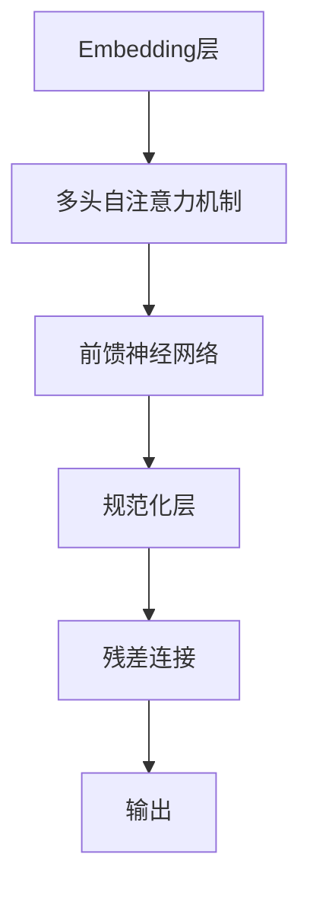
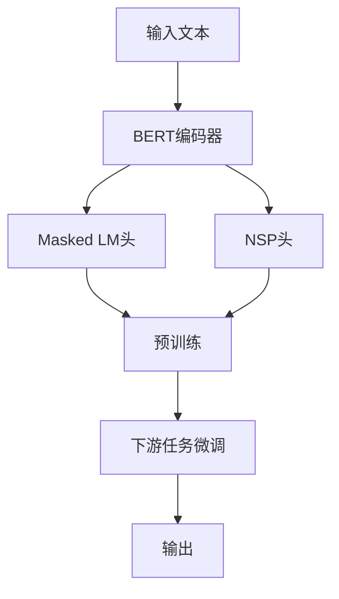

# BERT原理与代码实例讲解

## 1. 背景介绍

### 1.1 自然语言处理的重要性

在当今时代,自然语言处理(NLP)已成为人工智能领域的关键技术之一。它使计算机能够理解、处理和生成人类语言,为各种应用程序提供强大的语言理解和生成能力。NLP技术广泛应用于机器翻译、聊天机器人、语音识别、文本分类、情感分析等领域,极大地促进了人机交互的发展。

### 1.2 NLP面临的挑战

尽管NLP技术取得了长足的进步,但仍面临着诸多挑战。其中最大的挑战之一是理解自然语言的深层次语义和上下文信息。传统的NLP模型通常基于统计和规则方法,难以捕捉语言的复杂性和多义性。此外,大多数模型都是基于单词级别的表示,无法充分利用上下文信息。

### 1.3 Transformer和BERT的出现

2017年,Transformer模型在机器翻译任务中取得了突破性的成果,它利用自注意力机制来捕捉输入序列中任意两个位置之间的依赖关系。基于Transformer的思想,2018年,谷歌推出了BERT(Bidirectional Encoder Representations from Transformers)模型,它通过预训练的方式学习上下文语义表示,为下游NLP任务提供了强大的语义表示能力。BERT的出现彻底改变了NLP领域,成为当前最先进的语言模型之一。

## 2. 核心概念与联系

### 2.1 Transformer模型

Transformer是一种全新的基于注意力机制的序列到序列(Seq2Seq)模型,它完全抛弃了传统的RNN和CNN结构,使用多头自注意力机制来捕捉输入和输出之间的长程依赖关系。Transformer的核心思想是允许每个位置的词向量直接关注其他位置的词向量,从而更好地捕捉上下文信息。



### 2.2 BERT模型

BERT是一种基于Transformer的双向编码器模型,它通过预训练的方式学习上下文语义表示。BERT的核心思想是使用Masked Language Model(MLM)和Next Sentence Prediction(NSP)两个预训练任务,在大量的无标注文本数据上进行预训练,学习通用的语言表示。预训练完成后,BERT可以在各种下游NLP任务上进行微调(fine-tuning),从而获得出色的性能表现。



### 2.3 BERT的创新点

BERT的创新点主要有以下几个方面:

1. **双向编码**:BERT通过掩码机制,使用左右上下文信息对被掩码的词进行预测,实现了真正的双向编码。
2. **深层表示**:BERT采用了Transformer的多层编码器结构,能够学习到更深层次的语义表示。
3. **预训练和微调**:BERT采用了预训练和微调的范式,预训练阶段学习到通用的语言表示,微调阶段针对特定任务进行优化。
4. **大规模语料**:BERT在大规模无标注语料上进行预训练,使其能够捕捉到丰富的语义和上下文信息。

## 3. 核心算法原理具体操作步骤

### 3.1 输入表示

BERT的输入表示由三部分组成:Token Embeddings、Segment Embeddings和Position Embeddings。

1. **Token Embeddings**:将输入文本的每个词映射为一个词向量。
2. **Segment Embeddings**:区分输入序列是属于句子A还是句子B。
3. **Position Embeddings**:编码每个词在序列中的位置信息。

这三部分embeddings相加,构成了BERT的初始输入表示。

### 3.2 BERT编码器

BERT编码器是基于Transformer的多层编码器结构,由多个相同的编码器层堆叠而成。每个编码器层包含以下几个子层:

1. **多头自注意力机制**:捕捉输入序列中任意两个位置之间的依赖关系。
2. **前馈神经网络**:对每个位置的向量进行非线性映射。
3. **残差连接**:将子层的输入和输出相加,以缓解梯度消失问题。
4. **层归一化**:对每个子层的输出进行归一化,加速收敛。

通过多层编码器的堆叠,BERT能够学习到更深层次的语义表示。

### 3.3 Masked Language Model (MLM)

MLM是BERT的核心预训练任务之一。它的操作步骤如下:

1. 从输入序列中随机选择15%的词进行掩码,用特殊的[MASK]标记替换。
2. 使用BERT编码器对掩码后的序列进行编码,得到每个位置的上下文向量表示。
3. 对于被掩码的词,使用其上下文向量和词表中所有词的embedding计算点积,得到每个词作为该位置正确词的概率分布。
4. 最大化被掩码词的正确词的概率,作为MLM的训练目标。

通过MLM,BERT能够同时利用左右上下文信息,学习到更丰富的语义表示。

### 3.4 Next Sentence Prediction (NSP)

NSP是BERT的另一个预训练任务,用于捕捉句子间的关系。它的操作步骤如下:

1. 从语料库中选择句子对作为输入,有50%的概率将两个句子连接,另外50%的概率随机选择两个无关的句子。
2. 将句子对输入BERT编码器,得到两个句子的向量表示。
3. 使用这两个向量表示计算句子关系分数,判断它们是否为连续的句子对。
4. 最大化正确句子对的分数,作为NSP的训练目标。

通过NSP,BERT能够学习到句子间的关系和语义连贯性。

## 4. 数学模型和公式详细讲解举例说明

### 4.1 自注意力机制

自注意力机制是Transformer和BERT的核心,它允许每个位置的词向量直接关注其他位置的词向量。给定一个输入序列 $X = (x_1, x_2, \dots, x_n)$,自注意力机制计算每个位置 $i$ 的输出向量 $y_i$ 如下:

$$y_i = \sum_{j=1}^{n} \alpha_{ij}(x_jW^V)$$

其中, $\alpha_{ij}$ 是注意力权重,表示位置 $i$ 对位置 $j$ 的注意力程度。它通过以下公式计算:

$$\alpha_{ij} = \frac{exp(e_{ij})}{\sum_{k=1}^{n}exp(e_{ik})}$$

$$e_{ij} = \frac{(x_iW^Q)(x_jW^K)^T}{\sqrt{d_k}}$$

$W^Q$、$W^K$、$W^V$ 分别是查询(Query)、键(Key)和值(Value)的线性变换矩阵,用于将输入向量映射到不同的子空间。$d_k$ 是缩放因子,用于防止点积过大导致梯度消失。

多头自注意力机制是将多个注意力头的结果拼接在一起,从不同的子空间捕捉不同的依赖关系。

### 4.2 前馈神经网络

前馈神经网络是Transformer和BERT编码器中的另一个关键组件,它对每个位置的向量进行非线性映射,捕捉更复杂的特征。给定输入向量 $x$,前馈神经网络的计算过程如下:

$$FFN(x) = max(0, xW_1 + b_1)W_2 + b_2$$

其中, $W_1$、$W_2$、$b_1$、$b_2$ 是可学习的参数,ReLU函数引入了非线性。

### 4.3 MLM损失函数

MLM的目标是最大化被掩码词的正确词的概率。给定输入序列 $X$,被掩码位置的索引集合 $M$,以及词表 $V$,MLM的损失函数定义如下:

$$\mathcal{L}_{MLM} = -\sum_{i \in M} \log P(x_i | X, M)$$

$$P(x_i | X, M) = \frac{e^{s(x_i)}}{\sum_{w \in V} e^{s(w)}}$$

其中, $s(x_i)$ 是被掩码位置 $i$ 的正确词 $x_i$ 的得分,通过BERT编码器和词表计算得到。损失函数最小化了被掩码词的负对数似然。

### 4.4 NSP损失函数

NSP的目标是最大化正确句子对的分数。给定两个句子的向量表示 $u$、$v$,NSP的损失函数定义如下:

$$\mathcal{L}_{NSP} = -\log P(y=1|u,v) - \log P(y=0|\overline{u},\overline{v})$$

$$P(y=1|u,v) = \sigma(u^Tv + b)$$

$$P(y=0|\overline{u},\overline{v}) = 1 - \sigma(\overline{u}^T\overline{v} + b)$$

其中, $\sigma$ 是sigmoid函数,用于将分数映射到 $[0,1]$ 区间。$b$ 是可学习的偏置项。损失函数最小化了正确句子对的负对数似然和错误句子对的负对数似然。

## 5. 项目实践:代码实例和详细解释说明

在这一部分,我们将提供一个基于PyTorch实现的BERT模型示例,并详细解释每个模块的代码。

### 5.1 导入所需库

```python
import torch
import torch.nn as nn
from transformers import BertModel, BertTokenizer
```

我们导入了PyTorch、PyTorch的nn模块,以及Hugging Face的Transformers库中的BertModel和BertTokenizer。

### 5.2 BERT模型定义

```python
class BertClassifier(nn.Module):
    def __init__(self, num_classes):
        super(BertClassifier, self).__init__()
        self.bert = BertModel.from_pretrained('bert-base-uncased')
        self.dropout = nn.Dropout(0.1)
        self.classifier = nn.Linear(self.bert.config.hidden_size, num_classes)

    def forward(self, input_ids, attention_mask=None, token_type_ids=None):
        outputs = self.bert(input_ids=input_ids,
                            attention_mask=attention_mask,
                            token_type_ids=token_type_ids)
        pooled_output = outputs[1]
        pooled_output = self.dropout(pooled_output)
        logits = self.classifier(pooled_output)
        return logits
```

我们定义了一个BertClassifier类,继承自nn.Module。在初始化函数中,我们加载预训练的BERT模型,并添加一个dropout层和一个线性分类层。

在forward函数中,我们将输入传递给BERT模型,获取最后一层编码器的输出。然后,我们使用dropout层和线性分类层对输出进行处理,得到分类的logits。

### 5.3 数据准备

```python
tokenizer = BertTokenizer.from_pretrained('bert-base-uncased')

def encode_data(text, max_len=512):
    encoded = tokenizer.encode_plus(
        text,
        add_special_tokens=True,
        max_length=max_len,
        pad_to_max_length=True,
        return_attention_mask=True,
        return_tensors='pt'
    )
    return encoded
```

我们使用BertTokenizer对输入文本进行编码,将文本转换为BERT模型可以接受的输入格式。encode_data函数将文本编码为输入id、attention mask和token type id。

### 5.4 模型训练

```python
model = BertClassifier(num_classes=2)
optimizer = torch.optim.Adam(model.parameters(), lr=2e-5)
criterion = nn.CrossEntropyLoss()

for epoch in range(num_epochs):
    for text, label in train_data:
        encoded = encode_data(text)
        input_ids = encoded['input_ids']
        attention_mask = encoded['attention_mask']

        outputs = model(input_ids, attention_mask=attention_mask)
        loss = criterion(outputs, label)

        optimizer.zero_grad()
        loss.backward()
        optimizer.step()
```

我们实例化BertClassifier模型,并使用Adam优化器和交叉熵损失函数进行训练。在每个epoch中,我们遍历训练数据,对每个样本进行编码,将编码后的输入传递给BERT模型,计算