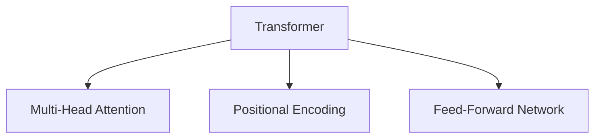
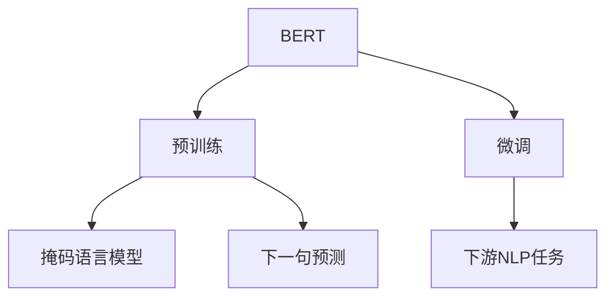
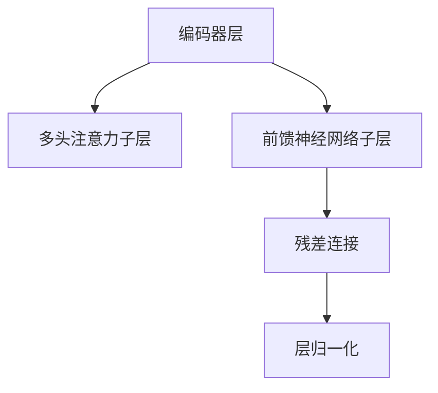

# BERT原理与代码实例讲解

## 1.背景介绍

### 1.1 自然语言处理的重要性

在当今的数字时代,自然语言处理(NLP)已成为人工智能领域中最重要和最具挑战性的研究方向之一。它旨在使计算机能够理解、解释和生成人类语言。NLP技术广泛应用于多个领域,如机器翻译、智能助理、情感分析、文本摘要等。随着海量文本数据的快速增长,高效准确的NLP模型变得至关重要。

### 1.2 语言模型的发展历程

传统的NLP任务通常依赖于特征工程,需要人工设计和提取文本特征。这种方法存在局限性,难以捕捉语言的深层语义信息。2013年,Word2Vec的提出标志着NLP领域迎来了深度学习的浪潮。通过神经网络自动学习词嵌入表示,Word2Vec能够捕捉词与词之间的语义关系。

2017年,Transformer模型应运而生,通过自注意力机制有效捕捉长距离依赖关系,在机器翻译等序列到序列任务中取得了突破性进展。2018年,BERT(Bidirectional Encoder Representations from Transformers)基于Transformer提出,成为NLP领域的里程碑式模型。

### 1.3 BERT的重要意义

BERT是一种全新的语言表示模型,通过预训练的方式学习双向编码表示,能够更好地捕捉词语在上下文中的语义信息。BERT在多个NLP任务上取得了state-of-the-art的表现,推动了NLP技术的快速发展。BERT的出现不仅改变了NLP模型的训练范式,也为各种下游NLP任务提供了强大的语义表示能力。

## 2.核心概念与联系

### 2.1 Transformer模型

BERT是基于Transformer模型构建的,因此了解Transformer是理解BERT的基础。Transformer完全基于注意力机制,摒弃了RNN和CNN等传统结构,能够高效地并行计算,捕捉长距离依赖关系。

Transformer的核心组件包括:

1. **多头注意力机制(Multi-Head Attention)**:通过计算Query、Key和Value之间的相似性,捕捉输入序列中不同位置之间的依赖关系。
2. **位置编码(Positional Encoding)**:由于Transformer没有递归或卷积结构,位置编码用于注入序列的位置信息。
3. **前馈神经网络(Feed-Forward Network)**:对每个位置的表示进行独立的位置wise前馈神经网络变换。



### 2.2 BERT的双向编码表示

BERT的核心创新在于使用了双向编码表示(Bidirectional Encoder Representations)。传统的语言模型通常是单向的,即在生成下一个词时只考虑了前面的上下文。而BERT通过掩码语言模型(Masked Language Model)的方式,同时捕捉左右上下文的信息,从而获得更加丰富的语义表示。

### 2.3 BERT的预训练和微调

BERT采用了两阶段的训练策略:预训练(Pre-training)和微调(Fine-tuning)。

1. **预训练**:在大规模无标注语料上训练BERT模型,学习通用的语言表示。预训练任务包括掩码语言模型和下一句预测。
2. **微调**:将预训练的BERT模型应用于特定的下游NLP任务,通过有标注的数据进行微调,使模型适应特定任务。

这种预训练+微调的范式大大降低了有标注数据的需求,提高了模型的泛化能力。



## 3.核心算法原理具体操作步骤

### 3.1 输入表示

BERT的输入由三部分组成:Token Embeddings、Segment Embeddings和Position Embeddings。

1. **Token Embeddings**:将输入文本切分为tokens,每个token对应一个词嵌入向量。
2. **Segment Embeddings**:区分输入序列属于句子A还是句子B,用于下一句预测任务。
3. **Position Embeddings**:编码token在序列中的位置信息。

这三部分嵌入相加,构成BERT的初始输入表示。

$$\text{Input Representation} = \text{Token Embeddings} + \text{Segment Embeddings} + \text{Position Embeddings}$$

### 3.2 多头注意力机制

BERT使用了多头注意力机制来捕捉输入序列中不同位置之间的依赖关系。每个注意力头都会学习不同的注意力模式,最终将多个注意力头的结果拼接起来,形成最终的注意力表示。

对于一个查询向量$q$,键向量$k$和值向量$v$,注意力计算公式如下:

$$\text{Attention}(q, k, v) = \text{softmax}(\frac{qk^T}{\sqrt{d_k}})v$$

其中$d_k$是缩放因子,用于防止点积过大导致梯度消失。

### 3.3 编码器层

BERT的编码器由多个相同的编码器层堆叠而成,每个编码器层包含以下子层:

1. **多头注意力子层**:计算输入序列的注意力表示。
2. **前馈神经网络子层**:对注意力表示进行非线性变换,捕捉更高层次的特征。
3. **残差连接和层归一化**:用于加速训练并提高模型性能。

编码器层的输出就是BERT的最终编码表示,可用于下游NLP任务。



### 3.4 预训练任务

BERT的预训练包括两个任务:掩码语言模型(Masked Language Model)和下一句预测(Next Sentence Prediction)。

1. **掩码语言模型**:随机掩码输入序列中的部分tokens,模型需要预测被掩码的tokens。这种双向编码方式使BERT能够同时利用左右上下文的信息。
2. **下一句预测**:判断两个句子是否相邻,用于学习句子之间的关系表示。

通过预训练,BERT可以在大规模无标注语料上学习通用的语言表示能力。

### 3.5 微调过程

对于特定的下游NLP任务,需要将预训练的BERT模型进行微调。微调过程包括:

1. **添加任务特定的输出层**:根据任务类型(如分类、序列标注等),添加相应的输出层。
2. **微调所有参数**:在有标注的任务数据上,对BERT的所有参数(编码器层和新添加的输出层)进行端到端的联合微调。

通过微调,BERT可以适应特定的NLP任务,发挥最佳性能。

## 4.数学模型和公式详细讲解举例说明

### 4.1 注意力机制

注意力机制是BERT的核心,允许模型动态地捕捉输入序列中不同位置之间的依赖关系。给定一个查询向量$q$,键向量$k$和值向量$v$,注意力计算公式如下:

$$\text{Attention}(q, k, v) = \text{softmax}(\frac{qk^T}{\sqrt{d_k}})v$$

其中$d_k$是缩放因子,用于防止点积过大导致梯度消失。

softmax函数用于计算注意力权重:

$$\text{softmax}(x_i) = \frac{e^{x_i}}{\sum_j e^{x_j}}$$

注意力权重反映了查询向量与每个键向量的相似程度。通过与值向量相乘,我们可以获得注意力表示,它是输入序列中不同位置的加权和。

例如,在机器翻译任务中,注意力机制可以自动学习对于当前生成的目标词,应该关注源句子中哪些词。这种灵活的依赖捕捉能力是BERT取得卓越表现的关键。

### 4.2 位置编码

由于Transformer没有递归或卷积结构,因此需要显式地编码输入序列中token的位置信息。BERT使用了正弦位置编码,其公式如下:

$$
\begin{aligned}
\text{PE}_{(pos, 2i)} &= \sin\left(\frac{pos}{10000^{2i/d_\text{model}}}\right) \\
\text{PE}_{(pos, 2i+1)} &= \cos\left(\frac{pos}{10000^{2i/d_\text{model}}}\right)
\end{aligned}
$$

其中$pos$是token的位置索引,$i$是维度索引,$d_\text{model}$是模型维度。

正弦位置编码能够自然地表示相对位置关系,例如$\text{PE}_{(k+1)} - \text{PE}_{(k)}$可以编码相邻位置之间的距离。这种编码方式允许模型自动学习位置不变性,对于捕捉长距离依赖关系非常有帮助。

### 4.3 掩码语言模型

BERT的掩码语言模型任务是这样的:在输入序列中随机掩码15%的tokens,模型需要预测被掩码的tokens。具体来说,对于每个被掩码的token:

- 80%的时候,用`[MASK]`标记替换该token
- 10%的时候,用随机token替换
- 10%的时候,保留原token

这种掩码策略可以更好地模拟实际场景,提高模型的泛化能力。

给定掩码后的输入序列$X$,模型需要最大化被掩码位置的条件概率:

$$\mathcal{L}_\text{MLM} = -\mathbb{E}_{X, X_\text{masked}} \left[ \sum_{i \in \text{masked}} \log P(x_i | X_\text{masked}) \right]$$

通过这种双向编码的方式,BERT可以同时利用左右上下文的信息,学习更丰富的语义表示。

### 4.4 下一句预测

下一句预测任务旨在学习句子之间的关系表示。在训练时,BERT会以50%的概率从语料库中选择两个相邻的句子,另外50%的概率选择两个不相关的句子。

给定两个句子$\text{Sentence}_A$和$\text{Sentence}_B$,BERT需要预测它们是否相邻,即最大化下一句预测的概率:

$$\mathcal{L}_\text{NSP} = -\mathbb{E} \left[ \log P(\text{IsNext} | \text{Sentence}_A, \text{Sentence}_B) \right]$$

其中$\text{IsNext}$是一个二元标签,表示两个句子是否相邻。

通过下一句预测任务,BERT可以学习捕捉句子之间的关系和连贯性,为下游任务(如问答、自然语言推理等)提供有用的语义信息。

## 5.项目实践:代码实例和详细解释说明

在这一部分,我们将通过一个实际的代码示例,演示如何使用BERT进行文本分类任务。我们将使用PyTorch实现BERT,并在IMDB电影评论数据集上进行二分类(正面评论和负面评论)。

### 5.1 导入所需库

```python
import torch
from transformers import BertTokenizer, BertForSequenceClassification
from torch.utils.data import TensorDataset, DataLoader
```

我们将使用Hugging Face的`transformers`库,它提供了BERT的预训练模型和tokenizer。

### 5.2 数据预处理

```python
# 加载IMDB数据集
from torchtext.datasets import IMDB

train_data, test_data = IMDB(split=('train', 'test'))

# 将文本转换为BERT输入
tokenizer = BertTokenizer.from_pretrained('bert-base-uncased')

def encode(text, max_length=512):
    encoded = tokenizer.encode_plus(
        text,
        add_special_tokens=True,
        max_length=max_length,
        pad_to_max_length=True,
        return_tensors='pt',
        truncation=True
    )
    return encoded['input_ids'], encoded['attention_mask']

train_inputs, train_masks = [], []
for text in train_data.text:
    input_ids, attention_mask = encode(text)
    train_inputs.append(input_ids)
    train_masks.append(attention_mask)

test_inputs, test_masks = [], []
for text in test_data.text:
    input_ids, attention_mask = encode(text)
    test_inputs.append(input_ids)
    test_masks.append(attention_mask)
```

我们使用BERT token