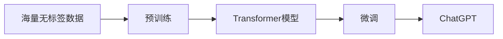

# ChatGPT原理与代码实例讲解

## 1.背景介绍

ChatGPT是由OpenAI开发的一种大型语言模型,它基于Transformer架构和自然语言处理技术,通过海量数据的训练,可以与人进行自然流畅的对话交流,回答问题,提供建议等。ChatGPT的出现引起了学术界和工业界的广泛关注,它代表了人工智能自然语言处理领域的重大突破。

### 1.1 ChatGPT的起源与发展

ChatGPT源自OpenAI的GPT(Generative Pre-trained Transformer)系列语言模型。GPT模型最早由OpenAI在2018年提出,此后不断迭代升级,推出了GPT-2、GPT-3等更强大的版本。ChatGPT则是在GPT-3.5的基础上,针对对话任务进行了优化和微调,使其能更好地应对人机对话场景。

### 1.2 ChatGPT的应用前景

ChatGPT凭借其出色的语言理解和生成能力,在客服、教育、医疗、金融等领域都有广阔的应用前景。它可以作为智能客服系统,提供24小时不间断的服务;可以作为个性化的教育助手,为学生答疑解惑;还可以辅助医生进行病情分析和诊断等。ChatGPT有望成为未来人机交互的重要界面。

### 1.3 ChatGPT带来的挑战

ChatGPT的强大能力也引发了一些担忧和挑战。比如其生成的内容可能存在偏见和错误,如何保证其安全性和可控性是一大难题。此外,ChatGPT可能对某些领域的就业产生冲击,如何应对人工智能带来的就业转型也是社会各界需要思考的问题。

## 2.核心概念与联系

要理解ChatGPT的原理,需要了解以下几个核心概念:

### 2.1 Transformer架构

Transformer是一种基于自注意力机制(Self-Attention)的神经网络架构,它摒弃了传统的RNN和CNN,通过Self-Attention实现了并行计算,大大提高了训练效率。Transformer由编码器(Encoder)和解码器(Decoder)组成,编码器负责对输入序列进行编码,解码器根据编码信息生成输出序列。

### 2.2 预训练(Pre-training)

预训练是指在大规模无标签数据上,通过自监督学习的方式训练语言模型。常见的预训练任务包括语言模型、掩码语言模型等。通过预训练,模型可以学习到语言的通用表征,捕捉词汇、句法、语义等不同层次的特征。预训练使得模型具备了一定的语言理解能力。

### 2.3 微调(Fine-tuning) 

微调是指在预训练的基础上,针对下游任务(如对话、问答等)进行进一步训练,使模型适应特定任务。微调一般在较小的标注数据集上进行,通过调整模型参数,使其更好地完成目标任务。ChatGPT就是在GPT预训练模型的基础上,针对对话任务进行了微调优化。

### 2.4 Self-Attention

Self-Attention 是 Transformer 的核心,它允许模型的每个位置都能与其他位置建立联系,捕捉序列内部的依赖关系。具体来说,Self-Attention 计算序列中每个位置与其他位置的相关性权重,然后基于权重对序列进行加权求和,得到该位置的新表征。Self-Attention 使得模型能够更好地处理长距离依赖。

下图展示了这些核心概念之间的联系:



## 3.核心算法原理具体操作步骤

ChatGPT的核心算法主要包括Transformer的编码器和解码器,以及Self-Attention机制。下面详细介绍这些算法的具体操作步骤。

### 3.1 编码器(Encoder)

编码器由若干个编码层(Encoder Layer)组成,每个编码层包含两个子层:Self-Attention层和前馈神经网络层。

#### 3.1.1 Self-Attention层

1. 将输入序列X转换为三个矩阵:Query矩阵Q、Key矩阵K、Value矩阵V。
2. 计算Q与K的点积,得到注意力分数矩阵 $A=softmax(\frac{QK^T}{\sqrt{d_k}})$。
3. 将注意力分数矩阵A与V相乘,得到加权求和后的输出 $Z=AV$。

#### 3.1.2 前馈神经网络层

1. 将Self-Attention层的输出Z通过两层全连接网络,得到最终的编码层输出。
2. 第一层全连接使用ReLU激活函数,第二层全连接不使用激活函数。

### 3.2 解码器(Decoder)

解码器也由若干个解码层(Decoder Layer)组成,每个解码层包含三个子层:Self-Attention层、Encoder-Decoder Attention层和前馈神经网络层。

#### 3.2.1 Self-Attention层

与编码器的Self-Attention层类似,但在计算注意力分数矩阵时,引入了掩码(Mask)机制,防止解码器看到未来的信息。

#### 3.2.2 Encoder-Decoder Attention层 

1. 将解码器Self-Attention层的输出作为Query矩阵Q。
2. 将编码器的输出作为Key矩阵K和Value矩阵V。
3. 计算Q、K、V的注意力输出,与编码器的Self-Attention层类似。

#### 3.2.3 前馈神经网络层

与编码器的前馈神经网络层相同。

### 3.3 训练过程

ChatGPT的训练过程分为两个阶段:预训练阶段和微调阶段。

#### 3.3.1 预训练阶段

1. 在大规模无标签文本数据上,使用自监督学习方法如掩码语言模型进行训练。
2. 随机掩盖输入序列的部分Token,让模型预测被掩盖的Token。
3. 通过最小化预测误差,优化模型参数,使模型学习到语言的通用表征。

#### 3.3.2 微调阶段

1. 在预训练模型的基础上,使用对话数据对模型进行微调。
2. 将对话历史作为编码器的输入,将当前回复作为解码器的输出。
3. 通过最小化交叉熵损失,优化模型在对话任务上的表现。

## 4.数学模型和公式详细讲解举例说明

ChatGPT中用到的主要数学模型和公式包括Self-Attention、残差连接、Layer Normalization等。下面以Self-Attention为例进行详细讲解。

### 4.1 Self-Attention

Self-Attention可以看作一个映射函数,将输入序列 $X=(x_1,x_2,...,x_n)$ 映射为输出序列 $Z=(z_1,z_2,...,z_n)$。具体步骤如下:

1. 将输入序列X通过三个线性变换得到Q、K、V矩阵:

$$
Q=XW^Q, K=XW^K, V=XW^V
$$

其中 $W^Q, W^K, W^V$ 是可学习的参数矩阵。

2. 计算Q与K的点积并归一化,得到注意力分数矩阵A:

$$
A=softmax(\frac{QK^T}{\sqrt{d_k}})
$$

其中 $d_k$ 是K矩阵的维度,用于缩放点积结果。

3. 将注意力分数矩阵A与V相乘,得到加权求和后的输出Z:

$$
Z=AV
$$

直观地理解,Self-Attention可以看作是一个查询-键-值(Query-Key-Value)的过程:
- 将每个输入向量 $x_i$ 视为一个查询(Query),去查找与其相关的其他向量。 
- 将每个输入向量 $x_i$ 同时视为键(Key)和值(Value),用于被其他向量查找和提取信息。
- 查询向量 $q_i$ 与所有键向量 $k_j$ 计算相似度分数 $a_{ij}$,得到注意力分数矩阵A。
- 将注意力分数 $a_{ij}$ 作为值向量 $v_j$ 的权重,加权求和得到输出向量 $z_i$。

通过Self-Attention,模型可以学习到输入序列内部的依赖关系,捕捉到重要的上下文信息。

## 5.项目实践：代码实例和详细解释说明

下面以PyTorch为例,给出实现ChatGPT中核心模块的代码示例。

### 5.1 Self-Attention层

```python
import torch
import torch.nn as nn

class SelfAttention(nn.Module):
    def __init__(self, hidden_size, num_heads):
        super(SelfAttention, self).__init__()
        self.hidden_size = hidden_size
        self.num_heads = num_heads
        self.head_dim = hidden_size // num_heads
        
        self.query = nn.Linear(hidden_size, hidden_size)
        self.key = nn.Linear(hidden_size, hidden_size)
        self.value = nn.Linear(hidden_size, hidden_size)
        
        self.softmax = nn.Softmax(dim=-1)
    
    def forward(self, x, mask=None):
        batch_size, seq_len, _ = x.size()
        
        Q = self.query(x).view(batch_size, seq_len, self.num_heads, self.head_dim).transpose(1, 2)
        K = self.key(x).view(batch_size, seq_len, self.num_heads, self.head_dim).transpose(1, 2)
        V = self.value(x).view(batch_size, seq_len, self.num_heads, self.head_dim).transpose(1, 2)
        
        attn_scores = torch.matmul(Q, K.transpose(-2, -1)) / (self.head_dim ** 0.5)
        if mask is not None:
            attn_scores = attn_scores.masked_fill(mask==0, -1e9)
        attn_probs = self.softmax(attn_scores)
        
        output = torch.matmul(attn_probs, V).transpose(1, 2).contiguous().view(batch_size, seq_len, self.hidden_size)
        return output
```

代码解释:
- `__init__`方法初始化Self-Attention层,包括隐藏层大小`hidden_size`、注意力头数`num_heads`等参数,以及用于计算Q、K、V矩阵的线性变换。
- `forward`方法定义前向传播过程,将输入`x`转换为Q、K、V矩阵,计算注意力分数矩阵,并进行softmax归一化得到注意力概率分布,最后加权求和得到输出。
- 如果提供了掩码`mask`,则在计算注意力分数时将无效位置的分数设为极小值,防止关注到无效信息。

### 5.2 前馈神经网络层

```python
import torch.nn as nn

class FeedForward(nn.Module):
    def __init__(self, hidden_size, ffn_size, dropout_rate):
        super(FeedForward, self).__init__()
        
        self.fc1 = nn.Linear(hidden_size, ffn_size)
        self.relu = nn.ReLU()
        self.fc2 = nn.Linear(ffn_size, hidden_size)
        self.dropout = nn.Dropout(dropout_rate)
        
    def forward(self, x):
        x = self.fc1(x)
        x = self.relu(x)
        x = self.dropout(x)
        x = self.fc2(x)
        return x
```

代码解释:
- `__init__`方法初始化前馈神经网络层,包括隐藏层大小`hidden_size`、中间层大小`ffn_size`、dropout率等参数。
- `forward`方法定义前向传播过程,将输入`x`通过两个线性变换和ReLU激活函数,并应用dropout正则化防止过拟合。

### 5.3 编码器层

```python
import torch.nn as nn

class EncoderLayer(nn.Module):
    def __init__(self, hidden_size, num_heads, ffn_size, dropout_rate):
        super(EncoderLayer, self).__init__()
        
        self.self_attn = SelfAttention(hidden_size, num_heads)
        self.norm1 = nn.LayerNorm(hidden_size)
        self.ffn = FeedForward(hidden_size, ffn_size, dropout_rate)
        self.norm2 = nn.LayerNorm(hidden_size)
        self.dropout = nn.Dropout(dropout_rate)
        
    def forward(self, x, mask=None):
        residual = x
        x = self.self_attn(x, mask)
        x = self.dropout(x)
        x = self.norm1(residual + x)
        
        residual = x
        x = self.ffn(x)
        x = self.dropout(x)
        x = self.norm2(residual + x)
        return x
```

代码解释:
- `__init