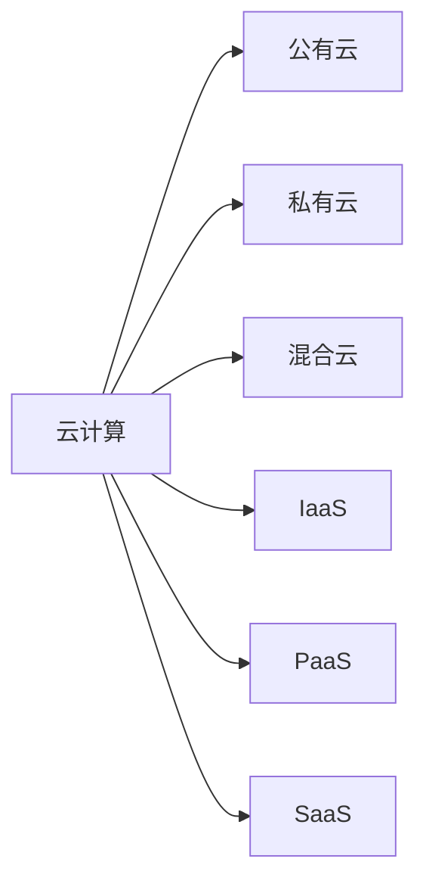

## 1.背景介绍

在过去的十年里，云计算已经从一个前沿概念发展成为一个主流的IT解决方案。通过云计算，企业和个人可以获得无需购买和维护硬件的情况下，访问和存储大量数据的能力。云计算的出现，不仅改变了我们使用计算资源的方式，也为企业提供了新的商业模式和机会。

## 2.核心概念与联系

云计算是通过互联网提供计算服务的模型，包括服务器、存储、数据库、网络、软件、分析和智能等。这种模型可以提供更快的创新、灵活的资源和经济效益。

云计算的核心概念包括：

- 公有云：公有云是由第三方提供商提供的计算服务，这些服务通过公共互联网提供给任何人使用。
- 私有云：私有云是为单个组织提供的计算服务，可以在公司的内部网络上运行，也可以由第三方提供商托管。
- 混合云：混合云结合了公有云和私有云，允许数据和应用程序在两者之间移动，以获得更大的灵活性和更多的部署选项。

在云计算中，还有几个关键的服务模型，包括：

- IaaS（基础设施即服务）：在这个模型中，提供商提供物理或虚拟机、网络和存储。
- PaaS（平台即服务）：在这个模型中，提供商提供包括操作系统、数据库和开发工具在内的一整套环境，用户可以在这个环境中开发或运行他们的应用程序。
- SaaS（软件即服务）：在这个模型中，提供商提供通过互联网访问的应用程序。



## 3.核心算法原理具体操作步骤

云计算的核心在于其资源管理和调度算法。这些算法的目标是优化资源利用率，降低延迟，提高系统的吞吐量。以下是一个基本的资源调度算法的步骤：

1. 用户提交任务请求到云平台。
2. 云平台的调度器根据当前的资源利用情况，选择一个最佳的资源节点来执行这个任务。
3. 任务在该节点上执行，执行结果返回给用户。
4. 调度器根据任务的执行情况，动态调整资源的分配策略。

这个过程可以用以下的伪代码来表示：

```python
def schedule(task):
    best_node = select_best_node()
    result = execute_task(task, best_node)
    update_strategy(task, result)
    return result
```

## 4.数学模型和公式详细讲解举例说明

在云计算的资源调度中，一个关键的问题是如何选择最佳的资源节点。这通常可以通过解决一个优化问题来实现。这个优化问题的目标函数通常是系统的总体性能，约束条件是每个节点的资源容量。

假设我们有$n$个任务和$m$个节点，每个任务$i$需要的资源量为$r_i$，每个节点$j$的资源容量为$c_j$。我们的目标是找到一个任务到节点的映射$f$，使得系统的总体性能$P$最大，同时满足每个节点的资源容量约束。

这个优化问题可以用以下的数学模型来表示：

$$
\begin{align*}
\max & \quad P(f) \\
\text{s.t.} & \quad \sum_{i=1}^{n} r_i \cdot f(i, j) \leq c_j, \quad \forall j \in \{1, 2, \ldots, m\} \\
& \quad f(i, j) \in \{0, 1\}, \quad \forall i \in \{1, 2, \ldots, n\}, j \in \{1, 2, \ldots, m\}
\end{align*}
$$

其中，$f(i, j) = 1$表示任务$i$被分配到节点$j$上执行，$f(i, j) = 0$表示任务$i$没有被分配到节点$j$上执行。

## 5.项目实践：代码实例和详细解释说明

在实际的项目实践中，我们通常使用云计算平台提供的API来创建和管理云资源。以下是一个使用Amazon Web Services（AWS）的EC2服务创建虚拟机的Python代码示例：

```python
import boto3

ec2 = boto3.resource('ec2')

instance = ec2.create_instances(
    ImageId='ami-0abcdef1234567890',
    MinCount=1,
    MaxCount=1,
    InstanceType='t2.micro',
    KeyName='my-key-pair',
    SubnetId='subnet-0abcdef1234567890',
)[0]

print('Created instance', instance.id)
```

这段代码首先导入了`boto3`库，这是AWS的官方Python SDK。然后，我们创建了一个EC2资源对象，并调用其`create_instances`方法来创建新的虚拟机。最后，我们打印出新创建的虚拟机的ID。

## 6.实际应用场景

云计算在许多领域都有广泛的应用，例如：

- 大数据分析：云计算平台通常提供各种大数据处理工具，如Hadoop和Spark，可以方便地处理和分析大量的数据。
- 人工智能和机器学习：云计算平台提供了大量的计算资源和专门的AI服务，可以用于训练和运行复杂的机器学习模型。
- 网站和应用托管：通过云计算，开发者可以轻松地部署和扩展他们的应用，而无需关心底层的硬件和网络设施。

## 7.工具和资源推荐

以下是一些云计算的常用工具和资源：

- AWS：Amazon的云计算平台，提供了包括计算、存储、数据库、分析、AI和机器学习在内的广泛服务。
- Google Cloud：Google的云计算平台，提供了包括计算、存储、数据库、分析、AI和机器学习在内的广泛服务。
- Azure：Microsoft的云计算平台，提供了包括计算、存储、数据库、分析、AI和机器学习在内的广泛服务。
- Docker：一个开源的应用容器引擎，可以让开发者打包他们的应用和依赖包到一个可移植的容器中，然后发布到任何流行的Linux或Windows机器上，也可以实现虚拟化。
- Kubernetes：一个开源的容器编排工具，可以实现容器的自动部署、扩缩和管理。

## 8.总结：未来发展趋势与挑战

云计算的未来发展趋势主要有以下几个方向：

- 边缘计算：随着物联网和5G技术的发展，越来越多的数据和计算需求会发生在网络的边缘。云计算需要结合边缘计算，将计算能力下放到网络的边缘，以降低延迟和提高数据的安全性。
- AI和机器学习：AI和机器学习是云计算的重要应用领域。未来，我们会看到更多的AI和机器学习服务出现在云计算平台上，包括更高级的API和预训练模型。
- 安全和隐私保护：随着数据规模的增长和数据安全意识的提高，如何在云计算环境中保护数据的安全和隐私将成为一个重要的问题。

云计算也面临着一些挑战，包括技术、经济和法律等方面的挑战。例如，如何有效地调度和管理大规模的资源，如何降低云服务的成本，如何处理跨国界的数据流动和法律问题等。

## 9.附录：常见问题与解答

1. 问：云计算是否安全？
   答：云计算的安全性取决于云服务提供商的安全措施和用户的使用习惯。大多数云服务提供商都会提供一系列的安全措施来保护用户的数据，包括数据加密、访问控制、安全审计等。用户也需要采取一些措施来保护自己的数据，例如使用强密码、定期备份数据等。

2. 问：我应该选择公有云还是私有云？
   答：这取决于你的具体需求。公有云通常更便宜、更灵活，适合大多数小型和中型企业。私有云提供更高的安全性和控制性，适合对安全性和性能有特殊需求的大型企业。

3. 问：我如何开始使用云计算？
   答：你可以从注册一个云服务提供商的账户开始。大多数云服务提供商都提供免费的试用期或免费的服务层级，你可以在这个期间尝试他们的服务，看看是否满足你的需求。

作者：禅与计算机程序设计艺术 / Zen and the Art of Computer Programming
