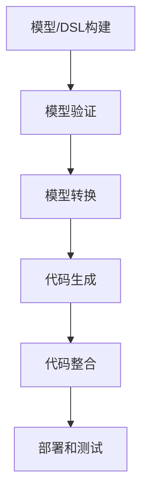

# CodeGen原理与代码实例讲解

## 1. 背景介绍

### 1.1 软件开发的挑战

在当今快节奏的软件开发环境中,开发人员面临着许多挑战。其中包括:

- 需求频繁变更
- 短迭代周期 
- 代码复杂性不断增加
- 缺乏自动化工具支持

这些因素导致开发效率低下,代码质量难以保证,给软件交付带来了巨大压力。

### 1.2 代码生成的兴起 

为了应对这些挑战,代码生成(CodeGen)技术应运而生。CodeGen通过从高级模型或领域特定语言(DSL)自动生成源代码,从而提高了开发效率,降低了人工编码错误,提升了代码质量。

CodeGen已广泛应用于各种领域,如Web开发、移动应用、游戏引擎、嵌入式系统等。它正在改变传统的软件开发模式。

## 2. 核心概念与联系

### 2.1 模型驱动开发(MDD)

CodeGen紧密联系着模型驱动开发(Model-Driven Development, MDD)理念。MDD提倡使用模型作为软件开发的核心构件,而不是源代码。

在MDD中,开发人员构建高层次的模型来描述软件系统的结构、行为和要求。这些模型独立于特定的平台和编程语言。

### 2.2 领域特定语言(DSL)

领域特定语言(Domain-Specific Language, DSL)是MDD的关键支撑技术。DSL是为某个特定领域设计的小型专用编程语言。

DSL允许开发人员使用领域术语和概念来描述系统,从而提高了可读性和可维护性。DSL通常具有简洁的语法和丰富的表达能力。

### 2.3 模型到代码转换

CodeGen的核心是将模型或DSL转换为可执行的源代码。这个过程通常由代码生成器(Code Generator)自动完成。

代码生成器读取模型或DSL,并根据预定义的转换规则生成对应的源代码。这种方式确保了模型和代码的同步,减少了手工编码的工作量。

### 2.4 CodeGen工具链

CodeGen通常依赖于一系列工具和框架,共同构建了CodeGen工具链。主要包括:

- 建模工具(Modeling Tools)
- DSL工具(DSL Tools)  
- 模型转换引擎(Model Transformation Engines)
- 代码生成器(Code Generators)
- 版本控制系统(Version Control Systems)

这些工具协同工作,支撑整个CodeGen过程。

## 3. 核心算法原理具体操作步骤

### 3.1 CodeGen流程概览

CodeGen的核心算法原理可概括为以下步骤:



1. **模型/DSL构建**: 使用建模工具或DSL工具构建软件系统的高层次模型或DSL描述。

2. **模型验证**: 检查模型或DSL是否满足预定义的规则和约束,确保其正确性和完整性。

3. **模型转换**: 使用模型转换引擎将高层次模型转换为特定平台或编程语言的低层次模型。

4. **代码生成**: 代码生成器读取低层次模型,并根据预定义的模板生成对应的源代码。

5. **代码整合**: 将生成的代码与手工编写的代码或其他第三方库集成。

6. **部署和测试**: 将生成的代码部署到目标环境并进行测试。

### 3.2 模型/DSL构建

模型或DSL构建是CodeGen的起点。开发人员需要使用建模工具或DSL工具来描述软件系统的各个方面,如架构、行为、数据等。

常见的建模语言包括UML、SysML等。DSL则根据特定领域的需求定制语法和语义。

无论使用何种语言,目标都是以高层次、领域特定的方式描述系统,抽象出实现细节。

### 3.3 模型验证

在进行模型转换和代码生成之前,需要对模型或DSL进行验证,确保其正确性和完整性。

模型验证通常包括:

- **语法检查**: 检查模型或DSL是否符合语法规则。

- **静态语义检查**: 检查模型或DSL是否满足预定义的约束和规则。

- **动态验证**: 通过模拟执行或形式化验证,检查模型或DSL的动态行为是否符合预期。

模型验证可以尽早发现错误,避免在后续阶段产生更多问题。

### 3.4 模型转换

在进行代码生成之前,通常需要将高层次模型转换为特定平台或编程语言的低层次模型。

模型转换的过程由模型转换引擎完成,它根据预定义的转换规则将源模型映射到目标模型。常见的模型转换语言包括QVT、ATL等。

模型转换可以分为不同层次,如平台独立模型(PIM)到平台特定模型(PSM)的转换、PSM到代码模型的转换等。每个层次的转换都有对应的规则和约束。

### 3.5 代码生成

代码生成是CodeGen的核心步骤。代码生成器读取低层次模型,并根据预定义的模板生成对应的源代码。

代码生成器通常支持多种编程语言和目标平台,如Java、C#、Python、JavaScript等。它们使用模板引擎(如Velocity、Mustache等)将模型元素映射到代码片段。

生成的代码通常包括基本结构、框架代码、样板代码等。开发人员可以在此基础上添加业务逻辑代码。

### 3.6 代码整合

生成的代码通常需要与手工编写的代码或第三方库集成,形成完整的应用程序。

代码整合过程包括:

- 识别生成代码和手工代码之间的接口和依赖关系。

- 将生成代码与手工代码合并,解决命名空间、类继承等冲突。

- 集成第三方库,如UI框架、数据库驱动等。

- 构建和部署整个应用程序。

代码整合需要谨慎处理,确保生成代码和手工代码之间的一致性和兼容性。

### 3.7 部署和测试

最后一步是将生成的代码部署到目标环境并进行测试。

部署过程包括:

- 构建可执行程序或安装包。

- 部署到目标服务器、设备或云环境。

- 配置运行时环境,如数据库、中间件等。

测试则需要覆盖各个层面,包括:

- 单元测试:测试生成代码的基本功能。

- 集成测试:测试生成代码与手工代码、第三方库的集成。

- 系统测试:测试整个应用程序的端到端功能。

- 非功能性测试:测试性能、安全性、可用性等方面。

测试反馈将指导模型、代码生成规则和模板的改进,形成迭代式的优化过程。

## 4. 数学模型和公式详细讲解举例说明  

在CodeGen过程中,数学模型和公式扮演着重要角色,尤其在模型转换和代码生成阶段。以下是一些常见的数学模型和公式:

### 4.1 形式语言和文法

形式语言和文法是描述DSL语法的基础。它们使用数学符号和规则来定义语言的构造。

常见的形式语言包括正则语言、上下文无关语言等。文法则包括正则文法、上下文无关文法等。

例如,一个简单的算术表达式语言可以用以下上下文无关文法(BNF)定义:

$$
\begin{align*}
\langle\text{expr}\rangle \quad &::= \quad \langle\text{expr}\rangle \, \langle\text{op}\rangle \, \langle\text{term}\rangle \; | \; \langle\text{term}\rangle \\
\langle\text{term}\rangle \quad &::= \quad \langle\text{term}\rangle \, \langle\text{mulop}\rangle \, \langle\text{factor}\rangle \; | \; \langle\text{factor}\rangle \\
\langle\text{factor}\rangle \quad &::= \quad \text{(} \, \langle\text{expr}\rangle \, \text{)} \; | \; \text{number} \\
\langle\text{op}\rangle \quad &::= \quad \text{+} \; | \; \text{-} \\
\langle\text{mulop}\rangle \quad &::= \quad \text{*} \; | \; \text{/}
\end{align*}
$$

这种形式化定义为语言的解析和代码生成奠定了基础。

### 4.2 模型转换算法

模型转换算法描述了如何将源模型映射到目标模型。常见的模型转换算法包括:

- **关系模型转换**: 使用关系代数或关系逻辑描述模型元素之间的映射关系。

- **图转换**: 将模型表示为图,并使用图重写规则进行转换。

- **visitor模式**: 使用visitor设计模式遍历源模型,并生成目标模型。

以关系模型转换为例,假设要将UML类模型转换为Java代码模型,可以定义以下映射关系:

$$
\begin{align*}
\texttt{Class}(c,\text{attrs},\text{ops}) \; &\Rightarrow \; \texttt{JavaClass}(c,\text{attrs}',\text{ops}') \\
\texttt{Attribute}(a,t) \in \text{attrs} \; &\Rightarrow \; \texttt{JavaField}(a,t') \in \text{attrs}' \\
\texttt{Operation}(o,p,r) \in \text{ops} \; &\Rightarrow \; \texttt{JavaMethod}(o,p',r') \in \text{ops}'
\end{align*}
$$

这种形式化描述为模型转换提供了清晰的语义基础。

### 4.3 代码生成模板

代码生成模板描述了如何将模型元素映射到代码片段。常见的模板引擎使用基于模式匹配的模板语言。

例如,使用Velocity模板引擎生成Java类的代码模板如下:

```
#foreach($attr in $class.attributes)
private $attr.type $attr.name;
#end

public $class.name() {
    // 构造函数代码
}

#foreach($method in $class.methods)
public $method.returnType $method.name(#foreach($param in $method.parameters)$param.type $param.name#if($foreach.hasNext), #end#end) {
    // 方法体代码
}
#end
```

其中,`$class`、`$attr`、`$method`等是模型元素的引用,通过模式匹配插入到代码模板中。

模板引擎还支持循环、条件判断等控制结构,使代码生成更加灵活和强大。

### 4.4 度量和优化

为了评估和优化CodeGen过程,我们需要定义一些度量标准。常见的度量包括:

- **代码覆盖率**: 生成代码覆盖总代码的比例。
- **代码重复率**: 生成代码中重复代码的比例。
- **代码复杂度**: 生成代码的循环复杂度、分支复杂度等。

通过优化模型、转换规则和代码模板,我们可以最大化代码覆盖率,最小化代码重复率和复杂度。

例如,假设我们希望最小化生成代码的循环复杂度,可以定义如下目标函数:

$$
\begin{align*}
\min \quad & \sum_{m \in M} \texttt{cyclomatic}(m) \\
\text{s.t.} \quad & \texttt{cover}(M, C) \geq \alpha \\
               & \texttt{duplicate}(M) \leq \beta
\end{align*}
$$

其中,`M`是生成的方法集合,`C`是总代码,`α`和`β`分别是代码覆盖率和代码重复率的阈值。

通过约束优化等技术,我们可以找到最优的代码生成策略,生成高质量的代码。

## 5. 项目实践:代码实例和详细解释说明

为了更好地理解CodeGen的原理和实践,我们将通过一个具体的项目案例进行讲解。该项目旨在为一个简单的在线购物系统生成Java Web应用程序代码。

### 5.1 项目概述

我们将使用UML作为建模语言,描述购物系统的类图、用例图和活动图等模型。然后,通过模型转换和代码生成,自动生成Java Web应用程序的框架代码,包括实体类、控制器、服务层等。

最终生成的代码将与