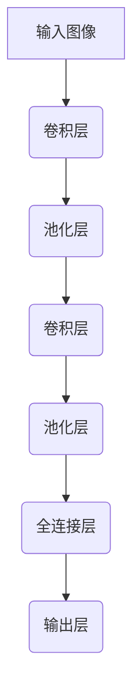

以下是题为《Computer Vision 原理与代码实战案例讲解》的技术博客文章正文:

# Computer Vision 原理与代码实战案例讲解

## 1.背景介绍

### 1.1 什么是计算机视觉?

计算机视觉(Computer Vision, CV)是人工智能领域的一个重要分支,旨在使计算机能够从数字图像或视频中获取有意义的高层次信息,并对其进行处理以实现某种任务。简单来说,计算机视觉就是赋予机器以"视觉"的能力,使其能像人类一样识别和理解图像或视频中的内容。

### 1.2 计算机视觉的应用

计算机视觉技术在现实世界中有着广泛的应用,例如:

- 面部识别和人脸解锁
- 自动驾驶汽车的环境感知
- 工业自动化中的缺陷检测
- 医疗影像分析诊断
- 机器人视觉导航
- 虚拟/增强现实

随着深度学习等技术的不断发展,计算机视觉的性能和应用范围都在不断扩大。

## 2.核心概念与联系

### 2.1 图像表示

在计算机中,图像被表示为一个二维或三维的数值矩阵,每个元素对应图像中一个像素点的亮度或颜色值。常见的图像格式有RGB、灰度图等。

### 2.2 特征提取

特征提取是计算机视觉的关键步骤之一。它从原始图像数据中提取出对识别和分类有意义的特征,如边缘、角点、纹理等。经典的特征提取算法有SIFT、HOG等。

### 2.3 模式识别

模式识别的目标是根据提取的特征,将图像或视频中的对象归类到某个已知类别。常用的模式识别算法有支持向量机(SVM)、决策树、朴素贝叶斯等。

### 2.4 深度学习模型

近年来,基于深度卷积神经网络(CNN)的模型在计算机视觉任务中取得了突破性进展,如图像分类、目标检测、语义分割等。著名的模型有AlexNet、VGGNet、ResNet等。

## 3.核心算法原理具体操作步骤

### 3.1 图像预处理

在进行特征提取和模式识别之前,通常需要对原始图像进行预处理,以提高后续步骤的效果。常见的预处理操作包括:

1. 去噪: 使用滤波器去除图像中的噪声
2. 几何变换: 对图像进行旋转、平移、缩放等变换
3. 灰度化: 将彩色图像转换为灰度图像
4. 直方图均衡化: 增强图像的对比度

#### 代码示例: Python OpenCV 图像预处理

```python
import cv2

# 读取图像
img = cv2.imread('image.jpg')

# 去噪
denoised = cv2.fastNlMeansDenoisingColored(img)

# 旋转
rows, cols = img.shape[:2]
M = cv2.getRotationMatrix2D((cols/2, rows/2), 30, 1)
rotated = cv2.warpAffine(img, M, (cols, rows))

# 灰度化
gray = cv2.cvtColor(img, cv2.COLOR_BGR2GRAY)

# 直方图均衡化
equalized = cv2.equalizeHist(gray)
```

### 3.2 特征提取算法

#### 3.2.1 SIFT 算法

SIFT(Scale-Invariant Feature Transform)是一种经典的特征提取算法,可以提取图像中尺度不变的关键点,并计算每个关键点的描述子向量,用于后续的匹配和识别。

SIFT 算法的主要步骤包括:

1. 构建高斯金字塔: 通过不同尺度的高斯滤波构建图像金字塔
2. 检测极值点: 在高斯金字塔中寻找极值点作为潜在的关键点
3. 精确定位关键点: 通过拟合二次曲面,去除低对比度和不稳定的关键点
4. 分配方向: 根据关键点邻域的梯度方向分配主方向
5. 生成描述子: 计算关键点邻域内梯度方向直方图,形成描述子向量

#### 代码示例: Python OpenCV SIFT 实现

```python
import cv2

# 读取图像
img = cv2.imread('image.jpg')

# 创建 SIFT 对象
sift = cv2.SIFT_create()

# 检测关键点和计算描述子
kp, des = sift.detectAndCompute(img, None)

# 绘制关键点
img_kp = cv2.drawKeypoints(img, kp, None)
cv2.imwrite('sift_keypoints.jpg', img_kp)
```

#### 3.2.2 HOG 算法

HOG(Histogram of Oriented Gradients)是另一种常用的特征提取算法,常用于目标检测和行人检测等任务。它通过计算图像局部区域内的梯度方向直方图作为特征。

HOG 算法的主要步骤包括:

1. 计算梯度: 对图像计算水平和垂直方向的梯度
2. 计算梯度方向: 根据梯度值计算每个像素点的梯度方向
3. 构建梯度直方图: 将图像划分为小块,计算每个小块内像素的梯度方向直方图
4. 构建描述子向量: 将所有小块的直方图串联起来形成描述子向量

#### 代码示例: Python scikit-image HOG 实现

```python
from skimage.feature import hog
from skimage import data, color, exposure

# 读取图像
image = color.rgb2gray(data.astronaut())

# 计算 HOG 特征
fd, hog_image = hog(image, orientations=9, pixels_per_cell=(8, 8),
                    cells_per_block=(3, 3), visualize=True)

# 显示 HOG 图像
fig, (ax1, ax2) = plt.subplots(1, 2, figsize=(8, 4))
ax1.axis('off')
ax1.imshow(image, cmap=plt.cm.gray)
ax1.set_title('Input image')

ax2.axis('off')
ax2.imshow(hog_image, cmap=plt.cm.gray)
ax2.set_title('Histogram of Oriented Gradients')
plt.show()
```

### 3.3 模式识别算法

#### 3.3.1 支持向量机 (SVM)

支持向量机(Support Vector Machine, SVM)是一种常用的监督学习模型,可用于分类和回归任务。SVM的基本思想是在高维空间中寻找一个超平面,将不同类别的样本分开,并使得两类样本到超平面的距离最大化。

SVM 算法的主要步骤包括:

1. 将样本映射到高维空间
2. 在高维空间中寻找最优超平面,使得两类样本到超平面的距离最大
3. 通过核函数计算高维空间中样本的内积,避免显式计算高维映射

#### 代码示例: Python scikit-learn SVM 实现

```python
from sklearn import datasets
from sklearn import svm

# 加载样本数据
iris = datasets.load_iris()
X, y = iris.data, iris.target

# 创建 SVM 分类器
clf = svm.SVC(kernel='linear')

# 训练模型
clf.fit(X, y)

# 进行预测
predicted = clf.predict([[5.1, 3.5, 1.4, 0.2]])
print(predicted)
```

#### 3.3.2 决策树

决策树是一种基于树形结构的监督学习算法,可用于分类和回归任务。决策树通过递归地对样本进行划分,构建一棵决策树,每个叶节点对应一个类别。

决策树算法的主要步骤包括:

1. 选择最优特征,根据该特征对样本集合进行划分
2. 对每个子集重复步骤1,直到满足停止条件
3. 生成决策树

#### 代码示例: Python scikit-learn 决策树实现

```python
from sklearn import datasets
from sklearn import tree

# 加载样本数据
iris = datasets.load_iris()
X, y = iris.data, iris.target

# 创建决策树分类器
clf = tree.DecisionTreeClassifier()

# 训练模型
clf.fit(X, y)

# 进行预测
predicted = clf.predict([[5.1, 3.5, 1.4, 0.2]])
print(predicted)
```

## 4.数学模型和公式详细讲解举例说明

### 4.1 卷积神经网络 (CNN)

卷积神经网络是深度学习中应用最广泛的一种网络结构,在计算机视觉任务中表现出色。CNN 由多个卷积层、池化层和全连接层组成,能够自动从图像中学习出有效的特征表示。

卷积层的数学原理是通过卷积操作提取图像的局部特征。设输入为 $I$,卷积核为 $K$,则卷积操作可表示为:

$$
O(i,j) = \sum_{m}\sum_{n} I(i+m, j+n)K(m,n)
$$

其中 $O$ 为输出特征图, $i,j$ 为输出特征图的位置。卷积层通过多个卷积核提取不同的特征。

池化层则用于降低特征图的分辨率,减少参数量。常见的池化操作有最大池化和平均池化。

全连接层将前面层的特征展平,并通过权重矩阵进行线性变换,得到最终的分类或回归输出。

下图展示了一个典型的 CNN 结构:



### 4.2 目标检测算法

目标检测是计算机视觉中一个重要的任务,旨在从图像或视频中定位并识别出感兴趣的目标。常见的目标检测算法包括基于区域的卷积神经网络 (R-CNN)、单shot检测器 (SSD) 等。

以 R-CNN 为例,其基本思想是:

1. 使用选择性搜索算法提取图像中的候选区域
2. 对每个候选区域使用 CNN 提取特征
3. 使用 SVM 分类器对每个区域进行分类和边界框回归

R-CNN 的优化版本 Fast R-CNN 和 Faster R-CNN 通过共享卷积特征和使用区域提议网络 (RPN) 进一步提高了检测速度和精度。

目标检测算法的性能通常使用平均精度 (mAP) 来评估,公式如下:

$$
\text{AP} = \int_0^1 p(r)dr
$$

其中 $p(r)$ 是精确率-召回率曲线。对所有类别的 AP 取平均即得到 mAP。

## 5.项目实践: 代码实例和详细解释说明

在这一部分,我们将通过一个实际的项目案例,演示如何使用 Python 和相关库实现计算机视觉任务。我们将构建一个简单的人脸检测系统,能够从图像或视频中检测并标记出人脸区域。

### 5.1 准备工作

首先,我们需要安装所需的 Python 库:

```
pip install opencv-python dlib
```

- OpenCV: 一个强大的计算机视觉库,提供了图像处理、特征提取等功能。
- dlib: 一个C++库,包含了人脸检测和识别等算法的实现。

### 5.2 人脸检测器

我们将使用 dlib 库中基于 HOG 特征的人脸检测器。以下代码展示了如何加载预训练的人脸检测模型,并在图像中检测人脸:

```python
import cv2
import dlib

# 加载人脸检测器模型
detector = dlib.get_frontal_face_detector()

# 读取图像
img = cv2.imread('people.jpg')

# 检测人脸
faces = detector(img, 1)

# 在图像上绘制人脸框
for face in faces:
    x1 = face.left()
    y1 = face.top()
    x2 = face.right()
    y2 = face.bottom()
    cv2.rectangle(img, (x1, y1), (x2, y2), (0, 0, 255), 2)

# 显示结果图像
cv2.imshow('Face Detection', img)
cv2.waitKey(0)
cv2.destroyAllWindows()
```

在上面的代码中,我们首先加载了 dlib 库中的人脸检测器模型。然后,我们读取一张包含多个人脸的图像,并使用检测器在图像中检测人脸。对于每个检测到的人脸,我们获取其边界框坐标,并在原始图像上绘制出红色的矩形框。最后,我们显示带有人脸