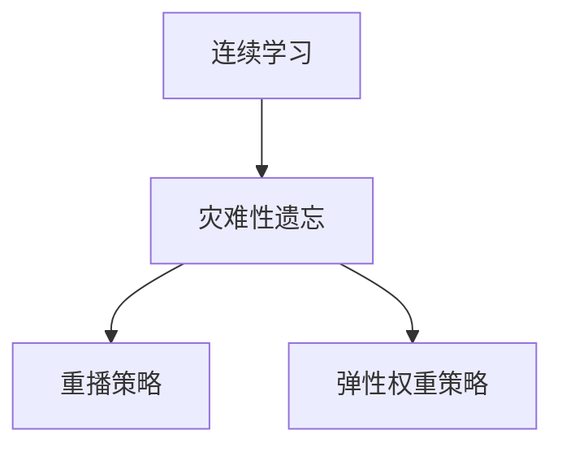

## 1.背景介绍

在现实世界中，人类的学习过程是持续的，我们不断从新的经验中学习，同时保留对旧知识的理解。然而，大多数现有的机器学习模型并不具备这种能力，它们通常在一个固定的、预先定义的任务集上进行训练，然后在这些任务上进行测试，这种方式被称为“批量学习”或“离线学习”。然而，在许多实际应用中，我们需要模型能够适应新任务，而不是仅仅在旧任务上表现良好。这就引出了一种新的学习范式，被称为“连续学习”或“生命长学习”。

## 2.核心概念与联系

连续学习的目标是让模型能够在任务序列上进行学习，每个任务都可以在任何时间点出现，并可能与其他任务有所重叠。模型需要在新任务上表现良好，同时保持对旧任务的性能。这是一项具有挑战性的任务，因为新的任务可能会干扰模型对旧任务的理解，这种现象被称为“灾难性遗忘”。

为了解决这个问题，连续学习的研究者提出了许多策略，其中最常见的是“重播”和“弹性权重”。重播策略是通过存储旧任务的一部分数据，并在学习新任务时重播这些数据，从而防止模型忘记旧任务。弹性权重策略则是通过对模型参数施加约束，使得在学习新任务时，重要参数的改变被限制，从而防止灾难性遗忘。



## 3.核心算法原理具体操作步骤

接下来，我们将详细介绍如何实现连续学习的一个基本算法——Elastic Weight Consolidation (EWC)。EWC是一种弹性权重策略，它通过对模型参数施加一个额外的损失项，使得在学习新任务时，重要参数的改变被限制。

EWC的基本思想是，对于每个参数，我们都维护一个重要性权重，该权重表示该参数对旧任务的重要性。在学习新任务时，我们通过最小化一个包含两个部分的损失函数来更新参数：一个是新任务的损失，另一个是参数变化的损失，该损失与参数的重要性权重成比例。

以下是EWC的基本操作步骤：

1. 在任务1上训练模型，得到参数$\theta$。
2. 计算参数$\theta$对任务1的重要性权重$F$，$F$可以通过计算损失函数关于$\theta$的Hessian矩阵得到。
3. 在任务2上训练模型，更新参数$\theta$，更新规则为最小化损失函数$L = L_{task2}(\theta) + \frac{1}{2}\sum_iF_i(\theta_i - \theta_i^{old})^2$，其中$L_{task2}$是任务2的损失，$\theta^{old}$是任务1学习得到的参数。
4. 重复步骤2和3，直到所有任务学习完毕。

## 4.数学模型和公式详细讲解举例说明

在EWC中，模型的参数更新规则可以通过以下公式表示：

$$\theta = \theta - \eta \nabla L(\theta) - \eta \sum_iF_i(\theta_i - \theta_i^{old})$$

其中，$\eta$是学习率，$L(\theta)$是新任务的损失，$F_i$是参数$\theta_i$的重要性权重，$\theta_i^{old}$是旧任务学习得到的参数。

这个公式告诉我们，模型的参数不仅要考虑新任务的损失，还要考虑参数变化的损失。参数变化的损失与参数的重要性权重成比例，重要性权重越大，参数变化的损失就越大，因此，对于重要的参数，我们更倾向于保持它的值不变。

## 5.项目实践：代码实例和详细解释说明

以下是一个使用PyTorch实现的EWC的简单示例。在这个示例中，我们首先在一个二分类任务上训练一个简单的神经网络，然后在另一个二分类任务上使用EWC进行训练。

```python
import torch
from torch import nn, optim

class SimpleNet(nn.Module):
    def __init__(self):
        super(SimpleNet, self).__init__()
        self.fc = nn.Linear(2, 2)

    def forward(self, x):
        return self.fc(x)

# 初始化网络和优化器
net = SimpleNet()
optimizer = optim.SGD(net.parameters(), lr=0.01)

# 任务1的数据和标签
data1 = torch.tensor([[0.0, 0.0], [1.0, 1.0]])
label1 = torch.tensor([0, 1])

# 在任务1上训练网络
for i in range(100):
    optimizer.zero_grad()
    output = net(data1)
    loss = nn.CrossEntropyLoss()(output, label1)
    loss.backward()
    optimizer.step()

# 存储任务1学习得到的参数
params_old = net.fc.weight.data.clone()

# 计算参数的重要性权重
fisher = torch.autograd.grad(loss, net.fc.weight, create_graph=True)[0]**2

# 任务2的数据和标签
data2 = torch.tensor([[0.0, 1.0], [1.0, 0.0]])
label2 = torch.tensor([0, 1])

# 在任务2上使用EWC进行训练
for i in range(100):
    optimizer.zero_grad()
    output = net(data2)
    loss = nn.CrossEntropyLoss()(output, label2)
    ewc_loss = (fisher * (net.fc.weight - params_old)**2).sum()
    (loss + ewc_loss).backward()
    optimizer.step()
```

这个示例展示了如何在PyTorch中实现EWC，通过添加一个额外的损失项，我们可以使得模型在学习新任务时，更加注意保持对旧任务的性能。

## 6.实际应用场景

连续学习在许多实际应用中都有广泛的应用，例如自动驾驶、机器人、个性化推荐等。在自动驾驶中，车辆需要在不断变化的环境中进行学习，例如从城市道路学习到乡村道路，或者从白天学习到夜晚。在机器人领域，机器人需要在完成一个任务后，能够快速适应新的任务，例如从搬运物品学习到清洁地板。在个性化推荐中，推荐系统需要在用户的兴趣不断变化的情况下进行学习，例如从推荐电影学习到推荐音乐。

## 7.工具和资源推荐

对于想要深入研究连续学习的读者，我推荐以下几个工具和资源：

- PyTorch: PyTorch是一个广泛使用的深度学习框架，它具有易于使用和灵活的特点，非常适合用来实现连续学习的算法。
- TensorFlow: TensorFlow是另一个广泛使用的深度学习框架，它提供了许多高级的功能，例如自动微分和分布式计算，也可以用来实现连续学习的算法。
- Continual AI: Continual AI是一个专门研究连续学习的社区，它提供了许多关于连续学习的资源，例如论文、代码和教程。

## 8.总结：未来发展趋势与挑战

连续学习是一个非常活跃的研究领域，未来的发展趋势可能会朝着以下几个方向：

- 更有效的防止灾难性遗忘的方法：现有的方法，例如重播和弹性权重，都有一定的局限性，例如需要存储旧任务的数据或者需要计算复杂的重要性权重。未来的研究可能会提出更有效的方法，例如通过模型结构或者训练策略来防止灾难性遗忘。
- 更适应复杂任务的模型：现有的连续学习的研究大多数集中在简单的任务上，例如图像分类或者强化学习的游戏。未来的研究可能会设计更适应复杂任务的模型，例如自然语言处理或者复杂的决策问题。
- 更接近人类学习的模型：人类的学习过程是持续的，我们不断从新的经验中学习，同时保留对旧知识的理解。未来的研究可能会设计更接近人类学习的模型，例如通过模仿人类的记忆和遗忘机制。

尽管连续学习面临许多挑战，但我相信，随着研究的深入，我们将能够设计出更强大的连续学习的模型，使得机器能够像人类一样，不断从新的经验中学习，同时保留对旧知识的理解。

## 9.附录：常见问题与解答

Q: 什么是灾难性遗忘？
A: 灾难性遗忘是指在学习新任务时，模型忘记了旧任务的现象。这是因为模型的参数在学习新任务时被更新，可能会导致模型对旧任务的理解被破坏。

Q: 重播和弹性权重有什么区别？
A: 重播和弹性权重都是防止灾难性遗忘的方法，但它们的方法不同。重播是通过存储旧任务的一部分数据，并在学习新任务时重播这些数据，从而防止模型忘记旧任务。弹性权重则是通过对模型参数施加约束，使得在学习新任务时，重要参数的改变被限制，从而防止灾难性遗忘。

Q: 如何计算参数的重要性权重？
A: 参数的重要性权重可以通过计算损失函数关于参数的Hessian矩阵得到。Hessian矩阵的每个元素表示损失函数关于对应参数的二阶导数，反映了参数的变化对损失函数的影响。因此，Hessian矩阵可以被用作参数的重要性权重。

作者：禅与计算机程序设计艺术 / Zen and the Art of Computer Programming