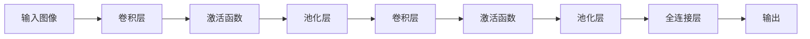

# Convolutional Neural Networks (CNN) 原理与代码实战案例讲解

## 1.背景介绍

### 1.1 深度学习的崛起
近年来,深度学习技术取得了突破性进展,在计算机视觉、自然语言处理、语音识别等领域取得了超越人类的性能表现。作为深度学习的重要分支,卷积神经网络(Convolutional Neural Networks, CNN)在图像识别领域展现出了非凡的威力。

### 1.2 CNN的应用
CNN 在图像分类、目标检测、语义分割、人脸识别等计算机视觉任务中得到了广泛应用。从无人驾驶汽车到智能医疗诊断,CNN正在深刻影响和改变着我们的生活。

### 1.3 本文目标
本文将从原理到实践,全面深入地探讨CNN的核心概念、算法原理、数学模型以及代码实现。通过本文的学习,你将掌握CNN的精髓,并能够运用CNN解决实际问题。

## 2.核心概念与联系

### 2.1 人工神经元
CNN的基本组成单元是人工神经元。类似于生物神经元接收其他神经元的信号,对信号进行处理后产生输出,人工神经元接收其他神经元的加权输入,通过激活函数处理后输出结果。

### 2.2 感受野
感受野指的是输入图像中的一个区域,该区域中的像素参与计算一个神经元的输出。CNN通过局部连接和权值共享,使得神经元能够提取输入图像的局部特征。感受野的大小决定了神经元提取特征的尺度。

### 2.3 卷积层
卷积层是CNN的核心组件。卷积层中的每个神经元与前一层的局部区域进行卷积操作,提取局部特征。通过逐层叠加卷积层,CNN能够提取输入图像从低级到高级的特征表示。

### 2.4 池化层  
池化层对卷积层的输出进行下采样,降低特征图的空间维度。常见的池化操作包括最大池化和平均池化。池化层能够提高特征的平移不变性和鲁棒性。

### 2.5 全连接层
经过多个卷积层和池化层,输入图像被转化为高维特征。全连接层将这些高维特征映射到样本的类别标签上。全连接层的每个神经元与上一层的所有神经元相连,负责对特征进行分类或回归。

下图展示了CNN的核心概念之间的联系:



## 3.核心算法原理具体操作步骤

### 3.1 卷积操作
卷积操作是CNN的核心。对于一个二维图像I和卷积核K,卷积操作的数学定义为:

$$(I*K)(i,j) = \sum_m \sum_n I(i+m, j+n) K(m,n)$$

其中,I为输入图像,K为卷积核,*表示卷积操作,i和j为输出特征图上的像素坐标,m和n为卷积核的索引。

卷积操作的步骤如下:
1. 选择合适大小的卷积核
2. 将卷积核在输入图像上滑动,提取局部特征
3. 将提取的局部特征通过激活函数处理
4. 将处理后的特征作为下一层的输入

### 3.2 池化操作
池化操作对卷积层的输出进行下采样,常见的有最大池化和平均池化两种。

以最大池化为例,其数学定义为:

$$y(i,j) = \max_{m,n} x(i \cdot s+m, j \cdot s+n)$$

其中,x为输入特征图,y为输出特征图,i和j为输出特征图上的像素坐标,s为池化窗口的步长,m和n为池化窗口内的索引。

最大池化的操作步骤如下:
1. 选择合适大小的池化窗口和步长
2. 将池化窗口在输入特征图上滑动
3. 取池化窗口内的最大值作为输出像素值
4. 重复步骤2和3,直到遍历整个输入特征图

### 3.3 前向传播
前向传播是CNN的推理过程。给定一个输入图像,CNN通过逐层应用卷积、激活、池化等操作,最终在全连接层输出预测结果。

前向传播的数学表达为:

$$a^{(l)} = \sigma(W^{(l)} * a^{(l-1)} + b^{(l)})$$

其中,l表示网络的层数,a表示层的输出,W和b分别为权重矩阵和偏置项,σ为激活函数,*表示卷积操作。

前向传播的步骤如下:
1. 输入图像通过第一个卷积层提取低级特征
2. 低级特征经过激活函数和池化处理
3. 将处理后的特征输入下一个卷积层,提取更高级的特征
4. 重复步骤2和3,直到最后一个卷积层
5. 将卷积层的输出"展平"成一维向量
6. 将一维向量输入全连接层,输出预测结果

### 3.4 反向传播
反向传播是CNN的训练算法,通过最小化损失函数来优化网络参数。反向传播利用链式法则,将损失函数对网络输出的梯度逐层向前传播,并更新每一层的参数。

反向传播的数学表达为:

$$\frac{\partial L}{\partial W^{(l)}} = (a^{(l-1)})^T * \delta^{(l)}$$

$$\frac{\partial L}{\partial b^{(l)}} = \sum \delta^{(l)}$$

$$\delta^{(l)} = \frac{\partial L}{\partial z^{(l)}} = \delta^{(l+1)} * (W^{(l+1)})^T \odot \sigma'(z^{(l)})$$

其中,L为损失函数,z为神经元的输入,δ为误差项,⊙表示按元素相乘。

反向传播的步骤如下:
1. 计算网络的输出与真实标签之间的损失
2. 计算损失函数对网络输出的梯度
3. 将梯度通过全连接层反向传播
4. 将梯度通过池化层反向传播
5. 将梯度通过激活函数反向传播
6. 将梯度通过卷积层反向传播
7. 根据梯度更新每一层的参数
8. 重复步骤1-7,直到网络收敛

## 4.数学模型和公式详细讲解举例说明

### 4.1 卷积的数学模型
卷积操作可以表示为:

$$(I*K)(i,j) = \sum_m \sum_n I(i+m, j+n) K(m,n)$$

举例说明,假设我们有一个3x3的图像I和一个2x2的卷积核K:

$$I = \begin{bmatrix}
1 & 2 & 3\\
4 & 5 & 6\\
7 & 8 & 9
\end{bmatrix}, K = \begin{bmatrix}
1 & 0\\
0 & 1
\end{bmatrix}$$

则卷积操作的结果为:

$$(I*K)(0,0) = 1 \times 1 + 2 \times 0 + 4 \times 0 + 5 \times 1 = 6$$

$$(I*K)(0,1) = 2 \times 1 + 3 \times 0 + 5 \times 0 + 6 \times 1 = 8$$

$$(I*K)(1,0) = 4 \times 1 + 5 \times 0 + 7 \times 0 + 8 \times 1 = 12$$

$$(I*K)(1,1) = 5 \times 1 + 6 \times 0 + 8 \times 0 + 9 \times 1 = 14$$

最终得到输出特征图:

$$\begin{bmatrix}
6 & 8\\
12 & 14
\end{bmatrix}$$

### 4.2 池化的数学模型
最大池化可以表示为:

$$y(i,j) = \max_{m,n} x(i \cdot s+m, j \cdot s+n)$$

举例说明,假设我们有一个4x4的特征图x,池化窗口大小为2x2,步长为2:

$$x = \begin{bmatrix}
1 & 2 & 3 & 4\\
5 & 6 & 7 & 8\\
9 & 10 & 11 & 12\\
13 & 14 & 15 & 16
\end{bmatrix}$$

则最大池化的结果为:

$$y(0,0) = \max(1, 2, 5, 6) = 6$$

$$y(0,1) = \max(3, 4, 7, 8) = 8$$

$$y(1,0) = \max(9, 10, 13, 14) = 14$$

$$y(1,1) = \max(11, 12, 15, 16) = 16$$

最终得到输出特征图:

$$\begin{bmatrix}
6 & 8\\
14 & 16
\end{bmatrix}$$

### 4.3 softmax 分类器的数学模型 
在CNN的最后一层,我们通常使用softmax分类器将特征映射到类别概率。softmax函数将一个N维实值向量压缩到(0,1)区间内的N维实值向量,并且向量中元素的和为1,可以视为概率分布。

softmax函数定义为:

$$p(y=j|x) = \frac{e^{x^T w_j}}{\sum_{k=1}^K e^{x^T w_k}}$$

其中,x为输入特征向量,w_j为第j个类别的权重向量,K为类别总数。

举例说明,假设我们有一个三分类问题,CNN的输出特征向量为x=[2, 1, 0],三个类别的权重向量分别为:

$$w_1 = [1, 2, 0]^T$$

$$w_2 = [0, 1, 2]^T$$

$$w_3 = [2, 0, 1]^T$$

则三个类别的原始分数为:

$$x^T w_1 = 2 \times 1 + 1 \times 2 + 0 \times 0 = 4$$

$$x^T w_2 = 2 \times 0 + 1 \times 1 + 0 \times 2 = 1$$

$$x^T w_3 = 2 \times 2 + 1 \times 0 + 0 \times 1 = 4$$

将原始分数带入softmax函数,得到三个类别的概率:

$$p(y=1|x) = \frac{e^4}{e^4 + e^1 + e^4} = 0.7$$

$$p(y=2|x) = \frac{e^1}{e^4 + e^1 + e^4} = 0.0474$$

$$p(y=3|x) = \frac{e^4}{e^4 + e^1 + e^4} = 0.2526$$

可以看出,对于输入特征x,模型预测它属于第一类的概率最大。

## 5.项目实践:代码实例和详细解释说明

下面我们通过一个简单的CNN在MNIST手写数字识别数据集上的实践,来加深对CNN原理的理解。

### 5.1 数据准备

```python
import numpy as np
from keras.datasets import mnist
from keras.utils import np_utils

# 加载MNIST数据集
(X_train, y_train), (X_test, y_test) = mnist.load_data()

# 数据预处理
X_train = X_train.reshape(X_train.shape[0], 28, 28, 1)
X_test = X_test.reshape(X_test.shape[0], 28, 28, 1)
X_train = X_train.astype('float32')
X_test = X_test.astype('float32')
X_train /= 255
X_test /= 255

# 将类别标签转换为one-hot编码
Y_train = np_utils.to_categorical(y_train, 10)
Y_test = np_utils.to_categorical(y_test, 10)
```

这里我们加载了MNIST手写数字识别数据集,并进行了必要的预处理,如调整数据维度、归一化像素值到0-1之间、将类别标签转换为one-hot编码。

### 5.2 构建CNN模型

```python
from keras.models import Sequential
from keras.layers import Dense, Dropout, Flatten, Conv2D, MaxPooling2D

# 构建CNN模型
model = Sequential()

model.add(Conv2D(32, (3, 3), activation='relu', input_shape=(28, 28, 1)))
model.add(Conv2D(64, (3, 3), activation='relu'))
model.add(MaxPooling2D(pool_size=(2, 2)))
model.add(Dropout(0.25))

model.