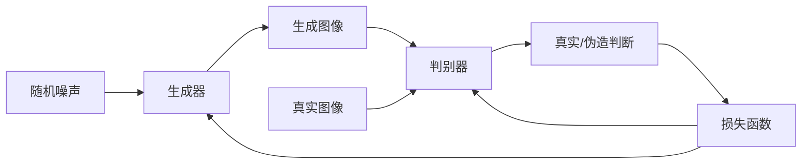

# DALL-E原理与代码实例讲解

## 1.背景介绍

### 1.1 人工智能图像生成的兴起

近年来,人工智能技术在图像生成领域取得了长足的进步,催生了一系列令人惊叹的图像生成模型。其中,DALL-E无疑是最具代表性和影响力的一款。DALL-E的出现,不仅推动了人工智能图像生成技术的发展,更重要的是它为人类创造性活动提供了新的可能性。

### 1.2 DALL-E的重要意义

DALL-E是一种全新的人工智能系统,它能够根据自然语言描述生成高度逼真和创新的图像。这种将文本转化为图像的能力打破了人类传统的创作方式,为艺术家、设计师等创意人员提供了崭新的创作工具。同时,DALL-E在医疗、教育、娱乐等领域也有着广阔的应用前景。

## 2.核心概念与联系

### 2.1 生成式对抗网络(GAN)

DALL-E的核心技术是生成式对抗网络(GAN)。GAN由两个神经网络组成:生成器(Generator)和判别器(Discriminator)。生成器的任务是从随机噪声中生成逼真的图像,而判别器则需要区分生成的图像是真实的还是伪造的。两个网络相互对抗,最终达到一种动态平衡,使得生成器能够产生高质量的图像。



### 2.2 自然语言处理(NLP)

DALL-E的另一个关键技术是自然语言处理(NLP)。NLP模块需要理解自然语言描述,并将其转化为图像生成所需的语义表示。这种语义表示作为条件输入,指导生成器生成符合描述的图像。NLP模块通常采用transformer等深度学习模型,能够有效捕捉文本的上下文信息。

### 2.3 多模态融合

DALL-E的核心在于将GAN和NLP技术有机结合,实现了文本到图像的多模态融合。这种融合不仅需要处理不同模态之间的差异,还需要捕捉文本和图像之间的复杂关联。DALL-E采用了一种新颖的架构,能够在保留每种模态的独特特征的同时,实现有效的跨模态交互。

## 3.核心算法原理具体操作步骤

DALL-E的核心算法可以概括为以下几个主要步骤:

### 3.1 文本编码

首先,DALL-E使用一个经过预训练的自然语言模型(如BERT)对输入的文本描述进行编码。该模型能够捕捉文本的语义和上下文信息,并将其表示为一系列向量。这些向量就是后续生成图像所需的语义条件。

$$\text{Text Encoding: } \boldsymbol{t} = \text{BERT}(\text{text description})$$

其中,$\boldsymbol{t}$是编码后的文本向量序列。

### 3.2 图像生成

接下来,DALL-E使用一个基于Transformer的生成器网络,将文本编码$\boldsymbol{t}$和随机噪声$\boldsymbol{z}$作为输入,生成一个初始的图像$\boldsymbol{x}_0$。

$$\boldsymbol{x}_0 = \text{Generator}(\boldsymbol{t}, \boldsymbol{z})$$

### 3.3 图像优化

为了提高生成图像的质量和逼真度,DALL-E采用了一种基于对抗训练的图像优化策略。具体来说,生成器会不断优化$\boldsymbol{x}_0$,使其更加符合文本描述,同时判别器会对优化后的图像$\boldsymbol{x}_i$进行评分,指导生成器的优化方向。这个过程可以表示为:

$$\boldsymbol{x}_{i+1} = \boldsymbol{x}_i + \alpha \nabla_{\boldsymbol{x}_i} \log D(\boldsymbol{x}_i|\boldsymbol{t})$$

其中,$D$是判别器网络,$\alpha$是学习率,$\nabla_{\boldsymbol{x}_i} \log D(\boldsymbol{x}_i|\boldsymbol{t})$是判别器对$\boldsymbol{x}_i$的评分梯度。通过多次迭代优化,最终可以得到高质量的生成图像$\boldsymbol{x}_N$。

### 3.4 图像解码

在获得优化后的图像表示$\boldsymbol{x}_N$之后,DALL-E使用一个解码器网络将其转换为实际的RGB图像像素值,得到最终的输出图像。

$$\text{Output Image} = \text{Decoder}(\boldsymbol{x}_N)$$

通过上述步骤,DALL-E能够根据自然语言描述生成高度逼真和创新的图像。

## 4.数学模型和公式详细讲解举例说明

DALL-E的核心数学模型是生成式对抗网络(GAN),其目标函数可以表示为:

$$\min_G \max_D V(D,G) = \mathbb{E}_{\boldsymbol{x} \sim p_\text{data}(\boldsymbol{x})}[\log D(\boldsymbol{x})] + \mathbb{E}_{\boldsymbol{z} \sim p_\boldsymbol{z}(\boldsymbol{z})}[\log(1 - D(G(\boldsymbol{z})))]$$

其中,$G$是生成器网络,$D$是判别器网络,$\boldsymbol{x}$是真实图像数据,$\boldsymbol{z}$是随机噪声向量。

判别器$D$的目标是最大化对真实图像的判别概率$\log D(\boldsymbol{x})$,同时最小化对生成图像$G(\boldsymbol{z})$的判别概率$\log(1 - D(G(\boldsymbol{z})))$。而生成器$G$的目标则是最小化$\log(1 - D(G(\boldsymbol{z})))$,使生成的图像足够逼真以欺骗判别器。

在DALL-E中,生成器$G$和判别器$D$还需要考虑文本条件$\boldsymbol{t}$,目标函数变为:

$$\min_G \max_D V(D,G) = \mathbb{E}_{\boldsymbol{x} \sim p_\text{data}(\boldsymbol{x})}[\log D(\boldsymbol{x}|\boldsymbol{t})] + \mathbb{E}_{\boldsymbol{z} \sim p_\boldsymbol{z}(\boldsymbol{z})}[\log(1 - D(G(\boldsymbol{z}|\boldsymbol{t})|\boldsymbol{t}))]$$

这里,$D(\boldsymbol{x}|\boldsymbol{t})$表示判别器对于给定文本条件$\boldsymbol{t}$时,判断图像$\boldsymbol{x}$为真实图像的概率。$G(\boldsymbol{z}|\boldsymbol{t})$表示生成器根据文本条件$\boldsymbol{t}$和噪声$\boldsymbol{z}$生成图像。

通过优化上述目标函数,DALL-E能够学习到一个高质量的生成器$G$,使其生成的图像不仅逼真,而且符合输入的文本描述。

让我们通过一个具体例子来理解DALL-E的工作原理。假设输入的文本描述是"一只可爱的小狗在草地上玩耍"。首先,DALL-E会使用BERT等NLP模型对这个描述进行编码,得到相应的文本向量$\boldsymbol{t}$。然后,将$\boldsymbol{t}$和一个随机噪声向量$\boldsymbol{z}$输入到生成器$G$中,生成一个初始的图像$\boldsymbol{x}_0 = G(\boldsymbol{z}|\boldsymbol{t})$。

接下来,DALL-E会通过对抗训练的方式不断优化$\boldsymbol{x}_0$,使其更加符合文本描述。具体来说,判别器$D$会对优化后的图像$\boldsymbol{x}_i$进行评分,计算$\log D(\boldsymbol{x}_i|\boldsymbol{t})$,表示该图像在给定文本条件下被判断为真实图像的概率。然后,根据这个评分的梯度$\nabla_{\boldsymbol{x}_i} \log D(\boldsymbol{x}_i|\boldsymbol{t})$,生成器会相应地调整$\boldsymbol{x}_i$,得到$\boldsymbol{x}_{i+1} = \boldsymbol{x}_i + \alpha \nabla_{\boldsymbol{x}_i} \log D(\boldsymbol{x}_i|\boldsymbol{t})$。

经过多次迭代优化后,DALL-E最终会生成一张高质量的图像$\boldsymbol{x}_N$,该图像不仅看起来逼真,而且符合"一只可爱的小狗在草地上玩耍"的描述。最后,DALL-E使用一个解码器网络将$\boldsymbol{x}_N$转换为实际的RGB图像像素值,输出最终的结果图像。

通过上述例子,我们可以看到DALL-E是如何巧妙地将自然语言处理和生成式对抗网络相结合,实现了文本到图像的高质量生成。

## 5.项目实践:代码实例和详细解释说明

为了更好地理解DALL-E的原理和实现,我们提供了一个简化版本的代码示例。这个示例使用PyTorch框架,实现了DALL-E的核心功能:根据给定的文本描述生成相应的图像。

### 5.1 导入所需库

```python
import torch
import torch.nn as nn
from transformers import BertTokenizer, BertModel
```

我们首先导入PyTorch和Transformers库,后者用于实现BERT文本编码器。

### 5.2 文本编码器

```python
class TextEncoder(nn.Module):
    def __init__(self):
        super().__init__()
        self.tokenizer = BertTokenizer.from_pretrained('bert-base-uncased')
        self.bert = BertModel.from_pretrained('bert-base-uncased')

    def forward(self, text):
        inputs = self.tokenizer(text, return_tensors='pt')
        outputs = self.bert(**inputs)
        return outputs.last_hidden_state
```

`TextEncoder`模块使用预训练的BERT模型对输入文本进行编码。`forward`函数首先使用BERT的tokenizer将文本转换为模型可接受的输入格式,然后将其输入到BERT模型中,获取最后一层隐藏状态作为文本的向量表示。

### 5.3 生成器

```python
class Generator(nn.Module):
    def __init__(self, text_dim, noise_dim, img_dim):
        super().__init__()
        self.proj = nn.Linear(text_dim + noise_dim, img_dim)

    def forward(self, text_encoding, noise):
        x = torch.cat([text_encoding, noise], dim=1)
        x = self.proj(x)
        return x
```

`Generator`模块将文本编码和随机噪声作为输入,通过一个全连接层将它们融合并映射到图像的向量空间。这是一个非常简化的生成器实现,实际应用中通常会使用更复杂的网络结构,如卷积神经网络或Transformer。

### 5.4 判别器

```python
class Discriminator(nn.Module):
    def __init__(self, text_dim, img_dim):
        super().__init__()
        self.text_proj = nn.Linear(text_dim, img_dim)
        self.img_proj = nn.Linear(img_dim, img_dim)
        self.classifier = nn.Linear(img_dim, 1)

    def forward(self, text_encoding, img):
        text_proj = self.text_proj(text_encoding)
        img_proj = self.img_proj(img)
        concat = text_proj * img_proj
        output = self.classifier(concat)
        return output
```

`Discriminator`模块的作用是判断给定的图像是真实的还是生成的。它首先分别对文本编码和图像进行线性投影,然后将投影后的向量进行逐元素乘积,最后通过一个线性层输出一个标量值,表示图像为真实图像的概率。

### 5.5 训练过程

```python
text_encoder = TextEncoder()
generator = Generator(text_dim=768, noise_dim=100, img_dim=64)
discriminator = Discriminator(text_dim=768, img_dim=64)

text = "A cute puppy playing on the grass."
text_encoding = text_encoder(text)

noise = torch.randn(1, 100)
fake_img = generator(text_encoding, noise)

real_img = ... # 加载真实图像数据

d_real = discriminator(text_encoding, real_img)
d_fake = discriminator(text_encoding, fake_img.detach())

loss_d = -(torch.log(