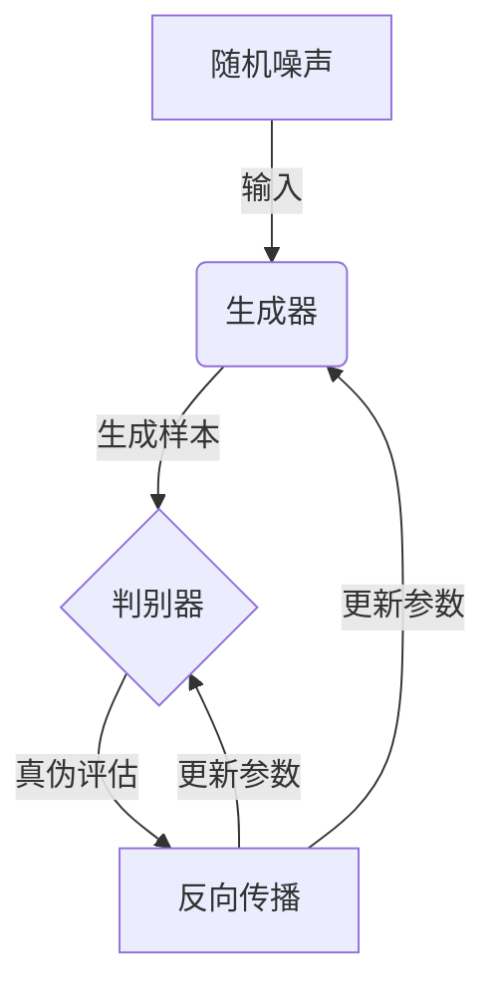
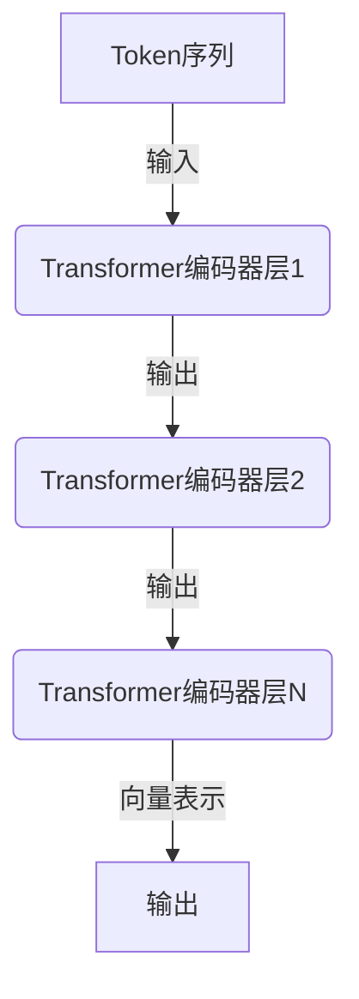
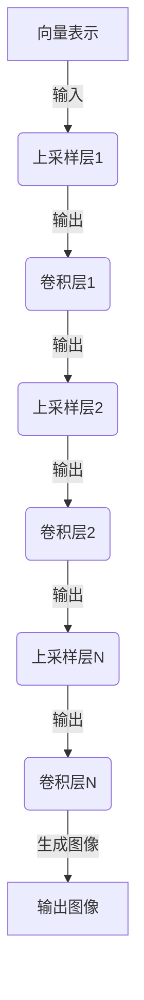
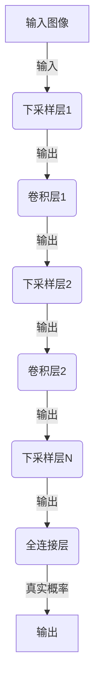
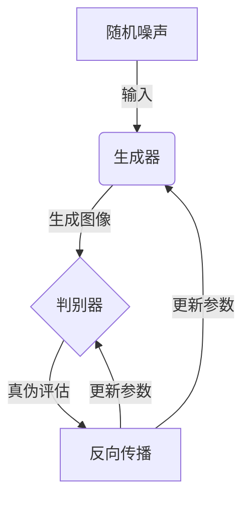

# DALL-E原理与代码实例讲解

## 1.背景介绍

### 1.1 人工智能的新里程碑

人工智能的发展一直是科技界的焦点。近年来,由OpenAI公司推出的DALL-E系统,引起了全球广泛关注。DALL-E是一种全新的人工智能模型,它能够根据自然语言描述生成逼真的图像,这在人工智能历史上可谓是一个里程碑式的突破。

### 1.2 DALL-E的重大意义

DALL-E的出现,不仅展示了人工智能在计算机视觉和自然语言处理领域的巨大进步,更重要的是它为人类创作提供了全新的可能性。无论是设计、艺术创作,还是科学可视化等领域,DALL-E都有潜在的应用前景。它可以帮助人类更高效地将想象转化为视觉形式,大大提高创作效率。

### 1.3 DALL-E的发展历程

DALL-E的雏形最早可以追溯到2021年初,当时OpenAI公司发布了一个名为DALL-E的多模态AI系统,它能够根据自然语言描述生成相关图像。这一突破性的成果引发了学术界和业界的广泛关注。

随后,OpenAI不断优化和完善DALL-E系统,于2022年4月推出了DALL-E 2,其生成图像的质量和多样性都有了大幅提升。DALL-E 2不仅能生成逼真的图像,还能根据文字描述对现有图像进行编辑和修改。

## 2.核心概念与联系

### 2.1 生成式对抗网络(GAN)

DALL-E的核心技术是基于生成式对抗网络(Generative Adversarial Networks,GAN)。GAN是一种由两个神经网络组成的架构,包括生成器(Generator)和判别器(Discriminator)。

生成器的作用是从随机噪声中生成逼真的数据样本,例如图像或文本。判别器则负责判断生成的数据是真实的还是伪造的。两个网络相互对抗,生成器试图欺骗判别器,而判别器则努力区分真伪。通过这种对抗训练,生成器最终能够生成高质量的数据样本。



### 2.2 transformer架构

除了GAN之外,DALL-E还采用了transformer架构,这是一种在自然语言处理领域广泛使用的序列到序列模型。transformer能够有效地捕捉输入序列中的长程依赖关系,从而更好地理解和生成序列数据。

在DALL-E中,transformer被用于编码自然语言描述,并将其映射到一个连续的向量空间中。然后,这个向量被输入到GAN的生成器中,用于生成相应的图像。


### 2.3 多模态学习

DALL-E的另一个核心概念是多模态学习(Multimodal Learning)。多模态学习旨在从不同模态的数据中学习知识表示,例如同时处理文本、图像、视频等不同形式的数据。

在DALL-E中,自然语言描述和图像就是两种不同的模态。通过同时学习这两种模态之间的映射关系,DALL-E能够更好地理解语义信息,并将其转化为视觉形式。这种多模态学习的能力使得DALL-E在图像生成任务上表现出色。

## 3.核心算法原理具体操作步骤

### 3.1 数据预处理

在训练DALL-E模型之前,需要对输入数据进行预处理。对于自然语言描述,通常会使用标记化(Tokenization)将文本转换为token序列,然后使用词嵌入(Word Embedding)将每个token映射到一个连续的向量空间中。

对于图像数据,则需要进行标准化处理,例如调整图像大小、归一化像素值等,以确保输入数据的一致性。

### 3.2 Transformer编码器

自然语言描述经过预处理后,会被输入到Transformer编码器中。Transformer编码器由多个编码器层组成,每个编码器层包含多头注意力机制(Multi-Head Attention)和前馈神经网络(Feed-Forward Neural Network)。

通过自注意力机制,Transformer编码器能够捕捉输入序列中的长程依赖关系,从而更好地理解语义信息。编码器的输出是一个连续的向量表示,它包含了自然语言描述的语义信息。



### 3.3 GAN生成器

Transformer编码器的输出向量会被输入到GAN的生成器中。生成器是一个深度卷积神经网络(Deep Convolutional Neural Network),它能够将输入向量映射到一个高维的潜在空间中。

在潜在空间中,生成器会对输入向量进行上采样(Upsampling)操作,逐步生成高分辨率的图像。这个过程通常包括多个上采样层和卷积层,每一层都会提高图像的分辨率和细节。



### 3.4 GAN判别器

生成器生成的图像会被输入到GAN的判别器中。判别器是一个深度卷积神经网络,它的目标是判断输入图像是真实的还是由生成器生成的。

判别器会对输入图像进行下采样(Downsampling)操作,提取图像的特征信息。然后,这些特征信息会被输入到一个全连接层中,输出一个标量值,表示图像是真实的概率。



### 3.5 对抗训练

生成器和判别器通过对抗训练的方式相互优化。生成器的目标是生成足够逼真的图像,以欺骗判别器;而判别器则努力区分真实图像和生成图像。

在训练过程中,生成器会根据判别器的反馈不断调整参数,以生成更加逼真的图像。同时,判别器也会根据生成器的输出调整参数,提高区分真伪的能力。这种对抗训练的过程会持续多个epoch,直到生成器和判别器达到动态平衡。



## 4.数学模型和公式详细讲解举例说明

### 4.1 生成式对抗网络(GAN)的目标函数

生成式对抗网络(GAN)的目标是训练一个生成器 $G$,使其能够从一个先验噪声分布 $p_z(z)$ 生成与真实数据分布 $p_{data}(x)$ 相似的样本。同时,训练一个判别器 $D$,使其能够区分生成器生成的样本和真实数据样本。

GAN的目标函数可以表示为:

$$\min_G \max_D V(D, G) = \mathbb{E}_{x \sim p_{data}(x)}[\log D(x)] + \mathbb{E}_{z \sim p_z(z)}[\log (1 - D(G(z)))]$$

其中:
- $\mathbb{E}_{x \sim p_{data}(x)}[\log D(x)]$ 表示判别器对真实数据样本的期望输出为正类(真实)的对数概率。
- $\mathbb{E}_{z \sim p_z(z)}[\log (1 - D(G(z)))]$ 表示判别器对生成器生成的样本的期望输出为负类(伪造)的对数概率。

通过最小化生成器的损失函数 $\log (1 - D(G(z)))$,生成器可以生成更加逼真的样本,以欺骗判别器。同时,通过最大化判别器的损失函数 $\log D(x) + \log (1 - D(G(z)))$,判别器可以提高区分真伪样本的能力。

### 4.2 Transformer的注意力机制

Transformer中的注意力机制(Attention Mechanism)是一种计算输入序列中每个元素的加权平均值的方法。它能够捕捉输入序列中的长程依赖关系,从而更好地理解序列的语义信息。

注意力机制的计算过程可以表示为:

$$\text{Attention}(Q, K, V) = \text{softmax}\left(\frac{QK^T}{\sqrt{d_k}}\right)V$$

其中:
- $Q$ 表示查询向量(Query)
- $K$ 表示键向量(Key)
- $V$ 表示值向量(Value)
- $d_k$ 表示键向量的维度

首先,计算查询向量 $Q$ 和键向量 $K$ 的点积,并除以 $\sqrt{d_k}$ 进行缩放。然后,对点积结果应用 softmax 函数,得到注意力权重。最后,将注意力权重与值向量 $V$ 相乘,得到加权平均值,即注意力输出。

通过多头注意力机制(Multi-Head Attention),Transformer可以从不同的子空间捕捉不同的注意力模式,从而提高模型的表示能力。

### 4.3 GAN生成器的上采样操作

在GAN的生成器中,上采样(Upsampling)操作是一种将低分辨率的特征图放大到高分辨率的过程。常见的上采样方法包括最近邻插值(Nearest Neighbor)、双线性插值(Bilinear)和转置卷积(Transposed Convolution)等。

转置卷积是一种常用的上采样方法,它可以学习到更加复杂的上采样模式。转置卷积的计算过程可以表示为:

$$y_{i,j,k} = \sum_{m,n,l} x_{m,n,l} \cdot w_{i-m,j-n,k-l}$$

其中:
- $x$ 表示输入特征图
- $y$ 表示输出特征图
- $w$ 表示卷积核权重

转置卷积的核心思想是将每个输入像素值与卷积核中对应的权重相乘,然后将所有乘积相加,得到输出像素值。通过合理设置卷积核的大小和步长,可以实现上采样操作。

## 5.项目实践：代码实例和详细解释说明

在这一部分,我们将提供一个基于PyTorch的DALL-E模型实现示例,并对关键代码进行详细解释。

### 5.1 数据预处理

```python
import torch
from torchvision import transforms

# 定义图像预处理转换
image_transform = transforms.Compose([
    transforms.Resize((256, 256)),
    transforms.ToTensor(),
    transforms.Normalize(mean=[0.5, 0.5, 0.5], std=[0.5, 0.5, 0.5])
])

# 加载图像数据集
dataset = ImageFolder('path/to/dataset', transform=image_transform)
dataloader = DataLoader(dataset, batch_size=32, shuffle=True)
```

在这个示例中,我们首先定义了一个图像预处理转换 `image_transform`。它包括调整图像大小、转换为张量格式,以及对像素值进行归一化处理。

然后,我们加载了一个图像数据集 `ImageFolder`,并使用 `DataLoader` 创建了一个数据加载器,用于在训练过程中批量获取图像数据。

### 5.2 Transformer编码器

```python
import torch.nn as nn

class TransformerEncoder(nn.Module):
    def __init__(self