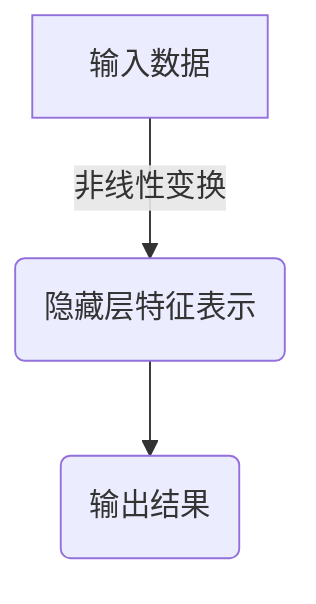
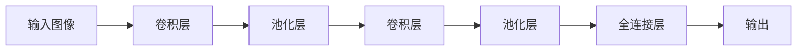
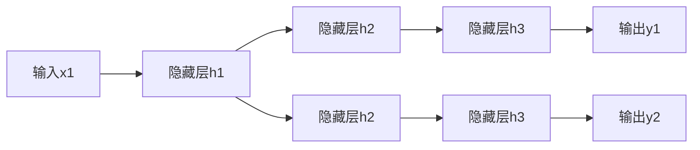

# Deep Learning

## 1.背景介绍

### 1.1 人工智能的发展历程

人工智能(Artificial Intelligence, AI)是当代科技领域最具革命性和颠覆性的技术之一。自20世纪50年代诞生以来,AI不断发展壮大,经历了多次重大突破,催生了众多分支领域。其中,深度学习(Deep Learning)是AI领域最新的一个里程碑式进展,被视为AI发展的最新阶段。

### 1.2 深度学习的兴起

深度学习起源于对生物神经网络的模拟,借鉴了人脑识别模式的基本机理。早在20世纪80年代,科学家们就提出了人工神经网络的概念,并进行了大量理论和实践探索。但由于当时计算能力和数据量的限制,神经网络一直无法得到有效训练,难以发挥出应有的潜力。

直到近年来,大数据和强大的并行计算能力的出现,为深度学习的发展创造了必要条件。2006年,Geoffrey Hinton等人在神经网络上取得突破性进展,提出了深度置信网络(Deep Belief Network)模型,有效解决了神经网络训练的困难,掀开了深度学习的序幕。随后,Alex Krizhevsky等人在2012年的ImageNet图像识别挑战赛上,利用深度卷积神经网络(Convolutional Neural Network, CNN)取得了巨大成功,使深度学习在计算机视觉领域崭露头角。

## 2.核心概念与联系

### 2.1 什么是深度学习?

深度学习是机器学习(Machine Learning)的一个分支,它通过对数据进行表征学习,获取多层次的分层特征表示,并对输入数据进行建模、分析和预测。与传统的机器学习方法相比,深度学习更加强调利用多层非线性变换对数据进行分层抽象,发现数据的内在分布规律。



深度学习模型通常由多个处理层级组成,每个层级对上一层的输出进行非线性变换,提取更加抽象和复杂的特征表示。这种层层抽象的方式使得深度学习模型能够自主学习数据的内在规律,而无需人工设计特征。

### 2.2 深度学习与神经网络

深度学习与人工神经网络(Artificial Neural Network, ANN)密切相关。神经网络是一种受生物神经系统启发而设计的数学模型,由大量互连的节点(神经元)组成,用于对输入数据进行处理和学习。

$$
y = f\left(\sum_{i=1}^{n}w_ix_i + b\right)
$$

上式表示一个简单的神经元模型,其中 $x_i$ 是输入, $w_i$ 是权重, $b$ 是偏置项, $f$ 是激活函数。神经网络通过调整神经元之间的连接权重,来学习输入数据与期望输出之间的映射关系。

深度学习模型实际上是一种多层次的神经网络结构,通过增加网络的深度(层数),使得模型能够学习到更加抽象和复杂的特征表示。常见的深度学习模型包括前馈神经网络(Feedforward Neural Network)、卷积神经网络(Convolutional Neural Network)、循环神经网络(Recurrent Neural Network)等。

### 2.3 深度学习的关键技术

深度学习的发展离不开一些关键技术的突破,包括:

1. **优化算法**: 如随机梯度下降(Stochastic Gradient Descent)、自适应优化算法(Adam)等,用于有效训练深度神经网络。
2. **正则化技术**: 如dropout、批量归一化(Batch Normalization)等,用于防止过拟合,提高模型的泛化能力。
3. **激活函数**: 如ReLU、Leaky ReLU等,引入非线性因素,增强模型的表达能力。
4. **结构优化**: 如残差连接(Residual Connection)、注意力机制(Attention Mechanism)等,使得网络结构更加合理高效。
5. **硬件加速**: 利用GPU、TPU等硬件加速深度学习模型的训练和推理过程。

## 3.核心算法原理具体操作步骤

### 3.1 前馈神经网络

前馈神经网络(Feedforward Neural Network, FNN)是深度学习中最基础的网络结构,也是其他复杂网络的基础。它由输入层、隐藏层和输出层组成,数据在网络中是单向传播的,没有回路。


前馈神经网络的训练过程包括以下步骤:

1. **前向传播**: 输入数据通过网络层层传递,每个神经元根据上一层的输出计算加权和,并通过激活函数得到自身的输出。
2. **计算损失**: 将网络的最终输出与期望输出计算损失函数(如均方误差)。
3. **反向传播**: 根据损失函数对网络的每个权重计算梯度,通过链式法则自后向前逐层计算。
4. **权重更新**: 根据梯度下降算法更新每个权重,使损失函数值下降。

重复上述过程,直至模型收敛或达到预期效果。

### 3.2 卷积神经网络

卷积神经网络(Convolutional Neural Network, CNN)是深度学习在计算机视觉领域的杰出代表,擅长对图像、视频等数据进行处理。CNN的核心思想是局部连接和权重共享,能够有效捕捉数据的局部特征。

CNN的基本结构包括卷积层(Convolution Layer)、池化层(Pooling Layer)和全连接层(Fully Connected Layer)。



1. **卷积层**: 通过滑动卷积核在输入数据上进行卷积操作,提取局部特征。
2. **池化层**: 对卷积层的输出进行下采样,减少数据量,提高模型的泛化能力。
3. **全连接层**: 将前面层的特征映射到最终的输出,用于分类或回归任务。

CNN的训练过程与前馈神经网络类似,但由于卷积层和池化层的特殊结构,需要对梯度的计算方式进行相应调整。

### 3.3 循环神经网络

循环神经网络(Recurrent Neural Network, RNN)是处理序列数据(如文本、语音、时间序列等)的有力工具。与前馈网络不同,RNN在隐藏层之间引入了循环连接,使得网络能够捕捉序列数据中的时间依赖关系。



RNN的核心思想是将序列数据一个时间步一个时间步地输入网络,并在每个时间步更新隐藏层的状态,从而捕捉序列数据的动态变化规律。

在实际应用中,由于传统RNN存在梯度消失或爆炸的问题,往往采用长短期记忆网络(Long Short-Term Memory, LSTM)或门控循环单元(Gated Recurrent Unit, GRU)等变体,以更好地捕捉长期依赖关系。

## 4.数学模型和公式详细讲解举例说明

### 4.1 神经网络的数学模型

神经网络的数学模型可以表示为一系列的函数组合,每一层的输出都是上一层输出经过一个非线性变换得到的。

对于一个单层神经网络,其数学表达式为:

$$
\begin{aligned}
z &= \mathbf{W}^T\mathbf{x} + \mathbf{b} \\
\mathbf{y} &= f(z)
\end{aligned}
$$

其中:
- $\mathbf{x}$ 是输入向量
- $\mathbf{W}$ 是权重矩阵
- $\mathbf{b}$ 是偏置向量
- $f$ 是非线性激活函数,如sigmoid、ReLU等

对于多层神经网络,可以将每一层看作是一个函数的组合:

$$
f^{(L)}(\mathbf{x}) = f^{(L)}\left(f^{(L-1)}\left(\cdots f^{(2)}\left(f^{(1)}(\mathbf{x})\right)\right)\right)
$$

其中 $L$ 表示网络的层数。

在训练过程中,我们需要通过优化算法(如梯度下降)来调整网络的参数 $\mathbf{W}$ 和 $\mathbf{b}$,使得网络的输出 $\mathbf{y}$ 尽可能接近期望输出 $\mathbf{t}$。这个过程可以通过最小化损失函数 $\mathcal{L}(\mathbf{y}, \mathbf{t})$ 来实现,常见的损失函数有均方误差、交叉熵等。

### 4.2 卷积神经网络中的卷积操作

卷积操作是卷积神经网络的核心,它通过在输入数据上滑动卷积核,提取局部特征。

对于二维图像数据,卷积操作可以表示为:

$$
S(i, j) = (I * K)(i, j) = \sum_{m}\sum_{n}I(i+m, j+n)K(m, n)
$$

其中:
- $I$ 是输入图像
- $K$ 是卷积核(也称滤波器)
- $S$ 是卷积操作的输出特征图
- $m$、$n$ 是卷积核的索引

卷积操作可以看作是在输入数据上滑动卷积核,对每个局部区域进行加权求和,得到输出特征图上的一个像素值。通过设计不同的卷积核,可以提取不同的特征,如边缘、纹理等。

在实际应用中,卷积层往往会串联多个卷积核,形成多个特征图,捕捉输入数据的不同特征。

### 4.3 循环神经网络中的时间反向传播算法

循环神经网络的训练过程需要采用时间反向传播算法(Backpropagation Through Time, BPTT),来计算每个时间步的梯度。

对于给定的时间序列 $\mathbf{x} = (x_1, x_2, \ldots, x_T)$,RNN的前向计算过程为:

$$
\begin{aligned}
\mathbf{h}_t &= f_W(\mathbf{h}_{t-1}, \mathbf{x}_t) \\
\mathbf{o}_t &= g_V(\mathbf{h}_t)
\end{aligned}
$$

其中:
- $\mathbf{h}_t$ 是时间步 $t$ 的隐藏状态
- $f_W$ 是根据权重矩阵 $W$ 计算隐藏状态的函数
- $\mathbf{o}_t$ 是时间步 $t$ 的输出
- $g_V$ 是根据权重矩阵 $V$ 计算输出的函数

在反向传播过程中,我们需要计算每个时间步的梯度:

$$
\frac{\partial \mathcal{L}}{\partial W} = \sum_{t=1}^T \frac{\partial \mathcal{L}}{\partial \mathbf{h}_t} \frac{\partial \mathbf{h}_t}{\partial W}
$$

其中 $\mathcal{L}$ 是损失函数。

通过时间反向传播算法,我们可以沿着时间步的反方向,依次计算每个时间步的梯度,并对网络的权重进行更新。这种算法能够有效捕捉序列数据中的长期依赖关系,是训练循环神经网络的关键。

## 5.项目实践: 代码实例和详细解释说明

### 5.1 使用PyTorch构建前馈神经网络

在这个示例中,我们将使用PyTorch构建一个简单的前馈神经网络,用于对MNIST手写数字数据集进行分类。

```python
import torch
import torch.nn as nn
import torch.optim as optim

# 定义网络结构
class FeedforwardNet(nn.Module):
    def __init__(self):
        super(FeedforwardNet, self).__init__()
        self.fc1 = nn.Linear(28 * 28, 512