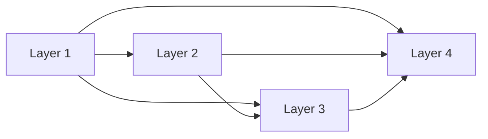

## 1.背景介绍

深度学习领域中，卷积神经网络（Convolutional Neural Networks, CNN）已经在图像识别、语音识别等任务上取得了显著的成果。在CNN的发展过程中，一种名为DenseNet（Densely Connected Convolutional Networks）的网络结构引起了广泛的关注。它通过引入了稠密连接（Dense Connection）的概念，实现了特征的重复利用，提高了模型的性能。本文将深入探讨DenseNet的原理，并通过代码实例进行详细讲解。

## 2.核心概念与联系

DenseNet的核心概念是稠密连接。在稠密连接中，每一层的输出都会作为后续所有层的输入。这种设计使得网络可以直接访问之前层的原始信息，同时也保留了所有层的输出信息。这种连接方式带来了以下三个主要优点：

- 提高了特征的利用率：由于每一层都可以接收前面所有层的特征图（feature maps），因此网络可以在需要的时候选择并复用这些特征。

- 加强了特征的传播：每一层的特征图都可以直接传递到后面的所有层，这有助于解决梯度消失的问题。

- 减少了参数的数量：由于前面层的特征可以直接传递到后面的层，因此可以减少中间层的输出通道数，从而减少了参数的数量。

下面是DenseNet的一个基本结构示例，其中L表示层，每一条箭头代表一次前向传播：



## 3.核心算法原理具体操作步骤

DenseNet的实现主要包括以下步骤：

1. 定义稠密块（Dense Block）：稠密块由多个卷积层组成，每个卷积层的输入都是前面所有层的输出的集合。

2. 定义过渡层（Transition Layer）：由于稠密块中特征图的数量会随着层数的增加而增加，为了控制模型的复杂度，需要在稠密块之间添加过渡层，用于减少特征图的数量。

3. 构建网络：将多个稠密块和过渡层交替堆叠，形成最终的DenseNet网络。

## 4.数学模型和公式详细讲解举例说明

在DenseNet中，假设第$l$层的输入为$x^{[1]},x^{[2]},\ldots,x^{[l]}$，其中$x^{[i]}$是第$i$层的输出，那么第$l$层的输出可以表示为：

$$
x^{[l]} = H^{[l]}([x^{[1]},x^{[2]},\ldots,x^{[l-1]}])
$$

其中，$H^{[l]}$表示第$l$层的非线性变换函数，$[\ldots]$表示特征图的连接操作。

在实际应用中，$H^{[l]}$通常由BN（Batch Normalization）、ReLU和3x3卷积组成，可以表示为：

$$
H^{[l]}(x) = Conv(ReLU(BN(x)))
$$

## 5.项目实践：代码实例和详细解释说明

以下是一个基于PyTorch实现的简单DenseNet代码示例：

```python
import torch
import torch.nn as nn

# 定义卷积操作
def conv3x3(in_channels, out_channels):
    return nn.Conv2d(in_channels, out_channels, kernel_size=3, padding=1, bias=False)

# 定义稠密层
class DenseLayer(nn.Module):
    def __init__(self, in_channels, growth_rate):
        super(DenseLayer, self).__init__()
        self.bn = nn.BatchNorm2d(in_channels)
        self.relu = nn.ReLU(inplace=True)
        self.conv = conv3x3(in_channels, growth_rate)

    def forward(self, x):
        out = self.conv(self.relu(self.bn(x)))
        out = torch.cat([x, out], dim=1)
        return out

# 定义稠密块
class DenseBlock(nn.Module):
    def __init__(self, in_channels, growth_rate, num_layers):
        super(DenseBlock, self).__init__()
        self.layers = nn.ModuleList([
            DenseLayer(in_channels + i*growth_rate, growth_rate)
            for i in range(num_layers)])

    def forward(self, x):
        for layer in self.layers:
            x = layer(x)
        return x
```

## 6.实际应用场景

DenseNet由于其优秀的性能和高效的参数利用，已经被广泛应用于图像分类、目标检测、语义分割等计算机视觉任务中。例如，DenseNet在ImageNet图像分类任务上取得了超过ResNet的性能。

## 7.工具和资源推荐

- PyTorch：一个基于Python的深度学习框架，提供了灵活和高效的神经网络编程接口。

- TensorFlow：一个强大的深度学习框架，提供了丰富的API和工具，支持多种硬件平台。

- DenseNet GitHub：DenseNet的官方GitHub仓库，提供了DenseNet的原始论文和代码实现。

## 8.总结：未来发展趋势与挑战

DenseNet作为一种有效的CNN结构，其稠密连接的设计为深度学习模型的设计提供了新的思路。然而，随着深度学习领域的发展，DenseNet也面临着一些挑战，例如如何进一步提高模型的性能，如何处理更大规模的数据等。未来，我们期待看到更多基于DenseNet的改进模型和新的应用。

## 9.附录：常见问题与解答

Q: DenseNet和ResNet有什么区别？

A: DenseNet和ResNet的主要区别在于连接方式。ResNet采用的是残差连接，即每一层的输出是输入和变换函数的和；而DenseNet采用的是稠密连接，即每一层的输出是前面所有层输出的集合。

Q: DenseNet的参数量是不是很大？

A: 尽管DenseNet的连接方式看起来会引入大量的参数，但实际上，由于其有效的特征复用，DenseNet的参数量通常比其他同等性能的模型要少。

作者：禅与计算机程序设计艺术 / Zen and the Art of Computer Programming