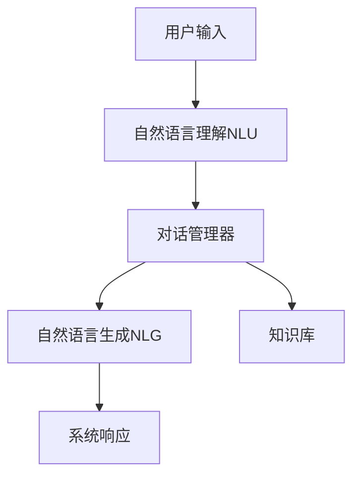
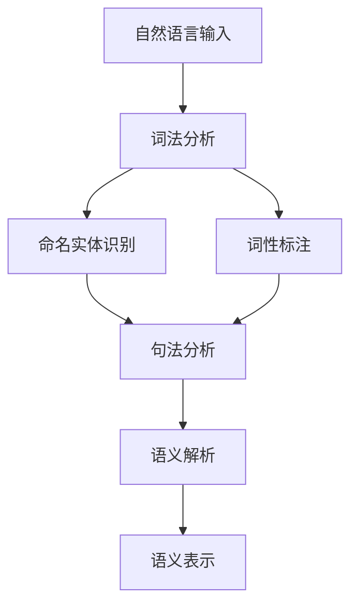
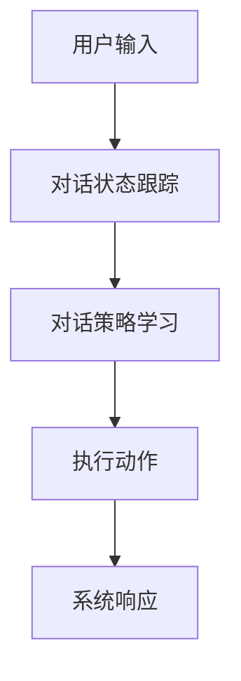
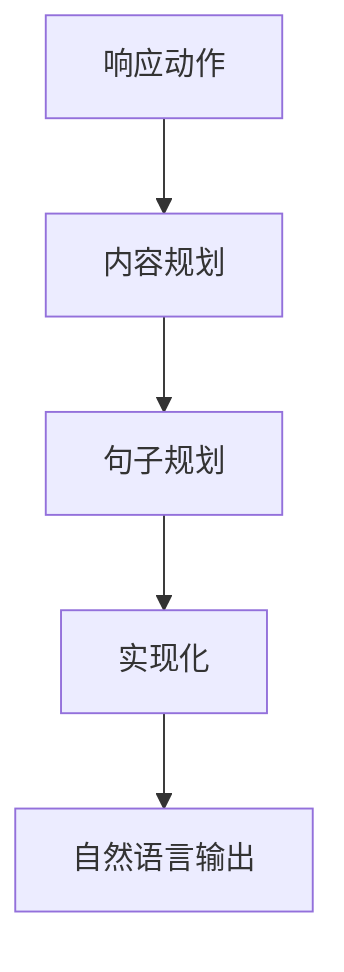

# Dialogue Systems原理与代码实例讲解

## 1.背景介绍

### 1.1 什么是对话系统?

对话系统(Dialogue Systems)是一种人工智能系统,旨在与人类进行自然语言交互。它们通过理解和生成自然语言,使计算机能够像人类一样进行对话。对话系统广泛应用于虚拟助手、客户服务、教育、娱乐等领域。

### 1.2 对话系统的重要性

随着人工智能技术的快速发展,对话系统正在改变人机交互的方式。它们提供了一种更自然、更直观的交互方式,使用户能够以自然语言提出查询和命令,而不再局限于传统的图形用户界面。对话系统的出现极大地提高了人机交互的效率和用户体验。

### 1.3 对话系统的挑战

尽管取得了长足的进步,但构建高质量的对话系统仍然面临着诸多挑战:

- 自然语言理解:准确理解人类的自然语言输入,包括词义disambigution、语义解析等。
- 上下文理解:把握对话的上下文和语境,维持对话的连贯性。
- 知识库集成:融合丰富的领域知识,提供准确的响应。
- 自然语言生成:生成自然、流畅、多样化的语言输出。
- 评估体系:缺乏统一的评估标准和指标。

## 2.核心概念与联系

### 2.1 对话系统的架构

一个典型的对话系统由以下几个核心模块组成:



1. **自然语言理解(NLU)**: 将用户的自然语言输入转换为对话系统可以理解的语义表示。
2. **对话管理器**: 根据当前对话状态和语义表示,决定系统的下一步动作,如查询知识库、调用API等。
3. **知识库**: 存储领域知识,为对话提供信息支持。
4. **自然语言生成(NLG)**: 将对话管理器的响应转化为自然语言输出。

### 2.2 主要技术

对话系统涉及多种人工智能技术,包括:

- **自然语言处理(NLP)**: 用于自然语言理解和生成,如词法分析、句法分析、语义分析等。
- **对话管理**: 控制对话流程,实现状态跟踪、策略学习等。
- **知识表示与推理**: 构建知识库,进行知识推理。
- **机器学习**: 用于各个模块的训练,如语义解析、对话策略等。

### 2.3 主流方法

目前主要有两种对话系统构建方法:

1. **基于规则的系统**: 使用人工设计的规则和模板,需要大量的领域知识和专家经验。
2. **基于数据驱动的系统**: 利用机器学习技术从大量对话数据中自动学习模型,如序列到序列模型等。

近年来,基于数据驱动的方法取得了突破性进展,但两种方法往往结合使用,相互补充。

## 3.核心算法原理具体操作步骤

### 3.1 自然语言理解

自然语言理解是对话系统的基础,其目标是将自然语言转换为计算机可以理解的语义表示。主要包括以下步骤:

1. **词法分析**: 将输入文本分割为词元(token)序列。
2. **命名实体识别(NER)**: 识别出文本中的命名实体,如人名、地名、组织机构名等。
3. **词性标注(POS Tagging)**: 为每个词元赋予相应的词性标记,如名词、动词、形容词等。
4. **句法分析**: 根据语法规则分析句子的句法结构树。
5. **语义解析**: 将句法结构树映射为语义表示,如逻辑形式、语义框架等。

常用的语义表示形式包括:

- 逻辑形式(Logic Form): 使用一阶逻辑或λ-演算表示语义。
- 语义框架(Semantic Frames): 使用一组预定义的框架和slot来表示语义。
- 意图和实体(Intent and Entities): 识别用户的意图和相关实体。

这些步骤通常由多个模型协同完成,如使用BERT进行词性标注和NER,使用序列到序列模型进行语义解析等。



### 3.2 对话管理

对话管理器根据当前对话状态和用户输入,决定系统的下一步动作。主要包括以下步骤:

1. **对话状态跟踪**: 维护对话的上下文信息,如用户意图、对话历史等。
2. **对话策略学习**: 根据对话状态,学习最优的对话策略,决定系统的响应动作。
3. **执行动作**: 根据策略,执行相应的动作,如查询知识库、调用API等。

常用的对话状态表示形式包括:

- 基于规则的状态机
- 基于机器学习的状态向量
- 层次化的对话框架

对话策略学习通常建模为强化学习或者imitation learning问题。策略可以由规则设计,也可以通过与用户交互数据学习得到。



### 3.3 自然语言生成

自然语言生成(NLG)模块将对话管理器的响应动作转化为自然语言输出。主要包括以下步骤:

1. **内容规划**: 根据响应动作,决定输出的语义内容。
2. **句子规划**: 将语义内容组织为句子级的语义表示。
3. **实现化(Realization)**: 将句子级语义表示转化为自然语言文本。

常用的NLG模型包括:

- 基于模板的方法: 使用预定义的模板和slot填充。
- 基于规则的实现器: 使用语法规则将语义表示转化为自然语言。
- 基于神经网络的序列生成模型: 直接从语义表示生成自然语言,如Seq2Seq、Transformer等。



## 4.数学模型和公式详细讲解举例说明

对话系统中涉及多种数学模型和公式,我们将重点介绍两种常用的模型:序列到序列模型和Transformer模型。

### 4.1 序列到序列模型(Seq2Seq)

序列到序列模型广泛应用于机器翻译、对话系统等领域,用于将一个序列映射为另一个序列。它由两部分组成:编码器(Encoder)和解码器(Decoder)。

#### 4.1.1 编码器(Encoder)

编码器将输入序列 $X=(x_1, x_2, ..., x_n)$ 映射为一系列隐藏状态 $\boldsymbol{h} = (h_1, h_2, ..., h_n)$:

$$h_t = f(x_t, h_{t-1})$$

其中 $f$ 是递归函数,通常使用RNN或LSTM等模型实现。最后一个隐藏状态 $h_n$ 被视为输入序列的编码表示。

#### 4.1.2 解码器(Decoder)

解码器根据编码表示 $h_n$ 生成输出序列 $Y=(y_1, y_2, ..., y_m)$:

$$p(y_t | y_{<t}, X) = g(y_{t-1}, s_t, c)$$

其中 $g$ 是生成函数,通常使用RNN或LSTM等模型实现。$s_t$ 是解码器的隐藏状态,而 $c$ 是通过注意力机制从编码器获得的上下文向量。

#### 4.1.3 注意力机制(Attention)

注意力机制允许解码器在生成每个输出token时,动态地关注输入序列的不同部分。具体来说,对于每个时间步 $t$,注意力权重 $\alpha_{t,i}$ 表示解码器对输入token $x_i$ 的关注程度:

$$\alpha_{t,i} = \frac{\exp(e_{t,i})}{\sum_{j=1}^n \exp(e_{t,j})}$$

其中 $e_{t,i}$ 是一个评分函数,用于衡量输入token $x_i$ 对当前解码状态的相关性。上下文向量 $c_t$ 是输入序列的加权和:

$$c_t = \sum_{i=1}^n \alpha_{t,i} h_i$$

解码器使用上下文向量 $c_t$ 和前一时间步的输出 $y_{t-1}$ 来预测当前时间步的输出 $y_t$。

序列到序列模型通过最大化输出序列的条件概率来训练,即最大化:

$$\log p(Y|X) = \sum_{t=1}^m \log p(y_t | y_{<t}, X)$$

### 4.2 Transformer模型

Transformer是一种全新的基于注意力机制的序列到序列模型,不依赖于RNN或LSTM,因此可以更好地并行化,提高计算效率。它主要由编码器(Encoder)和解码器(Decoder)两部分组成。

#### 4.2.1 编码器(Encoder)

编码器由多个相同的层组成,每一层包含两个子层:多头注意力机制(Multi-Head Attention)和前馈神经网络(Feed-Forward Neural Network)。

多头注意力机制允许模型关注输入序列的不同表示子空间,具体计算如下:

$$\text{MultiHead}(Q, K, V) = \text{Concat}(head_1, ..., head_h)W^O$$
$$\text{where } head_i = \text{Attention}(QW_i^Q, KW_i^K, VW_i^V)$$

其中 $Q$、$K$、$V$ 分别表示查询(Query)、键(Key)和值(Value)。$W_i^Q$、$W_i^K$、$W_i^V$ 和 $W^O$ 是可学习的权重矩阵。

前馈神经网络对每个位置的表示进行独立的变换:

$$\text{FFN}(x) = \max(0, xW_1 + b_1)W_2 + b_2$$

编码器的输出是输入序列的编码表示,将被传递给解码器。

#### 4.2.2 解码器(Decoder)

解码器也由多个相同的层组成,每一层包含三个子层:

1. 掩码多头注意力机制(Masked Multi-Head Attention):用于关注输出序列的前缀。
2. 多头注意力机制(Multi-Head Attention):用于关注编码器的输出。
3. 前馈神经网络(Feed-Forward Neural Network)。

掩码多头注意力机制确保在生成token $y_t$ 时,只关注前缀 $y_{<t}$,而不会关注后续的tokens。

解码器的输出是生成的输出序列。

Transformer模型通过最大化输出序列的条件概率来训练,与序列到序列模型类似。

## 5.项目实践:代码实例和详细解释说明

在这一部分,我们将通过一个基于Python的代码示例,展示如何使用序列到序列模型构建一个简单的对话系统。

### 5.1 数据准备

我们将使用一个包含问答对的数据集,其中每个样本由一个问题和一个对应的答案组成。我们需要将数据集划分为训练集和测试集。

```python
import pandas as pd
from sklearn.model_selection import train_test_split

# 加载数据集
data = pd.read_csv('data.csv')

# 划分训练集和测试集
train, test = train_test_split(data, test_size=0.2, random_state=42)
```

### 5.2 数据预处理

我们需要对文本数据进行预处理,包括词元化(tokenization)、填充(padding)和构建词表(vocabulary)等步骤。

```python
import tensorflow as tf
from tensorflow.keras.preprocessing.text import Tokenizer
from tensorflow.keras.preprocessing.sequence import pad_sequences

# 构建词表
tokenizer = Tokenizer(num_words=10000, oov_token='<OOV>')
tokenizer.fit_on_texts(train['question