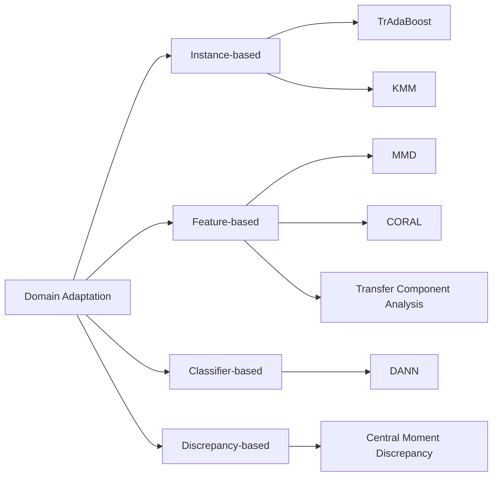

# Domain Adaptation原理与代码实例讲解

## 1.背景介绍
### 1.1 什么是Domain Adaptation
Domain Adaptation(领域自适应)是迁移学习的一个重要分支,旨在解决不同但相关领域之间的知识迁移问题。当我们在某个源领域(source domain)已有标注数据和训练好的模型,希望将其应用到另一个目标领域(target domain)时,由于两个领域的数据分布存在差异,直接应用源领域模型到目标领域通常会导致性能显著下降。Domain Adaptation的目标就是通过某些适应方法,使得源领域的模型能够很好地适应目标领域的数据分布,从而提升其在目标领域上的性能表现。

### 1.2 Domain Adaptation的应用场景
Domain Adaptation在很多现实应用中都有广泛需求,比如:
- 跨语言文本分类:使用英文文本训练的分类器应用于中文文本分类
- 跨域图像分类:使用普通数码照片训练的分类器应用于医学影像分类  
- 语音识别的环境自适应:使用安静环境录制的语音训练的模型应用于嘈杂环境
- 自动驾驶中不同天气/光照条件下的场景适应

总之,只要涉及到不同领域/场景之间的知识迁移,都可能需要Domain Adaptation技术。

### 1.3 Domain Adaptation面临的挑战
尽管Domain Adaptation在诸多应用中展现出巨大潜力,但其在实践中仍然面临诸多挑战:

1. 源域和目标域的数据分布差异:这是Domain Adaptation需要解决的核心问题。不同领域数据在特征空间、类别空间的分布差异(domain shift)导致源域模型无法直接应用于目标域。
2. 目标域缺乏足够的标注数据:与源域相比,目标域通常缺乏大量的标注样本用于模型训练和调优,这加大了适应的难度。
3. 源域和目标域的类别空间不一致:在某些情况下,源域和目标域的类别体系可能并不完全一致,存在类别不完全重叠的情况。
4. 源域和目标域的特征空间差异:除了分布差异,源域和目标域的原始特征表示也可能不一致,给适应带来困难。

## 2.核心概念与联系
### 2.1 Domain与Distribution
在Domain Adaptation中,Domain(领域)指数据的Feature Space(特征空间)和Label Space(标签空间)的联合概念。Distribution(分布)则刻画了数据在特征-标签联合空间中的统计规律。Domain Adaptation的目标就是缓解源域和目标域数据分布的差异(Distribution Shift),使得源域的知识能够迁移到目标域。

### 2.2 Homogeneous与Heterogeneous DA 
根据源域和目标域的特征空间是否一致,可以将DA问题分为Homogeneous DA和Heterogeneous DA两类:
- Homogeneous DA:源域和目标域的特征空间一致,只是特征分布不同。如使用MNIST数据训练的分类器应用于USPS数据。
- Heterogeneous DA:源域和目标域的特征空间不一致,需要先进行特征变换。如文本分类中不同语种的词表示不同。

### 2.3 Supervised、Unsupervised与Semi-supervised DA
根据目标域上是否有标注数据,DA可分为以下三类:  
- Supervised DA:目标域有充足的标注数据。这种情况较为理想,但在实际中并不多见。
- Unsupervised DA:目标域完全没有标注数据。这是最具挑战的情况,需要充分利用源域标注数据和目标域无标注数据进行自适应。
- Semi-supervised DA:目标域只有少量标注数据。通过利用少量标注数据和大量无标注数据,可以获得比Unsupervised DA更好的自适应效果。

### 2.4 自适应方法分类
针对DA问题,学术界提出了多种自适应方法,大致可分为以下几类:

1. 基于Instance的方法:通过对源域样本进行重要性加权,使其分布与目标域接近,代表工作如TrAdaBoost。
2. 基于Feature的方法:学习一个新的特征表示空间,使得源域和目标域的特征分布相近,代表如MMD、CORAL等。  
3. 基于Classifier的方法:通过正则化项鼓励源域和目标域学到的分类器参数接近,代表如DANN。
4. 基于Discrepancy的方法:显式地最小化源域和目标域某些统计量的差异,如MMD、Central Moment Discrepancy等。

下图展示了这些方法之间的联系与区别:



## 3.核心算法原理具体操作步骤

下面以经典的MMD(Maximum Mean Discrepancy)方法为例,详细讲解其核心算法原理和具体操作步骤。

### 3.1 MMD的基本思想
MMD度量了两个分布在RKHS(Reproducing Kernel Hilbert Space)中均值的差异。直观上,如果将源域和目标域的数据映射到RKHS中,并最小化它们的MMD,则可以减小两个域的分布差异。MMD的数学定义为:

$$
MMD(p,q) = \sup_{f \in \mathcal{H}} (\mathbb{E}_{x \sim p}[f(x)] - \mathbb{E}_{y \sim q}[f(y)])
$$

其中$p$和$q$分别表示源域和目标域的数据分布,$\mathcal{H}$为RKHS空间。

### 3.2 MMD的具体计算
令源域样本为$\{x_i\}_{i=1}^{n}$,目标域样本为$\{y_j\}_{j=1}^{m}$,MMD的经验估计可以写为:

$$
MMD(X,Y) = \left\| \frac{1}{n}\sum_{i=1}^{n}\phi(x_i) - \frac{1}{m}\sum_{j=1}^{m}\phi(y_j) \right\|_{\mathcal{H}}
$$

其中$\phi(\cdot)$表示将数据映射到RKHS空间的特征映射函数。利用核技巧,上式可以reformulate为:

$$
MMD(X,Y) = \left( \frac{1}{n^2}\sum_{i=1}^{n}\sum_{i'=1}^{n}k(x_i,x_{i'}) + \frac{1}{m^2}\sum_{j=1}^{m}\sum_{j'=1}^{m}k(y_j,y_{j'}) - \frac{2}{nm}\sum_{i=1}^{n}\sum_{j=1}^{m}k(x_i,y_j) \right)^{1/2}
$$

其中$k(\cdot,\cdot)$为核函数,常用的如高斯核$k(x,y)=\exp(-\frac{\|x-y\|^2}{2\sigma^2})$。

### 3.3 基于MMD的Domain Adaptation
有了MMD这一度量工具,就可以将其集成到学习目标中,得到如下的Domain Adaptation目标:

$$
\min_{f \in \mathcal{H}} \mathcal{L}(f(X),Y) + \lambda MMD^2(X,Y) 
$$

其中$\mathcal{L}$为源域上的经验损失函数,$\lambda$为权衡两项的折中参数。上式鼓励学习一个假设$f$,使其在最小化源域经验风险的同时,也最小化源域和目标域的分布差异。

### 3.4 MMD的优化求解
上述基于MMD的DA目标函数可以通过梯度下降进行端到端的优化求解。以神经网络为例,典型的优化步骤如下:

1. 前向传播:分别将源域数据$\{x_i\}_{i=1}^{n}$和目标域数据$\{y_j\}_{j=1}^{m}$通过神经网络,得到对应的特征表示$\{f(x_i)\}_{i=1}^{n}$和$\{f(y_j)\}_{j=1}^{m}$。
2. 计算MMD:利用上述特征表示,根据MMD的公式计算出$MMD(f(X),f(Y))$。 
3. 计算总的损失函数:将源域上的经验损失$\mathcal{L}$和MMD项加权求和,得到总的损失。
4. 反向传播:利用损失函数对神经网络参数求梯度,并使用优化器(如Adam)更新参数。
5. 重复以上步骤,直到损失函数收敛。

## 4.数学模型和公式详细讲解举例说明
上文提到,MMD刻画了两个分布在RKHS空间中均值的差异。下面以高斯核为例,直观阐述MMD的几何意义。

假设我们将源域数据$X=\{x_1,\cdots,x_n\}$和目标域数据$Y=\{y_1,\cdots,y_m\}$通过特征映射$\phi(\cdot)$映射到RKHS空间$\mathcal{H}$,其中$\phi(x) = k(x,\cdot)$。根据RKHS的性质,空间$\mathcal{H}$由所有形如$f(\cdot)=\sum_{i=1}^{n}\alpha_i k(x_i,\cdot)$的函数构成,其内积满足$\langle f,g \rangle_{\mathcal{H}}=\sum_{i=1}^{n}\sum_{j=1}^{m}\alpha_i \beta_j k(x_i,y_j)$。

在RKHS空间中,源域数据的均值可以表示为$\mu_X=\frac{1}{n}\sum_{i=1}^{n}\phi(x_i)$,目标域数据的均值为$\mu_Y=\frac{1}{m}\sum_{j=1}^{m}\phi(y_j)$。利用RKHS空间的内积,两个均值之间的MMD距离可以展开为:

$$
\begin{aligned}
MMD^2(X,Y) &= \|\mu_X - \mu_Y\|_{\mathcal{H}}^2 \\
&= \langle \mu_X-\mu_Y, \mu_X-\mu_Y \rangle_{\mathcal{H}} \\
&= \langle \mu_X,\mu_X \rangle_{\mathcal{H}} - 2\langle \mu_X,\mu_Y \rangle_{\mathcal{H}} + \langle \mu_Y,\mu_Y \rangle_{\mathcal{H}} \\
&= \frac{1}{n^2}\sum_{i=1}^{n}\sum_{i'=1}^{n}k(x_i,x_{i'}) - \frac{2}{nm}\sum_{i=1}^{n}\sum_{j=1}^{m}k(x_i,y_j) + \frac{1}{m^2}\sum_{j=1}^{m}\sum_{j'=1}^{m}k(y_j,y_{j'})
\end{aligned}
$$

可见,MMD实际上度量了两个域的样本在RKHS空间中的平均相似度。当源域样本之间、目标域样本之间的相似度都很高,而源域和目标域样本之间的相似度很低时,MMD值就会很大,反之则MMD值较小。因此,最小化MMD有助于缓解域间分布差异。

特别地,当核函数选择为高斯核$k(x,y)=\exp(-\frac{\|x-y\|^2}{2\sigma^2})$时,MMD可以写为:

$$
MMD^2(X,Y) = \frac{1}{n^2}\sum_{i=1}^{n}\sum_{i'=1}^{n}e^{-\frac{\|x_i-x_{i'}\|^2}{2\sigma^2}} - \frac{2}{nm}\sum_{i=1}^{n}\sum_{j=1}^{m}e^{-\frac{\|x_i-y_j\|^2}{2\sigma^2}} + \frac{1}{m^2}\sum_{j=1}^{m}\sum_{j'=1}^{m}e^{-\frac{\|y_j-y_{j'}\|^2}{2\sigma^2}}
$$

直观上,高斯核MMD鼓励源域样本之间、目标域样本之间在原始特征空间中聚集,而源域样本和目标域样本之间相互远离。

## 5.项目实践：代码实例和详细解释说明
下面给出一个基于PyTorch实现MMD的代码示例,并详细解释说明。

```python
import torch
import torch.nn as nn

class MMD_loss(nn.Module):
    def __init__(self, kernel_type='rbf', kernel_mul=2.0, kernel_num=5):
        super(MMD_loss, self).__init__()
        self.kernel