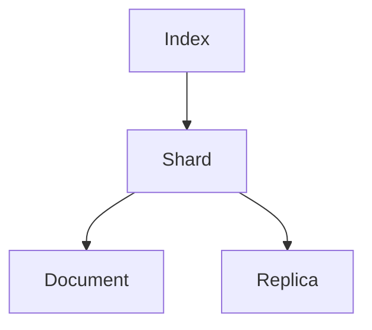

# ES搜索原理与代码实例讲解

## 1.背景介绍

### 1.1 什么是Elasticsearch?

Elasticsearch(简称ES)是一个分布式、RESTful风格的搜索和数据分析引擎,能够解决不断涌现出的各种用例。它是一个基于Apache Lucene构建的开源搜索引擎,具有高可扩展性、高性能和高可用性等优点。ES可以被下面这些常见的工作负载使用:

- 搜索
- 日志与指标分析
- 安全智能
- 业务分析
- 机器学习

### 1.2 ES的应用场景

Elasticsearch可以用于多种场景,例如:

- 电商网站商品搜索
- 日志数据分析
- 基于地理位置的数据搜索
- 代码搜索
- 站内搜索
- 安全分析

### 1.3 ES的优势

Elasticsearch具有以下优势:

- 分布式,易于扩展
- 高性能,实时搜索
- 多租户支持
- 支持结构化和非结构化数据
- RESTful API
- 易于集成

## 2.核心概念与联系

### 2.1 核心概念

在深入探讨ES搜索原理之前,我们需要了解一些核心概念:

- 索引(Index)
- 类型(Type) 
- 文档(Document)
- 分片(Shard)
- 副本(Replica)

#### 2.1.1 索引(Index)

索引是一个逻辑命名空间,其中可以存储关联的文档。它用于将数据进行逻辑分组和划分。

#### 2.1.2 类型(Type)

类型是索引的逻辑分区/分类,其语义完全由用户定义。一个索引通常被定义为包含具有相同特征的文档。

> 注意: Elasticsearch 7.x 版本中,Type 的概念已被删除,默认只有单个Type。

#### 2.1.3 文档(Document) 

文档是可被索引的基本数据单元,由一个或多个字段组成。它类似于关系数据库中的一行记录。

#### 2.1.4 分片(Shard)

分片是ES中最小的工作单元,用于水平分割数据并实现并行化处理,从而提高性能和吞吐量。每个索引都可以被拆分为多个分片,分片可以分布在不同的节点上。

#### 2.1.5 副本(Replica)

副本是分片的冗余备份,用于防止硬件故障导致的数据丢失,并支持扩展搜索量。副本可以位于不同的节点上,以提供更好的容错能力和查询吞吐量。

### 2.2 核心概念关系

上述核心概念之间的关系如下:



1. 一个索引可以包含多个分片。
2. 每个分片是一个独立的Lucene索引,可以存储多个文档。
3. 每个分片可以有零个或多个副本,用于提高数据冗余和查询吞吐量。

## 3.核心算法原理具体操作步骤

### 3.1 倒排索引

Elasticsearch使用倒排索引作为其核心数据结构。倒排索引是一种将文档中的词条与文档进行映射的数据结构。它由以下两个部分组成:

1. **词条词典(Term Dictionary)**: 存储所有唯一的词条,并为每个词条分配一个唯一的编号(termID)。
2. **倒排文件(Postings File)**: 记录了每个词条出现在哪些文档中,以及在文档中的位置信息。

创建倒排索引的过程如下:

1. 收集文档数据
2. 执行文本分析(分词、小写、去除停用词等)
3. 为每个唯一词条创建一个倒排列表
4. 将倒排列表存储在磁盘上

搜索时,ES会:

1. 分析查询字符串
2. 查找词典中对应的termID
3. 查找倒排文件中的倒排列表
4. 根据文档ID和位置信息计算相关性得分
5. 返回排序后的结果

### 3.2 分布式架构

为了实现高可扩展性和高可用性,Elasticsearch采用了分布式架构。主要组件包括:

- **节点(Node)**: 运行Elasticsearch的单个服务器实例。
- **集群(Cluster)**: 一组节点的集合,共享同一个集群名称。
- **主节点(Master Node)**: 负责集群范围内的管理操作,如创建或删除索引、跟踪哪些节点是群集的一部分等。
- **数据节点(Data Node)**: 用于存储数据相关的操作,如CRUD、搜索和聚合。
- **客户端节点(Client Node)**: 用于将请求转发到数据节点,不存储任何数据。

分布式架构的工作流程:

1. 客户端向任意节点发送请求
2. 该节点作为协调节点,将请求转发到相关的数据节点
3. 数据节点在本地分片上执行操作
4. 数据节点将结果返回给协调节点
5. 协调节点合并结果并返回给客户端

### 3.3 分片分配

Elasticsearch使用分片分配策略将分片分布到不同的数据节点上。主要目标是:

1. **尽量将分片分散到不同节点**
2. **为每个分片分配冗余副本**
3. **在节点故障或新增节点时重新分配分片**

分片分配过程:

1. 新创建索引时,主节点根据配置计算分片数量
2. 将主分片使用平衡策略分配到数据节点
3. 为每个主分片分配指定数量的副本分片
4. 当节点加入或离开集群时,重新分配分片

## 4.数学模型和公式详细讲解举例说明

### 4.1 相关性评分

Elasticsearch使用一种基于TF-IDF(Term Frequency-Inverse Document Frequency)算法的相关性评分模型来计算文档与查询的相关程度。

TF-IDF由两部分组成:

1. **词频(Term Frequency, TF)**: 描述词条在文档中出现的频率。
   
   $$
   \text{TF}(t,d) = \frac{n_{t,d}}{\sum_{t' \in d} n_{t',d}}
   $$

   其中 $n_{t,d}$ 表示词条 $t$ 在文档 $d$ 中出现的次数。

2. **逆向文档频率(Inverse Document Frequency, IDF)**: 描述词条在整个文档集合中的稀有程度。

   $$
   \text{IDF}(t,D) = \log \frac{|D|}{|\{d \in D: t \in d\}|}
   $$

   其中 $|D|$ 表示文档集合的大小,分母表示包含词条 $t$ 的文档数量。

综合 TF 和 IDF,我们可以得到 TF-IDF 权重:

$$
\text{TF-IDF}(t,d,D) = \text{TF}(t,d) \times \text{IDF}(t,D)
$$

TF-IDF 权重越高,表示词条 $t$ 在文档 $d$ 中越重要,同时在整个文档集合中也越稀有。

Elasticsearch 使用 Vector Space Model 将文档和查询表示为向量,并计算它们之间的相似度得分。具体步骤如下:

1. 计算查询向量和文档向量的 TF-IDF 权重
2. 将查询向量和文档向量标准化为单位向量
3. 计算查询向量和文档向量的余弦相似度作为相关性得分

### 4.2 布尔模型

除了 TF-IDF 模型,Elasticsearch 还支持布尔模型进行搜索。布尔模型使用布尔运算符(AND、OR、NOT)来组合多个查询条件。

例如,查询 "elasticsearch AND lucene" 将返回同时包含 "elasticsearch" 和 "lucene" 两个词条的文档。

布尔模型的优点是可以精确控制搜索结果,但缺点是可能会过于严格,导致相关文档被排除在外。

### 4.3 短语搜索

短语搜索是一种特殊的查询类型,用于查找包含完整短语的文档。例如,查询 "elasticsearch server" 将返回包含这个完整短语的文档,而不是单独包含 "elasticsearch" 和 "server" 两个词条的文档。

短语搜索的工作原理是:

1. 将短语分解为多个词条
2. 查找每个词条在倒排索引中的位置信息
3. 检查这些词条是否按照正确顺序紧密相邻
4. 如果是,则将该文档视为匹配结果

短语搜索可以提高搜索精确度,但也可能导致相关文档被排除在外。

## 5.项目实践:代码实例和详细解释说明

在本节中,我们将通过一个基于 Java 的示例项目来演示如何使用 Elasticsearch 进行数据索引、搜索和聚合操作。

### 5.1 项目设置

首先,我们需要在项目中添加 Elasticsearch 的依赖项。对于 Maven 项目,可以在 `pom.xml` 文件中添加以下依赖:

```xml
<dependency>
    <groupId>org.elasticsearch.client</groupId>
    <artifactId>elasticsearch-rest-high-level-client</artifactId>
    <version>7.17.3</version>
</dependency>
```

### 5.2 创建 Elasticsearch 客户端

接下来,我们需要创建一个 Elasticsearch 客户端实例,用于与 Elasticsearch 集群进行通信。以下代码展示了如何创建一个 REST 高级客户端:

```java
RestHighLevelClient client = new RestHighLevelClient(
    RestClient.builder(
        new HttpHost("localhost", 9200, "http")));
```

### 5.3 索引文档

下面的代码示例展示了如何将一个 JSON 文档索引到 Elasticsearch 中:

```java
IndexRequest request = new IndexRequest("products")
    .source("""
        {
          "name": "Product 1",
          "description": "This is a sample product",
          "price": 19.99
        }
        """, XContentType.JSON);

IndexResponse response = client.index(request, RequestOptions.DEFAULT);
String id = response.getId();
```

在这个示例中,我们创建了一个 `IndexRequest` 对象,指定了索引名称 `products` 和要索引的 JSON 文档。然后,我们使用 `client.index()` 方法将文档索引到 Elasticsearch 中。

### 5.4 搜索文档

下面的代码示例展示了如何在 Elasticsearch 中执行搜索查询:

```java
SearchRequest searchRequest = new SearchRequest("products");
SearchSourceBuilder sourceBuilder = new SearchSourceBuilder();
sourceBuilder.query(QueryBuilders.matchQuery("description", "sample"));

searchRequest.source(sourceBuilder);

SearchResponse searchResponse = client.search(searchRequest, RequestOptions.DEFAULT);
SearchHits hits = searchResponse.getHits();

for (SearchHit hit : hits.getHits()) {
    String id = hit.getId();
    Map<String, Object> sourceAsMap = hit.getSourceAsMap();
    // 处理搜索结果
}
```

在这个示例中,我们创建了一个 `SearchRequest` 对象,指定了要搜索的索引名称 `products`。然后,我们使用 `SearchSourceBuilder` 构建搜索查询,在这个例子中,我们使用 `matchQuery` 查询来搜索 `description` 字段中包含 "sample" 的文档。

接下来,我们使用 `client.search()` 方法执行搜索查询,并遍历搜索结果 `hits`。对于每个匹配的文档,我们可以获取文档 ID 和源数据。

### 5.5 聚合数据

Elasticsearch 提供了强大的聚合功能,可以对数据进行统计和分析。下面的代码示例展示了如何执行一个简单的聚合操作:

```java
SearchRequest searchRequest = new SearchRequest("products");
SearchSourceBuilder sourceBuilder = new SearchSourceBuilder();
sourceBuilder.aggregation(AggregationBuilders.terms("price_ranges")
    .field("price")
    .size(10000)
    .shardSize(10000));

searchRequest.source(sourceBuilder);

SearchResponse searchResponse = client.search(searchRequest, RequestOptions.DEFAULT);
Terms terms = searchResponse.getAggregations().get("price_ranges");

for (Terms.Bucket bucket : terms.getBuckets()) {
    double key = bucket.getKeyAsNumber().doubleValue();
    long docCount = bucket.getDocCount();
    // 处理聚合结果
}
```

在这个示例中,我们使用 `AggregationBuilders.terms()` 创建了一个按照 `price` 字段进行分组的聚合。我们设置了较大的 `size` 和 `shardSize` 参数,以确保不会丢失任何数据桶。

执行搜索请求后,我们可以从 `SearchResponse` 中获取聚合结果。对于每个数据