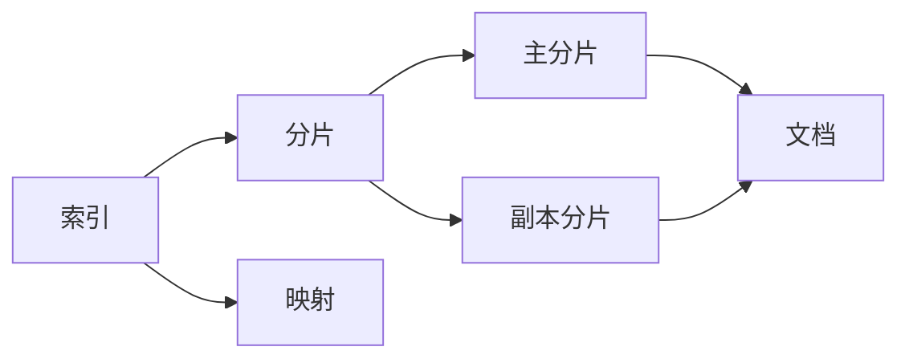

# ES索引原理与代码实例讲解

## 1.背景介绍

### 1.1 什么是ES
Elasticsearch(简称ES)是一个基于Lucene构建的开源、分布式、RESTful接口的全文搜索引擎。Elasticsearch还是一个分布式文档数据库，其中每个字段均可被索引，而且每个字段的数据均可被搜索，ES能够横向扩展至数以百计的服务器存储以及处理PB级的数据。

### 1.2 ES的应用场景
ES主要用于海量数据的查询和分析，常见的应用场景包括：

- 全文搜索：ES可以作为后台系统的全文检索引擎，实现快速、实时的全文搜索。
- 日志分析：ES可以收集、分析和可视化日志数据，实现异常检测、安全分析等。
- 指标分析：ES可以存储时间序列数据，对其进行聚合分析，实现指标监控等。
- 地理位置分析：ES支持地理位置数据的存储和分析，可用于LBS等领域。

### 1.3 ES索引的重要性
在ES中，索引(Index)是文档(Document)的容器，类似于关系型数据库中的表(Table)。索引是ES存储和查询数据的基本单位，高效的索引是实现海量数据实时查询的关键。

## 2.核心概念与联系

### 2.1 文档(Document)
文档是ES中的最小数据单元，由一组键值对(key-value)组成，使用JSON格式表示。每个文档都有一个唯一ID，可以自动生成或手动指定。

### 2.2 索引(Index)
索引是文档的容器，一个索引可以包含多个文档。索引名称必须是全小写，不能以下划线开头。

### 2.3 映射(Mapping)
映射定义了文档中字段的类型和属性，类似于关系型数据库中的表结构。在创建索引时可以预先定义映射，也可以采用动态映射。

### 2.4 分片(Shard)
分片是ES分布式存储的基本单位。索引可以被拆分为多个分片，分布在不同的节点上，从而实现水平扩展。每个分片本身也是一个完整的、独立的"索引"。

### 2.5 副本(Replica)  
副本是分片的备份，可以提高查询性能和容错能力。每个分片可以有0个或多个副本，副本分布在不同的节点上。

### 2.6 核心概念之间的关系



一个索引包含多个分片，每个分片包含多个文档。索引的映射定义了文档的结构。分片分为主分片和副本分片，副本分片是主分片的备份。

## 3.核心算法原理具体操作步骤

### 3.1 倒排索引
ES使用倒排索引(Inverted Index)的数据结构来实现快速的全文搜索。倒排索引包含两部分：

1. 词典(Term Dictionary)：记录所有文档的词条，并记录词条的一些统计信息，如文档频率。
2. 倒排列表(Posting List)：记录词条对应的文档ID，可以理解为 {词条: [文档ID1, 文档ID2...]} 的映射关系。

### 3.2 分词(Tokenizer)
将文本按照一定规则拆分为词条(Term)的过程。ES提供了多种内置分词器，如standard, whitespace, keyword等，也支持自定义分词器。

### 3.3 文档打分
ES使用 TF-IDF 算法对文档的相关度进行打分。

- TF(Term Frequency)：词条在文档中出现的频率。频率越高，文档的相关度越高。 
- IDF(Inverse Document Frequency)：词条在所有文档中出现的频率。频率越高，词条的区分度越低。

最终文档的分数由 TF 和 IDF 共同决定。除了TF-IDF，ES还支持BM25、布尔模型等其他相关度算法。

## 4.数学模型和公式详细讲解举例说明

### 4.1 TF-IDF模型

TF-IDF的数学表达式为：

$$
tfidf(t,d) = tf(t,d) * idf(t)
$$

其中，$tf(t,d)$表示词条t在文档d中的词频，$idf(t)$表示词条t的逆文档频率。

$idf(t)$的计算公式为：

$$
idf(t) = log(\frac{N}{df(t)+1})
$$

其中，$N$为文档总数，$df(t)$为包含词条t的文档数。

举例说明：假设有以下3个文档：

```
d1: This is a book
d2: This is a pen
d3: This is an apple
```

对于词条"this"，它在3个文档中都出现，因此$df(this)=3$，$idf(this)=log(3/(3+1))=0$。

对于词条"book"，它只在d1中出现，因此$df(book)=1$，$idf(book)=log(3/(1+1))=0.69$。

可见，出现在所有文档中的词条"this"的IDF值为0，对文档区分度低；而出现在少数文档中的词条"book"的IDF值较大，对文档区分度高。

### 4.2 BM25模型

BM25是另一种常用的文档相关度算法，考虑了文档长度对相关度的影响。其数学表达式为：

$$
score(q,d) = \sum_{t \in q} idf(t) * \frac{tf(t,d) * (k1+1)}{tf(t,d) + k1 * (1-b+b*\frac{|d|}{avgdl})}
$$

其中，$q$为查询，$t$为查询中的词条，$k1$和$b$为调节因子，$|d|$为文档长度，$avgdl$为文档平均长度。

与TF-IDF相比，BM25引入了文档长度因子，对于较长的文档，词条的TF值会被一定程度地削弱，从而平衡了文档长度对相关度的影响。

## 5.项目实践：代码实例和详细解释说明

下面通过一个简单的Java代码实例，演示如何使用ES的Java客户端创建索引、添加文档、查询文档等基本操作。

### 5.1 创建索引

```java
// 创建ES客户端
RestHighLevelClient client = new RestHighLevelClient(
        RestClient.builder(new HttpHost("localhost", 9200, "http")));

// 创建索引请求
CreateIndexRequest request = new CreateIndexRequest("my-index");

// 设置索引的settings和mappings
request.settings(Settings.builder()
        .put("index.number_of_shards", 1)
        .put("index.number_of_replicas", 1)
);
request.mapping("{\n" +
        "  \"properties\": {\n" +
        "    \"message\": {\n" +
        "      \"type\": \"text\"\n" +
        "    }\n" +
        "  }\n" +
        "}", XContentType.JSON);

// 发送请求
CreateIndexResponse response = client.indices().create(request, RequestOptions.DEFAULT);

// 关闭客户端
client.close();
```

上面的代码创建了一个名为"my-index"的索引，设置了分片数和副本数，并定义了一个名为"message"的文本类型字段。

### 5.2 添加文档

```java
// 创建ES客户端
RestHighLevelClient client = new RestHighLevelClient(
        RestClient.builder(new HttpHost("localhost", 9200, "http")));

// 创建索引请求
IndexRequest request = new IndexRequest("my-index");

// 设置文档ID
request.id("1");

// 设置文档内容  
request.source("{\n" +
        "  \"message\": \"Hello World!\"\n" +
        "}", XContentType.JSON);

// 发送请求
IndexResponse response = client.index(request, RequestOptions.DEFAULT);

// 关闭客户端
client.close();
```

上面的代码向"my-index"索引添加了一个ID为"1"的文档，内容为一个JSON对象。

### 5.3 查询文档

```java
// 创建ES客户端
RestHighLevelClient client = new RestHighLevelClient(
        RestClient.builder(new HttpHost("localhost", 9200, "http")));

// 创建查询请求
SearchRequest request = new SearchRequest("my-index");

// 设置查询条件
SearchSourceBuilder sourceBuilder = new SearchSourceBuilder();
sourceBuilder.query(QueryBuilders.termQuery("message", "hello"));
request.source(sourceBuilder);

// 发送请求
SearchResponse response = client.search(request, RequestOptions.DEFAULT);

// 解析响应结果
SearchHits hits = response.getHits();
for (SearchHit hit : hits) {
    String sourceAsString = hit.getSourceAsString();
    System.out.println(sourceAsString);
}

// 关闭客户端
client.close();
```

上面的代码查询"my-index"索引中"message"字段包含"hello"的文档，并打印出文档内容。

## 6.实际应用场景

### 6.1 电商搜索
在电商平台中，ES可以作为商品搜索引擎，实现商品的全文检索、过滤、排序、高亮显示等功能。用户可以通过关键词快速找到所需商品。

### 6.2 日志分析
ES可以收集各种服务器、应用的日志，通过Kibana等可视化工具实现日志的实时监控和分析。开发人员可以快速定位问题，运维人员可以实时掌握系统健康状态。

### 6.3 金融风控
在金融领域，ES可以实时存储和分析海量交易数据，通过机器学习算法构建风险模型，实现实时反欺诈、反洗钱等风险控制。

### 6.4 舆情监测
ES可以抓取和分析各大社交平台、新闻媒体的文本数据，通过情感分析、话题检测等NLP技术，实现舆情监测和预警。

## 7.工具和资源推荐

- Kibana：ES的配套可视化工具，可以实现数据的探索、可视化和仪表盘展示。
- Logstash：数据收集和处理的管道工具，可以将不同来源的数据导入ES。
- Beats：轻量级数据采集器，如Filebeat可以收集日志文件，Metricbeat可以收集系统、服务的指标数据。
- Elasticsearch官方文档：https://www.elastic.co/guide/en/elasticsearch/reference/current/index.html
- Elasticsearch Java API文档：https://www.elastic.co/guide/en/elasticsearch/client/java-rest/current/index.html

## 8.总结：未来发展趋势与挑战

### 8.1 发展趋势

- 云原生部署：随着Kubernetes的普及，ES也提供了官方的Helm Chart，支持容器化部署和编排。
- 机器学习：ES在7.x版本引入了官方的机器学习模块，可以直接在ES中进行时序数据的异常检测、根因分析等。
- 向量检索：ES在最新的版本中引入了向量数据类型和KNN查询，为图像搜索、语义搜索等场景提供了支持。

### 8.2 挑战

- 数据规模：如何存储和查询PB级别的海量数据仍然是一个挑战。
- 查询性能：如何在毫秒级响应用户请求，需要不断优化查询和索引策略。
- 运维成本：ES集群的运维复杂度高，需要专业的运维团队和工具。

## 9.附录：常见问题与解答

### 9.1 ES与关系型数据库的区别是什么？
ES是面向文档的NoSQL数据库，没有固定的表结构，数据以JSON格式存储。ES着重于全文搜索、聚合分析等场景，而关系型数据库更适合事务处理、复杂Join查询等场景。

### 9.2 ES的分布式架构是如何实现的？
ES的分布式架构是通过分片(Shard)和副本(Replica)实现的。索引被拆分为多个分片，分布在不同节点上。每个分片可以有多个副本，提供了高可用和读扩展的能力。

### 9.3 ES的近实时搜索是什么意思？
ES的写入和查询都在毫秒级别，但不是严格的实时。文档写入后会先进入内存缓存和translog，默认每秒刷新一次，这个延迟称为refresh_interval。同时每隔一段时间(默认30分钟)会将缓存的文档刷新到磁盘，形成一个新的段(segment)，这个过程称为flush。

### 9.4 ES如何确保数据的可靠性？
ES通过副本机制保证了数据的高可用，每个分片可以有多个副本，分布在不同节点上。当写入请求到达时，需要分片的主副本和大多数副本都写入成功才算成功，这样可以