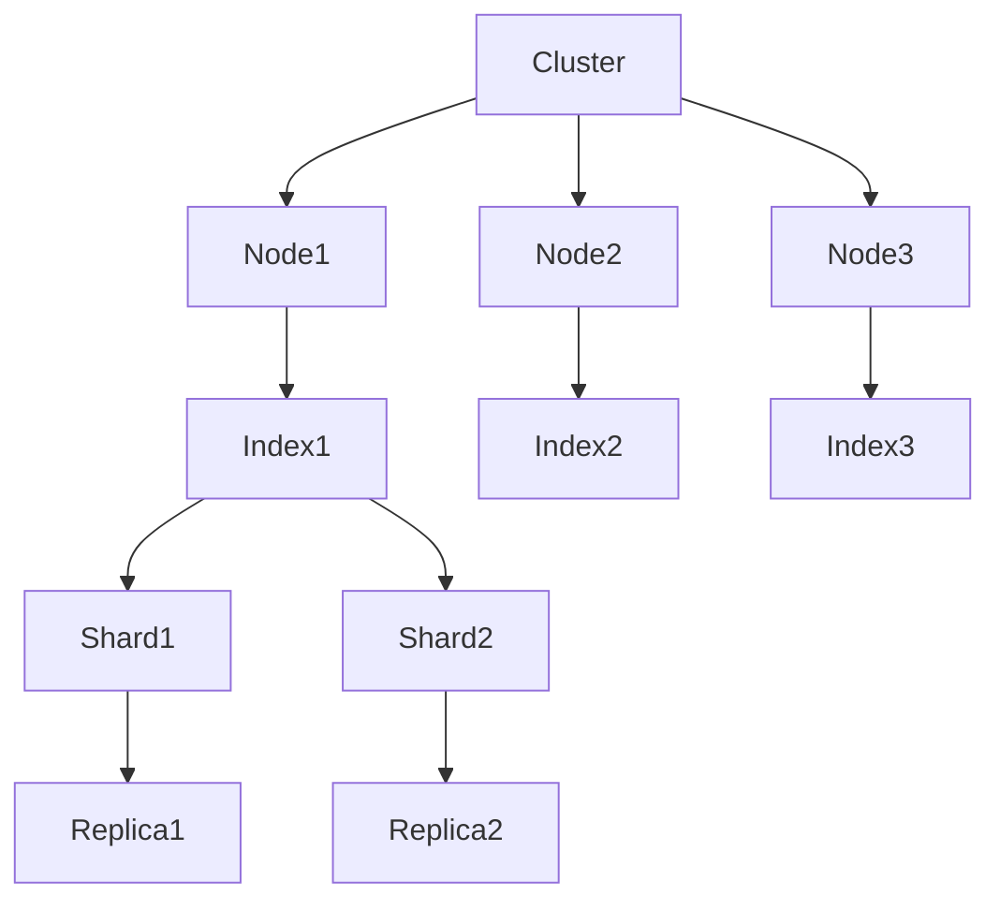

# ElasticSearch Kibana原理与代码实例讲解

## 1.背景介绍

### 1.1 数据爆炸时代的到来

在当今时代,随着互联网、物联网、云计算等技术的飞速发展,海量数据的产生已经成为一种常态。无论是企业内部的运营数据、用户行为数据,还是社交媒体上的用户内容、物联网设备采集的各种传感器数据,都在以前所未有的规模和速度不断积累。这种数据爆炸式的增长,给传统的数据存储和分析系统带来了前所未有的挑战。

### 1.2 传统数据库的局限性

传统的关系型数据库虽然在结构化数据的存储和查询方面表现出色,但在处理海量非结构化或半结构化数据时,却显现出了一些明显的缺陷:

- 扩展性差:关系型数据库通常采用垂直扩展的方式,即通过增加单机的CPU、内存等硬件资源来提高性能,但这种方式不仅成本高昂,而且扩展能力有限。
- schema灵活性差:关系型数据库要求数据符合预先定义的schema,这对于处理种类繁多、结构不固定的非结构化数据来说,显得力不从心。
- 查询效率低下:当数据量达到一定规模时,关系型数据库在执行全文检索、模糊查询等操作时,查询效率会急剧下降。

### 1.3 ElasticSearch的崛起

为了应对日益严峻的数据挑战,一种全新的数据存储和分析解决方案应运而生——ElasticSearch。作为一款分布式、RESTful风格的搜索和分析引擎,ElasticSearch基于Apache Lucene构建,能够提供近乎实时的搜索服务。它不仅能够存储并检索海量的结构化和非结构化数据,而且具有高度的可扩展性、高可用性和容错性,可以满足各种大数据场景下的需求。

ElasticSearch的核心特性包括:

- 分布式:ElasticSearch可以在多台服务器上部署,并对所有节点中的数据进行自动平衡和路由操作,从而支持PB级的结构化或非结构化数据的处理。
- RESTful:ElasticSearch提供了一套基于RESTful风格的API接口,使得用户可以使用任何兼容HTTP协议的编程语言与它进行交互。
- 近实时搜索:ElasticSearch能够在数据发生变化之后,在秒级别内反映出来,从而实现近乎实时的搜索体验。
- 全文检索:ElasticSearch通过集成Apache Lucene,支持全文检索、模糊查询、地理位置查询等多种查询方式。
- 高可用:ElasticSearch的分布式架构使它具有天然的高可用性,当部分节点发生故障时,数据和查询请求会自动转移到其他节点上,从而避免单点故障。

### 1.4 Kibana的作用

Kibana是一款开源的数据分析和可视化平台,专门为ElasticSearch量身打造,可以将ElasticSearch的数据通过各种图表进行友好的展示,并提供了强大的操作数据的工具。Kibana不仅能够对ElasticSearch的数据进行搜索、查看和交互,还提供了高级数据分析和可视化功能,如构建生动的仪表板、编辑漂亮的可视化图形等。

总的来说,ElasticSearch和Kibana的结合,为海量数据的存储、检索、分析和可视化提供了一体化的解决方案,在日志分析、全文搜索、数据分析等领域发挥着重要作用。

## 2.核心概念与联系

在深入探讨ElasticSearch和Kibana的原理和实践之前,我们有必要先了解一些核心概念,为后续的学习打下基础。

### 2.1 Cluster(集群)

一个ElasticSearch实例被称为一个节点(Node),而一组由一个或多个节点组成并共享数据的节点集合则被称为一个集群(Cluster)。集群是ElasticSearch的基础架构单元,能够提供分布式处理能力、容错能力和高可用性。

集群中的每个节点都可以处理请求,但是每个节点的角色不同,主要分为以下几种:

- Master Node:负责集群的管理操作,如创建或删除索引、添加或移除节点等,集群中有一个主节点,其余为备份节点。
- Data Node:负责数据的存储和相关操作,如CRUD、查询、聚合等。
- Ingest Node:负责数据的预处理,如数据的转换、加密等。
- Coordinating Node:负责在数据节点之间划分工作,并将最终结果返回给客户端。

一个节点可以同时扮演多种角色,但在生产环境中,为了提高系统的稳定性和可扩展性,通常会对节点角色进行合理划分。

### 2.2 Index(索引)

在ElasticSearch中,Index相当于关系型数据库中的Database的概念,它是一个用来存储相关数据的地方。一个Index由一个或多个Shard组成,每个Shard又由一个或多个Replica副本组成,以提供数据冗余备份和提高查询吞吐量。

Index有以下几个核心概念:

- Mapping:定义索引中文档的结构,类似于关系型数据库中的Schema。
- Document:Index中的基本单位,用JSON格式表示,相当于关系型数据库中的一行记录。
- Field:Document中的属性,相当于关系型数据库中的列。

### 2.3 Shard(分片)

Shard是ElasticSearch的核心概念之一,它是Index的底层工作单元。Index被分片后的每个片段就是一个Shard,每个Shard都是一个Lucene的实例,用于存储数据。

将Index分片的主要目的是:

- 水平扩展:将数据分散到多个Shard上,从而支持更大的数据量。
- 并行计算:由于每个Shard都是一个完整的搜索引擎实例,所以可以并行执行搜索和聚合操作,提高性能。

每个Shard都会有一个或多个Replica副本,用于提供数据冗余备份和提高查询吞吐量。当主Shard损坏时,副本Shard会自动替换为主Shard,保证数据不会丢失。

### 2.4 Lucene

Lucene是一个由Apache软件基金会支持的开源全文检索引擎库,使用Java编写。ElasticSearch的核心是建立在Lucene之上的,它利用Lucene提供的全文检索、评分、过滤等功能,并在此基础上进行了扩展,如分布式支持、RESTful API等。

Lucene的主要组件包括:

- IndexWriter:用于创建和修改索引。
- IndexReader:用于读取索引并进行搜索。
- Directory:索引的存储位置,可以是文件系统或内存。
- Analyzer:用于将文本转换为索引项的组件,支持多语言分词。

ElasticSearch通过封装Lucene,使其能够更好地支持分布式、RESTful等特性,从而实现大数据场景下的高效搜索和分析。

### 2.5 Mermaid流程图

下面的Mermaid流程图展示了ElasticSearch的核心概念及其关系:

上图清晰地展示了ElasticSearch的分布式架构,以及Cluster、Node、Index、Shard和Replica之间的关系。每个Cluster由多个Node组成,每个Node可以存储多个Index,每个Index又由多个Shard和Replica副本组成。这种设计使ElasticSearch具有高度的可扩展性和容错性。

## 3.核心算法原理具体操作步骤

### 3.1 倒排索引

ElasticSearch的核心是基于Lucene的倒排索引(Inverted Index)技术。倒排索引是一种索引数据结构,它将文档中的每个词与包含该词的文档相关联,从而实现快速的全文搜索。

构建倒排索引的具体步骤如下:

1. **文本分析**:将文档内容按照一定的规则(如大小写规范化、去除标点符号、分词等)进行预处理,得到一系列单词项(Term)。
2. **建立词典**:将所有不重复的Term按照某种规则(如字典序)排序,并为每个Term分配一个唯一的编号(TermID)。
3. **构建倒排列表**:对于每个Term,建立一个倒排列表(Posting List),记录包含该Term的所有文档的ID(DocID)和该Term在文档中的位置信息。
4. **编码和压缩**:为了节省存储空间,倒排列表中的DocID和位置信息会进行编码和压缩处理。

通过倒排索引,ElasticSearch可以快速找到包含特定Term的所有文档,从而实现高效的全文检索。同时,倒排索引还支持各种查询语法,如布尔查询、短语查询、模糊查询等,为用户提供了强大的搜索能力。

### 3.2 分布式架构

ElasticSearch采用分布式架构,可以将数据分散存储在多个节点上,从而实现水平扩展和高可用性。其核心原理如下:

1. **分片(Sharding)**:将一个Index划分为多个Shard,每个Shard都是一个独立的Lucene实例,可以分布在不同的节点上。
2. **副本(Replication)**:为每个Shard创建一个或多个副本(Replica),用于提供数据冗余备份和提高查询吞吐量。
3. **集群发现**:ElasticSearch通过集群发现机制,自动发现集群中的所有节点,并维护节点信息。
4. **主节点选举**:集群中会自动选举一个节点作为主节点(Master Node),负责集群的管理操作。
5. **分片分配**:主节点会根据一定的策略,将Shard和Replica分配到不同的数据节点(Data Node)上。
6. **请求路由**:客户端发送的请求会先到达协调节点(Coordinating Node),协调节点会根据请求的类型和目标Shard,将请求路由到相应的数据节点。
7. **故障转移**:当某个节点发生故障时,主节点会将该节点上的Shard迁移到其他节点,并从Replica中选举新的主Shard,保证数据的可用性。

通过分布式架构,ElasticSearch可以实现水平扩展、高可用性和容错性,从而满足大数据场景下的需求。

### 3.3 查询执行流程

当用户发起一个搜索请求时,ElasticSearch会执行以下步骤来获取查询结果:

1. **查询解析**:客户端发送的查询请求会被解析为一个查询对象(Query Object),该对象包含查询字符串、查询类型、分页信息等。
2. **查询重写**:ElasticSearch会对查询对象进行重写,以优化查询执行效率。例如将布尔查询转换为多个单一查询,或者添加查询缓存等。
3. **路由计算**:根据查询目标索引的元数据信息,计算出需要查询的Shard列表。
4. **查询执行**:将查询请求并行发送到每个目标Shard所在的节点,并在每个Shard上执行本地搜索。
5. **结果合并**:协调节点会将各个Shard返回的结果进行合并,包括去重、排序、分页等操作,最终形成全局有序的查询结果集。
6. **返回结果**:将最终的查询结果返回给客户端。

在整个查询执行过程中,ElasticSearch会充分利用分布式架构的优势,通过分片和并行执行来提高查询效率。同时,它还采用了多种优化策略,如查询缓存、文档缓存、字段数据缓存等,进一步提升查询性能。

## 4.数学模型和公式详细讲解举例说明

在ElasticSearch中,相关性评分(Relevance Scoring)是一个非常重要的概念。它决定了搜索结果的排序,即哪些文档与查询更加相关,应该排在前面。ElasticSearch采用了一种基于TF-IDF算法的评分模型,通过计算每个文档与查询之间的相似度,来确定相关性得分