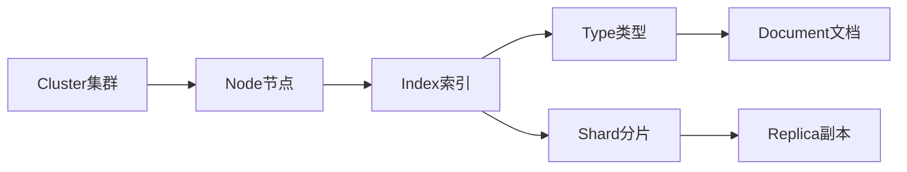

# ElasticSearch 原理与代码实例讲解

## 1.背景介绍

### 1.1 搜索引擎的重要性

在当今大数据时代，海量的数据正在以前所未有的速度增长。如何从海量数据中快速、准确地检索出用户需要的信息，成为了一个巨大的挑战。搜索引擎技术应运而生，它可以帮助用户从海量数据中找到所需的信息，是大数据时代不可或缺的关键技术之一。

### 1.2 ElasticSearch的诞生

ElasticSearch是一个基于Lucene构建的开源、分布式、RESTful搜索引擎。它诞生于2010年，由Elastic公司开发，旨在解决海量数据的实时搜索和分析问题。ElasticSearch不仅仅是一个全文搜索引擎，还是一个分布式实时文档存储、搜索、分析的引擎。它可以近乎实时地存储、搜索和分析海量数据。

### 1.3 ElasticSearch的应用场景

ElasticSearch凭借其优异的性能和灵活性，在很多领域得到了广泛应用，例如：

- 全文搜索：如维基百科、Stack Overflow等
- 日志分析：如ELK(ElasticSearch, Logstash, Kibana)技术栈
- 数据分析：如商业智能(BI)、用户行为分析等
- 安全分析：如异常行为检测、威胁情报等

## 2.核心概念与联系

要深入理解ElasticSearch的原理，首先需要了解其核心概念：

### 2.1 Near Realtime (NRT) 

ElasticSearch是一个近实时搜索引擎，意思是从索引一个文档到这个文档可被搜索只需要很短的延迟(通常是1秒)。

### 2.2 Cluster 集群

集群是一个或多个节点(服务器)的集合，它们共同保存整个数据，并提供跨所有节点的联合索引和搜索功能。一个集群由一个唯一的名字标识，默认是"elasticsearch"。

### 2.3 Node 节点 

节点是集群中的一个服务器，存储数据，并参与集群的索引和搜索功能。一个节点也是由一个名字来标识的，默认情况下，这个名字是一个随机的漫威漫画角色的名字。

### 2.4 Index 索引

索引是具有某种相似特性的文档的集合。例如，可以有一个客户数据的索引，一个产品目录的索引，以及一个订单数据的索引。索引由一个名字来标识(必须全部是小写字母)。

### 2.5 Type 类型

在索引中，可以定义一个或多个类型。一个类型是索引的一个逻辑类别/分区，其语义完全由用户来定。通常，会为具有一组共同字段的文档定义一个类型。

### 2.6 Document 文档

文档是可被索引的基本信息单元。例如，可以拥有某一个客户的文档，某一个产品的文档，以及某一个订单的文档。文档以JSON格式来表示。

### 2.7 Shards & Replicas 分片与副本

索引可能存储大量数据，这些数据可能超出单个节点的硬件限制。为了解决这个问题，ElasticSearch提供了将索引细分为多个分片的能力。创建索引时，可以简单地定义想要的分片数量。每个分片本身就是一个功能完善且独立的"索引"，可以被放置在集群中的任何节点上。

分片的一个重要性质是，它们能在创建索引时被水平细分。然而，也允许在分片层次上执行搜索和相关操作，从而可以在所有分片上并行处理操作，从而提高性能/吞吐量。

在一个网络/云环境里，失败随时都可能发生，在某个分片/节点不知怎么的就处于离线状态或由于任何原因消失了。这种情况下，有一个故障转移机制是非常有用并且是强烈推荐的。为此目的，ElasticSearch允许创建一个或多个索引分片的副本，称为复制分片或简称副本。

### 2.8 核心概念之间的关系

下面用一个Mermaid流程图来展示ElasticSearch的核心概念之间的关系：



从图中可以看出：

- 一个集群包含多个节点
- 一个节点可以包含多个索引
- 一个索引可以包含多个类型，也可以被分成多个分片
- 每个分片可以有多个副本
- 每个类型下可以有多个文档

理解了这些核心概念之后，我们再来深入探讨ElasticSearch的原理。

## 3.核心算法原理具体操作步骤

ElasticSearch的核心是基于Lucene的倒排索引。那么什么是倒排索引呢？

### 3.1 倒排索引

传统的数据库索引是通过文档ID找到对应的关键词，而倒排索引则相反，它通过关键词找到对应的文档。具体来说，倒排索引由两部分组成：

- 词典(Term Dictionary)：记录所有文档的词条，一般都比较大。
- 倒排列表(Posting List)：记录了词条对应的文档集合，由倒排索引项(Posting)组成。

例如，假设我们有以下三个文档：

- 文档1：ElasticSearch is a distributed search engine
- 文档2：Distributed systems are hard to debug
- 文档3：Search engines are fun

我们可以为这三个文档建立如下的倒排索引：

```
Term       Posting List
-----------------------------------------------
a          (1)  
distributed (1,2)
search     (1,3) 
engine     (1,3)
is         (1)
systems    (2)
are        (2,3)
hard       (2)
to         (2)
debug      (2)
engines    (3)
fun        (3)
```

可以看到，每个词条都对应一个倒排列表，倒排列表记录了包含该词条的文档ID。

### 3.2 索引过程

ElasticSearch索引一个文档的过程如下：

1. 将文档传给相应的分片 
2. 调用分析器(Analyzer)对文档进行分词，转换为一个一个的词条(Term)
3. 创建倒排索引，将词条映射到对应的倒排列表

### 3.3 搜索过程

ElasticSearch搜索的过程如下：

1. 客户端发送搜索请求到一个节点，称为协调节点(Coordinating Node) 
2. 协调节点将搜索请求转发到所有的分片
3. 每个分片在本地执行搜索，并构建一个匹配文档的优先队列
4. 每个分片返回各自优先队列中所有文档的ID和排序值给协调节点，它再把这些值合并到自己的优先队列中
5. 当所有的分片都返回了结果，协调节点就将结果返回给客户端

## 4.数学模型和公式详细讲解举例说明

在ElasticSearch的搜索过程中，使用了一些数学模型和公式来计算文档的相关性得分，主要有两个：

### 4.1 TF/IDF模型

TF/IDF(Term Frequency/Inverse Document Frequency)是一种统计方法，用以评估一个词条对于一个文件集或一个语料库中的其中一份文件的重要程度。

- TF(Term Frequency)：词频，指的是某一个给定的词条在该文件中出现的频率。

$$
TF(t,d) = \frac{f_{t,d}}{\sum_{t' \in d} f_{t',d}}
$$

其中，$f_{t,d}$是词条t在文档d中出现的次数，$\sum_{t' \in d} f_{t',d}$是文档d中所有词条的出现次数之和。

- IDF(Inverse Document Frequency)：逆向文件频率，是一个词语普遍重要性的度量。某一特定词语的IDF，可以由总文件数目除以包含该词语的文件的数目，再将得到的商取对数得到。

$$
IDF(t,D) = \log \frac{|D|}{|\{d \in D: t \in d\}|}
$$

其中，$|D|$是语料库中的文件总数，$|\{d \in D: t \in d\}|$是包含词条t的文件数目。

TF-IDF的主要思想是：如果某个词或短语在一篇文章中出现的频率高，并且在其他文章中很少出现，则认为此词或者短语具有很好的类别区分能力，适合用来分类。

### 4.2 BM25模型

BM25(Best Match 25)是一种基于概率检索模型的排序函数，是ElasticSearch默认的相似度算法。它的计算公式如下：

$$
score(D,Q) = \sum_{i=1}^n IDF(q_i) \cdot \frac{f(q_i,D) \cdot (k_1 + 1)}{f(q_i,D) + k_1 \cdot (1-b+b \cdot \frac{|D|}{avgdl})}
$$

其中：

- $f(q_i,D)$是查询中每一个词项$q_i$在文档D中出现的频率
- $|D|$是文档D的长度
- $avgdl$是文档集合的平均长度
- $k_1$和$b$是自由参数，通常$k_1$的取值为1.2~2.0，$b$的取值为0.75

相比TF-IDF，BM25引入了文档长度因子，对过长或过短的文档进行了一定的惩罚。同时，它还引入了自由参数$k_1$和$b$，使得排序函数更加灵活。

## 5.项目实践：代码实例和详细解释说明

下面我们通过一个具体的例子，来演示如何使用ElasticSearch的Java客户端进行索引和搜索。

### 5.1 建立索引

首先，我们需要建立一个索引。这里我们以一个博客系统为例，每篇博客有标题、作者、内容、发布时间等字段。

```java
// 创建Client
RestHighLevelClient client = new RestHighLevelClient(
        RestClient.builder(new HttpHost("localhost", 9200, "http")));

// 创建索引请求
CreateIndexRequest request = new CreateIndexRequest("blog");

// 设置索引的Mapping
request.mapping(
        "{\n" +
        "  \"properties\": {\n" +
        "    \"title\":    { \"type\": \"text\" },\n" +
        "    \"author\":   { \"type\": \"keyword\" },\n" +
        "    \"content\":  { \"type\": \"text\" },\n" +
        "    \"pub_date\": { \"type\": \"date\" }\n" +
        "  }\n" +
        "}", 
        XContentType.JSON);

// 发送请求
CreateIndexResponse createIndexResponse = client.indices().create(request, RequestOptions.DEFAULT);

// 关闭Client
client.close();
```

在这个例子中，我们创建了一个名为"blog"的索引，并设置了索引的Mapping，定义了每个字段的类型。其中，title和content是文本类型，会被分词；author是关键字类型，不会被分词；pub_date是日期类型。

### 5.2 索引文档

有了索引，我们就可以向其中添加文档了。

```java
// 创建Client
RestHighLevelClient client = new RestHighLevelClient(
        RestClient.builder(new HttpHost("localhost", 9200, "http")));

// 创建索引请求
IndexRequest request = new IndexRequest("blog");

// 设置文档ID
request.id("1");

// 设置文档内容
String jsonString = "{" +
        "\"title\":\"ElasticSearch原理与实践\"," +
        "\"author\":\"John Doe\"," +
        "\"content\":\"ElasticSearch是一个基于Lucene的搜索服务器。它提供了一个分布式多用户能力的全文搜索引擎。\"," +
        "\"pub_date\":\"2020-01-01\"" +
        "}";
request.source(jsonString, XContentType.JSON);

// 发送请求
IndexResponse indexResponse = client.index(request, RequestOptions.DEFAULT);

// 关闭Client
client.close();
```

在这个例子中，我们创建了一个ID为1的文档，并设置了文档的内容。

### 5.3 搜索文档

最后，我们来搜索文档。

```java
// 创建Client
RestHighLevelClient client = new RestHighLevelClient(
        RestClient.builder(new HttpHost("localhost", 9200, "http")));

// 创建搜索请求
SearchRequest searchRequest = new SearchRequest("blog"); 

// 创建搜索条件
SearchSourceBuilder searchSourceBuilder = new SearchSourceBuilder(); 
searchSourceBuilder.query(QueryBuilders.matchQuery("content", "ElasticSearch"));
searchRequest.source(searchSourceBuilder);

// 发送请求