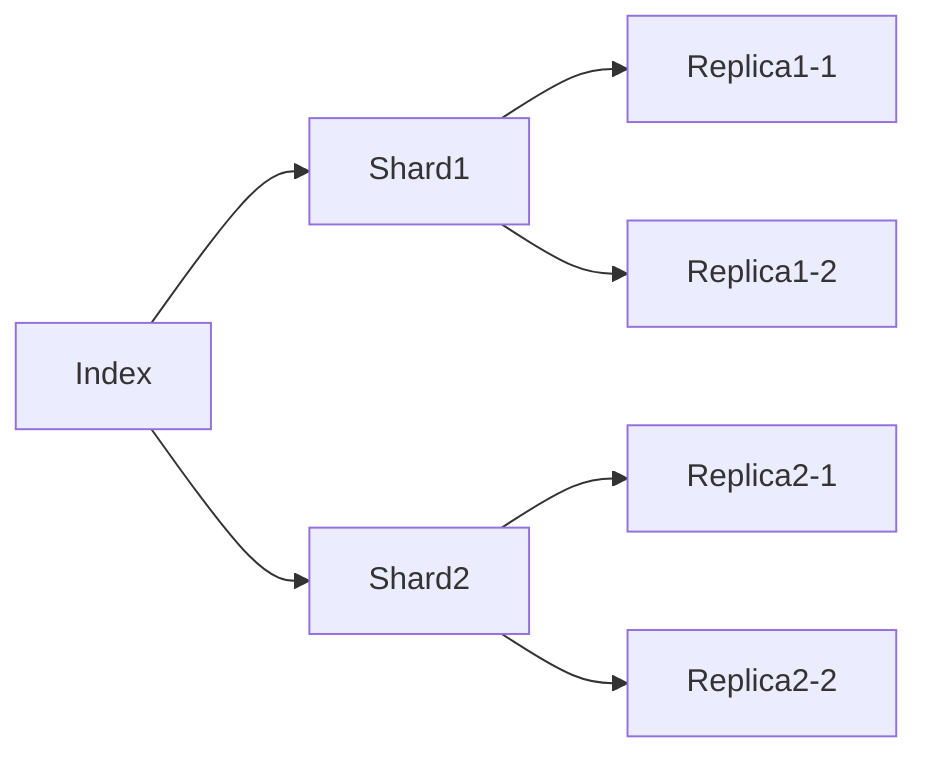

# ElasticSearch原理与代码实例讲解

## 1. 背景介绍
### 1.1 什么是ElasticSearch
ElasticSearch是一个基于Lucene的搜索服务器。它提供了一个分布式多用户能力的全文搜索引擎，基于RESTful web接口。ElasticSearch是用Java语言开发的，并作为Apache许可条款下的开放源码发布，是一种流行的企业级搜索引擎。

### 1.2 ElasticSearch的特点
- 实时分析
- 分布式实时文件存储，并将每一个字段都编入索引
- 文档导向，所有的对象全部是文档
- 高可用性，易扩展，支持集群（Cluster）、分片和复制（Shards 和 Replicas）
- 接口友好，支持JSON

### 1.3 ElasticSearch的应用场景
- 海量数据分析引擎
- 站内搜索引擎
- 数据仓库

## 2. 核心概念与联系
### 2.1 Node与Cluster
ElasticSearch可以作为一个独立的单个搜索服务器。不过，为了处理大型数据集，实现容错和高可用性，ElasticSearch可以运行在许多互相合作的服务器上。这些服务器的集合称为集群（cluster）。

集群中的一个节点（node）会被选举为主节点（master），它将临时管理集群级别的一些变更，例如新建或删除索引、增加或移除节点等。主节点不参与文档级别的变更或搜索，这意味着在流量增长的时候，该主节点不会成为集群的瓶颈。任何节点都可以成为主节点。

### 2.2 Index
ElasticSearch会索引所有字段，经过处理后写入一个反向索引（Inverted Index）。查找数据的时候，直接查找该索引。

所以，ElasticSearch数据管理的顶层单位就叫做 Index（索引），其实就相当于 MySQL、MongoDB 等里面的数据库的概念。另外值得注意的是，每个 Index （即数据库）的名字必须是小写。

### 2.3 Document
Index里面单条的记录称为Document（文档）。许多条Document构成了一个Index。Document使用JSON格式表示，常见的结构如下：

```json
{
  "user": "张三",
  "title": "工程师",
  "desc": "数据库管理"
}
```

同一个Index里面的Document，不要求有相同的结构（scheme），但是最好保持相同，这样有利于提高搜索效率。

### 2.4 Type
Document可以分组，比如`weather`这个Index里面，可以按城市分组（北京和上海），也可以按气候分组（晴天和雨天）。这种分组就叫做Type，它是虚拟的逻辑分组，用来过滤Document。

不同的Type应该有相似的结构（schema），举例来说，`id`字段不能在这个组是字符串，在另一个组是数值。这是与关系型数据库的表的一个区别。性质完全不同的数据（比如`products`和`logs`）应该存成两个Index，而不是一个Index里面的两个Type（虽然可以做到）。

### 2.5 Shard
Index数据过大时，可以分为多个分片（shard），每个分片是一个Lucene索引。Shard有两个好处：

- 支持水平扩展，提高系统存储容量
- 提高系统的吞吐量，每个Shard都可以处理请求

### 2.6 Replica
任何服务器随时可能故障或宕机，此时Shard可能就会丢失，因此可以为每个Shard创建多个Replica副本。Replica可以在Shard故障时提供备用服务，保证数据不丢失，多个Replica还可以提升搜索操作的吞吐量和性能。

Shard与Replica的关系如下图所示：



## 3. 核心算法原理具体操作步骤
### 3.1 分词
将文本按照一定的规则切分成词条（term）的过程，ElasticSearch中称之为Analysis。

- Character Filter：针对原始文本进行处理，例如去除html
- Tokenizer：将原始文本按照一定规则切分为单词
- Token Filter：将Tokenizer输出的单词进行再加工，比如转小写、删除或新增等处理

内置分词器：

- standard 分词器：(默认的)他会将词汇单元转换成小写形式，并去除停用词和标点符号，支持中文采用的方法为单字切分
- simple 分词器：首先会通过非字母字符来分割文本信息，然后将词汇单元统一为小写形式。该分词器会去掉数字类型的字符
- Whitespace 分词器：仅仅是去除空格，对字符没有lowcase化,不支持中文
- language 分词器：特定语言的分词器，不支持中文

### 3.2 搜索
ElasticSearch的搜索实现基于Lucene的倒排索引。倒排索引结构如下：

| Term      | Doc1 | Doc2 | Doc3 |
|-----------|------|------|------|
| ElasticSearch | ✓    | ✓    |      |
| Lucene    | ✓    |      | ✓    |
| 搜索      | ✓    | ✓    | ✓    |

搜索过程：

1. 用户输入查询语句
2. 对查询语句进行词法分析、语法分析，构建对应的查询树
3. 根据查询树进行搜索，获取document list
4. 根据document list到倒排列表中获取对应的文档
5. 将文档结果返回给用户

### 3.3 打分
ElasticSearch会对查询结果进行打分排序。打分的本质是排序，需要在索引时定义，索引时会存储 normalization factor，查询时将查询结果与 normalization factor 计算并生成一个 score 作为排序值。

ElasticSearch提供了默认的打分算法 BM25，并且允许修改其参数以及自定义打分算法。

BM25 的计算公式如下：

$$
score(D,Q) = \sum_{i=1}^{n} IDF(q_i) \cdot \frac{f(q_i,D) \cdot (k_1+1)}{f(q_i,D) + k_1 \cdot (1-b+b \cdot \frac{|D|}{avgdl})}
$$

其中：
- $f(q_i,D)$ 代表term $q_i$ 在doc $D$ 中出现的频率
- $|D|$ 代表doc $D$ 的长度
- $avgdl$ 代表所有doc的平均长度
- $k_1,b$ 为常数，通常 $k_1=1.2, b=0.75$

## 4. 数学模型和公式详细讲解举例说明
### 4.1 布尔模型 
布尔模型是信息检索中的经典模型，基本思想就是把搜索关键词之间的关系定义为与(and)、或(or)、非(not)。

举例：查询 "ElasticSearch AND Lucene"，代表同时包含 "ElasticSearch" 和 "Lucene" 的文档。

布尔模型的优点是概念清晰、计算简单，缺点是无法计算文档和查询的相关度，无法进行排序。

### 4.2 向量空间模型
向量空间模型用向量来表示文本，通过计算两个向量的夹角余弦值来得到文本间的相似度。

设文档向量 $d=(d_1,d_2,...,d_n)$，查询向量 $q=(q_1,q_2,...,q_n)$，其中 $d_i,q_i$ 表示词项 $t_i$ 在文档或查询中的权重，那么两个向量的夹角余弦值为：

$$
sim(d,q) = \frac{d \cdot q}{|d| \times |q|} = \frac{\sum_{i=1}^n d_i \times q_i}{\sqrt{\sum_{i=1}^n d_i^2} \times \sqrt{\sum_{i=1}^n q_i^2}}
$$

向量空间模型可以比较文档和查询的相关性，常用的权重计算方法有：

- TF-IDF：$w_{i,j} = tf_{i,j} \times log(\frac{N}{df_i})$，其中 $tf_{i,j}$ 表示词项 $t_i$ 在文档 $d_j$ 中的频率，$df_i$ 表示包含词项 $t_i$ 的文档数，$N$ 为总文档数
- BM25：即上文提到的打分公式

### 4.3 概率模型
概率模型从概率和统计的角度对信息检索进行建模，其基本思想是计算文档与查询的相关概率。

常见的概率模型有：

- Binary Independence Model：假设词项之间相互独立，文档与查询的相关概率为各个词项出现概率的乘积
- BM25：基于 2-Poisson 模型，假设文档中词项出现频率服从 Poisson 分布，并引入文档长度因子进行归一化

概率模型的优点是有统计学基础，缺点是概率和统计的计算量较大。

## 5. 项目实践：代码实例和详细解释说明
下面通过一个简单的Java项目来演示 ElasticSearch 的基本用法。

### 5.1 环境准备
- JDK 1.8+
- ElasticSearch 7.x
- elasticsearch-rest-high-level-client 7.x

添加 Maven 依赖：

```xml
<dependency>
    <groupId>org.elasticsearch.client</groupId>
    <artifactId>elasticsearch-rest-high-level-client</artifactId>
    <version>7.6.2</version>
</dependency>
```

### 5.2 连接 ES
```java
RestHighLevelClient client = new RestHighLevelClient(
        RestClient.builder(
                new HttpHost("localhost", 9200, "http")));
```

### 5.3 创建索引
```java
CreateIndexRequest request = new CreateIndexRequest("blog"); 
CreateIndexResponse response = client.indices().create(request, RequestOptions.DEFAULT);
```

### 5.4 插入文档
```java
IndexRequest request = new IndexRequest("blog");
request.id("1");
request.source(jsonBuilder()
        .startObject()
            .field("title", "ElasticSearch 入门")
            .field("content", "ElasticSearch 是一个基于 Lucene 的搜索服务器")
            .field("created", new Date())
        .endObject());
IndexResponse response = client.index(request, RequestOptions.DEFAULT);
```

### 5.5 搜索文档
```java
SearchRequest request = new SearchRequest("blog"); 
SearchSourceBuilder sourceBuilder = new SearchSourceBuilder();
sourceBuilder.query(QueryBuilders.termQuery("title", "ElasticSearch"));
sourceBuilder.from(0);
sourceBuilder.size(5);
request.source(sourceBuilder);
SearchResponse response = client.search(request, RequestOptions.DEFAULT);
```

### 5.6 删除文档
```java
DeleteRequest request = new DeleteRequest("blog", "1");
DeleteResponse response = client.delete(request, RequestOptions.DEFAULT);
```

### 5.7 删除索引
```java
DeleteIndexRequest request = new DeleteIndexRequest("blog"); 
AcknowledgedResponse response = client.indices().delete(request, RequestOptions.DEFAULT);
```

## 6. 实际应用场景
### 6.1 日志搜索平台
使用 ElasticSearch 存储日志数据，可以快速查询和分析海量日志，还可以和 Kibana 配合实现日志的可视化。

### 6.2 电商搜索引擎
使用 ElasticSearch 作为电商网站的商品搜索引擎，实现商品的多条件搜索、过滤、排序等功能，并支持高并发的查询请求。

### 6.3 相似文章推荐
利用 ElasticSearch 的 More Like This 查询，实现相似文章的推荐。More Like This 会将文档进行分词，然后根据词频等信息，返回相似的文档。

## 7. 工具和资源推荐
- Kibana：ElasticSearch 的可视化工具
- Logstash：开源的数据收集引擎，可以和 ElasticSearch 配合使用
- Beats：轻量型的数据采集器
- Elasticsearch: The Definitive Guide：ElasticSearch 权威指南
- Elasticsearch 官方文档：https://www.elastic.co/guide/en/elasticsearch/reference/current/index.html

## 8. 总结：未来发展趋势与挑战
ElasticSearch 在搜索引擎、日志分析、指标分析等领域有广泛应用，未来随着数据规模的不断增长，ElasticSearch 也面临着新的挑战和机遇：

- 更智能的搜索和问答：利用自然语言处理、知识图谱等技术，让搜索变得更加智能，能够理解用户意图，给出准确答案
- 更实时的搜索和分析：通过优化存储和查询，实现秒级乃至毫秒级的实时搜索和分析
-