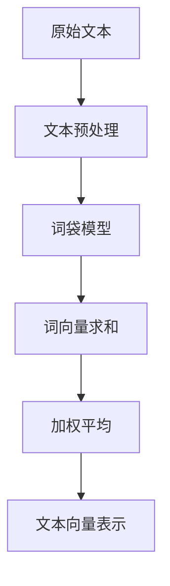

# FastText原理与代码实例讲解

## 1. 背景介绍

### 1.1 文本分类的重要性

在当今的数字时代,文本数据无处不在。从社交媒体上的用户评论到新闻文章,再到客户支持邮件,文本数据源源不断地涌现。能够有效地处理和分析这些海量文本数据对于企业和组织来说至关重要。文本分类是自然语言处理(NLP)领域的一个核心任务,它旨在自动将文本数据归类到预定义的类别中。准确的文本分类可以为各种应用程序提供支持,例如垃圾邮件检测、情感分析、新闻分类等。

### 1.2 传统文本分类方法的局限性

传统的文本分类方法通常依赖于手工设计的特征工程,这是一个耗时且容易出错的过程。此外,这些方法无法很好地捕捉词与词之间的语义关系,也难以处理未见过的单词。随着数据量的不断增长和新词不断涌现,传统方法的性能受到了严重限制。

### 1.3 FastText的兴起

为了解决传统方法的局限性,Facebook AI研究院(FAIR)在2016年提出了FastText,这是一种基于神经网络的文本分类算法。FastText利用词向量(Word Embeddings)来捕捉单词之间的语义关系,并采用了一种高效的分层softmax分类器,使得它在保持较高准确性的同时,训练和预测速度都非常快。自问世以来,FastText已被广泛应用于各种文本分类任务,并取得了卓越的成绩。

## 2. 核心概念与联系

### 2.1 词向量(Word Embeddings)

词向量是FastText的核心概念之一。它是将单词映射到一个连续的向量空间中的技术,使得语义相似的单词在向量空间中彼此靠近。这种表示方式能够捕捉单词之间的语义和语法关系,为后续的文本分类任务提供有价值的输入特征。

在FastText中,词向量是通过对大量文本语料进行训练而得到的,这个过程被称为词向量预训练(Word Embeddings Pre-training)。预训练的词向量可以作为初始化的向量,在后续的文本分类任务中进行微调(Fine-tuning),从而提高分类性能。

### 2.2 词袋模型(Bag of Words)

词袋模型(Bag of Words,BoW)是一种将文本表示为词频向量的简单而有效的方法。在这种模型中,一个文本被视为一个"袋子",里面装着独立的单词,单词的顺序被忽略了。每个单词的出现次数就构成了该文本对应的词频向量。

尽管词袋模型忽略了单词的顺序和语法结构等重要信息,但它仍然是一种非常实用的文本表示方法。FastText利用了词袋模型的思想,将一个文本表示为该文本中所有单词向量的加权平均,从而捕捉了文本的语义信息。



### 2.3 N-gram特征

除了利用单词级别的信息,FastText还引入了字符级N-gram特征,以捕捉更细粒度的模式。N-gram是指一个长度为N的字符序列,例如"ing"就是一个3-gram。通过考虑N-gram特征,FastText不仅能够处理已知单词,还能够很好地泛化到未见过的单词,从而提高了模型的鲁棒性。

例如,对于一个未见过的单词"jokingly",即使该单词不存在于训练集中,FastText仍然可以利用其中的N-gram特征(如"jok"、"oki"、"kin"、"ing"等)来推断其语义信息。这种基于N-gram的方法使得FastText能够更好地处理任意词汇表中的单词。

### 2.4 分层softmax分类器

FastText采用了一种高效的分层softmax分类器,用于将文本映射到预定义的类别标签。与传统的softmax分类器相比,分层softmax通过构建一个分层树状结构来降低计算复杂度,从而大大提高了训练和预测的速度。

在分层softmax中,类别标签被组织成一个层次化的树状结构。每个内部节点代表一个潜在的二元决策,而叶节点则对应实际的类别标签。在预测时,只需要沿着树的路径进行一系列二元决策,就可以高效地确定最终的类别标签。这种分层结构显著降低了计算开销,使FastText能够在保持较高准确性的同时,实现快速的训练和预测。

## 3. 核心算法原理具体操作步骤

FastText的核心算法原理可以概括为以下几个步骤:

1. **文本预处理**: 首先对原始文本进行标准的预处理,包括标点符号去除、大小写统一、词干提取等。

2. **构建词袋表示**: 对预处理后的文本,构建词袋表示,即统计每个单词在文本中出现的次数,形成一个词频向量。

3. **获取词向量**: 对于每个单词,从预训练的词向量字典中查找其对应的词向量。如果单词不存在于字典中,则利用N-gram特征构建该单词的词向量表示。

4. **计算文本向量**: 将该文本中所有单词的词向量进行加权平均,得到该文本的向量表示。

5. **分层softmax分类**: 将文本向量输入到分层softmax分类器中,沿着树状结构进行一系列二元决策,最终得到该文本所属的类别标签。

6. **模型训练**: 在训练过程中,通过反向传播算法更新模型参数(包括词向量和分类器参数),使得模型在训练集上的分类误差最小化。

7. **模型预测**: 对于新的文本数据,重复步骤1到5,即预处理、构建词袋表示、获取词向量、计算文本向量,并通过训练好的分层softmax分类器进行预测。

上述步骤反映了FastText的核心思想:利用词向量捕捉单词语义信息,通过词袋模型和N-gram特征构建文本向量表示,再结合高效的分层softmax分类器进行快速分类。这种思路使FastText在准确性和效率之间达到了良好的权衡。

## 4. 数学模型和公式详细讲解举例说明

### 4.1 词袋模型(Bag of Words)

在词袋模型中,一个文本$T$被表示为其中所有单词的多集,即:

$$\text{BoW}(T) = \{w_1, w_2, \ldots, w_n\}$$

其中$w_i$表示文本$T$中出现的第$i$个单词。

为了获得一个固定长度的向量表示,我们可以构建一个词典$\mathcal{V}$,它包含了所有可能出现的单词。然后,对于每个文本$T$,我们统计每个单词$w \in \mathcal{V}$在$T$中出现的次数$\text{count}(w, T)$,从而得到一个$|\mathcal{V}|$维的词频向量:

$$\mathbf{x} = (x_1, x_2, \ldots, x_{|\mathcal{V}|}), \quad x_i = \text{count}(w_i, T)$$

这种基于词袋的表示方法虽然简单,但忽略了单词的顺序和语法结构等重要信息。

### 4.2 词向量(Word Embeddings)

为了捕捉单词之间的语义关系,FastText采用了词向量的表示方式。每个单词$w$被映射到一个$d$维的密集向量$\mathbf{v}_w \in \mathbb{R}^d$,这个向量被称为该单词的词向量(Word Embedding)。语义相似的单词在向量空间中彼此靠近。

词向量可以通过对大量文本语料进行无监督训练而得到,这个过程被称为词向量预训练(Word Embeddings Pre-training)。常用的预训练方法包括Word2Vec、GloVe等。预训练得到的词向量可以作为初始化的向量,在后续的文本分类任务中进行微调(Fine-tuning),从而提高分类性能。

### 4.3 文本向量表示

在FastText中,一个文本$T$的向量表示$\mathbf{v}_T$是通过对该文本中所有单词的词向量进行加权平均而得到的,即:

$$\mathbf{v}_T = \frac{1}{|T|} \sum_{w \in T} \alpha_w \mathbf{v}_w$$

其中$|T|$表示文本$T$中单词的个数,$\alpha_w$是单词$w$的权重(通常取1或者根据单词频率计算得到),$\mathbf{v}_w$是单词$w$的词向量。

这种基于词向量的加权平均方式能够很好地捕捉文本的语义信息,同时保留了一定的词袋模型特性(即单词顺序被忽略)。

### 4.4 N-gram特征

为了提高模型的泛化能力,FastText引入了字符级N-gram特征。对于一个单词$w$,我们可以将其拆分为一系列的N-gram,并为每个N-gram构建一个向量表示$\mathbf{v}_g$。然后,单词$w$的向量表示$\mathbf{v}_w$就是所有N-gram向量的加权平均:

$$\mathbf{v}_w = \frac{1}{|G_w|} \sum_{g \in G_w} \mathbf{v}_g$$

其中$G_w$是单词$w$的所有N-gram集合,$|G_w|$是N-gram的个数。

通过这种方式,FastText不仅能够处理已知单词,还能够很好地泛化到未见过的单词,从而提高了模型的鲁棒性。

### 4.5 分层softmax分类器

FastText采用了一种高效的分层softmax分类器,用于将文本映射到预定义的类别标签。传统的softmax分类器计算复杂度为$\mathcal{O}(KC)$,其中$K$是输入向量的维度,$C$是类别数量。当类别数量$C$很大时,计算开销就会变得非常高昂。

为了降低计算复杂度,分层softmax将类别标签组织成一个层次化的树状结构,每个内部节点代表一个潜在的二元决策,而叶节点则对应实际的类别标签。在预测时,只需要沿着树的路径进行一系列二元决策,就可以高效地确定最终的类别标签。

具体来说,对于一个输入向量$\mathbf{x}$和一个内部节点$n$,我们计算该节点的得分$s_n(\mathbf{x})$:

$$s_n(\mathbf{x}) = \mathbf{w}_n^T \mathbf{x} + b_n$$

其中$\mathbf{w}_n$和$b_n$分别是该节点的权重向量和偏置项。然后,我们通过sigmoid函数将得分转换为二元决策的概率:

$$p_n(\mathbf{x}) = \sigma(s_n(\mathbf{x}))$$

对于叶节点(即实际的类别标签),我们可以计算其条件概率:

$$P(y|\mathbf{x}) = \prod_{n \in \text{path}(y)} p_n(\mathbf{x})^{\mathbb{I}(n \in \text{path}(y))}$$

其中$\text{path}(y)$表示从根节点到叶节点$y$的路径,$\mathbb{I}(\cdot)$是指示函数。

通过这种分层结构,FastText的分类器计算复杂度降低到了$\mathcal{O}(K \log C)$,大大提高了训练和预测的效率。

以上是FastText核心数学模型和公式的详细讲解,结合具体的例子有助于更好地理解这些概念和原理。

## 5. 项目实践:代码实例和详细解释说明

在本节中,我们将通过一个实际的代码示例来演示如何使用FastText进行文本分类。我们将使用Python编程语言和FastText库来构建一个电影评论情感分析模型。

### 5.1 数据准备

我们将使用经典的IMDB电影评论数据集,该数据集包含了25,000条带有情感标签(正面或负面)的电影评论。我们将数据集划分为训练集(20,000条评论)和测试集(5,000条评论)。

```python
import fasttext

# 加载数据集