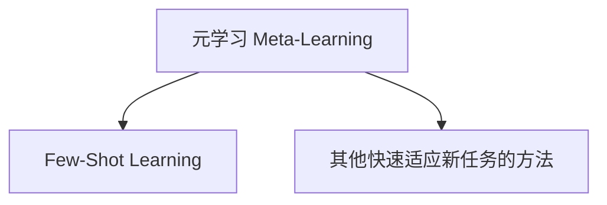
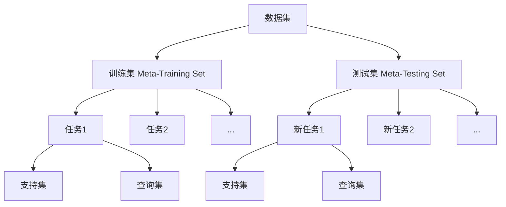
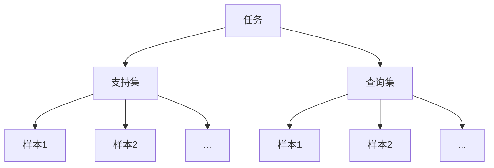
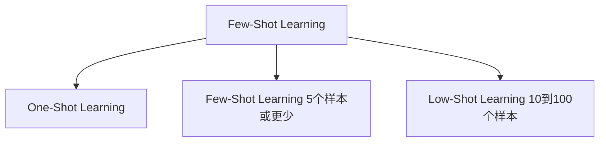
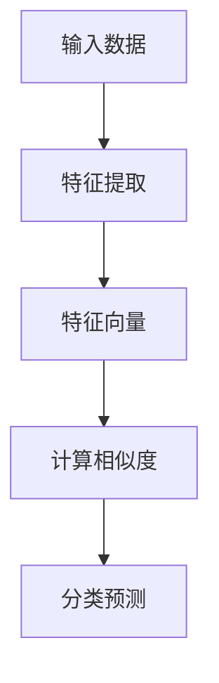
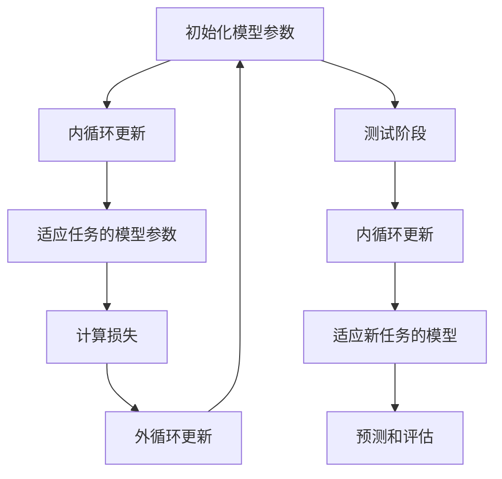
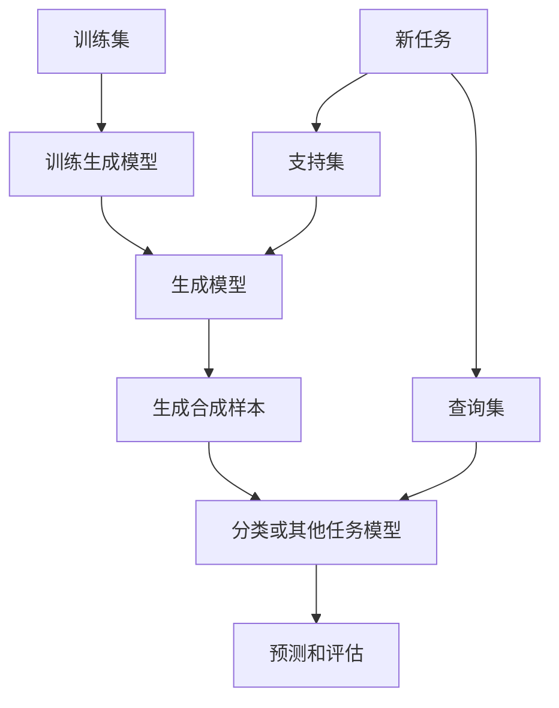

# Few-Shot Learning 原理与代码实例讲解

## 1. 背景介绍

### 1.1 机器学习的挑战

在传统的机器学习中,我们需要大量的标记数据来训练模型,以便模型能够学习并泛化到新的未见示例。然而,在许多现实世界的应用场景中,获取大量的标记数据是一个巨大的挑战。例如,在医疗诊断、自然语言处理等领域,标记数据的获取往往需要耗费大量的人力和财力。

### 1.2 Few-Shot Learning 的概念

Few-Shot Learning(少样本学习)旨在解决上述挑战,它是一种机器学习范式,能够仅依赖少量的标记样本就可以快速学习新的概念和任务。与传统机器学习方法相比,Few-Shot Learning更加贴近人类的学习方式,人类往往能够从少量的示例中快速学习新的概念。

### 1.3 Few-Shot Learning 的应用

Few-Shot Learning 在许多领域都有广泛的应用前景,例如:

- **计算机视觉**: 快速识别新类别的物体、人脸等。
- **自然语言处理**: 快速适应新领域的语料,进行文本分类、机器翻译等任务。
- **医疗健康**: 利用少量的病例数据快速学习新疾病的诊断模型。
- **机器人控制**: 通过少量的示例快速学习新的动作和技能。

## 2. 核心概念与联系

### 2.1 元学习(Meta-Learning)

Few-Shot Learning 与元学习(Meta-Learning)密切相关。元学习旨在学习一种通用的学习策略,使得模型能够快速适应新的任务,而不是直接学习具体的任务。Few-Shot Learning 可以被视为元学习的一个特例,它专注于利用少量的示例数据快速学习新的任务。



### 2.2 训练集与测试集

在 Few-Shot Learning 中,我们通常将数据集划分为两部分:

1. **训练集 (Meta-Training Set)**: 用于训练模型的元学习策略,包含多个不同的任务和对应的支持集(Support Set)和查询集(Query Set)。
2. **测试集 (Meta-Testing Set)**: 用于评估模型在新任务上的泛化能力,也包含多个新任务的支持集和查询集。



### 2.3 支持集与查询集

在每个任务中,数据被划分为两部分:

1. **支持集 (Support Set)**: 包含少量的标记样本,用于快速学习新任务。
2. **查询集 (Query Set)**: 包含未标记的样本,用于评估模型在该任务上的性能。

模型需要利用支持集中的少量示例快速学习新任务,并在查询集上进行预测和评估。



### 2.4 Few-Shot Learning 的分类

根据支持集中样本的数量,Few-Shot Learning 可以分为以下几类:

- **One-Shot Learning**: 支持集中只有一个样本。
- **Few-Shot Learning**: 支持集中有少量样本,通常是5个或更少。
- **Low-Shot Learning**: 支持集中有更多但仍然是少量的样本,通常是10到100个。



## 3. 核心算法原理具体操作步骤

Few-Shot Learning 的核心思想是利用先验知识和少量的示例数据快速学习新任务。常见的 Few-Shot Learning 算法包括:

### 3.1 基于度量的方法

基于度量的方法旨在学习一个好的特征空间,使得同一类别的样本在该特征空间中彼此靠近,而不同类别的样本相距较远。在测试时,将查询样本与支持集中的每个样本计算相似度,并根据最近邻原则进行分类。

#### 3.1.1 算法步骤

1. **特征提取**: 使用预训练的神经网络(如 CNN、RNN 等)从输入数据中提取特征向量。
2. **计算相似度**: 计算查询样本与支持集中每个样本之间的相似度,常用的相似度度量包括欧几里得距离、余弦相似度等。
3. **分类预测**: 根据最近邻原则,将查询样本分配到与其最相似的支持集样本所属的类别。



#### 3.1.2 代码示例

下面是一个使用 PyTorch 实现的基于度量的 Few-Shot Learning 示例:

```python
import torch
import torch.nn as nn
import torch.nn.functional as F

# 特征提取网络
class FeatureExtractor(nn.Module):
    def __init__(self):
        super(FeatureExtractor, self).__init__()
        # 定义网络结构
        ...

    def forward(self, x):
        # 前向传播计算特征向量
        ...
        return features

# 相似度计算
def compute_similarity(query, support):
    query_features = feature_extractor(query)
    support_features = feature_extractor(support)
    similarities = torch.cdist(query_features, support_features, p=2)  # 计算欧几里得距离
    return similarities

# 分类预测
def predict(query, support, support_labels):
    similarities = compute_similarity(query, support)
    pred_labels = []
    for sim in similarities:
        sorted_indices = torch.argsort(sim)
        nearest_label = support_labels[sorted_indices[0]]
        pred_labels.append(nearest_label)
    return pred_labels
```

在上述示例中,我们首先定义了一个特征提取网络 `FeatureExtractor`,用于从输入数据中提取特征向量。然后,我们实现了 `compute_similarity` 函数,用于计算查询样本与支持集样本之间的相似度(这里使用欧几里得距离)。最后,`predict` 函数根据最近邻原则对查询样本进行分类预测。

### 3.2 基于优化的方法

基于优化的方法旨在直接学习一个可以快速适应新任务的模型参数。在训练阶段,模型会在多个任务上进行训练,目标是找到一个好的初始参数,使得在测试时,只需要少量的梯度更新就可以适应新任务。

#### 3.2.1 算法步骤

1. **初始化模型参数**: 使用预训练的模型参数或随机初始化参数。
2. **内循环更新**: 在每个训练任务上,使用支持集数据对模型参数进行少量的梯度更新,得到适应该任务的模型参数。
3. **外循环更新**: 使用查询集数据计算损失,并反向传播更新初始模型参数,使其能够快速适应不同的任务。
4. **测试阶段**: 在新的测试任务上,使用支持集数据对初始模型参数进行少量的梯度更新,得到适应该任务的模型,然后在查询集上进行预测和评估。



#### 3.2.2 代码示例

下面是一个使用 PyTorch 实现的基于优化的 Few-Shot Learning 示例:

```python
import torch
import torch.nn as nn
import torch.optim as optim

# 定义模型
class Model(nn.Module):
    def __init__(self):
        super(Model, self).__init__()
        # 定义网络结构
        ...

    def forward(self, x):
        # 前向传播
        ...
        return outputs

# 内循环更新
def inner_loop(model, optimizer, support_data, support_labels, n_steps):
    for _ in range(n_steps):
        outputs = model(support_data)
        loss = criterion(outputs, support_labels)
        optimizer.zero_grad()
        loss.backward()
        optimizer.step()

# 外循环更新
def outer_loop(model, optimizer, train_tasks):
    for task in train_tasks:
        support_data, support_labels, query_data, query_labels = task
        inner_loop(model, optimizer, support_data, support_labels, n_inner_steps)
        outputs = model(query_data)
        loss = criterion(outputs, query_labels)
        optimizer.zero_grad()
        loss.backward()
        optimizer.step()

# 训练
model = Model()
optimizer = optim.SGD(model.parameters(), lr=0.01)
for epoch in range(n_epochs):
    outer_loop(model, optimizer, train_tasks)

# 测试
for test_task in test_tasks:
    support_data, support_labels, query_data, query_labels = test_task
    inner_loop(model, optimizer, support_data, support_labels, n_inner_steps)
    outputs = model(query_data)
    # 评估性能
```

在上述示例中,我们首先定义了一个模型 `Model`。`inner_loop` 函数实现了在每个任务上使用支持集数据对模型参数进行少量的梯度更新。`outer_loop` 函数则使用查询集数据计算损失,并反向传播更新初始模型参数。在训练过程中,我们在多个训练任务上重复执行 `outer_loop`。在测试阶段,我们在每个测试任务上执行 `inner_loop` 以适应新任务,然后在查询集上进行预测和评估。

### 3.3 基于生成模型的方法

基于生成模型的方法旨在学习一个生成模型,能够从少量的示例中捕获数据的潜在分布。在测试时,生成模型可以生成合成的样本,并与查询样本一起用于分类或其他任务。

#### 3.3.1 算法步骤

1. **训练生成模型**: 使用训练集中的多个任务,训练一个生成模型(如 GAN、VAE 等),使其能够从少量的示例中捕获数据的潜在分布。
2. **生成合成样本**: 在测试时,对于每个新任务,使用支持集数据作为条件,生成合成样本。
3. **分类或其他任务**: 将生成的合成样本与查询样本一起输入到分类器或其他任务模型中,进行预测和评估。



#### 3.3.2 代码示例

下面是一个使用 PyTorch 实现的基于生成模型的 Few-Shot Learning 示例,使用了条件变分自编码器 (Conditional Variational Autoencoder, CVAE):

```python
import torch
import torch.nn as nn
from torch.distributions import Normal

# 编码器
class Encoder(nn.Module):
    def __init__(self, input_dim, latent_dim):
        super(Encoder, self).__init__()
        # 定义网络结构
        ...

    def forward(self, x, c):
        # 前向传播计算均值和方差
        ...
        return mu, logvar

# 解码器
class Decoder(nn.Module):
    def __init__(self, latent_dim, output_dim):
        super(Decoder, self).__init__()
        # 定义网络结构
        ...

    def forward(self, z, c):
        # 前向传播重构输入
        ...
        return x_recon

# CVAE模型
class CVAE(nn.Module):
    def __init__(self, input_dim, latent_dim, output_dim):
        super(CVAE, self).__init__()
        self.encoder = Encoder(input_dim, latent_dim)
        self.decoder = Decoder(latent_dim, output_dim)

    def reparameterize(self, mu, logvar):
        std = torch.exp(0.5 * logvar)