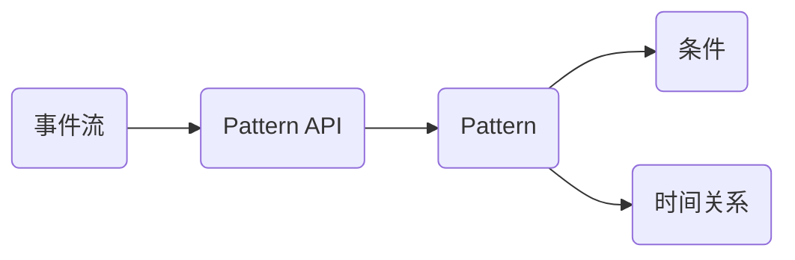
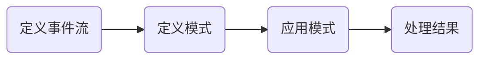

## 1.背景介绍

Apache Flink是一款开源的流处理框架，它可以在分布式环境中处理大规模数据流。Flink的Pattern API，又称为CEP（Complex Event Processing，复杂事件处理）库，是Flink的一个强大特性，它可以用来识别事件流中的复杂模式。

## 2.核心概念与联系

在Flink的CEP库中，事件模式是通过`Pattern`类定义的。每一个`Pattern`代表一个事件的模式，它可以包含多个条件，比如事件的类型、属性等。`Pattern`还可以定义事件之间的时间关系，比如事件A必须在事件B之后发生。



## 3.核心算法原理具体操作步骤

使用Flink的Pattern API进行复杂事件处理，一般需要以下几个步骤：

1. 定义事件流：首先需要有一个事件流，可以是一个实时的数据流，也可以是一个历史的数据集。
2. 定义模式：使用`Pattern`类定义事件的模式，可以定义多个条件和事件之间的时间关系。
3. 应用模式：将定义好的模式应用到事件流上，Flink会自动匹配满足模式的事件序列。
4. 处理结果：对匹配到的事件序列进行处理，比如生成一个新的事件，或者触发一个告警。



## 4.数学模型和公式详细讲解举例说明

在Flink的CEP库中，事件模式的匹配是通过NFA（非确定性有限自动机）实现的。NFA是一种计算模型，它可以表示复杂的时间关系和条件。在NFA中，每一个状态代表一个事件的模式，每一个转移代表一个事件的发生。NFA的起始状态代表模式的开始，结束状态代表模式的结束。

假设我们有一个模式P，它由事件A、B和C组成，事件A必须在事件B之后发生，事件B必须在事件C之后发生。这个模式可以表示为一个NFA，如下图所示：

```mermaid
graph LR
    start(开始) --> A(事件A)
    A --> B(事件B)
    B --> C(事件C)
    C --> end(结束)
```

在这个NFA中，每一个状态都有一个自环，表示事件可以重复发生。每一个转移都有一个条件，表示事件必须满足某个条件才能发生。例如，从状态A到状态B的转移，条件就是事件A必须在事件B之后发生。

在处理事件流时，Flink会遍历事件流，对每一个事件，都会尝试将其匹配到NFA的一个状态。如果匹配成功，就会生成一个新的NFA实例，表示一个可能的事件序列。如果匹配失败，就会删除这个NFA实例。当一个NFA实例到达结束状态时，就表示找到了一个满足模式的事件序列。

## 5.项目实践：代码实例和详细解释说明

下面我们通过一个简单的例子来说明如何使用Flink的Pattern API进行复杂事件处理。在这个例子中，我们有一个事件流，每个事件有一个类型和一个时间戳。我们的目标是找出所有满足以下模式的事件序列：首先是一个类型为A的事件，然后在5分钟内发生一个类型为B的事件。

首先，我们定义事件流：

```java
DataStream<Event> stream = ...
```

然后，我们定义模式：

```java
Pattern<Event, ?> pattern = Pattern.<Event>begin("start")
    .where(new SimpleCondition<Event>() {
        public boolean filter(Event value) {
            return value.getType().equals("A");
        }
    })
    .next("end")
    .where(new SimpleCondition<Event>() {
        public boolean filter(Event value) {
            return value.getType().equals("B");
        }
    })
    .within(Time.minutes(5));
```

接下来，我们将模式应用到事件流上：

```java
PatternStream<Event> patternStream = CEP.pattern(stream, pattern);
```

最后，我们处理匹配到的事件序列：

```java
DataStream<Alert> result = patternStream.select(new PatternSelectFunction<Event, Alert>() {
    public Alert select(Map<String, List<Event>> pattern) {
        Event start = pattern.get("start").get(0);
        Event end = pattern.get("end").get(0);
        return new Alert("Pattern match: " + start + " -> " + end);
    }
});
```

在这个例子中，我们使用了Flink的Pattern API的几个关键特性，包括事件过滤、事件顺序和时间窗口。这些特性使得Flink的Pattern API非常强大，可以处理各种复杂的事件模式。

## 6.实际应用场景

Flink的Pattern API可以应用在很多场景中，比如：

- 实时告警：监控系统的日志或指标，当发生某种模式的事件时，生成一个告警。
- 用户行为分析：分析用户的行为序列，找出满足某种模式的行为，比如购物篮分析。
- 网络安全：分析网络流量，找出满足某种模式的流量，比如DDoS攻击。

## 7.工具和资源推荐

如果你对Flink的Pattern API感兴趣，以下是一些有用的资源：

- [Apache Flink官方文档](https://flink.apache.org/)
- [Flink CEP库的GitHub仓库](https://github.com/apache/flink)
- [Flink的在线训练课程](https://training.ververica.com/)

## 8.总结：未来发展趋势与挑战

Flink的Pattern API是一个强大的工具，它将复杂事件处理的理论和实践结合在一起，使得处理复杂事件模式变得非常简单。然而，Flink的Pattern API也有一些挑战，比如如何处理大规模的事件流，如何处理不确定的事件顺序等。随着Flink的不断发展，我们期待这些问题能得到更好的解决。

## 9.附录：常见问题与解答

Q: Flink的Pattern API支持哪些类型的模式？

A: Flink的Pattern API支持各种复杂的模式，包括顺序模式、并行模式、循环模式等。你可以定义任意复杂的模式，只要它们可以表示为一个NFA。

Q: 如何处理大规模的事件流？

A: Flink的Pattern API是分布式的，它可以在多个节点上并行处理事件流。此外，Flink还提供了一些优化技术，比如状态压缩，来处理大规模的事件流。

Q: 如何处理不确定的事件顺序？

A: Flink的Pattern API默认假设事件是按时间顺序到达的。如果事件的顺序不确定，你可以使用Flink的时间戳和水位线功能来处理。

作者：禅与计算机程序设计艺术 / Zen and the Art of Computer Programming