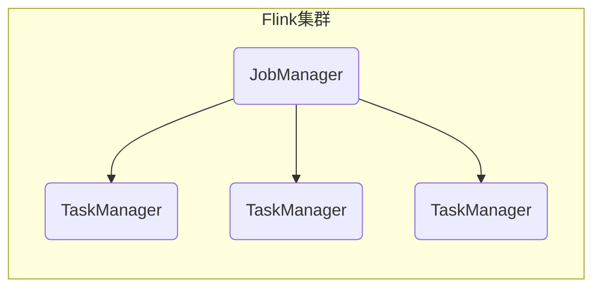
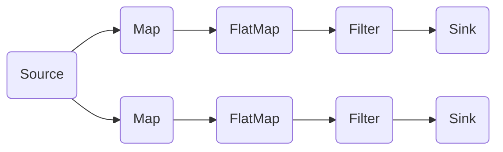

# Flink 原理与代码实例讲解

## 1.背景介绍

### 1.1 大数据时代的到来

在当今时代,数据已经成为了一种新的"燃料",推动着各行各业的创新和发展。随着互联网、物联网、移动互联网等技术的飞速发展,海量的数据不断被产生和积累。这些数据蕴含着巨大的价值,但如何高效地处理和分析这些数据,从中获取洞见和价值,成为了一个巨大的挑战。

### 1.2 传统数据处理系统的局限性

传统的数据处理系统,例如关系型数据库,在处理海量数据时往往会遇到瓶颈。它们通常采用批处理的方式,需要先将数据全部加载到内存中,然后进行处理。这种方式在处理大数据时,效率低下且成本高昂。此外,传统系统通常只能处理静态数据,无法及时响应动态变化的数据流。

### 1.3 流式数据处理的兴起

为了应对大数据时代的挑战,流式数据处理(Stream Processing)应运而生。流式数据处理系统能够实时处理持续到来的数据流,并及时产生结果。与传统的批处理系统不同,流式处理系统采用了一种全新的处理范式,能够更好地满足实时性、可扩展性和容错性等方面的需求。

Apache Flink 作为一款开源的分布式流式数据处理框架,凭借其出色的性能、灵活性和丰富的功能库,成为了流式数据处理领域的佼佼者。

## 2.核心概念与联系

### 2.1 Flink 架构概览

Flink 采用了主从架构,由一个 JobManager(主服务器)和多个 TaskManager(从服务器)组成。其中,JobManager 负责协调分布式执行,决定何时调度下一个任务;而 TaskManager 则负责执行具体的任务,读写数据,以及数据的传输和缓存。



### 2.2 流式数据模型

在 Flink 中,所有的计算都是以流的形式被表示的。流可以是有界的(Bounded)或无界的(Unbounded)。有界流是指有明确的开始和结束,例如读取一个文件中的数据。无界流则是持续不断产生的数据流,例如从 Kafka 消费实时日志数据。

### 2.3 数据转换

Flink 提供了丰富的数据转换操作,可以对流进行各种转换和处理。这些操作可以分为以下几类:

- Map: 对每个元素执行相同的操作,生成新的流。
- FlatMap: 对每个元素执行相同的操作,生成零个、一个或多个元素。
- Filter: 根据条件过滤掉部分元素。
- KeyBy: 根据 Key 对流进行分区。
- Reduce: 对具有相同 Key 的元素进行规约操作。
- Window: 基于某些特征(如时间或计数)对流进行分窗口。

这些操作可以灵活组合,构建出复杂的数据处理流水线。

### 2.4 状态管理

在流式数据处理中,状态管理是一个关键的概念。Flink 提供了一致且可容错的状态管理机制,能够在发生故障时自动恢复状态,确保计算的准确性。Flink 支持多种状态类型,包括键控状态(Key-Value State)、广播状态(Broadcast State)等。

### 2.5 时间语义

在流式处理中,时间语义是一个重要的概念。Flink 支持三种时间语义:事件时间(Event Time)、摄入时间(Ingestion Time)和处理时间(Processing Time)。事件时间是指事件实际发生的时间;摄入时间是指事件进入 Flink 的时间;处理时间则是指事件被处理的时间。选择合适的时间语义对于正确处理乱序数据和实现准确的窗口计算至关重要。

### 2.6 容错机制

Flink 采用了基于流水线快照的容错机制,能够在发生故障时自动重启并恢复状态,确保计算的准确性和一致性。这种容错机制不仅适用于单个节点故障,也适用于整个集群发生故障的情况。

## 3.核心算法原理具体操作步骤

### 3.1 流执行模型

Flink 采用了流执行模型(Streaming Execution Model),将计算任务拆分为多个并行的任务链(Task Chains)。每个任务链由一个或多个算子(Operator)组成,算子之间通过数据流(Stream)连接。



在执行过程中,每个任务链会被分配到不同的 TaskManager 上执行。TaskManager 会为每个算子创建一个或多个子任务(Subtask),这些子任务并行执行,从而提高整体的吞吐量。

### 3.2 数据分区

为了实现并行计算,Flink 需要将数据流分区(Partitioning)到不同的子任务上。Flink 提供了多种分区策略,包括:

- 重分区(Rebalance): 将数据均匀分布到下游所有子任务。
- 哈希分区(Hash Partitioning): 根据 Key 的哈希值将数据分发到不同的子任务。
- 范围分区(Range Partitioning): 根据 Key 的范围将数据分发到不同的子任务。
- ...

选择合适的分区策略对于充分利用并行计算能力至关重要。

### 3.3 窗口操作

在流式数据处理中,窗口操作(Window)是一个非常重要的概念。窗口用于将无限的流数据划分为有限的、可查询的"桶"。Flink 支持多种窗口类型,包括:

- 滚动窗口(Tumbling Window): 固定大小的非重叠窗口。
- 滑动窗口(Sliding Window): 固定大小的重叠窗口。
- 会话窗口(Session Window): 根据活动周期动态合并窗口。
- 全局窗口(Global Window): 将所有数据收集到一个全局窗口中。

窗口操作通常与聚合函数(如 sum、min、max 等)结合使用,以计算窗口内的聚合结果。

### 3.4 状态管理

Flink 的状态管理机制是其核心算法的重要组成部分。状态管理涉及以下几个关键步骤:

1. **状态存储**: Flink 将状态存储在 TaskManager 的 JVM 堆内存中,并定期将状态快照写入分布式存储系统(如 HDFS)。
2. **状态分片**: 为了提高并行度,Flink 将状态划分为多个分片,每个分片由一个子任务管理。
3. **状态恢复**: 当发生故障时,Flink 会从最近的一致快照中恢复状态,并重新执行计算。
4. **状态清理**: Flink 会定期清理过期的状态快照,以节省存储空间。

通过这种机制,Flink 能够实现精确一次(Exactly-Once)的语义,确保计算结果的准确性和一致性。

### 3.5 反压机制

在流式数据处理中,上游数据源的发送速率可能会超过下游算子的处理能力,导致数据积压和背压(Backpressure)问题。为了解决这个问题,Flink 实现了一种反压机制:

1. 每个算子都有一个输入缓冲区,用于临时存储待处理的数据。
2. 当输入缓冲区填满时,算子会向上游发送反压信号,要求上游减慢发送速率。
3. 上游算子收到反压信号后,会降低发送速率或暂停发送,直到下游缓冲区有足够的空间。

通过这种方式,Flink 能够动态调节数据流的速率,避免数据积压和资源浪费,提高整体系统的稳定性和吞吐量。

## 4.数学模型和公式详细讲解举例说明

在流式数据处理中,常常需要使用一些数学模型和公式来描述和优化系统的行为。以下是一些常见的数学模型和公式:

### 4.1 小顶堆模型

在实现滑动窗口操作时,Flink 使用了小顶堆(Min Heap)数据结构来维护窗口中的元素。小顶堆是一种特殊的二叉树,其中每个节点的值都小于或等于其子节点的值。

在滑动窗口中,当一个新元素到达时,它会被插入到小顶堆中。同时,如果窗口大小超过了限制,则会从小顶堆中移除最小的元素。这种方式可以保证小顶堆中始终存储着窗口内的最大 N 个元素。

小顶堆的插入和删除操作的时间复杂度为 $O(\log n)$,其中 n 是堆中元素的个数。因此,滑动窗口操作的时间复杂度为 $O(m \log n)$,其中 m 是窗口中元素的个数。

### 4.2 计数窗口模型

在实现会话窗口(Session Window)时,Flink 使用了一种基于计数的模型。会话窗口是根据数据的活动周期动态合并的窗口。

假设我们有一个会话间隔阈值 $\gamma$,表示两个数据之间的最大时间间隔。如果两个数据之间的时间间隔小于 $\gamma$,则它们属于同一个会话窗口;否则,它们属于不同的会话窗口。

我们可以使用一个计数器 $c$ 来跟踪当前会话窗口中的元素个数。当一个新元素到达时,如果它与上一个元素的时间间隔小于 $\gamma$,则 $c$ 加 1;否则,我们认为当前会话窗口结束,开启一个新的会话窗口,并将 $c$ 重置为 1。

通过这种方式,我们可以动态地合并和分割会话窗口,而无需预先指定窗口大小。

### 4.3 反压模型

为了描述和优化 Flink 的反压机制,我们可以使用一些队列理论模型。假设我们有一个 M/M/1 队列模型,其中:

- 到达过程服从泊松分布,平均到达率为 $\lambda$。
- 服务时间服从负指数分布,平均服务率为 $\mu$。
- 只有一个服务台。

在这种情况下,系统的利用率 $\rho = \frac{\lambda}{\mu}$。当 $\rho < 1$ 时,队列长度的期望值为:

$$E[N] = \frac{\rho}{1 - \rho}$$

我们可以将 Flink 的反压机制视为一个开环控制系统,其中输入缓冲区的大小就是队列长度。当队列长度超过一个阈值时,系统会触发反压机制,降低上游的发送速率 $\lambda$,从而降低系统的利用率 $\rho$,缓解队列积压。

通过建模和分析,我们可以优化反压机制的参数,例如缓冲区大小、反压阈值等,从而提高系统的吞吐量和稳定性。

## 5.项目实践:代码实例和详细解释说明

为了更好地理解 Flink 的原理和使用方式,我们来看一个实际的代码示例。在这个示例中,我们将从 Kafka 消费实时日志数据,对日志进行解析和统计,并将结果写入 ElasticSearch。

### 5.1 项目结构

```
|- src
|   |- main
|       |- java
|           |- com
|               |- example
|                   |- LogAnalyzer.java
|       |- resources
|           |- log4j.properties
|- pom.xml
```

### 5.2 添加依赖

在 `pom.xml` 文件中,我们需要添加以下依赖:

```xml
<dependencies>
    <dependency>
        <groupId>org.apache.flink</groupId>
        <artifactId>flink-java</artifactId>
        <version>${flink.version}</version>
    </dependency>
    <dependency>
        