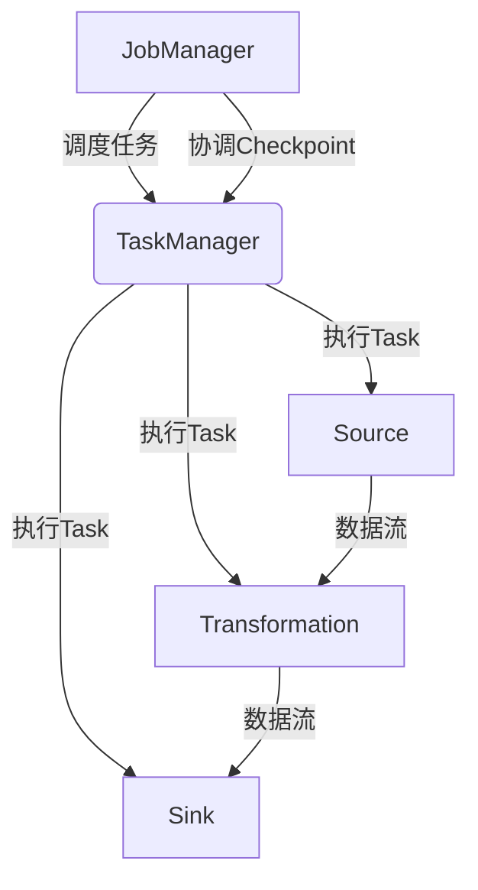
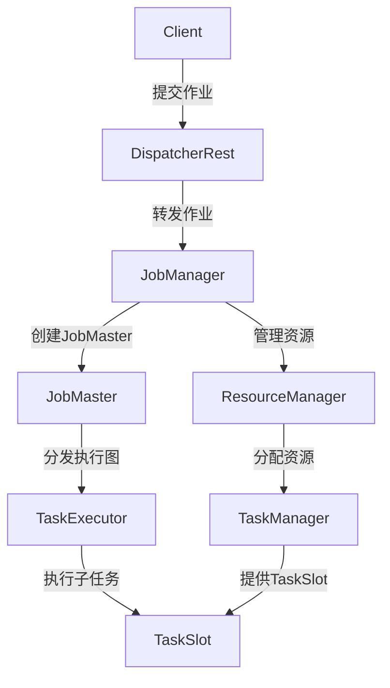
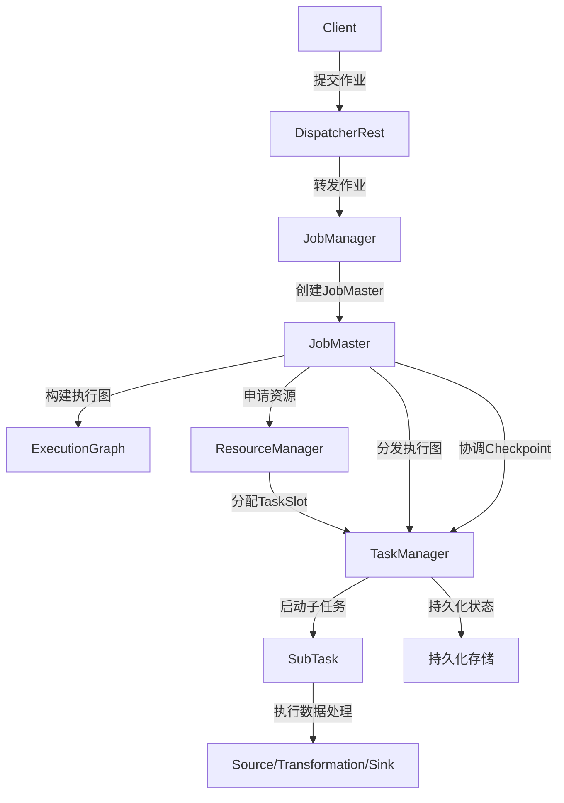
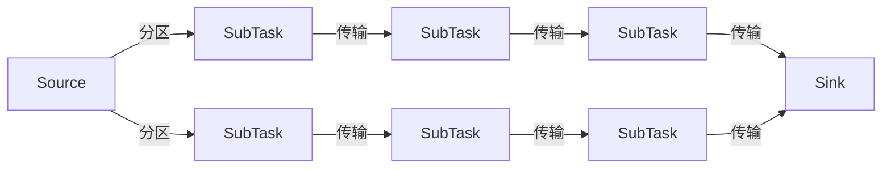

# Flink原理与代码实例讲解

## 1.背景介绍

### 1.1 大数据处理的演进

在当今数据爆炸式增长的时代,传统的数据处理方式已经无法满足企业对实时数据处理和分析的迫切需求。大数据时代的到来,推动了新一代分布式数据处理框架的兴起,例如Apache Hadoop、Apache Spark等。然而,这些框架主要侧重于离线批处理,无法有效地处理持续不断到来的数据流。

### 1.2 流式数据处理的需求

随着物联网、移动互联网、社交网络等应用的快速发展,实时数据流成为了数据处理的新挑战。许多场景需要实时处理持续产生的数据,如网络流量监控、金融交易监控、实时广告投放等。传统的批处理框架无法满足这种低延迟、高吞吐的实时数据处理需求。

### 1.3 Apache Flink的崛起

Apache Flink作为新一代分布式流式数据处理框架,旨在统一批处理和流处理,为实时数据处理提供高吞吐、低延迟的解决方案。Flink借鉴了Apache Spark的有向无环图(DAG)执行模型,同时引入了基于流的数据处理范式,支持有状态计算和事件时间语义。Flink具有良好的容错机制和高可用性,能够处理有界和无界数据流,并提供了丰富的API和库,支持多种编程语言。

## 2.核心概念与联系

### 2.1 Flink架构概览

Flink采用了主从架构,由一个JobManager(主服务器)和多个TaskManager(工作节点)组成。JobManager负责协调分布式执行,调度任务、协调检查点(checkpoints)等;TaskManager负责执行具体的数据处理任务,包括数据流的接收、转换和发送。

### 2.2 流式数据模型

Flink基于流式数据模型,将数据源抽象为无限长的数据流。数据流由一个一个的数据记录(Event/Element)组成,可以是有界的(如文件数据),也可以是无界的(如网络数据流)。Flink以数据流为中心,通过转换算子(Transformation)对数据流进行各种操作,最终将结果输出到Sink。

### 2.3 有向无环图执行模型

Flink借鉴了Spark的DAG(有向无环图)执行模型,将数据处理作业描述为一个由算子(Operator)组成的DAG。算子之间通过数据流(Stream)连接,构成了一个数据流水线。Flink会根据DAG的拓扑结构,将任务分发到不同的TaskManager上执行。

### 2.4 窗口(Window)概念

在流式数据处理中,由于数据是持续不断到来的,因此需要将无界数据流切分为有界的数据集进行处理。Flink提供了窗口(Window)的概念,可以根据时间或计数将数据流划分为有限的窗口,对每个窗口内的数据进行聚合计算。常见的窗口类型包括滚动窗口(Tumbling Window)、滑动窗口(Sliding Window)、会话窗口(Session Window)等。

### 2.5 状态管理与容错机制

由于流式数据处理需要维护中间计算结果的状态,Flink提供了有状态计算的支持。Flink将算子的状态存储在TaskManager的内存或者状态后端(如RocksDB)中,并通过定期的Checkpoint机制将状态持久化到持久化存储中,以实现容错和恢复。当TaskManager发生故障时,Flink可以根据最新的Checkpoint重新启动任务,恢复之前的计算状态,保证了精确一次(Exactly-Once)的语义。

## 3.核心算法原理具体操作步骤

### 3.1 Flink运行时架构

Flink的运行时架构由多个组件协作工作,包括JobManager、TaskManager、DispatcherRest、ResourceManager等。

1. **JobManager**是Flink集群的协调者,负责调度和协调任务的执行。它维护了作业的元数据、检查点(Checkpoint)和JobGraph。

2. **TaskManager**是Flink集群的工作节点,负责执行实际的数据处理任务。每个TaskManager包含多个TaskSlot,用于执行不同的子任务(SubTask)。

3. **DispatcherRest**是JobManager的REST服务端点,用于接收客户端提交的作业,并将作业转发给JobManager。

4. **ResourceManager**负责管理Flink集群中的TaskManager资源,包括TaskManager的插槽(Slot)分配、TaskManager的注册和终止等。

5. **JobMaster**是JobManager的一个组件,负责单个作业的调度和协调。它将JobGraph转换为执行图(ExecutionGraph),并将执行图分发到TaskManager上执行。

6. **TaskExecutor**是TaskManager的一个组件,负责执行具体的子任务(SubTask)。它从JobMaster接收执行图,并在TaskSlot中启动子任务的执行线程。

下图展示了Flink运行时架构的主要组件及其交互关系:

### 3.2 作业执行流程

Flink作业的执行流程包括以下几个主要步骤:

1. **客户端提交作业**:客户端将作业代码提交到DispatcherRest,DispatcherRest会将作业转发给JobManager。

2. **JobManager创建JobMaster**:JobManager接收到作业后,会为该作业创建一个JobMaster实例,负责该作业的调度和协调。

3. **JobMaster构建执行图**:JobMaster将作业代码转换为JobGraph,然后将JobGraph转换为ExecutionGraph(执行图)。ExecutionGraph描述了作业的并行度、算子之间的数据流等执行细节。

4. **TaskManager提供资源**:JobMaster向ResourceManager申请所需的TaskManager资源(TaskSlot)。ResourceManager将空闲的TaskSlot分配给JobMaster。

5. **分发执行图到TaskManager**:JobMaster将ExecutionGraph分发到对应的TaskManager上,TaskManager上的TaskExecutor会启动相应的子任务(SubTask)线程。

6. **子任务执行**:TaskExecutor在TaskSlot中启动子任务线程,执行具体的数据处理操作,包括数据的接收、转换和发送等。

7. **Checkpoint机制**:在执行过程中,JobMaster会协调TaskManager定期进行Checkpoint,将算子的状态持久化到持久化存储中,以实现容错和恢复。

8. **结果输出**:经过一系列转换后,数据最终会输出到指定的Sink中。

下图展示了Flink作业的典型执行流程:

### 3.3 数据流水线执行

在Flink中,数据流水线的执行由多个并行的子任务(SubTask)协作完成。每个SubTask负责处理数据流的一部分,并将处理结果传递给下游的SubTask。

1. **数据分区**:Flink采用了数据分区(Partitioning)的策略,将数据流划分为多个逻辑分区,每个分区由一个SubTask处理。常见的分区策略包括重分区(Rebalance)、哈希分区(Hash Partitioning)、广播(Broadcast)等。

2. **数据传输**:SubTask之间通过网络进行数据传输。Flink采用了零拷贝(Zero-Copy)技术,避免了不必要的数据拷贝,提高了数据传输效率。

3. **算子链(Operator Chaining)**:为了减少不必要的数据序列化/反序列化和网络传输,Flink会将多个算子链接在一起,形成算子链。算子链内的数据处理在同一个线程中完成,避免了线程间的上下文切换开销。

4. **异步数据传输**:Flink采用了异步数据传输机制,发送端和接收端使用独立的线程进行数据传输,避免了阻塞等待,提高了吞吐量。

5. **反压(Backpressure)**:当下游算子处理速度跟不上上游算子的数据发送速度时,会触发反压机制。上游算子会暂时缓存数据,等待下游算子处理完当前数据后再继续发送,避免了数据丢失和内存溢出。

下图展示了Flink数据流水线的执行过程:

## 4.数学模型和公式详细讲解举例说明

在流式数据处理中,常常需要对数据进行聚合计算,例如计算平均值、求和等。Flink提供了窗口(Window)的概念,将无界的数据流划分为有限的窗口,对每个窗口内的数据进行聚合操作。

### 4.1 滚动窗口(Tumbling Window)

滚动窗口是一种非重叠的窗口类型,它将数据流划分为固定大小的窗口,每个窗口包含一段时间内的数据。滚动窗口的计算公式如下:

$$
\begin{align*}
w_i &= [t_i, t_i + w) \\
t_i &= i \times w \\
i &= 0, 1, 2, \ldots
\end{align*}
$$

其中:

- $w_i$ 表示第 $i$ 个窗口
- $t_i$ 表示第 $i$ 个窗口的起始时间戳
- $w$ 表示窗口的大小(时间或计数)

例如,对于一个5秒的滚动窗口,数据流可以划分为以下窗口:

$$
\begin{align*}
w_0 &= [0, 5) \\
w_1 &= [5, 10) \\
w_2 &= [10, 15) \\
&\ldots
\end{align*}
$$

### 4.2 滑动窗口(Sliding Window)

滑动窗口是一种重叠的窗口类型,它将数据流划分为固定大小的窗口,但每个新窗口会与前一个窗口有重叠部分。滑动窗口的计算公式如下:

$$
\begin{align*}
w_i &= [t_i, t_i + w) \\
t_i &= i \times s \\
i &= 0, 1, 2, \ldots
\end{align*}
$$

其中:

- $w_i$ 表示第 $i$ 个窗口
- $t_i$ 表示第 $i$ 个窗口的起始时间戳
- $w$ 表示窗口的大小(时间或计数)
- $s$ 表示滑动步长(时间或计数)

例如,对于一个10秒的滑动窗口,步长为5秒,数据流可以划分为以下窗口:

$$
\begin{align*}
w_0 &= [0, 10) \\
w_1 &= [5, 15) \\
w_2 &= [10, 20) \\
&\ldots
\end{align*}
$$

### 4.3 会话