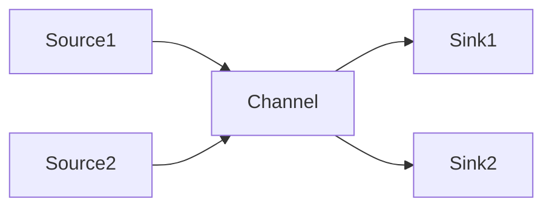

# Flume原理与代码实例讲解

## 1.背景介绍

### 1.1 数据采集的重要性

在当今的数字时代,数据已经成为了企业和组织的重要资产。无论是网络日志、服务器指标、用户行为数据还是物联网设备产生的海量数据,都需要被高效、可靠地收集和传输,以便后续的数据存储、处理和分析。数据采集是构建现代数据基础架构的关键环节,对于实现数据驱动的决策和创新至关重要。

### 1.2 Flume的定位

Apache Flume是一个分布式、可靠、高可用的数据采集系统,旨在高效地从不同的数据源收集、聚合和移动大量的日志数据。Flume的设计理念是将数据流从源头到目的地进行可靠地传输和持久化。它可以采集各种不同格式的日志数据,如网络流量数据、服务器日志、社交媒体数据等,并将其传输到HDFS、HBase、Solr等存储系统中,为后续的数据处理和分析做好准备。

### 1.3 Flume的优势

相比于传统的日志采集方式,Flume具有以下优势:

- **可靠性**:Flume通过事务机制确保数据在传输过程中不会丢失,并提供了多种故障转移策略,保证了数据的可靠性。
- **灵活性**:Flume支持多种数据源和目的地,可以轻松地集成到现有的数据基础架构中。
- **扩展性**:Flume采用了分布式、流式的架构设计,可以轻松地进行水平扩展,应对大规模数据采集场景。
- **容错性**:Flume具有高度的容错性,能够自动检测故障并进行故障转移,确保数据采集的连续性。
- **简单性**:Flume提供了简单易用的配置方式,降低了系统的管理和维护成本。

## 2.核心概念与联系

### 2.1 Flume的核心组件

Flume由以下三个核心组件组成:

1. **Source(源)**:Source是数据进入Flume的入口,它从外部数据源(如Web服务器日志、应用程序日志等)收集数据,并将其传输到Channel中。Flume支持多种类型的Source,如Avro Source、Syslog Source等。

2. **Channel(通道)**:Channel是Flume中的内存缓冲区,用于临时存储从Source接收到的事件数据,直到它们被Sink持久化。Channel可以防止Source和Sink之间的速度不匹配导致的数据丢失。Flume支持多种类型的Channel,如Memory Channel、File Channel等。

3. **Sink(槽)**:Sink是Flume中的出口,它从Channel中取出事件数据,并将其存储到外部存储系统中,如HDFS、HBase、Solr等。Sink可以处理批量或事务性的数据传输。Flume支持多种类型的Sink,如HDFS Sink、Hbase Sink等。

这三个组件通过配置文件进行连接,构成了一个完整的数据流水线,如下图所示:



### 2.2 Flume的工作流程

Flume的工作流程如下:

1. Source从外部数据源收集数据,并将其封装为事件(Event)。
2. Source将事件传输到Channel中进行临时缓存。
3. Sink从Channel中取出事件,并将其传输到外部存储系统中进行持久化存储。

在这个过程中,Source和Sink可以是一对多或多对一的关系,以满足不同的数据采集需求。Channel作为缓冲区,可以防止Source和Sink之间的速度不匹配导致的数据丢失。

### 2.3 Flume的可靠性机制

为了确保数据在传输过程中不会丢失,Flume采用了事务机制和多种故障转移策略:

1. **事务机制**:Flume在Source、Channel和Sink之间采用事务机制,确保数据在整个流程中的一致性。如果任何一个环节出现故障,整个事务将回滚,避免数据丢失或重复。

2. **故障转移策略**:Flume提供了多种故障转移策略,如故障转移到备份Channel、备份Sink等,以确保在发生故障时能够继续进行数据采集和传输。

3. **重试机制**:Flume支持在发生故障时自动重试,以最大限度地减少数据丢失。

这些可靠性机制使得Flume能够在各种情况下保证数据的完整性和一致性,从而满足企业对于数据采集的高可靠性要求。

## 3.核心算法原理具体操作步骤

### 3.1 Flume的事务机制

Flume的事务机制是确保数据可靠传输的关键,它涉及到Source、Channel和Sink三个组件之间的交互。事务机制的具体操作步骤如下:

1. **Source获取数据**:Source从外部数据源获取数据,并将其封装为事件(Event)。

2. **Source将事件写入Channel**:Source尝试将事件写入Channel,并开启一个事务。如果写入成功,则继续下一步;否则,事务将回滚,并根据配置的重试策略进行重试。

3. **Sink从Channel获取事件**:Sink从Channel中获取事件,并开启一个事务。

4. **Sink将事件存储到目的地**:Sink尝试将事件存储到目的地(如HDFS、HBase等)。如果存储成功,则提交事务;否则,事务将回滚,并根据配置的重试策略进行重试。

5. **Source从Channel删除事件**:如果Sink成功提交事务,Source将从Channel中删除相应的事件。

通过这种事务机制,Flume确保了数据在整个传输过程中的一致性。如果任何一个环节出现故障,整个事务将回滚,避免了数据丢失或重复。

### 3.2 Flume的故障转移策略

为了提高系统的可靠性和容错性,Flume提供了多种故障转移策略,用于处理Channel或Sink出现故障的情况。常见的故障转移策略包括:

1. **故障转移到备份Channel**:当主Channel出现故障时,Flume可以将数据写入到备份Channel中,以确保数据不会丢失。

2. **故障转移到备份Sink**:当主Sink出现故障时,Flume可以将数据写入到备份Sink中,以确保数据能够持久化存储。

3. **重试策略**:Flume支持在发生故障时自动重试,以最大限度地减少数据丢失。可以配置重试次数和重试间隔时间。

4. **故障处理器**:Flume允许用户自定义故障处理器,以实现更加灵活和复杂的故障处理逻辑。

这些故障转移策略可以通过配置文件进行设置,从而提高Flume的可靠性和容错性,确保数据采集的连续性和完整性。

## 4.数学模型和公式详细讲解举例说明

在Flume中,并没有直接涉及复杂的数学模型或公式。但是,我们可以从概率论的角度来分析Flume的可靠性和容错性。

假设一个事件在传输过程中被成功处理的概率为$p$,则该事件被丢失的概率为$1-p$。如果我们有$n$个独立的事件需要传输,那么至少有一个事件被丢失的概率为:

$$P(\text{至少有一个事件被丢失}) = 1 - (p)^n$$

为了提高可靠性,我们希望这个概率尽可能小。因此,我们需要提高$p$的值,即提高单个事件被成功处理的概率。

在Flume中,我们可以通过以下方式来提高$p$的值:

1. **增加重试次数**:如果一个事件在传输过程中失败,Flume可以自动重试多次,从而增加事件被成功处理的概率。假设重试$k$次后事件仍然失败的概率为$q$,那么$p$可以表示为:

$$p = 1 - q^{k+1}$$

其中$k$是重试次数。显然,增加$k$的值可以提高$p$的值。

2. **增加备份组件**:Flume支持配置备份Channel和备份Sink,当主组件出现故障时,可以自动切换到备份组件,从而提高事件被成功处理的概率。假设主组件失败的概率为$r$,备份组件失败的概率为$s$,那么$p$可以表示为:

$$p = 1 - rs$$

显然,降低$r$和$s$的值可以提高$p$的值。

通过上述方式,Flume可以有效地提高事件被成功处理的概率,从而提高整个系统的可靠性和容错性。

## 5.项目实践:代码实例和详细解释说明

在本节中,我们将通过一个具体的代码示例来演示如何配置和使用Flume进行数据采集。

### 5.1 配置文件示例

下面是一个简单的Flume配置文件示例,它定义了一个从网络端口接收数据的Source、一个内存Channel和一个HDFS Sink:

```properties
# Define the Source
agent1.sources.src1.type = netcat
agent1.sources.src1.bind = localhost
agent1.sources.src1.port = 44444

# Define the Channel
agent1.channels.ch1.type = memory
agent1.channels.ch1.capacity = 1000
agent1.channels.ch1.transactionCapacity = 100

# Define the Sink
agent1.sinks.sk1.type = hdfs
agent1.sinks.sk1.hdfs.path = hdfs://namenode/flume/events/%Y/%m/%d/%H
agent1.sinks.sk1.hdfs.filePrefix = events-
agent1.sinks.sk1.hdfs.round = true
agent1.sinks.sk1.hdfs.roundValue = 10
agent1.sinks.sk1.hdfs.roundUnit = minute

# Bind the Source and Sink to the Channel
agent1.sources.src1.channels = ch1
agent1.sinks.sk1.channel = ch1
```

让我们逐一解释这些配置项:

1. **Source**:我们定义了一个`netcat`类型的Source,它将从本地主机的44444端口接收数据。

2. **Channel**:我们定义了一个`memory`类型的Channel,它具有1000个事件的容量,并且每个事务最多可以包含100个事件。

3. **Sink**:我们定义了一个`hdfs`类型的Sink,它将事件数据写入到HDFS中。`hdfs.path`指定了HDFS路径,其中包含了年、月、日和小时的动态变量。`hdfs.filePrefix`指定了HDFS文件的前缀。`hdfs.round`指定是否按照时间滚动生成新的HDFS文件,`hdfs.roundValue`和`hdfs.roundUnit`分别指定了滚动的时间间隔值和单位。

4. **绑定**:最后,我们将Source绑定到Channel,并将Sink绑定到Channel,构成了一个完整的数据流水线。

### 5.2 启动Flume Agent

配置文件准备就绪后,我们可以启动Flume Agent了。在Flume的安装目录下,执行以下命令:

```bash
bin/flume-ng agent --conf conf --conf-file example.conf --name agent1 -Dflume.root.logger=INFO,console
```

这个命令将使用我们定义的`example.conf`配置文件启动一个名为`agent1`的Flume Agent。`-Dflume.root.logger=INFO,console`选项指定了日志级别和日志输出目标。

### 5.3 测试数据采集

启动Flume Agent后,我们可以使用`netcat`命令向Source发送测试数据:

```bash
nc localhost 44444
```

在`netcat`命令行中输入一些文本,按Enter键发送。你应该能够在Flume的控制台中看到相应的日志输出,表示数据已经被成功采集和传输。

同时,你也可以检查HDFS上的相应路径,应该能够看到由Flume生成的数据文件。

### 5.4 代码解释

虽然Flume主要是通过配置文件进行设置,但是它的底层实现还是基于Java代码。下面是一个简化版本的`MemoryChannel`类的代码示例,用于说明Flume的内部工作原理:

```java
public class MemoryChannel extends AbstractConfigurableComponent implements Channel {
    private static final Logger logger = LoggerFactory.getLogger(MemoryChannel.class);
    private static final Integer defaultTransactionCapacity = 1000;
    private static final Integer defaultCapacity = 100;

    private Queue<Event> queue;
    private int transactionCapacity;
    private int capacity;

    public MemoryChannel() {
        super();
        queue = new LinkedBlockingQueue<Event>();
        transactionCapacity = defaultTransactionCapacity;
        