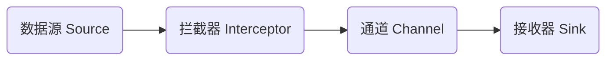

## 1.背景介绍

在大数据处理领域，数据流的采集、处理和存储是一个重要的环节。Apache Flume就是一个用于实现这个过程的强大工具。Flume的主要功能是收集、聚合和传输大量的日志数据。它的核心是一个可配置的数据流模型，定义了数据从源头到目的地的路径。而在这个数据流中，Flume拦截器则扮演着至关重要的角色，它允许我们在数据流动过程中对数据进行精细化的加工处理。

## 2.核心概念与联系

Flume拦截器（Interceptor）是Flume数据流中的一种元素，它插入在数据源（Source）和通道（Channel）之间，用于对事件（Event）进行处理。事件是Flume中的基本数据单元，包含了事件头（Header）和事件体（Body）。拦截器可以对这些事件进行增加、删除、修改等操作。

在Flume的架构中，数据源负责采集数据，生成事件；通道则负责缓存事件，以便后续的处理和传输。而拦截器则在这两者之间，对数据源采集的事件进行预处理，以满足特定的业务需求。



## 3.核心算法原理具体操作步骤

Flume拦截器的工作原理是基于事件驱动模型的。当数据源生成一个事件后，这个事件会被送入拦截器链。拦截器链是由一个或多个拦截器组成的，这些拦截器按照配置的顺序依次处理事件。每个拦截器都会对事件进行处理，并决定是否将事件传递给下一个拦截器。如果一个拦截器决定丢弃某个事件，那么这个事件就不会被传递给后续的拦截器和通道。

在Flume中，拦截器的实现需要继承`Interceptor`接口，并实现其`initialize`、`intercept`和`close`三个方法。其中，`initialize`方法用于初始化拦截器，`intercept`方法用于处理事件，`close`方法用于释放拦截器的资源。

## 4.数学模型和公式详细讲解举例说明

在Flume拦截器中，我们通常需要处理的问题是如何基于事件的属性进行决策。这可以通过决策树模型来实现。

决策树是一种常用的分类模型，它通过一系列的规则对数据进行分类。在Flume拦截器中，我们可以使用决策树模型来根据事件的属性决定如何处理事件。例如，我们可以定义一个规则，如果事件的某个属性满足某个条件，则丢弃这个事件。

决策树模型可以表示为一个函数$f$，它接受一个事件$e$作为输入，返回一个决策$d$。这个函数可以表示为：

$$
f(e) = d
$$

其中，$d$是一个二元变量，表示是否丢弃事件。如果$d=1$，则丢弃事件；如果$d=0$，则保留事件。

## 5.项目实践：代码实例和详细解释说明

下面是一个简单的Flume拦截器的实现示例。这个拦截器会丢弃所有包含"ERROR"关键字的事件。

```java
public class ErrorFilterInterceptor implements Interceptor {

    @Override
    public void initialize() {
        // 初始化方法，可以用来设置一些参数
    }

    @Override
    public Event intercept(Event event) {
        // 拦截方法，用来处理事件
        String body = new String(event.getBody());
        if (body.contains("ERROR")) {
            return null;  // 如果事件包含"ERROR"关键字，丢弃事件
        } else {
            return event;  // 否则，保留事件
        }
    }

    @Override
    public void close() {
        // 关闭方法，用来释放资源
    }
}
```

## 6.实际应用场景

Flume拦截器在许多实际应用场景中都非常有用。例如，在日志收集的场景中，我们可以使用拦截器来过滤掉不需要的日志信息，只保留我们关心的信息。在实时数据处理的场景中，我们可以使用拦截器来进行数据的预处理，例如数据清洗、数据转换等。

## 7.工具和资源推荐

Apache Flume是一个开源的大数据工具，可以在其官方网站上下载和获取更多的信息。除此之外，还有许多其他的工具和资源可以帮助我们更好地使用Flume和拦截器，例如：

- Flume User Guide：Flume的官方用户指南，详细介绍了Flume的使用方法和配置方式。
- Flume Developer Guide：Flume的开发者指南，详细介绍了如何开发Flume的插件，包括拦截器、数据源和接收器等。
- Flume Javadoc：Flume的Java API文档，可以帮助我们理解和使用Flume的Java API。

## 8.总结：未来发展趋势与挑战

随着大数据技术的发展，数据流的处理变得越来越重要。Flume和拦截器作为处理数据流的重要工具，其未来的发展趋势是向着更高效、更灵活、更强大的方向发展。

同时，我们也面临着一些挑战，例如如何处理更大规模的数据流，如何处理更复杂的数据处理逻辑，如何保证数据处理的准确性和可靠性等。这些都需要我们在未来的工作中不断探索和研究。

## 9.附录：常见问题与解答

Q: Flume拦截器可以修改事件的内容吗？

A: 可以。拦截器可以对事件进行任意的修改，包括修改事件的头部信息和体部信息。

Q: 如何配置多个Flume拦截器？

A: 可以在Flume的配置文件中，使用拦截器链的方式配置多个拦截器。这些拦截器会按照配置的顺序依次处理事件。

Q: Flume拦截器的处理速度会影响到整个Flume的性能吗？

A: 会。拦截器的处理速度直接影响到Flume的数据处理能力。如果拦截器的处理速度过慢，可能会成为Flume的性能瓶颈。

作者：禅与计算机程序设计艺术 / Zen and the Art of Computer Programming