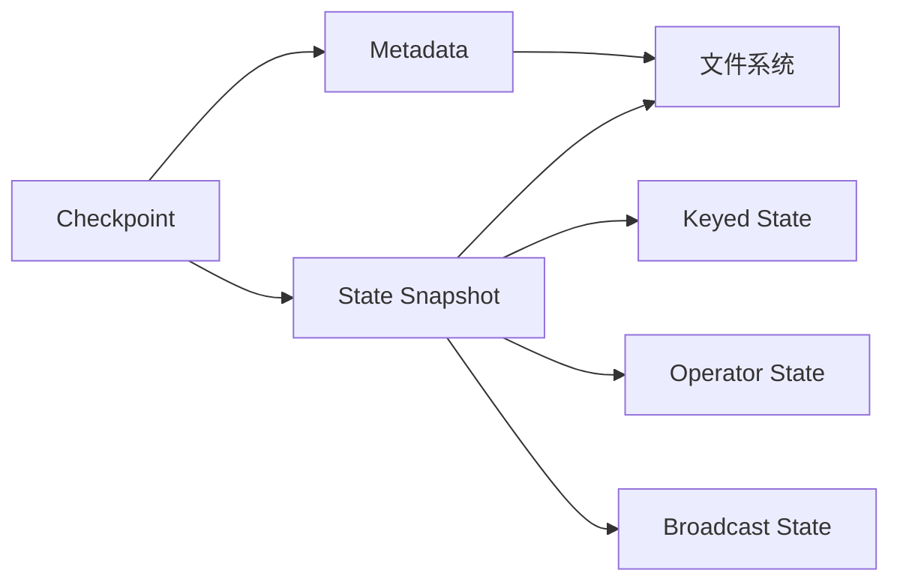

# FsStateBackend基于文件系统的状态存储原理与实践

## 1.背景介绍
### 1.1 状态管理的重要性
在流式计算系统中,状态管理是一个至关重要的组成部分。流式作业通常需要在数据流动态变化的过程中维护和更新状态信息,以支持各种计算逻辑。高效可靠的状态存储和访问能力,直接影响到流式作业的性能表现和计算结果的正确性。

### 1.2 Flink中的状态存储
Apache Flink作为一个高性能分布式流式计算引擎,提供了灵活的状态管理机制。Flink支持多种State Backend来存储状态数据,包括MemoryStateBackend、FsStateBackend和RocksDBStateBackend等。其中,FsStateBackend基于文件系统实现了高效的状态持久化存储。

### 1.3 FsStateBackend的应用场景
FsStateBackend适用于对状态访问实时性要求不高,但需要较大状态量的流式作业。利用可靠的文件系统作为存储介质,FsStateBackend能够支撑TB级别的状态数据,并保证在任务失败时进行状态恢复。典型的应用场景包括离线数据分析、增量数据处理等。

## 2.核心概念与关联
### 2.1 Checkpoint机制
- Checkpoint是Flink容错机制的核心,它能够持久化保存作业运行时状态,用于故障恢复
- 周期性地触发Checkpoint,将状态数据异步写入持久化存储
- Checkpoint包括Metadata和State Snapshot两部分

### 2.2 State类型
- Keyed State: 与特定key绑定,支持聚合类计算
- Operator State: Task级别状态,支持Source和Sink等算子
- Broadcast State: 广播变量,用于配置更新等场景

### 2.3 文件系统
- 支持HDFS、S3、GFS等多种文件系统
- 提供持久化、高可用的状态存储能力
- 利用文件系统的容错机制确保数据可靠性

### 2.4 核心概念关联


## 3.核心算法原理与操作步骤
### 3.1 状态数据序列化
- 状态数据通过序列化器转换为字节数组
- 常见的序列化器包括Avro、Kryo、Protobuf等
- 序列化后的状态数据写入内存Buffer中

### 3.2 状态数据持久化
- 内存Buffer累积到一定阈值后,触发状态数据持久化
- 将Buffer中的状态数据异步写入文件系统
- 每个状态数据切片对应一个文件,命名规则为`{checkpoint-id}-{state-name}-{subtask-index}`

### 3.3 Metadata管理
- 记录Checkpoint的元信息,包括ID、时间戳、状态数据文件路径等
- 将Metadata持久化到文件系统的Metadata文件中
- Metadata文件命名规则为`{checkpoint-id}_metadata`

### 3.4 状态数据恢复
- 从最近的Checkpoint恢复状态数据
- 读取Metadata文件,获取状态数据文件路径
- 并行读取状态数据文件,反序列化为状态对象

## 4.数学模型与公式详解
### 4.1 状态数据文件切片
为了优化I/O性能,FsStateBackend采用文件切片的方式存储状态数据。假设状态数据总大小为$S$,每个切片大小为$B$,则切片数量$N$计算公式为:

$$N = \left\lceil\frac{S}{B}\right\rceil$$

其中,$\left\lceil x \right\rceil$表示对$x$向上取整。

### 4.2 Checkpoint恢复时间估算
假设状态数据总大小为$S$,平均读取吞吐量为$v$,则Checkpoint恢复时间$T$估算公式为:

$$T = \frac{S}{v}$$

实际恢复时间还受到文件系统性能、网络带宽等因素影响。

### 4.3 内存Buffer大小设置
FsStateBackend使用内存Buffer缓存状态数据,Buffer大小$M$需要平衡内存占用和I/O频率。一般可设置为:

$$M = \alpha \times N$$

其中,$\alpha$为平均每个状态对象的大小,$N$为并发度(如SubTask数量)。

## 5.项目实践：代码实例与详解
下面通过一个简单的WordCount示例,演示如何使用FsStateBackend进行状态存储。

```java
// 配置FsStateBackend
env.setStateBackend(new FsStateBackend("hdfs://namenode:9000/flink/checkpoints"));

// 定义状态
ValueStateDescriptor<Long> countState = new ValueStateDescriptor<>("count", Long.class);

// 状态更新逻辑
dataStream.keyBy(word -> word)
    .flatMap(new RichFlatMapFunction<String, Tuple2<String, Long>>() {
        private transient ValueState<Long> state;

        @Override
        public void open(Configuration config) {
            state = getRuntimeContext().getState(countState);
        }

        @Override
        public void flatMap(String word, Collector<Tuple2<String, Long>> out) throws Exception {
            Long count = state.value();
            if (count == null) {
                count = 0L;
            }
            count++;
            state.update(count);
            out.collect(Tuple2.of(word, count));
        }
    });
```

以上代码中,首先通过`env.setStateBackend`配置使用FsStateBackend,指定Checkpoint在HDFS上的存储路径。

然后定义了一个`ValueState`类型的状态`countState`,用于存储每个单词的出现次数。

在状态更新逻辑中,通过`flatMap`算子对每个单词进行处理。`open`方法中初始化状态对象,`flatMap`方法中读取、更新和输出单词计数。

FsStateBackend会在Checkpoint时将状态数据持久化到配置的HDFS路径中,在任务恢复时重新加载状态数据。

## 6.实际应用场景
FsStateBackend适用于以下典型应用场景:

### 6.1 离线数据分析
- 海量历史数据的聚合分析
- 需要较大状态量,但对实时性要求不高
- 如:用户行为分析、日志分析等

### 6.2 增量数据处理
- 源数据不断增加,需要在旧状态基础上更新
- Checkpoint恢复可避免重复计算
- 如:数据仓库建设、增量爬虫等

### 6.3 高可用实时计算
- 流式作业需要24*7不间断运行
- Checkpoint+FsStateBackend保证高可用
- 如:实时大屏监控、实时风控等

## 7.工具与资源推荐
### 7.1 文件系统
- HDFS: Hadoop分布式文件系统,适合大规模数据存储
- Amazon S3: 基于云的对象存储服务,提供高可靠性
- Alluxio: 开源的分布式内存文件系统,提供高性能

### 7.2 Flink生态工具
- Flink Dashboard: 提供作业监控、管理等Web UI
- Flink Metrics: 支持自定义指标,监控作业运行状态
- Flink State Processor API: 允许查询和分析状态数据

### 7.3 学习资源
- Flink官方文档: https://ci.apache.org/projects/flink/flink-docs-stable/
- Ververica官方博客: https://www.ververica.com/blog
- 《Stream Processing with Apache Flink》: O'Reilly出版的Flink专著

## 8.总结:发展趋势与挑战
### 8.1 云原生支持
- 与Kubernetes深度集成,支持自动化部署、扩缩容等
- 针对云环境优化,提高资源利用率

### 8.2 Unify Batch & Streaming
- 统一批流框架,简化开发和维护
- 复用批处理生态,同时获得流处理能力

### 8.3 SQL化与Serverless
- 通过Flink SQL简化编程,降低使用门槛
- Serverless模式自动管理资源,按需付费

### 8.4 实时性能优化
- 改进Checkpoint机制,减少I/O开销
- 优化序列化与网络传输,提高吞吐量

### 8.5 AI赋能
- 整合机器学习框架,实现实时特征工程
- 支持在线学习、强化学习等场景

## 9.附录:常见问题与解答
### Q1:FsStateBackend适合什么规模的状态量?
A1:FsStateBackend能很好地支持GB到TB级别的状态量。但状态量过大时,Checkpoint和恢复的开销也会增加。

### Q2:FsStateBackend支持增量Checkpoint吗?
A2:FsStateBackend当前只支持全量Checkpoint。如果状态变化不大,可通过调大Checkpoint间隔来减少开销。

### Q3:FsStateBackend可以存储RocksDB状态后端的数据吗?
A3:可以。RocksDB状态后端可将数据Checkpoint到FsStateBackend配置的文件系统路径中。

### Q4:使用FsStateBackend需要对代码做改动吗?
A4:只需要在环境配置中指定使用FsStateBackend,并设置Checkpoint存储路径即可,不需要修改状态管理的代码逻辑。

### Q5:FsStateBackend是否有Exactly-Once语义?
A5:FsStateBackend与Checkpoint机制配合,可以保证端到端的Exactly-Once语义。即使任务失败,也能从Checkpoint恢复,保证数据一致性。

作者：禅与计算机程序设计艺术 / Zen and the Art of Computer Programming