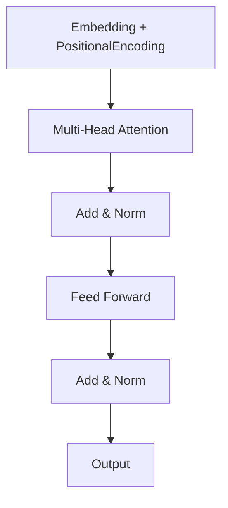
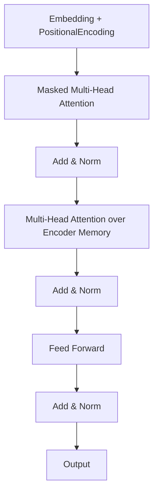

# GPT 原理与代码实例讲解

## 1. 背景介绍

### 1.1 人工智能的发展历程

人工智能(Artificial Intelligence, AI)是当代科技发展的热点领域之一。自20世纪50年代AI概念被正式提出以来,经历了几个重要的发展阶段。早期的AI系统主要基于符号主义和逻辑推理,如专家系统、规则引擎等。20世纪90年代,机器学习和神经网络算法开始兴起,使AI系统能够从数据中自动学习模式。

### 1.2 自然语言处理的重要性

随着互联网和移动设备的普及,自然语言处理(Natural Language Processing, NLP)成为AI领域的一个重点研究方向。NLP旨在使计算机能够理解和生成人类语言,实现人机自然交互。传统的NLP系统主要依赖规则和统计模型,效果有限。

### 1.3 GPT 模型的重大突破

2018年,OpenAI发布了生成式预训练转换器(Generative Pre-trained Transformer, GPT)模型,标志着NLP领域取得了重大突破。GPT基于transformer架构,通过无监督预训练捕获了大量语言知识,能够生成高质量、连贯的自然语言文本。GPT及其后续版本GPT-2、GPT-3等,展现了令人惊叹的语言生成能力,在多个NLP任务上取得了最先进的性能。

## 2. 核心概念与联系

### 2.1 自注意力机制(Self-Attention)

$$\mathrm{Attention}(Q, K, V) = \mathrm{softmax}(\frac{QK^T}{\sqrt{d_k}})V$$

自注意力机制是Transformer架构的核心,它允许模型捕获输入序列中任意两个位置之间的依赖关系。公式中,Q(Query)、K(Key)和V(Value)是通过线性变换得到的向量,用于计算注意力权重和加权求和。自注意力机制避免了RNN的递归计算,提高了并行能力。

### 2.2 多头注意力(Multi-Head Attention)

$$\mathrm{MultiHead}(Q, K, V) = \mathrm{Concat}(head_1, ..., head_h)W^O$$
$$\text{where } head_i = \mathrm{Attention}(QW_i^Q, KW_i^K, VW_i^V)$$

多头注意力通过独立学习多组Q、K、V的线性映射,从不同的表示子空间捕获不同的注意力模式,并将它们连接起来,提高了模型的表达能力。

### 2.3 位置编码(Positional Encoding)

由于Transformer没有递归和卷积结构,因此需要一种方式来注入序列的位置信息。位置编码是一种将位置信息编码为向量的方法,并将其加到输入的embedding中。常用的位置编码方法包括正弦编码和学习的位置嵌入向量。

### 2.4 Transformer 解码器(Decoder)

Transformer解码器用于生成目标序列。除了编码器中的子层外,它还包含一个"掩码"多头注意力子层,只允许每个位置关注之前的位置,以保持自回归属性。此外,还有一个编码器-解码器注意力子层,允许每个目标位置关注编码器的所有位置。

## 3. 核心算法原理具体操作步骤

### 3.1 GPT 预训练过程

GPT模型采用无监督的方式在大量文本语料上进行预训练,目标是最大化下一个词的条件概率。具体来说,给定一个长度为n的文本序列$X = (x_1, x_2, ..., x_n)$,GPT模型需要学习参数$\theta$,使得对于任意位置$i$,都有:

$$\max_\theta \prod_{i=1}^n P(x_i | x_1, ..., x_{i-1}; \theta)$$

这个目标函数实现了语言模型的本质,即基于上文预测下一个词。预训练使用了大规模语料,如书籍、网页等,使模型学习到丰富的语言知识。

### 3.2 微调(Fine-tuning)

预训练后的GPT模型可以通过在特定任务数据上进行"微调"(fine-tuning)来完成下游NLP任务。微调过程中,模型参数在新的任务数据上进行进一步训练和调整。由于已经在大规模语料上获得了良好的初始化,微调通常只需少量标注数据和较少的训练步骤,即可使模型快速收敛并取得良好性能。

### 3.3 生成(Generation)

在完成微调后,GPT模型可以用于生成任务。给定一个起始文本,模型会自回归地预测下一个词,并将其添加到输出序列中。通过不断迭代,就可以生成连贯、流畅的长文本。生成过程中,可以通过"顶部 k 随机采样"或"顶部 p 核采样"等技术来控制输出的多样性和创新性。

## 4. 数学模型和公式详细讲解举例说明

### 4.1 Transformer 编码器(Encoder)

Transformer编码器的核心是多头自注意力和前馈神经网络,如下所示:



1. 输入序列首先通过嵌入查找和位置编码,得到初始表示。
2. 该表示通过多头自注意力子层,捕获序列中任意两个位置之间的依赖关系。
3. 注意力输出与输入相加,并通过层归一化(Layer Normalization)。
4. 归一化后的向量通过前馈全连接子层,进行非线性变换。
5. 变换后的向量再次与输入相加并归一化,得到该编码器层的最终输出。
6. 输出可以作为下一层的输入,或作为解码器的Memory传递。

### 4.2 Transformer 解码器(Decoder)

Transformer解码器在编码器的基础上,增加了"掩码"自注意力和编码器-解码器注意力子层,用于生成目标序列。结构如下:



1. 输入序列同样通过嵌入和位置编码获得初始表示。
2. 该表示通过"掩码"多头自注意力子层,每个位置只能关注之前的位置。
3. 输出与输入相加并归一化。
4. 归一化后的向量通过编码器-解码器注意力子层,关注编码器Memory中的所有位置。
5. 注意力输出再次与输入相加并归一化。
6. 归一化后的向量通过前馈全连接子层进行非线性变换。
7. 变换后的向量再次与输入相加并归一化,得到该解码器层的最终输出。
8. 输出可作为下一层的输入,或作为生成目标序列的概率分布。

### 4.3 注意力计算示例

假设有一个长度为4的输入序列$X = (x_1, x_2, x_3, x_4)$,我们计算第三个位置的注意力权重。

1. 首先通过线性变换得到Query、Key和Value向量:

$$\begin{aligned}
Q_3 &= x_3W^Q \\
K &= (x_1W^K, x_2W^K, x_3W^K, x_4W^K) \\
V &= (x_1W^V, x_2W^V, x_3W^V, x_4W^V)
\end{aligned}$$

2. 计算Query与所有Key的点积得分:

$$\text{scores} = (Q_3K_1^T, Q_3K_2^T, Q_3K_3^T, Q_3K_4^T)$$

3. 通过softmax函数将得分归一化为注意力权重:

$$\begin{aligned}
\alpha_1 &= \text{softmax}(\text{scores})_1 \\
\alpha_2 &= \text{softmax}(\text{scores})_2 \\
\alpha_3 &= \text{softmax}(\text{scores})_3 \\
\alpha_4 &= \text{softmax}(\text{scores})_4
\end{aligned}$$

4. 使用注意力权重对Value向量加权求和,得到第三个位置的注意力输出:

$$\text{output}_3 = \alpha_1V_1 + \alpha_2V_2 + \alpha_3V_3 + \alpha_4V_4$$

通过这种方式,注意力机制可以自适应地为每个位置分配不同的权重,捕获序列中任意两个位置之间的依赖关系。

## 5. 项目实践:代码实例和详细解释说明

以下是一个使用PyTorch实现的简化版GPT模型示例,用于文本生成任务。

### 5.1 模型定义

```python
import torch
import torch.nn as nn

class GPTModel(nn.Module):
    def __init__(self, vocab_size, embedding_dim, num_heads, num_layers, max_len=512):
        super().__init__()
        self.token_embeddings = nn.Embedding(vocab_size, embedding_dim)
        self.position_embeddings = nn.Embedding(max_len, embedding_dim)
        
        encoder_layer = nn.TransformerEncoderLayer(d_model=embedding_dim, nhead=num_heads)
        self.transformer_encoder = nn.TransformerEncoder(encoder_layer, num_layers=num_layers)
        
        self.fc = nn.Linear(embedding_dim, vocab_size)

    def forward(self, input_ids):
        token_embeddings = self.token_embeddings(input_ids)
        position_embeddings = self.position_embeddings(torch.arange(input_ids.size(1), device=input_ids.device))
        embeddings = token_embeddings + position_embeddings
        
        encoder_output = self.transformer_encoder(embeddings)
        output = self.fc(encoder_output)
        
        return output
```

1. `__init__`方法初始化embedding层、位置编码层、Transformer编码器层和最终的全连接层。
2. `forward`方法首先获取token embedding和位置编码,并将它们相加作为输入。
3. 输入通过Transformer编码器层进行编码,得到编码器输出。
4. 编码器输出通过全连接层,输出每个位置的词汇概率分布。

### 5.2 训练

```python
import torch.optim as optim
from torch.utils.data import DataLoader

# 准备数据
train_data = ... # 训练数据集
train_loader = DataLoader(train_data, batch_size=32, shuffle=True)

# 初始化模型和优化器
model = GPTModel(vocab_size=10000, embedding_dim=256, num_heads=8, num_layers=6)
optimizer = optim.Adam(model.parameters(), lr=1e-4)
criterion = nn.CrossEntropyLoss()

# 训练循环
for epoch in range(num_epochs):
    for batch in train_loader:
        input_ids, labels = batch
        
        output = model(input_ids)
        loss = criterion(output.view(-1, vocab_size), labels.view(-1))
        
        optimizer.zero_grad()
        loss.backward()
        optimizer.step()
```

1. 准备训练数据集,并使用`DataLoader`加载批次数据。
2. 初始化GPT模型、优化器和损失函数。
3. 在训练循环中,将输入传入模型获取输出概率分布。
4. 计算输出与标签之间的交叉熵损失。
5. 反向传播梯度并更新模型参数。

### 5.3 生成文本

```python
import torch.nn.functional as F

# 输入起始文本
start_text = "The quick brown fox"
input_ids = tokenizer.encode(start_text)
input_ids = torch.tensor(input_ids).unsqueeze(0)

# 生成循环
for i in range(max_length):
    output = model(input_ids)
    last_token_logits = output[:, -1, :]
    
    # 使用顶部 k 随机采样或顶部 p 核采样生成下一个词
    next_token_id = top_k_top_p_sampling(last_token_logits)
    
    input_ids = torch.cat([input_ids, next_token_id.unsqueeze(0)], dim=-1)

generated_text = tokenizer.decode(input_ids.squeeze().tolist())
print(generated_text)
```

1. 输入起始文本,并使用tokenizer将其编码为输入id序列。
2. 在生成循环中,将当前输入传入模型获取输出概率分布。
3. 从最后一个位置的概率分布中,使用顶部k随机采样或顶部p核采样技术生成下一个词的id。
4. 将新生成的词id添加到输入序列中,作为下一步的输入。
5. 循环结束后,使用tokenizer将生成的id序列