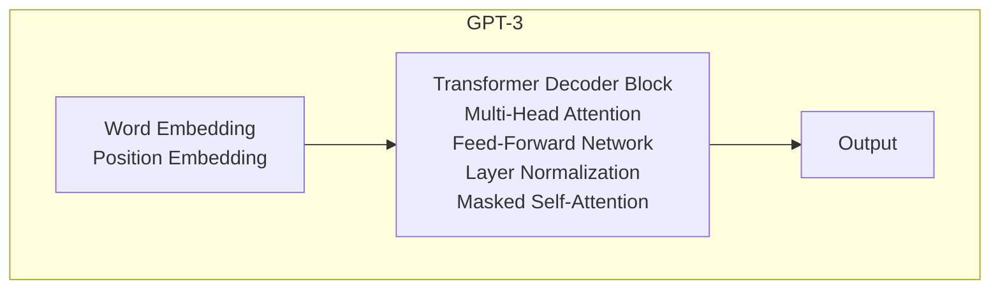

下面是以《GPT-3原理与代码实例讲解》为主题的技术博客文章正文内容：

# GPT-3原理与代码实例讲解

## 1.背景介绍

### 1.1 人工智能的发展历程

人工智能(Artificial Intelligence, AI)是当代科技发展的核心领域之一。自20世纪50年代AI概念被正式提出以来,经历了几个重要的发展阶段:

- 早期阶段(1950s-1960s):专家系统、博弈理论等奠基性研究
- 知识工程阶段(1970s-1980s):知识库、规则推理等
- 机器学习阶段(1990s-2010s):神经网络、支持向量机等
- 深度学习阶段(2010s-至今):卷积神经网络、循环神经网络、生成对抗网络等

### 1.2 自然语言处理(NLP)概述

自然语言处理(Natural Language Processing, NLP)是AI的一个重要分支,旨在使计算机能够理解和生成人类语言。NLP涉及语音识别、文本挖掘、机器翻译、问答系统等领域。

传统的NLP方法主要基于规则和统计模型,需要大量的人工标注语料和特征工程。而近年来,benefitting from大数据和算力的飞速发展,深度学习在NLP领域取得了突破性进展,尤其是Transformer模型的出现,极大推动了NLP的发展。

### 1.3 GPT-3概述

GPT-3(Generative Pre-trained Transformer 3)是一种全新的大型语言模型,由OpenAI于2020年发布。它基于Transformer架构,使用了自回归(autoregressive)语言模型,通过自监督学习方式在海量文本数据上进行预训练。

GPT-3的参数规模高达1750亿,是当时最大的语言模型。它展现出了强大的文本生成能力,可以输出看似人类水平的连贯文本,在很多NLP任务上取得了超越以往的成绩,引发了学术界和工业界的广泛关注。

## 2.核心概念与联系

### 2.1 Transformer架构

Transformer是一种全新的基于注意力机制(Attention Mechanism)的序列到序列(Seq2Seq)模型,由Google在2017年提出,主要用于机器翻译任务。它完全抛弃了RNN(循环神经网络)和CNN(卷积神经网络)结构,纯靠注意力机制来捕捉序列中的长程依赖关系。

Transformer的核心组件有编码器(Encoder)和解码器(Decoder)两部分:

- 编码器将输入序列映射到中间表示
- 解码器接收中间表示和输出序列,生成最终输出

编码器和解码器内部都采用了多头注意力机制和前馈神经网络,通过层与层的堆叠来提高表达能力。

Transformer架构的创新之处在于引入了自注意力机制,使模型不再局限于RNN的串行计算方式,而是通过并行计算来提高效率。自注意力机制可以同时关注整个输入序列的不同部分,捕捉远程依赖关系。

### 2.2 自回归语言模型

自回归(Autoregressive)语言模型是生成式模型的一种,主要用于文本生成任务。它根据前面的文本来预测下一个单词或token的概率分布,从而生成新的连贯文本。

具体来说,对于一个长度为T的token序列 $y = (y_1, y_2, ..., y_T)$,自回归模型需要学习联合概率分布:

$$P(y) = \prod_{t=1}^{T}P(y_t|y_1, y_2, ..., y_{t-1})$$

也就是说,每个token的生成概率都依赖于之前生成的所有token。

在训练阶段,模型会最大化训练语料库中所有序列的对数似然:

$$\max \sum_{y}{\log P(y)}$$

生成新文本时,模型会贪婪地采样最有可能的下一个token,并将其添加到已生成的序列中,重复该过程直至达到终止条件。

GPT-3正是一种基于Transformer解码器的大型自回归语言模型,通过自监督学习方式在广泛的文本语料上进行预训练。

### 2.3 自监督学习

自监督学习(Self-Supervised Learning)是一种无需人工标注的训练方式,模型通过从原始输入数据中自动生成监督信号来学习有用的表示。

对于NLP任务,常见的自监督学习方式包括:

- 掩码语言模型(Masked Language Modeling): 随机掩码部分输入token,模型需要预测被掩码的token。
- 下一句预测(Next Sentence Prediction): 判断两个句子是否为连续句子。
- 自编码(Autoencoding): 将输入序列重构为自身。
- 自回归语言模型: 以上文2.2所述方式预测序列的下一个token。

GPT-3采用了自回归语言模型的训练目标,在海量无标注文本数据上进行预训练,学习捕捉文本中的丰富语义和上下文信息。

### 2.4 GPT-3模型架构

GPT-3的模型架构继承了Transformer解码器的设计,主要组件包括:

- 词嵌入层(Word Embedding)
- 位置嵌入层(Position Embedding) 
- 多头注意力层(Multi-Head Attention)
- 前馈神经网络(Feed-Forward Network)
- 规范化层(Layer Normalization)
- 掩码自注意力(Masked Self-Attention)

其中掩码自注意力机制是关键,它确保了模型的预测只依赖于当前位置之前的token,从而实现了自回归特性。

GPT-3由62个Transformer解码器块组成,总参数量高达1750亿,是当时最大的语言模型。庞大的参数规模赋予了模型极强的表达能力,使其在广泛的NLP任务上表现出色。



## 3.核心算法原理具体操作步骤

GPT-3的核心算法原理是基于Transformer解码器结构的自回归语言模型,具体操作步骤如下:

### 3.1 输入表示

1) 将原始文本按词元(token)分词,得到一个token序列。
2) 将每个token映射到对应的词嵌入向量。
3) 为每个token添加位置嵌入,以编码其在序列中的位置信息。
4) 将词嵌入和位置嵌入相加,作为Transformer的输入表示。

### 3.2 Transformer解码器

输入表示经过一系列Transformer解码器块的处理:

1) 层规范化(Layer Normalization)
2) 掩码多头自注意力(Masked Multi-Head Self-Attention)
   - 对于序列中的每个token,计算其与前面所有token的注意力权重
   - 将注意力权重与对应token的值向量相加,得到注意力表示
3) 层规范化
4) 前馈神经网络(Feed-Forward Network)
   - 两层全连接网络,中间加入GELU非线性激活函数
5) 层规范化
6) 残差连接(Residual Connection)
   - 将步骤2和步骤4的输出分别加到输入上

上述过程在Transformer块内部重复N次(N=62对于GPT-3)。

### 3.3 输出和训练

1) 最终的Transformer输出通过一个线性投影层和Softmax,得到下一个token的概率分布。
2) 训练目标是最大化该概率分布中正确token的概率(自回归语言模型目标)。
3) 使用梯度下降等优化算法在大规模语料上进行模型训练。

### 3.4 生成新文本

1) 给定一个起始文本(或为空)。
2) 将其输入到GPT-3,得到下一个token的概率分布。
3) 从概率分布中采样一个token。
4) 将该token添加到已生成序列,重复步骤2-4直至达到终止条件。

通过上述自回归生成过程,GPT-3可以产生看似人类水平的连贯文本输出。

## 4.数学模型和公式详细讲解举例说明

### 4.1 注意力机制(Attention Mechanism)

注意力机制是Transformer的核心,它使用了一种查询-键值对(Query-Key-Value)的计算方式:

1) 计算查询向量Q与所有键向量K的点积得分:

$$\text{Score}(Q, K) = \frac{QK^T}{\sqrt{d_k}}$$

其中$d_k$是键向量的维度,缩放是为了防止过大的点积导致梯度饱和。

2) 对得分应用Softmax函数得到注意力权重:

$$\text{Attention}(Q, K, V) = \text{softmax}(\text{Score}(Q, K))V$$

3) 将注意力权重与值向量V加权求和,得到最终的注意力表示。

多头注意力机制是将注意力计算过程并行运行多次(多个头),然后将结果拼接起来,以提高表达能力。

### 4.2 掩码自注意力(Masked Self-Attention)

掩码自注意力是Transformer解码器中的关键,它确保了模型的预测只依赖于当前位置之前的token。

具体做法是在计算注意力得分时,将查询向量与未来位置的键向量的点积设置为负无穷,从而在Softmax后对应的权重为0。

例如对于一个长度为5的序列,计算第3个位置token的注意力表示时,注意力分数矩阵如下:

$$
\begin{bmatrix}
    \bullet & \bullet & \bullet & -\infty & -\infty \\
    \bullet & \bullet & \bullet & -\infty & -\infty\\
    \bullet & \bullet & \bullet & -\infty & -\infty\\
    \bullet & \bullet & \bullet & \bullet & -\infty\\
    \bullet & \bullet & \bullet & \bullet & \bullet
\end{bmatrixdiv}
$$

通过这种方式,GPT-3可以在自回归生成过程中保证每个token的预测只使用了历史信息。

### 4.3 交叉熵损失(Cross-Entropy Loss)

GPT-3的训练目标是最大化训练语料库中所有序列的对数似然,这可以通过最小化交叉熵损失函数来实现:

$$\mathcal{L} = -\sum_{i=1}^{N}\sum_{t=1}^{T_i} \log P(y_t^{(i)}|y_1^{(i)}, \ldots, y_{t-1}^{(i)}; \theta)$$

其中:
- $N$是训练样本数量
- $T_i$是第i个样本的token长度
- $y_t^{(i)}$是第i个样本的第t个token
- $\theta$是模型参数

对于每个token位置,我们需要最小化该位置的负对数似然损失。

在实际应用中,交叉熵损失可能会加入一些正则化项,如标签平滑(Label Smoothing)等,以提高模型的泛化性能。

## 5.项目实践:代码实例和详细解释说明

以下是一个使用Python和Hugging Face Transformers库的GPT-2小型实例,用于文本生成:

```python
from transformers import GPT2LMHeadModel, GPT2Tokenizer

# 加载预训练模型和分词器
model = GPT2LMHeadModel.from_pretrained('gpt2')
tokenizer = GPT2Tokenizer.from_pretrained('gpt2')

# 输入文本
input_text = "Once upon a time, there was"
input_ids = tokenizer.encode(input_text, return_tensors='pt')

# 生成文本
output = model.generate(input_ids, max_length=100, do_sample=True, top_k=50, top_p=0.95, num_return_sequences=1)
generated_text = tokenizer.decode(output[0], skip_special_tokens=True)

print(generated_text)
```

上述代码的关键步骤解释如下:

1. 加载预训练的GPT-2模型和分词器。GPT-2是GPT-3的一个小型版本,原理类似。
2. 将输入文本编码为token id序列。
3. 调用`model.generate()`方法进行文本生成:
   - `input_ids`是输入token id序列的张量
   - `max_length`限制生成序列的最大长度
   - `do_sample=True`表示按概率分布采样token,而不是贪心解码
   - `top_k`和`top_p`是两种流行的采样策略,用于控制输出质量
   - `num_return_sequences`指定要生成的序列数量
4. 