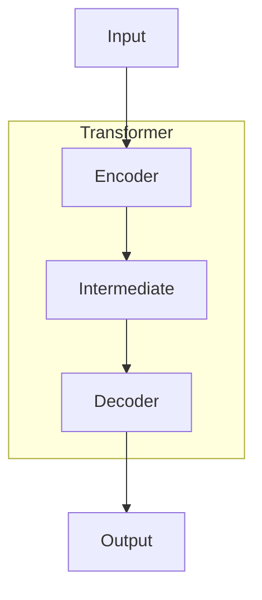
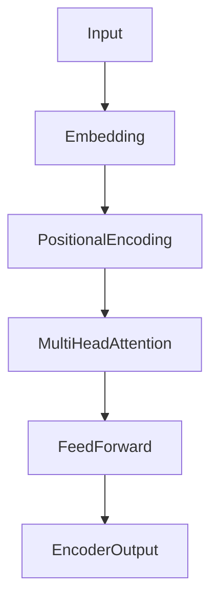
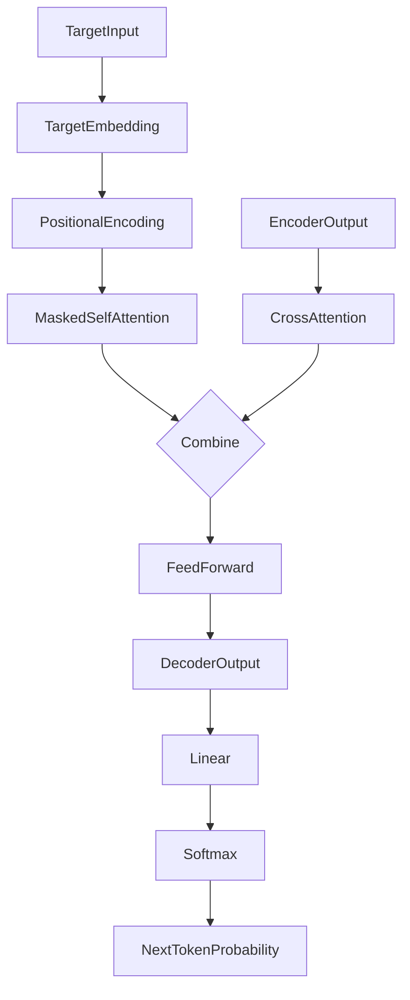

# GPT-4原理与代码实例讲解

## 1.背景介绍

### 1.1 人工智能的发展历程

人工智能(Artificial Intelligence, AI)是当代科技领域最具革命性和影响力的技术之一。自20世纪50年代AI概念被正式提出以来,经历了几个重要的发展阶段。早期的AI系统主要基于规则和逻辑推理,但存在局限性。随后,机器学习和深度学习的兴起,使AI系统能够从大量数据中自主学习,极大拓展了AI的能力边界。

### 1.2 自然语言处理(NLP)的重要性

在AI的众多应用领域中,自然语言处理(Natural Language Processing, NLP)技术尤为关键。NLP旨在使计算机能够理解和生成人类语言,是实现人机自然交互的基础。传统的NLP系统主要依赖规则和统计模型,但存在一定缺陷。近年来,benefiting from 大数据和深度学习技术的迅猛发展,NLP领域取得了突破性进展。

### 1.3 GPT系列模型的里程碑意义

2018年,OpenAI发布了GPT(Generative Pre-trained Transformer)模型,这是基于Transformer架构训练的第一个大型生成式语言模型。GPT通过自监督学习方式在大规模语料库上进行预训练,展现出强大的自然语言生成能力,在NLP领域引起了广泛关注。

随后,GPT-2(2019年)和GPT-3(2020年)等后续版本不断推进了模型的规模和性能,成为NLP界的里程碑式进展。2023年,OpenAI发布了GPT-4,这是迄今最先进的大型语言模型,在多个任务上展现出接近人类的能力,引发了学术界和产业界的热烈讨论。

## 2.核心概念与联系

### 2.1 Transformer架构

Transformer是GPT等大型语言模型的核心架构,由Google在2017年提出,用于机器翻译任务。它完全基于注意力(Attention)机制,摒弃了传统序列模型的循环神经网络结构,大幅提升了并行计算能力。

Transformer架构主要由编码器(Encoder)和解码器(Decoder)两部分组成。编码器将输入序列映射为中间表示,解码器则基于中间表示生成输出序列。注意力机制使模型能够自适应地捕捉序列中任意位置的依赖关系。



### 2.2 自监督学习

GPT等大型语言模型采用了自监督学习(Self-Supervised Learning)的范式。与监督学习需要大量人工标注数据不同,自监督学习可以利用原始文本语料进行训练。

常用的自监督学习任务包括"遮蔽语言模型"(Masked Language Modeling)和"下一句预测"(Next Sentence Prediction)等。模型通过预测被遮蔽的词元或下一个句子,学习捕捉语言的语义和上下文信息。

### 2.3 大模型优势

GPT-4等大型语言模型通过在海量语料上训练,获得了极为丰富的知识和上下文理解能力。模型规模的增长使其能够更好地捕捉复杂的语义和逻辑关系,从而在各种NLP任务上取得优异表现。

然而,大模型也存在一些挑战,如训练成本高昂、推理效率低下、可解释性较差等。研究人员正在探索模型压缩、知识蒸馏等技术来应对这些挑战。

## 3.核心算法原理具体操作步骤

### 3.1 Transformer编码器

Transformer编码器的核心是多头注意力(Multi-Head Attention)机制和位置编码(Positional Encoding)。具体步骤如下:

1. 将输入序列分割为多个词元(Token),并使用嵌入(Embedding)层将词元映射为向量表示。
2. 对嵌入向量添加位置编码,使模型能够捕捉序列的位置信息。
3. 将编码后的序列输入多头注意力层,计算每个词元与其他词元的注意力权重。
4. 将注意力权重与词元表示相结合,得到注意力加权和。
5. 将注意力加权和输入前馈网络(Feed-Forward Network),进行非线性变换。
6. 对上述过程进行多层堆叠,形成编码器的最终输出。



### 3.2 Transformer解码器

解码器的结构与编码器类似,但增加了对编码器输出的注意力计算,以及遮挡注意力(Masked Attention)机制。具体步骤如下:

1. 将目标序列输入嵌入层和位置编码层,得到初始表示。
2. 计算目标序列内部的遮挡注意力,避免每个位置获取后续位置的信息。
3. 计算目标序列与编码器输出的交叉注意力。
4. 将遮挡注意力和交叉注意力相结合,输入前馈网络。
5. 对上述过程进行多层堆叠,形成解码器的最终输出。
6. 将解码器输出通过线性层和softmax,得到下一个词元的概率分布。



### 3.3 训练过程

GPT-4等大型语言模型通常采用自监督学习的方式进行训练。以"遮蔽语言模型"任务为例,具体步骤如下:

1. 从语料库中随机采样一个序列作为输入。
2. 随机遮蔽输入序列中的15%的词元。
3. 将输入序列输入Transformer模型,模型需要预测被遮蔽的词元。
4. 计算模型预测和实际词元之间的交叉熵损失。
5. 使用优化算法(如AdamW)反向传播并更新模型参数。
6. 重复上述过程,直到模型在验证集上的指标不再提升为止。

通过大规模的预训练,模型可以学习到丰富的语言知识和上下文理解能力,为下游的各种NLP任务做好准备。

## 4.数学模型和公式详细讲解举例说明

### 4.1 注意力机制(Attention Mechanism)

注意力机制是Transformer架构的核心,它使模型能够自适应地捕捉输入序列中任意位置的依赖关系。对于给定的查询(Query)向量$\vec{q}$和一系列键(Key)-值(Value)对$\{(\vec{k_i}, \vec{v_i})\}_{i=1}^n$,注意力计算公式如下:

$$\mathrm{Attention}(\vec{q}, \vec{K}, \vec{V}) = \mathrm{softmax}\left(\frac{\vec{q}\vec{K}^T}{\sqrt{d_k}}\right)\vec{V}$$

其中,$\vec{K}$和$\vec{V}$分别表示键和值的矩阵表示,$d_k$是缩放因子,用于防止点积过大导致softmax函数的梯度较小。

注意力权重$\alpha_i$反映了查询向量$\vec{q}$与每个键向量$\vec{k_i}$的相关性,定义为:

$$\alpha_i = \frac{\exp(\vec{q}\vec{k_i}^T/\sqrt{d_k})}{\sum_{j=1}^n\exp(\vec{q}\vec{k_j}^T/\sqrt{d_k})}$$

最终的注意力加权和为:

$$\mathrm{Attention}(\vec{q}, \vec{K}, \vec{V}) = \sum_{i=1}^n\alpha_i\vec{v_i}$$

通过注意力机制,模型可以动态地聚焦于输入序列中与当前任务最相关的部分,大大提高了表示能力。

### 4.2 多头注意力(Multi-Head Attention)

为进一步捕捉不同子空间的依赖关系,Transformer采用了多头注意力机制。具体来说,将查询/键/值向量先通过线性变换分别映射为$h$个子空间,然后在每个子空间内计算注意力,最后将所有子空间的注意力结果拼接起来:

$$\begin{aligned}
\mathrm{MultiHead}(\vec{Q}, \vec{K}, \vec{V}) &= \mathrm{Concat}(\mathrm{head}_1, \ldots, \mathrm{head}_h)\vec{W}^O\\
\mathrm{where\ head}_i &= \mathrm{Attention}(\vec{Q}\vec{W}_i^Q, \vec{K}\vec{W}_i^K, \vec{V}\vec{W}_i^V)
\end{aligned}$$

其中,$\vec{W}_i^Q\in\mathbb{R}^{d_\mathrm{model}\times d_k}$,$\vec{W}_i^K\in\mathbb{R}^{d_\mathrm{model}\times d_k}$,$\vec{W}_i^V\in\mathbb{R}^{d_\mathrm{model}\times d_v}$,$\vec{W}^O\in\mathbb{R}^{hd_v\times d_\mathrm{model}}$是可训练的线性变换矩阵。

多头注意力机制赋予了模型更强的表示能力,能够同时关注输入序列的不同位置和子空间信息。

### 4.3 位置编码(Positional Encoding)

由于Transformer完全摒弃了循环神经网络和卷积神经网络,为了使模型能够捕捉序列的位置信息,需要引入位置编码。位置编码是一个将位置编码为向量的函数,常用的是正弦/余弦函数编码:

$$\begin{aligned}
\mathrm{PE}_{(pos, 2i)} &= \sin\left(pos/10000^{2i/d_\mathrm{model}}\right)\\
\mathrm{PE}_{(pos, 2i+1)} &= \cos\left(pos/10000^{2i/d_\mathrm{model}}\right)
\end{aligned}$$

其中,$pos$是词元的位置索引,而$i$是维度索引。位置编码向量将直接加到输入嵌入上,从而为模型提供位置信息。

### 4.4 层归一化(Layer Normalization)

为了加速模型收敛并提高性能,Transformer采用了层归一化(Layer Normalization)技术,其公式定义为:

$$\mathrm{LayerNorm}(\vec{x}) = \gamma\odot\frac{\vec{x}-\mu}{\sigma}+\beta$$

其中,$\mu$和$\sigma$分别是$\vec{x}$在最后一个维度上的均值和标准差,$\gamma$和$\beta$是可训练的缩放和偏移参数。层归一化有助于减轻内部协变量偏移的问题,使得模型训练更加稳定。

通过上述数学模型和公式,Transformer架构赋予了GPT-4强大的语言理解和生成能力,使其在各种NLP任务上表现出色。

## 5.项目实践:代码实例和详细解释说明

为了更好地理解GPT-4的原理,我们将通过一个简化版本的Transformer模型实现来演示其核心机制。本示例使用PyTorch框架,并基于"名著文本生成"任务进行训练和测试。

### 5.1 数据预处理

首先,我们需要对原始文本数据进行预处理,将其转换为模型可识别的格式。这里以《红楼梦》为例:

```python
import re
import torch

# 读取原始文本
with open('hongloumeng.txt', 'r', encoding='utf-8') as f:
    text = f.read()

# 去除非文本字符
text = re.sub(r'[\*\*\*\*\*]', '', text)

# 构建词表
vocab = list(set(text))
vocab_size = len(vocab)

# 词元编码
token_to_id = {token: i for i, token in enumerate(vocab)}
id_to_token = {i: token for i, token in enumerate(vocab)}

# 文本切分为序列
seq_length = 64
sequences = [torch.tensor([token_to_id[token] for token in text[i:i+seq_length]]) 
             for i in range(0, len(text)-seq_length, seq_length)]
```

上述代码将原始文本分割为长度为64的序列,并构建了词表(vocabulary)用于词元编码。接下来,我们将定义Transformer模