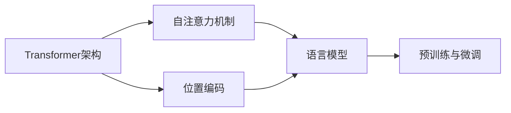

# GPT原理与代码实例讲解

## 1.背景介绍

近年来,自然语言处理(NLP)领域取得了长足的进步,其中Transformer模型的出现是一个里程碑式的突破。GPT(Generative Pre-trained Transformer)作为Transformer家族中的杰出代表,以其强大的语言理解和生成能力,在学术界和工业界引起了广泛关注。

GPT模型由OpenAI于2018年提出,经过多次迭代升级,目前已发展到GPT-4版本。GPT采用了无监督预训练+有监督微调的范式,通过在海量无标注语料上进行自回归语言建模的预训练,学习到丰富的语言知识和通用语义表示,再结合下游任务的标注数据进行微调,可以轻松适配到各种NLP任务,展现出强大的迁移学习能力和少样本学习能力。

### 1.1 GPT模型的发展历程

- 2018年6月:GPT-1发布,首次将Transformer用于语言模型预训练,在多个NLP任务上取得SOTA成绩。
- 2019年2月:GPT-2发布,模型参数量扩大到15亿,展现出惊人的语言生成能力,引发广泛讨论。  
- 2020年5月:GPT-3发布,模型参数量飙升到1750亿,few-shot学习能力令人瞩目。
- 2022年3月:GPT-4发布,进一步扩大模型规模,引入多模态能力,迈向通用人工智能。

### 1.2 GPT的应用场景

凭借其卓越的语言理解和生成能力,GPT模型在众多领域大放异彩:

- 对话系统:GPT可用于构建智能对话系统,提供个性化、连贯的对话体验。
- 文本生成:小说、新闻、诗歌创作,机器写作等生成任务。
- 语言翻译:GPT在机器翻译领域表现出色,实现高质量的翻译效果。  
- 文本摘要:利用GPT自动生成文章摘要,提取关键信息。
- 问答系统:GPT可用于构建知识问答系统,准确回答用户提问。
- 代码生成:GPT在代码自动生成和补全方面展现出惊人的能力。

GPT模型正在深刻影响和重塑人工智能技术格局,为人机交互和认知智能开辟了新的道路。接下来,本文将深入剖析GPT的原理,并通过代码实例演示其实现过程,帮助读者全面把握这一划时代的技术革新。

## 2.核心概念与联系

在探讨GPT原理之前,我们有必要先了解其背后的一些核心概念。

### 2.1 Transformer 架构

GPT模型的核心架构是Transformer,这是一种基于自注意力机制的序列建模框架。与传统的RNN/CNN不同,Transformer抛弃了循环和卷积结构,完全依赖于注意力机制来建模序列间的依赖关系。

Transformer由编码器(Encoder)和解码器(Decoder)两部分组成:

- 编码器负责对输入序列进行特征提取和语义编码。
- 解码器根据编码器的输出,自回归地生成目标序列。

编码器和解码器内部均由若干个相同的层(Layer)堆叠而成,每一层包含两个子层:

- 多头自注意力(Multi-Head Self-Attention)子层
- 前馈神经网络(Feed-Forward Network)子层

其中,自注意力机制用于捕捉序列内和序列间的长距离依赖,前馈网络用于对特征进行非线性变换。

### 2.2 自注意力机制

自注意力机制是Transformer的核心,用于计算序列中元素之间的相关性。对于输入序列的每个位置,自注意力通过如下三个步骤计算其语义表示:

1. 根据位置的嵌入向量计算Query/Key/Value向量
2. 计算当前位置对所有位置的注意力分数(Attention Scores) 
3. 将Value向量按注意力分数加权求和,得到当前位置的语义表示

其中,Query/Key用于计算不同位置间的相关性,Value用于聚合语义信息。自注意力的计算公式为:

$$
Attention(Q,K,V) = softmax(\frac{QK^T}{\sqrt{d_k}})V
$$

其中,$Q$,$K$,$V$分别为Query,Key,Value矩阵,$d_k$为Key向量的维度。

多头注意力通过引入多组独立的Query/Key/Value矩阵,在不同语义子空间计算注意力,增强了模型的表达能力。

### 2.3 位置编码

由于Transformer不包含任何循环和卷积结构,为了引入序列的位置信息,我们需要对输入序列进行位置编码(Positional Encoding)。

最常见的位置编码是正余弦位置编码,对于位置$pos$和维度$i$,位置编码公式为:

$$
PE_{(pos,2i)} = sin(pos/10000^{2i/d_{model}}) \\
PE_{(pos,2i+1)} = cos(pos/10000^{2i/d_{model}})
$$

其中,$d_{model}$为嵌入向量的维度。将位置编码与词嵌入相加,即可为每个位置引入唯一的位置信息。

### 2.4 语言模型

GPT模型本质上是一个语言模型,即以无监督的方式学习文本序列的概率分布。给定一个文本序列$x=(x_1,x_2,...,x_T)$,语言模型的目标是估计序列的概率:

$$
p(x) = \prod_{t=1}^T p(x_t|x_{<t})
$$

其中,$x_t$为序列的第$t$个token,$x_{<t}$为$x_t$之前的所有token。

传统的n-gram语言模型受限于有限的上下文窗口,难以捕捉长距离依赖。而基于神经网络的语言模型,如RNN和Transformer,则可以建模任意长度的上下文信息,大大提升了语言模型的性能。

### 2.5 预训练与微调

GPT采用了预训练+微调的范式,分两个阶段进行模型训练:

- 预训练阶段:在大规模无标注语料上以自回归的方式训练语言模型,学习通用的语言表示。
- 微调阶段:在下游任务的标注数据上微调预训练模型,使其适应特定任务。

预训练使模型掌握了丰富的语言知识,微调使模型学会了将通用语言知识迁移到具体任务。这种范式有效缓解了标注数据稀缺的问题,大大提升了模型的性能。

以上就是GPT模型涉及的核心概念,它们环环相扣,共同构建起GPT的技术框架:

接下来,我们将详细剖析GPT的训练和推理算法,并通过代码实例演示其实现过程。

## 3.核心算法原理和操作步骤

GPT模型的训练和推理过程可以分为以下几个关键步骤:

### 3.1 数据准备

首先需要准备大规模的无标注文本语料,并对其进行预处理:

1. 对原始文本进行清洗,去除噪声和无意义字符。
2. 对文本进行分词,将其转换为token序列。常用的分词方法有:
   - 基于规则的分词,如BPE(Byte Pair Encoding)
   - 基于统计的分词,如WordPiece,SentencePiece
3. 构建词表,将token映射为整数索引。
4. 将token序列截断或填充到固定长度。

经过预处理,原始文本被转换为规整的token ID序列,可以输入GPT模型进行训练。

### 3.2 模型构建

根据Transformer架构构建GPT模型,主要包括以下组件:

1. 词嵌入层(Embedding Layer):将token ID映射为稠密向量。
2. 位置编码层(Positional Encoding Layer):为每个位置生成位置向量,与词嵌入相加。
3. 多头注意力层(Multi-Head Attention Layer):计算序列内和序列间的注意力。
4. 前馈网络层(Feed-Forward Layer):对特征进行非线性变换。
5. Layer Normalization层:对特征进行归一化,稳定训练。
6. 残差连接(Residual Connection):将输入特征与变换后的特征相加,防止梯度消失。

以上组件按照Transformer架构进行堆叠,形成完整的GPT模型。

### 3.3 预训练

利用准备好的无标注语料对GPT模型进行预训练,具体步骤如下:

1. 将语料组织成形如 `[CLS] 文本1 [SEP] 文本2 [SEP]` 的序列。
2. 将序列输入GPT模型,计算自回归的条件概率:
$$p(x_t|x_{<t}) = softmax(W_e h_t + b_e)$$
其中,$h_t$为第$t$个位置的隐藏状态,$W_e$和$b_e$为输出层的参数。
3. 计算语言模型的交叉熵损失:
$$\mathcal{L}_{LM} = -\sum_{t=1}^T log p(x_t|x_{<t})$$
4. 利用梯度下降法优化模型参数,最小化损失函数。

预训练的目标是学习通用的语言表示,为下游任务做好准备。常见的预训练目标函数还包括:

- Next Sentence Prediction(NSP):预测两个文本段是否为连续的句子。
- Masked Language Model(MLM):随机Mask掉一些token,预测被Mask位置的原始token。

### 3.4 微调

在下游任务的标注数据上微调预训练的GPT模型,使其适应特定任务:

1. 根据任务类型,在GPT模型顶层添加任务特定的输出层,如分类层、生成层等。
2. 利用下游任务的标注数据,计算任务目标的损失函数,如交叉熵损失等。
3. 联合优化语言模型损失和任务目标损失:
$$\mathcal{L} = \mathcal{L}_{LM} + \lambda \mathcal{L}_{Task}$$
其中,$\lambda$为平衡两个损失的超参数。
4. 利用梯度下降法优化模型参数,最小化联合损失函数。

微调使GPT模型学会了将通用语言知识迁移到具体任务,在任务数据较少的情况下也能取得不错的效果。

### 3.5 推理

利用训练好的GPT模型进行推理,生成目标序列:

1. 根据任务类型,构造初始输入序列,如 `[CLS] Prompt [SEP]`。
2. 将初始序列输入GPT模型,计算最后一个token的条件概率分布。
3. 根据概率分布采样或选择概率最大的token,将其添加到生成序列中。
4. 重复步骤2-3,直到生成完整的目标序列。
5. 对生成的序列进行后处理,如去除停用词、调整标点等,得到最终结果。

推理过程充分利用了GPT模型的自回归特性和强大的语言生成能力,可用于文本续写、对话生成、机器翻译等任务。

以上就是GPT模型训练和推理的核心算法,下面我们将通过代码实例对其进行演示。

## 4.数学模型和公式详解

GPT模型涉及了多个关键的数学模型和公式,下面我们对其逐一进行详细讲解。

### 4.1 Transformer的数学表示

Transformer的核心是自注意力机制和前馈网络,其数学表示如下:

#### 4.1.1 自注意力机制

对于输入序列$X=(x_1,x_2,...,x_n)$,自注意力的计算过程为:

1. 计算Query/Key/Value矩阵:

$$
Q = XW^Q, K = XW^K, V = XW^V
$$

其中,$W^Q, W^K, W^V \in \mathbb{R}^{d_{model} \times d_k}$为可学习的参数矩阵。

2. 计算注意力分数:

$$
A = softmax(\frac{QK^T}{\sqrt{d_k}})
$$

其中,$A \in \mathbb{R}^{n \times n}$为注意力分数矩阵。

3. 计算注意力输出:

$$
Attention(Q,K,V) = AV
$$

多头注意力通过引入$h$组独立的注意力头,将不同头的输出