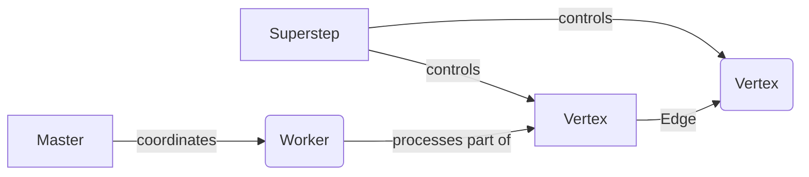

## 1.背景介绍

在处理大规模图数据时，我们需要一个强大的工具来帮助我们。Apache Giraph就是这样一个工具，它是一个迭代图处理系统，用于处理大规模图数据。Giraph的核心是基于Google的Pregel模型，并在此基础上做了许多优化和扩展。

## 2.核心概念与联系

在理解Giraph之前，我们需要理解几个核心概念：

- **Vertex（顶点）**：每个顶点都有一个唯一的ID和一个值，以及与之关联的边。顶点可以发送消息到其邻居顶点，并在每个迭代中处理接收到的消息。

- **Edge（边）**：边连接两个顶点，并有一个值。在Giraph中，边是有向的，从源顶点到目标顶点。

- **Superstep（超级步）**：Giraph的计算模型是基于迭代的，每个迭代称为一个超级步。在每个超级步中，所有的顶点并行处理接收到的消息并可能发送新的消息到下一个超级步。

- **Master和Worker**：Giraph的计算是分布式的，由一组worker节点完成。每个worker节点负责图的一部分。Master节点协调worker节点，并在每个超级步开始和结束时执行全局操作。



## 3.核心算法原理具体操作步骤

Giraph的计算过程分为以下步骤：

1. **读取输入**：Giraph从输入格式中读取图数据，每个worker节点读取一部分数据。

2. **初始化**：在第一个超级步中，每个顶点执行初始化函数。

3. **迭代计算**：在每个超级步中，每个顶点并行处理接收到的消息，并可能发送新的消息到下一个超级步。

4. **终止检查**：在每个超级步结束时，如果所有顶点都停止并且没有新的消息，计算终止。

5. **输出结果**：每个worker节点将其顶点的最终值写入输出格式。

## 4.数学模型和公式详细讲解举例说明

Giraph的计算模型可以用以下数学模型表示：

设 $G=(V,E)$ 为一个图，其中 $V$ 是顶点集， $E$ 是边集。设 $f$ 是在顶点上定义的函数， $f: V \times M \to V \times M$ ，其中 $M$ 是消息集。在每个超级步 $s$ ，每个顶点 $v$ 接收到消息集 $m$ ，然后计算 $f(v, m)$ ，得到新的顶点值和要发送的消息。

Giraph的迭代计算过程可以用以下公式表示：

$$
V_{s+1}, M_{s+1} = f(V_s, M_s)
$$

其中 $V_s$ 和 $M_s$ 分别是在超级步 $s$ 的顶点值和消息。

## 5.项目实践：代码实例和详细解释说明

下面是一个使用Giraph实现PageRank算法的例子：

```java
public class SimplePageRankComputation
    extends BasicComputation<LongWritable, DoubleWritable, FloatWritable, DoubleWritable> {
  @Override
  public void compute(
      Vertex<LongWritable, DoubleWritable, FloatWritable> vertex,
      Iterable<DoubleWritable> messages) {
    if (getSuperstep() >= 1) {
      double sum = 0;
      for (DoubleWritable message : messages) {
        sum += message.get();
      }
      DoubleWritable vertexValue = new DoubleWritable((0.15f / getTotalNumVertices()) + 0.85f * sum);
      vertex.setValue(vertexValue);
    }

    if (getSuperstep() < 30) {
      long edges = vertex.getNumEdges();
      sendMessageToAllEdges(vertex,
          new DoubleWritable(vertex.getValue().get() / edges));
    } else {
      vertex.voteToHalt();
    }
  }
}
```

这段代码定义了一个Giraph计算类，继承了`BasicComputation`类。在`compute`方法中，首先在超级步1以上时处理接收到的消息，然后在超级步30以下时发送消息到所有的边，最后在超级步30时停止计算。

## 6.实际应用场景

Giraph在许多大规模图处理场景中都有应用，例如社交网络分析、网络结构分析、推荐系统等。Facebook就使用Giraph进行社交图的分析和挖掘。

## 7.工具和资源推荐

- **Apache Giraph**：Giraph的官方网站提供了详细的文档和教程。

- **Giraph in Action**：这是一本关于Giraph的书，详细介绍了Giraph的使用和内部实现。

## 8.总结：未来发展趋势与挑战

随着图数据的规模不断增大，Giraph面临着如何进一步提高计算效率和扩展性的挑战。此外，Giraph还需要支持更多的图处理算法和模型。

## 9.附录：常见问题与解答

**问题1：Giraph和Hadoop有什么区别？**

答：Giraph和Hadoop都是分布式计算框架，但Hadoop是基于MapReduce模型，适合处理批量数据，而Giraph是基于Pregel模型，适合处理图数据。

**问题2：如何在Giraph中实现自定义的图处理算法？**

答：在Giraph中，可以通过继承`BasicComputation`类并实现`compute`方法来定义自己的图处理算法。

作者：禅与计算机程序设计艺术 / Zen and the Art of Computer Programming