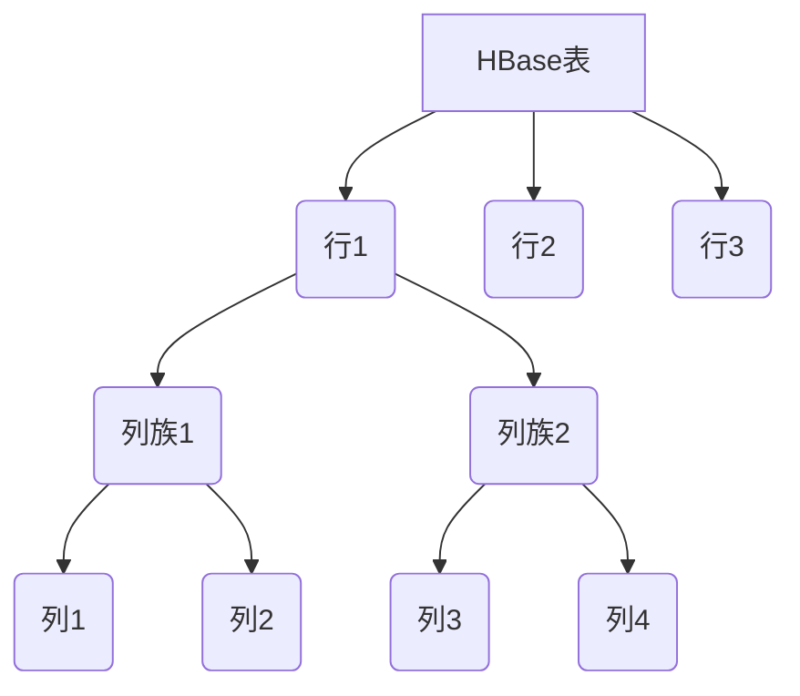
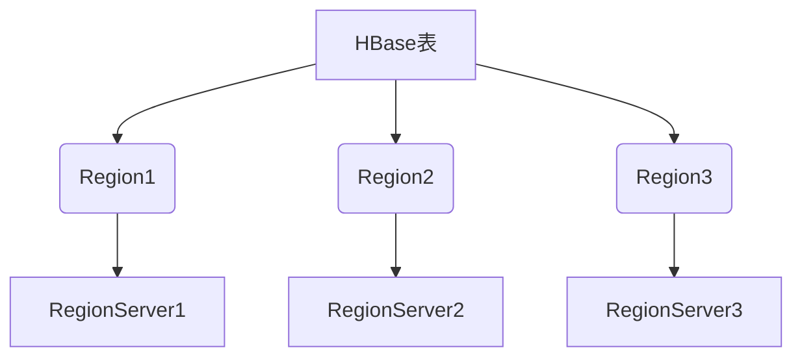
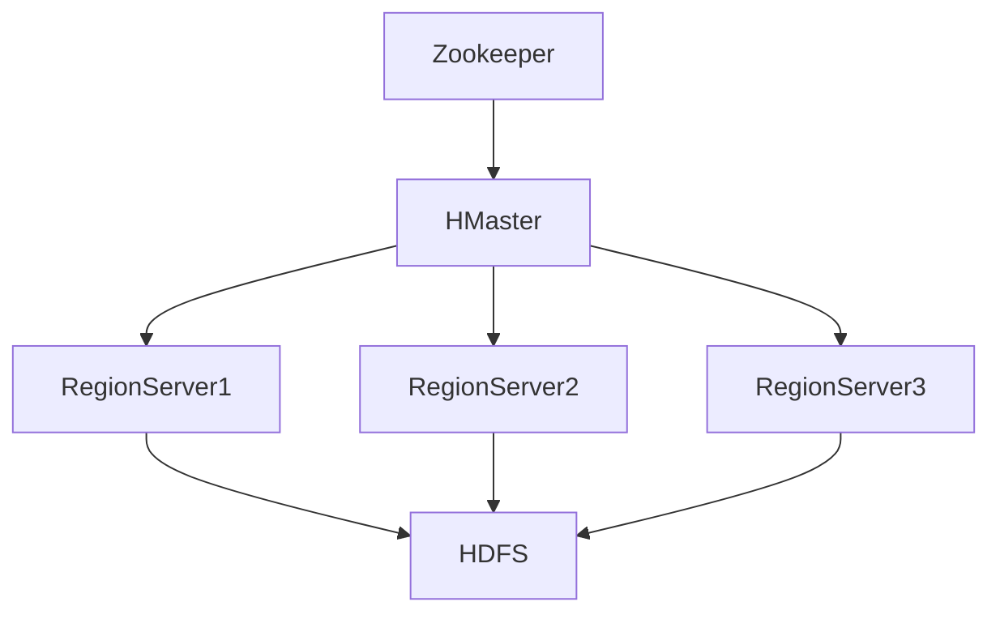
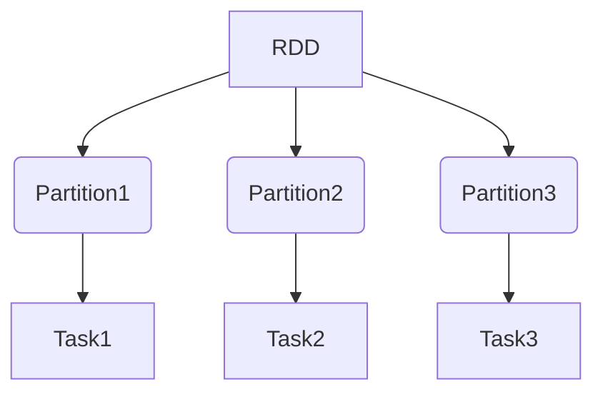
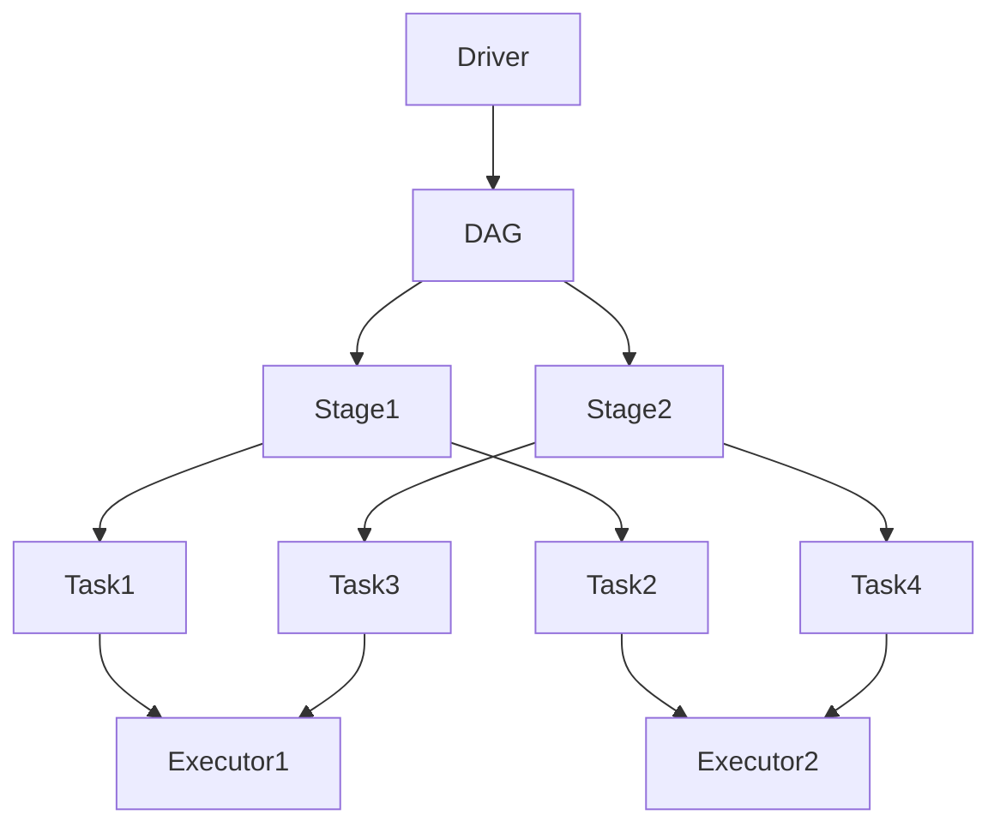
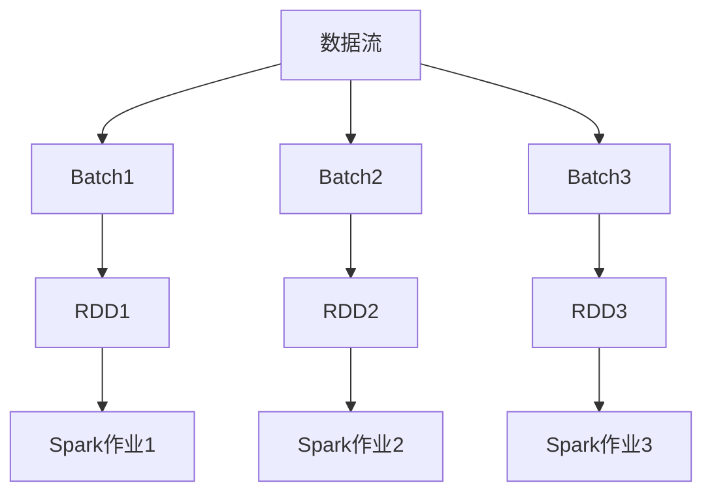

# HBase与Spark的高效协作,实现实时流式数据处理

## 1.背景介绍

### 1.1 大数据时代的到来

在当今时代,数据已经成为了企业最宝贵的资产之一。随着物联网、移动互联网、社交网络等新兴技术的快速发展,数据的产生速度和规模都在不断增长。传统的数据处理方式已经无法满足当前海量数据的需求,因此大数据技术应运而生。

### 1.2 大数据处理的挑战

大数据处理面临着诸多挑战,例如数据量巨大、数据种类繁多、数据处理速度要求高等。要高效地处理大数据,需要具备以下能力:

1. 存储和管理海量数据
2. 快速处理数据流
3. 分析多种类型的数据
4. 可扩展的计算能力

### 1.3 HBase和Spark的作用

为了应对大数据处理的挑战,Apache开源社区推出了HBase和Spark这两个强大的大数据处理工具。

- **HBase**是一个分布式、可伸缩的NoSQL数据库,专门为大数据存储而设计。它基于Google的Bigtable论文,具有高可靠性、高性能、可伸缩等特点,非常适合于存储和管理结构化和半结构化的大规模数据。

- **Spark**是一个快速、通用的大数据处理引擎,它可以高效地进行批处理、流式处理、机器学习和图计算等多种工作负载。Spark的核心是弹性分布式数据集(RDD),它能够在内存中高效处理数据,大大提高了数据处理的速度。

HBase和Spark两者有着不同的侧重点,但是将它们结合起来,就能够充分发挥各自的优势,实现高效的实时流式数据处理。

## 2.核心概念与联系

### 2.1 HBase核心概念

#### 2.1.1 列式存储

HBase采用了Bigtable的列式存储模型,这种模型非常适合于分布式存储海量数据。在HBase中,数据被组织成多个行,每一行又被分为多个列族(Column Family),每个列族下面可以有多个列(Column)。



#### 2.1.2 Region

为了实现数据的水平扩展,HBase会将表按行键(Row Key)的范围划分为多个Region。每个Region都由一个RegionServer来管理,RegionServer负责维护Region中的数据。



#### 2.1.3 HBase架构

HBase的架构主要包括以下几个核心组件:

- **Zookeeper**:用于协调HBase集群中的各个节点,维护集群状态。
- **HMaster**:负责监控HBase集群,处理RegionServer的加入和退出,协调Region的分配和迁移等工作。
- **RegionServer**:负责维护一个或多个Region,处理对这些Region的读写请求。
- **HDFS**:HBase的底层存储,用于持久化存储HBase的数据。



### 2.2 Spark核心概念

#### 2.2.1 RDD

RDD(Resilient Distributed Dataset)是Spark的核心抽象,它是一个不可变、分区的记录集合。RDD可以从HDFS、HBase等数据源创建,也可以通过并行化驱动程序中的集合来创建。



#### 2.2.2 Spark作业执行流程

当在Spark中提交一个作业时,Spark会根据RDD的依赖关系构建出一个执行DAG(Directed Acyclic Graph),然后将DAG分解为多个Stage,每个Stage由一组并行的Task组成。Task在Executor进程中执行,Executor进程可以在集群的多个节点上运行。



#### 2.2.3 Spark流式处理

Spark Streaming是Spark提供的流式处理框架,它将流式数据切分为一系列的小批次(micro-batches),每个小批次都被当作一个RDD进行处理。这种设计使得Spark Streaming能够充分利用Spark的高性能计算能力,同时也保留了流式处理的低延迟特性。



### 2.3 HBase与Spark的联系

HBase和Spark可以通过多种方式进行集成,实现高效的实时流式数据处理:

1. **Spark读写HBase数据**:Spark可以直接从HBase中读取数据,并将处理结果写回HBase。这种方式可以充分利用HBase作为存储层的优势,以及Spark作为计算层的优势。

2. **Spark Streaming整合HBase**:将HBase作为Spark Streaming的数据源或者接收器,实现对流式数据的实时处理和持久化存储。

3. **Spark SQL访问HBase**:通过Spark SQL对HBase中的数据进行结构化查询,简化了数据分析的过程。

4. **Spark MLlib与HBase**:将HBase中的数据导入到Spark MLlib中,利用Spark的机器学习库进行数据挖掘和建模。

通过HBase和Spark的紧密集成,我们可以构建出一个高效、可扩展的实时大数据处理平台,满足各种复杂的数据处理需求。

## 3.核心算法原理具体操作步骤

### 3.1 Spark读写HBase数据

#### 3.1.1 读取HBase数据

Spark可以通过`HBaseContext`来创建HBase的RDD,从而读取HBase中的数据。以下是读取HBase数据的基本步骤:

1. 创建`SparkConf`和`SparkContext`对象。
2. 创建`HBaseConfiguration`对象,设置HBase集群的相关配置。
3. 使用`HBaseContext`创建HBase的RDD。
4. 对RDD执行所需的转换和操作。

下面是一个示例代码:

```scala
import org.apache.spark.{SparkConf, SparkContext}
import org.apache.hadoop.hbase.HBaseConfiguration
import org.apache.spark.rdd.HBaseRDD

val conf = new SparkConf().setAppName("HBaseReadExample")
val sc = new SparkContext(conf)

val hbaseConf = HBaseConfiguration.create()
hbaseConf.set("hbase.zookeeper.quorum", "zk1,zk2,zk3")

val hbaseRDD = HBaseRDD.read(hbaseConf, "table_name", "column_family")

val result = hbaseRDD.map { case (key, value) =>
  // 处理每一行的数据
  ...
}

result.saveAsTextFile("output_path")
```

#### 3.1.2 写入HBase数据

要将Spark的RDD写入HBase,可以使用`HBaseContext`提供的`bulkPut`方法。以下是写入HBase数据的基本步骤:

1. 创建`SparkConf`和`SparkContext`对象。
2. 创建`HBaseConfiguration`对象,设置HBase集群的相关配置。
3. 使用`HBaseContext`创建HBase的RDD。
4. 对RDD执行所需的转换和操作,生成要写入HBase的RDD。
5. 使用`bulkPut`方法将RDD写入HBase。

下面是一个示例代码:

```scala
import org.apache.spark.{SparkConf, SparkContext}
import org.apache.hadoop.hbase.HBaseConfiguration
import org.apache.spark.rdd.HBaseRDD

val conf = new SparkConf().setAppName("HBaseWriteExample")
val sc = new SparkContext(conf)

val hbaseConf = HBaseConfiguration.create()
hbaseConf.set("hbase.zookeeper.quorum", "zk1,zk2,zk3")

val data = sc.parallelize(Seq(
  ("row1", "cf1", "col1", "value1"),
  ("row2", "cf1", "col2", "value2"),
  ("row3", "cf2", "col3", "value3")
))

val hbaseRDD = data.map { case (rowKey, colFamily, col, value) =>
  (rowKey, (colFamily, col, value))
}

HBaseRDD.bulkPut(hbaseRDD, "table_name")
```

在上面的示例中,我们首先创建了一个RDD,其中每个元素都是一个元组,包含了行键、列族、列和值。然后,我们使用`map`操作将RDD转换为HBase所需的格式。最后,我们使用`bulkPut`方法将RDD写入HBase。

### 3.2 Spark Streaming整合HBase

Spark Streaming可以将HBase作为数据源或者接收器,实现对流式数据的实时处理和持久化存储。

#### 3.2.1 HBase作为数据源

要将HBase作为Spark Streaming的数据源,我们需要使用`HBaseUtils`提供的`createStream`方法。以下是基本步骤:

1. 创建`StreamingContext`对象。
2. 创建`HBaseConfiguration`对象,设置HBase集群的相关配置。
3. 使用`HBaseUtils.createStream`方法创建HBase的DStream。
4. 对DStream执行所需的转换和操作。

下面是一个示例代码:

```scala
import org.apache.spark.streaming.{StreamingContext, Seconds}
import org.apache.hadoop.hbase.HBaseConfiguration
import org.apache.spark.streaming.hbase.HBaseUtils

val ssc = new StreamingContext(sc, Seconds(10))

val hbaseConf = HBaseConfiguration.create()
hbaseConf.set("hbase.zookeeper.quorum", "zk1,zk2,zk3")

val hbaseDStream = HBaseUtils.createStream(ssc, "table_name", "column_family")

val result = hbaseDStream.map { case (key, value) =>
  // 处理每一行的数据
  ...
}

result.print()

ssc.start()
ssc.awaitTermination()
```

在上面的示例中,我们首先创建了一个`StreamingContext`对象,然后使用`HBaseUtils.createStream`方法创建了一个HBase的DStream。接下来,我们可以对DStream执行所需的转换和操作,最后启动Streaming应用程序。

#### 3.2.2 HBase作为接收器

要将HBase作为Spark Streaming的接收器,我们需要使用`HBaseUtils`提供的`createHBaseSink`方法。以下是基本步骤:

1. 创建`StreamingContext`对象。
2. 创建`HBaseConfiguration`对象,设置HBase集群的相关配置。
3. 创建输入DStream。
4. 对DStream执行所需的转换和操作,生成要写入HBase的DStream。
5. 使用`HBaseUtils.createHBaseSink`方法创建HBase的Sink。
6. 将DStream写入HBase的Sink。

下面是一个示例代码:

```scala
import org.apache.spark.streaming.{StreamingContext, Seconds}
import org.apache.hadoop.hbase.HBaseConfiguration
import org.apache.spark.streaming.hbase.HBaseUtils

val ssc = new StreamingContext(sc, Seconds(10))

val hbaseConf = HBaseConfiguration.create()
hbaseConf.set("hbase.zookeeper.quorum", "zk1,zk2,zk3")

val inputDStream = ssc.socketTextStream("localhost", 9999)

val result = inputDStream.map { line =>
  // 处理每一行的数据,生成要写入HBase的格式
  (rowKey, (colFamily, col, value))
}

val hbaseSink = HBaseUtils.createHBaseSink(result, "table_name")

result.foreachRDD { rdd =>
  hbaseSink.bulkPut(rdd)
}

ssc.start()
ssc.awaitTermination()
```

在上面的示例中,我们首先创建了一个`SocketTextStream`作为输入DStream。然后,我们对DStream执行所需的转换和操作,生成要写入HBase的格式。接下来