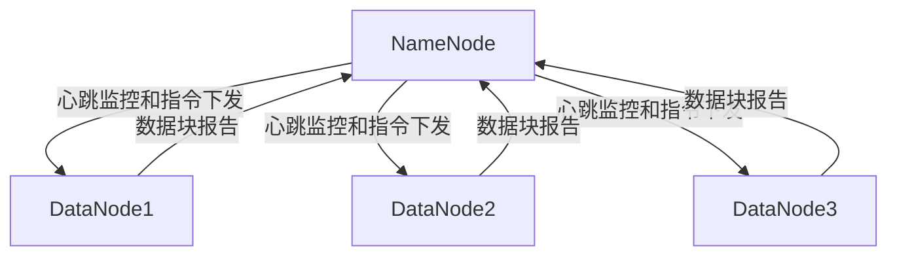
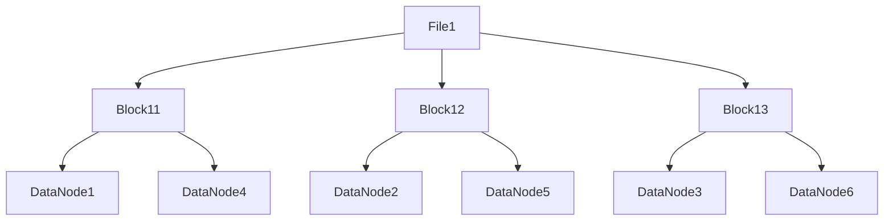

# HDFS原理与代码实例讲解

## 1.背景介绍

### 1.1 大数据时代的到来

随着互联网、物联网、云计算等技术的快速发展,数据的规模呈现出前所未有的爆炸式增长。传统的数据存储和处理系统已经无法满足日益增长的需求,迫切需要一种新的解决方案来应对海量数据的存储和计算挑战。在这种背景下,大数据技术应运而生。

### 1.2 大数据技术的核心需求

大数据技术需要解决以下几个核心问题:

1. 存储海量数据
2. 高效处理海量数据
3. 容错性和可靠性
4. 可扩展性和并行处理能力

### 1.3 HDFS的诞生

为了满足大数据时代的存储和计算需求,Apache Hadoop项目诞生了。Hadoop分布式文件系统(HDFS)作为Hadoop生态系统的核心组件,旨在提供一种可靠、高性能、高容错且可扩展的分布式文件系统,能够存储和处理大规模数据集。

## 2.核心概念与联系

### 2.1 HDFS架构概览

HDFS采用主从架构,由一个NameNode(名称节点)和多个DataNode(数据节点)组成。



NameNode负责管理整个文件系统的元数据(文件目录树、文件与数据块的映射关系等),并协调DataNode的工作。DataNode负责实际存储数据块,并定期向NameNode报告自身状态和数据块信息。

### 2.2 文件存储机制

HDFS将文件切分为多个数据块(Block),并将这些数据块存储在不同的DataNode上。每个数据块都有多个副本(默认3个),以提供容错能力和高可用性。



### 2.3 数据读写流程

1. **写数据流程**:客户端首先将数据流分块,并将数据块分发到不同的DataNode上。NameNode协调数据块的存储位置和副本数量。

2. **读数据流程**:客户端首先从NameNode获取文件的元数据信息,包括数据块的位置。然后,客户端直接从DataNode读取所需的数据块。

## 3.核心算法原理具体操作步骤

### 3.1 数据块放置策略

HDFS采用了一种智能的数据块放置策略,以实现高可用性和数据本地化。具体步骤如下:

1. 将第一个副本存储在客户端节点所在的同一个机架内的某个DataNode上,以实现数据本地化。
2. 将第二个副本存储在不同机架的某个DataNode上,以提高容错能力。
3. 将第三个副本存储在与第二个副本不同的机架上,以进一步增强容错能力。

### 3.2 数据块复制与平衡

为了保证数据的可靠性和可用性,HDFS会定期检查数据块的副本数量,并根据需要进行复制或删除操作。具体步骤如下:

1. NameNode会定期检查每个数据块的副本数量。
2. 如果某个数据块的副本数量少于设定值(默认为3),NameNode会在其他DataNode上复制该数据块。
3. 如果某个数据块的副本数量多于设定值,NameNode会删除多余的副本。
4. NameNode会尽量将数据块副本均匀分布在不同的机架上,以提高容错能力。

### 3.3 故障处理机制

HDFS采用了多种机制来处理各种故障情况,确保数据的可靠性和可用性。

1. **DataNode故障**:当某个DataNode发生故障时,NameNode会检测到该DataNode的心跳中断,并将该DataNode标记为死亡状态。然后,NameNode会在其他DataNode上复制该DataNode上的数据块,以保证数据的可靠性。

2. **NameNode故障**:HDFS支持NameNode的热备份机制,可以在NameNode发生故障时快速切换到备份NameNode,从而避免单点故障。

3. **网络隔离**:HDFS采用机架感知机制,可以检测到网络隔离情况,并在隔离区域内复制数据块,以确保数据的可用性。

## 4.数学模型和公式详细讲解举例说明

### 4.1 数据块大小选择

HDFS中,数据块的大小是一个关键参数,它会影响系统的性能和可靠性。数据块大小的选择需要权衡以下几个因素:

1. **磁盘传输效率**:较大的数据块可以提高磁盘传输效率,减少磁盘寻址开销。
2. **网络传输效率**:较小的数据块可以提高网络传输效率,减少网络拥塞的风险。
3. **容错能力**:较小的数据块可以提高容错能力,因为单个数据块的丢失影响较小。
4. **并行处理能力**:较小的数据块可以提高并行处理能力,因为可以将多个小块并行处理。

HDFS默认的数据块大小为128MB,这是一个相对平衡的选择。如果需要调整数据块大小,可以使用以下公式进行估算:

$$
BlockSize = \sqrt{\frac{TotalBytes}{NumNodes \times VolsPerNode}}
$$

其中:

- $BlockSize$: 数据块大小
- $TotalBytes$: 总数据量
- $NumNodes$: 集群中DataNode的数量
- $VolsPerNode$: 每个DataNode上的磁盘卷数量

### 4.2 数据块副本数量选择

HDFS中,数据块的副本数量也是一个关键参数,它会影响系统的可靠性和存储开销。副本数量的选择需要权衡以下几个因素:

1. **可靠性**:更多的副本可以提高数据的可靠性,减少数据丢失的风险。
2. **存储开销**:更多的副本会增加存储开销,降低存储利用率。
3. **网络开销**:更多的副本会增加数据复制的网络开销。

HDFS默认的数据块副本数量为3,这是一个相对平衡的选择。如果需要调整副本数量,可以使用以下公式进行估算:

$$
ReplicationFactor = \lceil \log_{1-P_n}(P_d) \rceil
$$

其中:

- $ReplicationFactor$: 数据块副本数量
- $P_n$: 单个节点故障的概率
- $P_d$: 数据丢失的最大可接受概率

例如,如果单个节点故障的概率为0.01,数据丢失的最大可接受概率为0.000001,那么根据上述公式,推荐的数据块副本数量为4。

## 5.项目实践:代码实例和详细解释说明

### 5.1 HDFS Java API示例

以下是一个使用HDFS Java API进行文件操作的示例代码:

```java
import org.apache.hadoop.conf.Configuration;
import org.apache.hadoop.fs.FileSystem;
import org.apache.hadoop.fs.Path;

public class HDFSExample {
    public static void main(String[] args) throws Exception {
        // 配置HDFS文件系统
        Configuration conf = new Configuration();
        conf.set("fs.defaultFS", "hdfs://namenode:9000");
        FileSystem fs = FileSystem.get(conf);

        // 创建目录
        Path dir = new Path("/user/example");
        if (!fs.exists(dir)) {
            fs.mkdirs(dir);
        }

        // 上传文件
        Path localFile = new Path("local_file.txt");
        Path hdfsFile = new Path("/user/example/hdfs_file.txt");
        fs.copyFromLocalFile(localFile, hdfsFile);

        // 读取文件
        // ...

        // 删除文件
        fs.delete(hdfsFile, true);

        // 关闭文件系统
        fs.close();
    }
}
```

代码解释:

1. 首先配置HDFS文件系统,指定NameNode的地址和端口。
2. 使用`FileSystem.get(conf)`方法获取HDFS文件系统实例。
3. 创建目录:使用`mkdirs()`方法创建目录。
4. 上传文件:使用`copyFromLocalFile()`方法将本地文件上传到HDFS。
5. 读取文件:可以使用`open()`方法打开HDFS文件进行读取操作。
6. 删除文件:使用`delete()`方法删除HDFS文件。
7. 最后关闭文件系统实例。

### 5.2 MapReduce示例

以下是一个使用MapReduce进行单词计数的示例代码:

```java
import org.apache.hadoop.conf.Configuration;
import org.apache.hadoop.fs.Path;
import org.apache.hadoop.io.IntWritable;
import org.apache.hadoop.io.Text;
import org.apache.hadoop.mapreduce.Job;
import org.apache.hadoop.mapreduce.Mapper;
import org.apache.hadoop.mapreduce.Reducer;
import org.apache.hadoop.mapreduce.lib.input.FileInputFormat;
import org.apache.hadoop.mapreduce.lib.output.FileOutputFormat;

import java.io.IOException;
import java.util.StringTokenizer;

public class WordCount {

    public static class TokenizerMapper
            extends Mapper<Object, Text, Text, IntWritable>{

        private final static IntWritable one = new IntWritable(1);
        private Text word = new Text();

        public void map(Object key, Text value, Context context
        ) throws IOException, InterruptedException {
            StringTokenizer itr = new StringTokenizer(value.toString());
            while (itr.hasMoreTokens()) {
                word.set(itr.nextToken());
                context.write(word, one);
            }
        }
    }

    public static class IntSumReducer
            extends Reducer<Text,IntWritable,Text,IntWritable> {
        private IntWritable result = new IntWritable();

        public void reduce(Text key, Iterable<IntWritable> values,
                           Context context
        ) throws IOException, InterruptedException {
            int sum = 0;
            for (IntWritable val : values) {
                sum += val.get();
            }
            result.set(sum);
            context.write(key, result);
        }
    }

    public static void main(String[] args) throws Exception {
        Configuration conf = new Configuration();
        Job job = Job.getInstance(conf, "word count");
        job.setJarByClass(WordCount.class);
        job.setMapperClass(TokenizerMapper.class);
        job.setCombinerClass(IntSumReducer.class);
        job.setReducerClass(IntSumReducer.class);
        job.setOutputKeyClass(Text.class);
        job.setOutputValueClass(IntWritable.class);
        FileInputFormat.addInputPath(job, new Path(args[0]));
        FileOutputFormat.setOutputPath(job, new Path(args[1]));
        System.exit(job.waitForCompletion(true) ? 0 : 1);
    }
}
```

代码解释:

1. `TokenizerMapper`是Map阶段的实现,它将输入文本按空格分割成单词,并输出`<单词, 1>`的键值对。
2. `IntSumReducer`是Reduce阶段的实现,它将Map阶段输出的相同单词的计数值进行汇总,并输出`<单词, 计数>`的键值对。
3. `main`方法是程序的入口,它配置作业参数、设置Mapper、Combiner和Reducer类,以及输入和输出路径。
4. `waitForCompletion`方法启动作业并等待完成。

## 6.实际应用场景

HDFS作为大数据生态系统的核心存储组件,在许多领域都有广泛的应用,例如:

1. **网络日志分析**:互联网公司通常需要分析海量的网络日志数据,以了解用户行为、优化网站性能等。HDFS可以高效存储和处理这些日志数据。

2. **基因组学研究**:基因组学研究涉及大量基因序列数据,HDFS可以存储和处理这些数据,支持基因组学研究。

3. **气象数据处理**:气象部门需要处理来自全球各地的大量气象数据,HDFS可以存储和处理这些数据,支持天气预报和气候研究。

4. **社交网络分析**:社交网络公司需要分析海量的用户数据,以了解用户行为和社交关系。HDFS可以存储和处理这些数据。

5. **物联网数据处理**:物联网设备产生大量的传感器数据,HDFS可以存储和处理这些数据,支持物联网应用。

## 7.工具和资