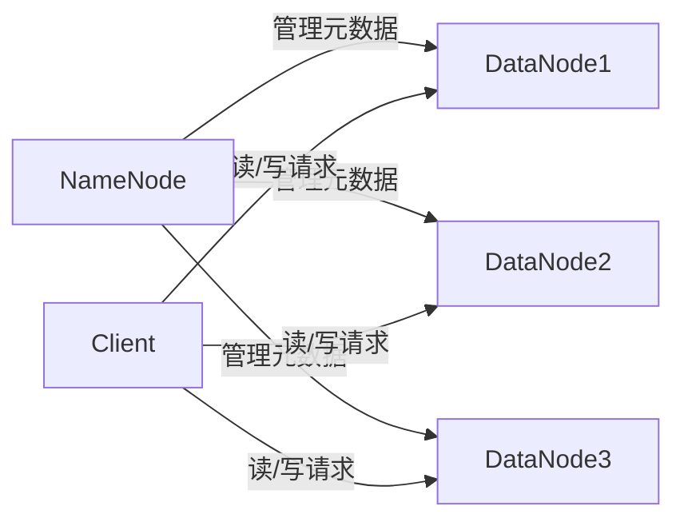

## 1.背景介绍

Hadoop Distributed File System (HDFS) 是 Apache Hadoop 项目的主要组成部分，它是一个高度容错性的系统，适用于在低成本硬件上运行的大规模数据集。HDFS 提供了高吞吐量的数据访问，非常适合大规模数据集上的应用。HDFS 放松了（与POSIX相比）一些硬盘访问要求以实现流式读取数据文件的目标。HDFS 在最初是为作为Apache Nutch web搜索引擎项目的基础设施而创建的。HDFS已经成为Apache Hadoop Core项目的一部分，它是Apache Software Foundation的顶级项目，由全球的志愿者和专业人员组成的开源社区进行维护。

## 2.核心概念与联系

HDFS采用了主/从架构。一个HDFS集群是由一个NameNode和多个DataNode组成的。NameNode是一个中心服务器，管理文件系统的元数据，例如，文件到数据块的映射、数据块到DataNode的映射等。DataNode则存储实际的数据块，处理文件系统的客户端读写请求。在HDFS中，文件被切分成一系列的数据块，这些块存储在集群中的机器上。



## 3.核心算法原理具体操作步骤

当客户端需要读取或写入一个文件时，首先会向NameNode发出请求，获取文件的元数据或者更新文件的元数据。然后，客户端会直接与存储文件数据块的DataNode进行通信，进行数据的读写操作。这种设计使得数据流量可以在DataNodes之间直接传输，而不需要经过NameNode，从而极大地提高了HDFS的扩展性。

## 4.数学模型和公式详细讲解举例说明

在HDFS中，一个重要的概念是数据块的复制（Replication）。复制是HDFS提高数据可靠性和可用性的主要机制。每个数据块在HDFS中都有多个副本，这些副本分布在不同的DataNode上。默认情况下，HDFS会创建每个数据块的三个副本。副本的数量可以由用户在创建文件时指定，也可以通过配置文件全局设置。

假设数据块的副本数量为 $r$ ，DataNode的数量为 $n$ ，则数据的可用性 $A$ 可以通过以下公式计算：

$$ A = 1 - (1 - \frac{r}{n})^n $$

这个公式表明，当副本数量增加或DataNode数量增加时，数据的可用性会提高。

## 5.项目实践：代码实例和详细解释说明

以下是一个简单的HDFS Java API的使用示例，该示例展示了如何使用HDFS API创建文件，并写入数据：

```java
import org.apache.hadoop.conf.Configuration;
import org.apache.hadoop.fs.FileSystem;
import org.apache.hadoop.fs.Path;

public class HdfsExample {
    public static void main(String[] args) throws Exception {
        Configuration conf = new Configuration();
        conf.set("fs.defaultFS", "hdfs://localhost:9000");
        FileSystem fs = FileSystem.get(conf);
        Path path = new Path("/user/example/test");
        if (!fs.exists(path)) {
            fs.create(path);
        }
        fs.close();
    }
}
```

这段代码首先创建一个Hadoop配置对象，并设置HDFS的地址。然后，使用这个配置对象创建一个FileSystem对象，该对象是HDFS API的主要入口。接下来，创建一个Path对象，表示HDFS中的一个文件或目录。如果这个路径不存在，就创建一个新文件。最后，关闭FileSystem对象，释放资源。

## 6.实际应用场景

HDFS在许多大数据处理场景中都有广泛的应用，例如，Web搜索引擎、社交网络分析、大规模机器学习和数据挖掘等。它也是许多大数据处理框架，如Apache Hadoop, Apache Spark, Apache Flink等的重要组成部分。

## 7.工具和资源推荐

- Apache Hadoop官方网站：https://hadoop.apache.org/
- HDFS用户指南：https://hadoop.apache.org/docs/stable/hadoop-project-dist/hadoop-hdfs/HdfsUserGuide.html
- HDFS Java API文档：https://hadoop.apache.org/docs/stable/api/org/apache/hadoop/fs/FileSystem.html

## 8.总结：未来发展趋势与挑战

随着大数据技术的发展，HDFS也面临着许多新的挑战。例如，如何提高存储效率，如何支持更多的存储介质，如何提高数据的安全性和隐私性等。尽管如此，HDFS仍然是大数据存储的重要选择，其简单、稳定、可扩展的特性使其在大数据处理中有着广泛的应用。

## 9.附录：常见问题与解答

1. **问题：HDFS是否支持小文件存储？**

   答：虽然HDFS可以存储小文件，但是由于HDFS的设计原则是为了处理大规模的数据集，因此，存储大量的小文件可能会导致NameNode的元数据过大，从而影响HDFS的性能。因此，对于小文件的存储，建议使用合适的文件合并策略，或者使用其他更适合小文件存储的系统，如HBase。

2. **问题：HDFS的数据块大小应该如何设置？**

   答：HDFS的数据块大小默认为64MB。对于大多数应用来说，这个默认值已经足够。但是，如果你的应用需要处理非常大的文件，并且文件的读取模式是顺序读取，那么增大数据块的大小可能会有助于提高系统的I/O效率。

作者：禅与计算机程序设计艺术 / Zen and the Art of Computer Programming