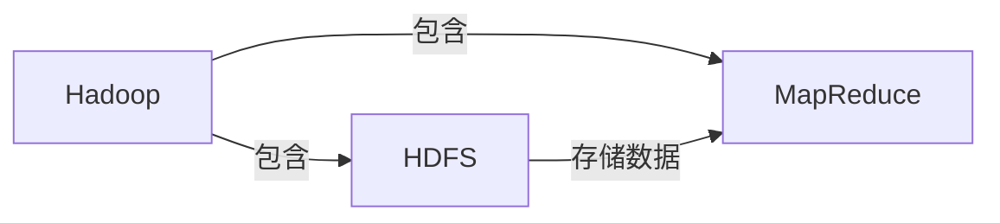

## 1.背景介绍

Hadoop，作为一个开源的分布式计算框架，已经在全球范围内广泛应用。它的出现，解决了大数据处理的痛点，使得大规模数据处理变得既简单又高效。然而，对于许多初学者来说，Hadoop的原理和实际应用可能会显得有些复杂。本文将深入探讨Hadoop的原理，并通过代码实例进行讲解，帮助读者更好地理解和掌握Hadoop。

## 2.核心概念与联系

Hadoop主要由两个核心组件构成：Hadoop Distributed File System（HDFS）和MapReduce。HDFS是一个高度容错性的系统，用于在低成本硬件上存储大量数据。MapReduce则是一个计算模型，用于处理存储在HDFS上的数据。



## 3.核心算法原理具体操作步骤

MapReduce算法包括两个阶段：Map阶段和Reduce阶段。在Map阶段，输入数据被分割成多个独立的片段，这些片段可以并行处理。在Reduce阶段，Map阶段的输出结果被汇总，产生最终的输出。


## 4.数学模型和公式详细讲解举例说明

在MapReduce中，我们可以使用函数来表示Map和Reduce阶段。假设我们有一个输入数据集D，我们可以表示为：

$$
D = \{ (k1, v1), (k2, v2), ..., (kn, vn) \}
$$

其中，$k$和$v$分别代表键和值。在Map阶段，我们定义一个函数$f$，可以将输入数据转换为中间键值对集合：

$$
f(k, v) = \{ (k', v') \}
$$

在Reduce阶段，我们定义一个函数$g$，可以将中间键值对集合转换为输出数据：

$$
g(k', \{v'\}) = \{ (k'', v'') \}
$$

## 5.项目实践：代码实例和详细解释说明

接下来，我们将通过一个简单的WordCount例子来展示Hadoop的使用。这个例子将统计输入文本中每个单词出现的次数。

首先，我们需要定义Map函数。在这个函数中，我们将输入文本分割成单词，并为每个单词生成一个键值对，键是单词，值是1：

```java
public void map(Object key, Text value, Context context) throws IOException, InterruptedException {
    StringTokenizer itr = new StringTokenizer(value.toString());
    while (itr.hasMoreTokens()) {
        word.set(itr.nextToken());
        context.write(word, one);
    }
}
```

然后，我们需要定义Reduce函数。在这个函数中，我们将同一个单词的所有值相加，得到这个单词的总数：

```java
public void reduce(Text key, Iterable values, Context context) throws IOException, InterruptedException {
    int sum = 0;
    for (IntWritable val : values) {
        sum += val.get();
    }
    result.set(sum);
    context.write(key, result);
}
```

## 6.实际应用场景

Hadoop在许多领域都有广泛的应用，包括搜索引擎、社交网络分析、市场营销分析、网络安全、生物信息学等。例如，Facebook使用Hadoop处理其大量的用户数据，以提供更精确的广告推荐。

## 7.工具和资源推荐

如果你想深入学习Hadoop，我推荐以下几个资源：

- Apache Hadoop官方网站：这是Hadoop的官方网站，你可以在这里找到最新的Hadoop版本和详细的文档。
- Hadoop: The Definitive Guide：这本书是学习Hadoop的经典教材，详细介绍了Hadoop的各个组件和使用方法。
- Cloudera Hadoop Distribution：Cloudera提供了一个易于使用的Hadoop发行版，适合初学者使用。

## 8.总结：未来发展趋势与挑战

随着数据量的不断增长，Hadoop的重要性也在不断提升。然而，Hadoop也面临着许多挑战，如数据安全性、实时处理能力、易用性等。未来，Hadoop需要在这些方面进行改进，以满足用户的需求。

## 9.附录：常见问题与解答

这里，我收集了一些关于Hadoop的常见问题和答案，希望对你有所帮助。

Q: Hadoop适合所有类型的数据处理任务吗？
A: 不，Hadoop主要适用于大规模数据处理任务，对于小规模数据处理，使用Hadoop可能会导致资源浪费。

Q: Hadoop能保证数据的安全性吗？
A: Hadoop提供了一些基本的数据安全机制，如数据备份和数据加密。然而，对于一些高安全性要求的应用，可能需要使用额外的安全工具。

作者：禅与计算机程序设计艺术 / Zen and the Art of Computer Programming
