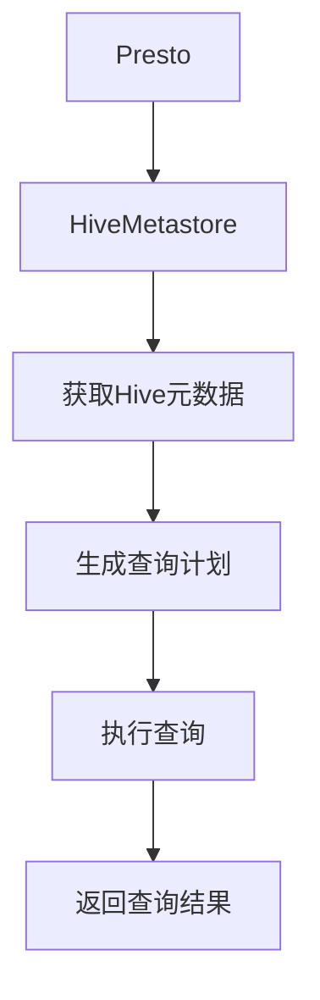

# HiveMetastore：Presto连接Hive的桥梁

## 1. 背景介绍

### 1.1 Hive简介

Apache Hive 是一个构建在 Hadoop 之上的数据仓库基础工具，它提供了一种类似 SQL 的查询语言 HiveQL，使用户可以用 SQL 语句访问存储在 Hadoop 分布式文件系统(HDFS)中的数据。Hive 可以将结构化的数据文件映射为一张数据库表，并且允许用户可以通过 HiveQL 查询语句进行数据提取、投影、过滤等操作。

### 1.2 Presto简介

Presto 是一个开源的分布式 SQL 查询引擎，旨在交互式分析处理。Presto 支持在线查询和批量数据分析，能够快速处理各种不同的数据源(如 Hive、Cassandra、关系数据库和专有数据存储)。Presto 的设计目标是查询任何尺寸的数据，并支持标准的 ANSI SQL，包括复杂查询、聚合和连接等操作。

### 1.3 HiveMetastore作用

HiveMetastore 是 Hive 的元数据存储服务，用于存储 Hive 中的元数据信息,如表、分区、列等。HiveMetastore 使用关系数据库(如 MySQL、PostgreSQL 等)作为其后端存储。当使用 Hive 创建、修改或删除表时,相应的元数据信息都会被存储在 HiveMetastore 中。

Presto 可以通过连接 HiveMetastore 来访问 Hive 中的数据。这种方式使得 Presto 可以无需复制或移动数据,直接查询 Hive 中已存在的数据,从而实现两个系统之间的无缝集成。

## 2. 核心概念与联系

### 2.1 Hive元数据概念

Hive 中的元数据包括以下几个核心概念:

1. **数据库(Database)**: 相当于关系数据库中的数据库概念,用于逻辑上组织 Hive 表。
2. **表(Table)**: Hive 中的表对应于 HDFS 上的一个或多个数据文件。
3. **分区(Partition)**: 表可以根据一个或多个列的值进行分区,以优化查询性能。
4. **列(Column)**: 表中的列对应于底层数据文件中的字段。

### 2.2 Presto与HiveMetastore连接

Presto 通过连接 HiveMetastore 来获取 Hive 中表的元数据信息,从而能够查询 Hive 表中的数据。Presto 与 HiveMetastore 的连接过程如下:

1. Presto 启动时,会读取配置文件中指定的 HiveMetastore URI。
2. Presto 通过 Thrift 协议连接 HiveMetastore。
3. Presto 从 HiveMetastore 获取所需的元数据信息,如数据库、表、分区等。
4. Presto 根据获取的元数据信息,生成查询计划并执行查询。

### 2.3 Presto查询Hive数据流程

Presto 查询 Hive 数据的基本流程如下所示:



1. Presto 连接 HiveMetastore 获取 Hive 元数据信息。
2. 根据获取的元数据信息,Presto 生成查询计划。
3. Presto 执行查询计划,从 HDFS 读取 Hive 表数据。
4. Presto 返回查询结果。

通过这种方式,Presto 可以无缝地查询 Hive 中已存在的数据,而无需进行数据移动或复制操作。

## 3. 核心算法原理具体操作步骤

### 3.1 Presto连接HiveMetastore

Presto 连接 HiveMetastore 的具体步骤如下:

1. **配置 HiveMetastore URI**

   在 Presto 的配置文件(`etc/catalog/hive.properties`)中,指定 HiveMetastore 的 URI:

   ```
   hive.metastore.uri=thrift://metastore-host:9083
   ```

2. **启动 Presto 协调器和工作节点**

   启动 Presto 协调器和工作节点服务。

3. **连接 HiveMetastore**

   Presto 协调器在启动时,会通过 Thrift 协议连接配置的 HiveMetastore URI。如果连接成功,Presto 就可以获取 Hive 元数据信息了。

### 3.2 获取Hive元数据

连接 HiveMetastore 后,Presto 会获取以下 Hive 元数据信息:

1. **数据库列表**

   Presto 获取 HiveMetastore 中所有的数据库列表。

2. **表元数据**

   对于每个数据库,Presto 获取其中所有表的元数据信息,包括表名、列信息、分区信息等。

3. **分区信息**

   如果表被分区,Presto 还会获取每个分区的元数据信息。

4. **存储信息**

   Presto 获取表数据在 HDFS 上的存储位置和格式信息。

### 3.3 生成查询计划

根据获取的 Hive 元数据信息,Presto 生成分布式查询计划:

1. **解析 SQL 查询**

   Presto 解析用户提交的 SQL 查询语句。

2. **查找表元数据**

   根据查询中涉及的表名,Presto 查找对应表的元数据信息。

3. **生成查询计划**

   Presto 根据表元数据生成分布式查询计划,包括如何从 HDFS 读取数据、如何在工作节点上执行查询等。

4. **优化查询计划**

   Presto 对生成的查询计划进行优化,以提高查询效率。

### 3.4 执行查询计划

经过上述步骤后,Presto 开始执行查询计划:

1. **分发查询任务**

   Presto 协调器将查询任务分发到工作节点上执行。

2. **读取 HDFS 数据**

   工作节点根据查询计划从 HDFS 读取 Hive 表数据。

3. **执行查询操作**

   工作节点执行查询计划中的各种操作,如投影、过滤、聚合、连接等。

4. **返回查询结果**

   查询执行完成后,工作节点将结果返回给协调器,协调器再将最终结果返回给客户端。

通过以上步骤,Presto 可以高效地查询 Hive 中的数据,而无需进行数据移动或复制操作。

## 4. 数学模型和公式详细讲解举例说明

在 Presto 查询 Hive 数据的过程中,涉及一些核心的数学模型和公式,下面将对它们进行详细讲解和举例说明。

### 4.1 数据分片(Data Sharding)

为了提高查询效率,Presto 会将数据分片(Sharding)分发到多个工作节点上进行并行处理。数据分片的基本原理是将数据按照某种策略划分为多个分片,每个分片由一个工作节点负责处理。

Presto 支持多种数据分片策略,包括:

1. **Hash 分片**

   根据某个列的 Hash 值将数据划分为多个分片。Hash 分片的公式为:

   $$\text{shardId} = \text{hash}(\text{columnValue}) \bmod \text{numBuckets}$$

   其中 $\text{columnValue}$ 是用于分片的列值, $\text{numBuckets}$ 是分片数量。

2. **范围分片**

   根据某个列值的范围将数据划分为多个分片。范围分片的公式为:

   $$\text{shardId} = \left\lfloor\frac{\text{columnValue} - \text{rangeStart}}{\text{rangeLength}}\right\rfloor \bmod \text{numBuckets}$$

   其中 $\text{columnValue}$ 是用于分片的列值, $\text{rangeStart}$ 是范围起始值, $\text{rangeLength}$ 是范围长度, $\text{numBuckets}$ 是分片数量。

通过合理的数据分片策略,Presto 可以充分利用集群资源,提高查询性能。

### 4.2 数据局部性(Data Locality)

在分布式系统中,数据局部性是一个非常重要的概念。数据局部性原理是尽可能将计算任务调度到存储相关数据的节点上执行,从而减少数据传输开销,提高系统性能。

在 Presto 查询 Hive 数据时,也会考虑数据局部性。Presto 会尽可能将查询任务调度到存储相关 HDFS 数据块的节点上执行,以减少数据传输开销。

数据局部性的计算公式为:

$$\text{locality} = \frac{\text{localReads}}{\text{totalReads}}$$

其中 $\text{localReads}$ 表示本地读取的数据量, $\text{totalReads}$ 表示总读取数据量。数据局部性的值在 0 到 1 之间,值越大表示数据局部性越好。

通过优化数据局部性,Presto 可以显著提高查询 Hive 数据的性能。

### 4.3 成本模型(Cost Model)

为了生成高效的查询计划,Presto 使用基于成本的查询优化器。成本模型用于估计不同查询计划的执行成本,从而选择成本最低的计划执行。

Presto 的成本模型考虑了多个因素,包括:

- 数据量
- 数据分布
- 计算资源
- 网络带宽
- 数据局部性

成本模型的基本公式为:

$$\text{cost} = \alpha \times \text{cpuCost} + \beta \times \text{networkCost} + \gamma \times \text{memoryCost}$$

其中 $\alpha$、$\beta$、$\gamma$ 是权重系数, $\text{cpuCost}$ 表示 CPU 成本, $\text{networkCost}$ 表示网络成本, $\text{memoryCost}$ 表示内存成本。

每个成本项都由多个子模型计算得出,例如 CPU 成本考虑了操作的计算复杂度、数据量等因素。通过精心设计的成本模型,Presto 可以生成高效的查询计划,提高查询性能。

## 5. 项目实践:代码实例和详细解释说明

在本节中,我们将通过一个实际项目案例,展示如何使用 Presto 查询 Hive 中的数据,并对相关代码进行详细解释。

### 5.1 项目背景

假设我们有一个电商网站的用户行为数据存储在 Hive 中,包括用户浏览记录、购买记录等。我们需要使用 Presto 对这些数据进行分析,以了解用户行为模式、优化产品推荐等。

### 5.2 Hive 表结构

我们在 Hive 中创建了两个表:

1. `user_visits` 表存储用户浏览记录:

```sql
CREATE TABLE user_visits (
  visit_id BIGINT,
  user_id BIGINT,
  product_id BIGINT,
  visit_time TIMESTAMP
)
PARTITIONED BY (dt STRING)
STORED AS PARQUET;
```

2. `user_purchases` 表存储用户购买记录:

```sql
CREATE TABLE user_purchases (
  purchase_id BIGINT,
  user_id BIGINT,
  product_id BIGINT,
  purchase_time TIMESTAMP,
  price DOUBLE
)
PARTITIONED BY (dt STRING)
STORED AS PARQUET;
```

### 5.3 Presto 查询示例

接下来,我们将使用 Presto 执行一些典型的查询任务。

#### 5.3.1 连接 Hive 元数据

首先,我们需要在 Presto 中配置 HiveMetastore 的连接信息:

```
# etc/catalog/hive.properties
hive.metastore.uri=thrift://metastore-host:9083
```

#### 5.3.2 查询用户浏览记录

下面的查询语句可以获取指定日期范围内的用户浏览记录:

```sql
SELECT
  user_id,
  product_id,
  visit_time
FROM hive.web.user_visits
WHERE dt BETWEEN '2023-05-01' AND '2023-05-07'
LIMIT 10;
```

这个查询从 `user_visits` 表中选取 `user_id`、`product_id` 和 `visit_time` 列,并对指定日期范围的数据进行过滤。

#### 5.3.3 查询用户购买记录

下面的查询语句可以获取指定日期范围内的用户购买记录,并计算每