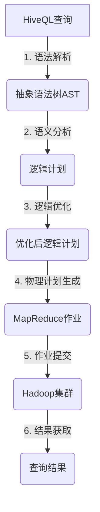

# HiveQL在房产数据分析中的应用

## 1.背景介绍

### 1.1 房地产行业数据分析的重要性

在当今快节奏的商业环境中,房地产行业正在经历前所未有的变革。随着人口增长、城市化进程加快以及消费者需求的不断变化,房地产公司需要利用大数据和分析工具来洞察市场趋势、理解客户行为,并优化业务决策。

房地产数据分析可以帮助企业:

- 预测房地产市场走势
- 发现潜在投资机会 
- 优化房源定价策略
- 改善客户体验
- 提高运营效率

### 1.2 大数据时代的挑战

然而,房地产数据通常存在于多个异构数据源中,包括销售记录、客户信息、房源列表、社交媒体等。传统的数据库系统难以高效处理如此庞大和多样化的数据集。这就对数据存储、管理和分析能力提出了新的挑战。

## 2.核心概念与联系

### 2.1 Apache Hive

Apache Hive是建立在Apache Hadoop之上的数据仓库基础架构,旨在提供数据汇总、查询和分析功能。它使用类SQL语言HiveQL(Hive Query Language)操作存储在Hadoop分布式文件系统(HDFS)中的数据。

Hive的主要优势包括:

- 支持熟悉的SQL语法,降低了编程门槛
- 良好的容错性和可扩展性
- 与Hadoop生态系统无缝集成

### 2.2 HiveQL概述

HiveQL是Hive的查询语言,语法类似SQL,但在底层实现上有所不同。HiveQL查询会被转换为一系列Hadoop MapReduce作业,在整个集群上并行执行。

HiveQL支持大多数标准SQL操作,如SELECT、JOIN、GROUP BY、ORDER BY等,并提供了一些特定于大数据处理的功能扩展。

```hiveql
CREATE TABLE houses (
  id INT,
  address STRING,
  price DOUBLE,
  bedrooms INT,
  bathrooms INT
) ROW FORMAT DELIMITED
  FIELDS TERMINATED BY ','
  STORED AS TEXTFILE;

LOAD DATA INPATH '/user/hive/houses' 
OVERWRITE INTO TABLE houses;

SELECT AVG(price) AS avg_price
FROM houses
WHERE bedrooms >= 3 AND bathrooms >= 2
GROUP BY city;
```

上面的示例展示了如何在Hive中创建表、加载数据,以及执行聚合查询。

### 2.3 Hive与房产数据分析

房地产数据通常包含了大量结构化和非结构化信息,如房源列表、客户资料、地理位置数据等。Hive凭借其处理大数据集的能力,以及与Hadoop生态系统的集成,非常适合用于房地产数据分析场景。

利用HiveQL,分析师可以方便地执行各种复杂查询,如:

- 统计不同区域的房价中位数
- 分析房源特征与售价的相关性
- 基于历史数据预测未来价格走势
- 整合多源数据进行全面分析

## 3.核心算法原理具体操作步骤

### 3.1 Hive查询执行流程

当用户提交一个HiveQL查询时,Hive会经历以下核心步骤:

1. **语法解析**: 将HiveQL查询字符串解析为抽象语法树(AST)
2. **语义分析**: 验证查询的语义是否正确,解析表和列引用
3. **逻辑计划生成**: 根据AST生成逻辑执行计划
4. **物理计划生成**: 将逻辑计划转换为一系列MapReduce作业
5. **作业提交**: 将MapReduce作业提交到Hadoop集群执行
6. **结果获取**: 从HDFS获取作业输出,并返回给用户



### 3.2 MapReduce作业执行

Hive将复杂查询转换为一系列MapReduce作业,利用Hadoop集群的并行计算能力高效处理大数据。

以下是一个WordCount作业的MapReduce流程示例:


1. **Map阶段**:每个Map任务并行处理输入文件的一部分数据,统计单词出现次数,生成键值对<word, count>
2. **Shuffle阶段**:按照key(word)对Map输出进行分组和排序
3. **Reduce阶段**:每个Reduce任务处理一个key组,对该组的value值进行求和,得到最终单词计数结果

Hive会根据查询语义生成对应的MapReduce作业流程,实现高效的大数据处理。

## 4.数学模型和公式详细讲解举例说明

在房产数据分析中,常常需要应用各种数学模型和统计方法来挖掘数据中的见解。以下是一些常用的数学模型和公式:

### 4.1 线性回归模型

线性回归是一种常用的监督学习算法,用于预测连续型目标变量。在房产分析中,可以用线性回归模型来预测房价:

$$
Y = \beta_0 + \beta_1X_1 + \beta_2X_2 + ... + \beta_nX_n + \epsilon
$$

其中:
- $Y$是房价(目标变量)
- $X_1, X_2, ..., X_n$是影响房价的特征变量(如房龄、面积、区域等)
- $\beta_0, \beta_1, ..., \beta_n$是模型参数
- $\epsilon$是误差项

通过训练数据拟合模型参数$\beta$,就可以对新的房源数据进行价格预测。

### 4.2 地理加权回归(GWR)

传统线性回归模型假设整个研究区域内的关系是固定的,但实际上不同地理位置的影响因素可能有所不同。地理加权回归(GWR)考虑了空间非平稳性,对每个观测点赋予不同的权重:

$$
Y_i = \beta_{0}(u_i, v_i) + \sum_{k=1}^{p}\beta_k(u_i, v_i)x_{ik} + \epsilon_i
$$

其中$(u_i, v_i)$是观测点$i$的坐标,权重由距离衰减函数确定,离观测点更近的样本在局部模型中权重更大。

GWR模型可用于分析不同区域的房价影响因素差异,有助于制定区域营销策略。

### 4.3 时间序列分析

房地产市场具有明显的周期性和季节性特征,因此时间序列分析方法对于预测未来趋势很有帮助。常用的时间序列模型包括:

- 自回归移动平均模型(ARMA)
- 季节自回归综合移动平均模型(SARIMA)
- 指数平滑模型(ETS)

以ARMA(p,q)模型为例:

$$
y_t = c + \phi_1y_{t-1} + ... + \phi_py_{t-p} + \epsilon_t + \theta_1\epsilon_{t-1} + ... + \theta_q\epsilon_{t-q}
$$

其中:
- $y_t$是时间t的观测值
- $\phi_1, ..., \phi_p$是自回归系数
- $\theta_1, ..., \theta_q$是移动平均系数
- $\epsilon_t$是白噪声误差项

通过对历史数据建模,可以捕捉房价的周期性、趋势和季节性变化,从而进行未来预测。

## 5.项目实践:代码实例和详细解释说明

让我们通过一个实际项目案例,展示如何使用HiveQL进行房产数据分析。我们将分析纽约市房源数据,探索不同区域和特征对房价的影响。

### 5.1 数据准备

我们使用纽约市开放数据门户提供的 [滚动销售数据](https://data.cityofnewyork.us/Housing-Development/Rolled-Sales/xjkg-7mxh)。该数据集包含2017年纽约市各区域的房地产销售记录,字段包括:

- 区域(BOROUGH)
- 街道地址(ADDRESS)
- 邮政编码(ZIP CODE)
- 销售价格(SALE PRICE)
- 建筑年份(YEAR BUILT)
- ......

首先,我们需要将数据加载到Hive表中。假设已经在HDFS的`/data/nyc_sales`路径下存放了数据文件。

```sql
CREATE EXTERNAL TABLE nyc_sales (
  borough STRING,
  neighborhood STRING,
  address STRING,
  zip_code INT,
  sale_price DOUBLE,
  year_built INT,
  ......
)
ROW FORMAT DELIMITED
FIELDS TERMINATED BY ','
LOCATION '/data/nyc_sales';
```

### 5.2 数据探索

加载完数据后,我们可以执行一些初步的数据探索查询:

```sql
-- 统计每个区域的房源数量
SELECT borough, COUNT(*) AS num_properties
FROM nyc_sales
GROUP BY borough;

-- 查看最高和最低售价
SELECT MAX(sale_price) AS max_price, 
       MIN(sale_price) AS min_price
FROM nyc_sales;

-- 计算每个区域的平均房价
SELECT borough, AVG(sale_price) AS avg_price
FROM nyc_sales
GROUP BY borough;
```

通过这些查询,我们可以快速了解数据的基本统计信息,为进一步分析做准备。

### 5.3 特征工程

接下来,我们可以基于原始数据构建一些新特征,以捕捉更多影响房价的因素:

```sql
-- 计算房龄
CREATE TEMPORARY VIEW nyc_sales_with_age AS
SELECT *, 
       YEAR(CURRENT_DATE()) - year_built AS age
FROM nyc_sales;

-- 根据房龄分段
CREATE TEMPORARY VIEW nyc_sales_with_age_group AS
SELECT *, 
  CASE 
    WHEN age < 10 THEN 'new'
    WHEN age BETWEEN 10 AND 30 THEN 'medium'
    ELSE 'old'
  END AS age_group
FROM nyc_sales_with_age;
```

我们新增了两个特征:房龄(age)和房龄分组(age_group),以探究房龄对价格的影响。

### 5.4 数据分析

有了丰富的特征后,我们就可以执行更复杂的分析查询了:

```sql
-- 分析不同区域和房龄的平均房价
SELECT borough, age_group, AVG(sale_price) AS avg_price
FROM nyc_sales_with_age_group
GROUP BY borough, age_group
ORDER BY borough, age_group;

-- 使用窗口函数计算每个区域中位数房价
SELECT borough, neighborhood, sale_price,
       PERCENTILE_APPROX(sale_price, 0.5) 
         OVER (PARTITION BY borough ORDER BY sale_price) AS median_price
FROM nyc_sales
ORDER BY borough, neighborhood, sale_price;
```

上述查询结果可以帮助我们发现:

- 不同区域的平均房价差异
- 新房和旧房的价格差异
- 每个区域的中位数房价水平

这些见解对于房地产营销和定价策略至关重要。

### 5.5 数据可视化

为了更直观地展示分析结果,我们可以将HiveQL查询结果导出到可视化工具(如Tableau、PowerBI等)中进行图表制作。以下是一个使用Python和Matplotlib库绘制的柱状图示例:

```python
import matplotlib.pyplot as plt

# 连接到Hive,执行查询并获取结果
cursor.execute("""
SELECT borough, age_group, AVG(sale_price) AS avg_price
FROM nyc_sales_with_age_group  
GROUP BY borough, age_group
ORDER BY borough, age_group
""")
results = cursor.fetchall()

# 准备数据
boroughs = sorted(set([r[0] for r in results]))
age_groups = sorted(set([r[1] for r in results]))
data = {b: {a: 0 for a in age_groups} for b in boroughs}
for borough, age_group, avg_price in results:
    data[borough][age_group] = avg_price
    
# 绘制柱状图
fig, ax = plt.subplots(figsize=(10,6))
bar_width = 0.2
index = np.arange(len(age_groups))
for i, borough in enumerate(boroughs):
    values = [data[borough][a] for a in age_groups]
    ax.bar(index + i * bar_width, values, bar_width, label=borough)
    
ax.set_xlabel('Age Group')
ax.set_ylabel('Average Price')
ax.set_xticks(index + bar_width / 2 * (len(boroughs) - 1))
ax.