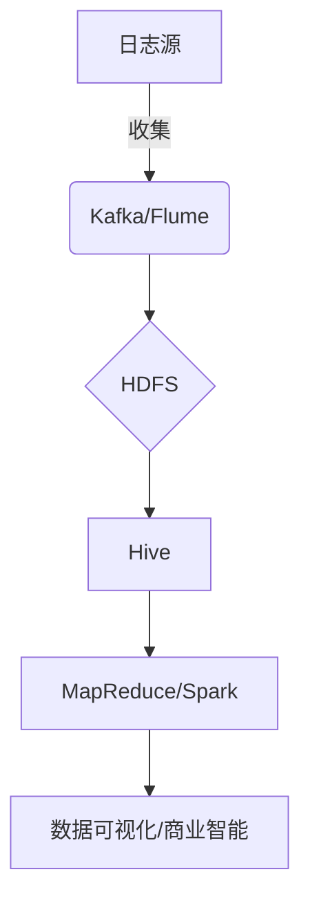

# HiveQL在日志分析中的应用

## 1.背景介绍

### 1.1 日志分析的重要性

在当今数字时代,日志数据无处不在。无论是网站访问日志、应用程序日志、安全日志还是系统日志,它们都记录了系统运行的宝贵信息。通过分析这些日志数据,我们可以了解用户行为模式、系统性能瓶颈、潜在安全威胁等,从而优化系统、改进用户体验、提高安全性。因此,日志分析成为了数据分析的一个重要组成部分。

### 1.2 大数据时代的日志分析挑战

随着业务系统的复杂化和用户量的激增,日志数据也呈现出海量、多样、动态等特点,对传统的日志分析方式带来了巨大挑战:

- 数据量大:日志数据每天可能达到TB甚至PB级别
- 数据种类多:结构化、半结构化和非结构化数据并存
- 数据动态变化:日志格式、字段随时可能发生变化

传统的关系型数据库已经无法满足大数据时代日志分析的需求,我们需要一种能够高效处理海量数据的新型数据分析架构。

### 1.3 大数据日志分析架构

为了解决大数据时代日志分析的挑战,业界提出了基于Hadoop的大数据日志分析架构,如下图所示:



该架构的核心组件包括:

- 日志收集工具(Kafka/Flume):负责收集各种日志源的数据
- HDFS:作为大数据的存储平台,存储海量日志数据  
- Hive:建立在HDFS之上的数据仓库,为日志数据建立元数据
- MapReduce/Spark:分布式计算框架,用于日志数据的ETL和分析
- 可视化工具:将分析结果以图表等形式呈现给用户

在这个架构中,Hive扮演着关键角色,它使用类SQL的HiveQL语言来管理存储在HDFS上的数据,极大简化了大数据分析的复杂度。

## 2.核心概念与联系

### 2.1 Hive概述

Apache Hive是建立在Hadoop之上的数据仓库基础构件,它将结构化的数据文件映射为一张数据库表,并提供类SQL的查询语言HiveQL来管理这些数据。Hive的本质是将HiveQL转化为MapReduce任务在Hadoop上执行。

Hive最大的优势在于使用熟悉的SQL语法进行大数据分析,降低了大数据分析的门槛。同时,Hive的容错性、可扩展性和统一的元数据管理,使其成为大数据分析的有力工具。

### 2.2 Hive与日志分析

Hive天生就是为结构化数据分析而设计的,而日志数据通常是半结构化或非结构化的。因此,在使用Hive进行日志分析之前,需要先对日志数据进行适当的结构化处理。常见的处理方式包括:

- 使用正则表达式或Grok模式从非结构化日志中提取结构化字段
- 将半结构化日志数据加载到Hive表中,利用Hive的Schema-on-Read特性
- 将日志数据转换为统一的列式存储格式(Parquet/ORC),以提高查询性能

经过结构化处理后,日志数据就可以在Hive中进行各种分析操作,如:

- 使用HiveQL进行数据统计、数据挖掘等分析
- 利用Hive的分区和存储桶功能优化查询性能  
- 结合UDF(用户自定义函数)实现个性化的分析需求
- 通过与机器学习框架(如Spark MLlib)集成,进行更高级的日志分析

## 3.核心算法原理具体操作步骤  

虽然Hive的设计初衷并非面向日志分析,但通过一些技巧和最佳实践,我们可以充分利用Hive强大的数据分析能力应用于日志分析场景。本节将介绍使用Hive进行日志分析的核心算法原理和具体操作步骤。

### 3.1 日志数据ETL

在将日志数据加载到Hive之前,需要先进行数据抽取(Extract)、转换(Transform)和加载(Load)等ETL过程,以确保数据的结构化和清洗。

1. **数据抽取**

   - 从各种日志源(如服务器日志文件、Kafka Topic等)收集原始日志数据
   - 可使用Flume、Logstash等工具实现日志数据的收集和传输

2. **数据转换**

   - 对非结构化和半结构化日志数据进行解析和转换,提取所需字段
   - 可使用正则表达式、Grok模式等方式从日志中解析出结构化字段
   - 对日志数据进行过滤、去重、字段转换等数据清洗操作

3. **数据加载**

   - 将清洗后的结构化日志数据加载到HDFS上的Hive表中
   - 可选择合适的文件格式,如Parquet、ORC等列式存储格式
   - 设置合理的分区和存储桶策略,优化查询性能

以Web服务器访问日志为例,ETL过程可以使用类似于下面的方式实现:

```java
// 使用Java编写的Flume Sink,将Nginx访问日志解析为结构化数据并写入HDFS
public class NginxLogSink extends AbstractSink {
  // ...
  public Status process() {
    Channel channel = getChannel();
    Transaction tx = channel.getTransaction();
    tx.begin();
    try {
      Event event = channel.take();
      String log = new String(event.getBody());
      // 使用正则表达式解析Nginx访问日志
      Pattern pattern = Pattern.compile(...);
      Matcher matcher = pattern.matcher(log);
      if (matcher.matches()) {
        // 提取结构化字段
        String remoteAddr = matcher.group(1);
        String timeLocal = matcher.group(2);
        String request = matcher.group(3);
        // ...
        
        // 将结构化数据写入HDFS
        Path hdfsPath = new Path("/nginx/logs/" + datePartition);
        FSDataOutputStream out = fs.create(hdfsPath);
        // 写入数据
        tx.commit();
      }
    } catch (Exception e) {
      tx.rollback();
    } finally {
      tx.close();
    }
    return Status.READY;
  }
}
```

### 3.2 Hive表设计

在Hive中对日志数据建模时,需要考虑以下几个关键因素:

- **模式演化**:日志格式可能会随时发生变化,因此需要选择灵活的数据格式
- **查询性能**:通过分区、存储桶等策略优化查询性能
- **数据生命周期**:设置合理的数据保留策略,避免存储资源浪费

一种常见的设计模式是使用Schema-on-Read的方式,将半结构化日志数据直接加载到Hive表中,并在查询时动态解析数据结构。以Nginx访问日志为例:

```sql
-- 创建外部表,指定数据格式为文本文件
CREATE EXTERNAL TABLE nginx_logs (
  log STRING
)
PARTITIONED BY (date_partition STRING)
STORED AS TEXTFILE
LOCATION '/nginx/logs';

-- 加载数据到分区
LOAD DATA INPATH '/nginx/logs/2023-05-30' INTO TABLE nginx_logs PARTITION (date_partition='2023-05-30');

-- 在查询时使用正则表达式解析日志
SELECT 
  regexp_extract(log, '^(\\d+.\\d+.\\d+.\\d+)\\s', 1) AS remote_addr,
  regexp_extract(log, '\\[(\\d+/\\w+/\\d+:\\d+:\\d+:\\d+\\s\\+\\d+)\\]', 1) AS time_local,
  regexp_extract(log, '"(\\S+)\\s?(\\S+)?\\s?(\\S+)?"', 1) AS request
FROM nginx_logs
WHERE date_partition = '2023-05-30'
LIMIT 10;
```

通过这种设计,我们可以在不改变表结构的情况下,适应日志格式的变化,同时利用分区提高查询效率。

### 3.3 HiveQL查询优化

对于大规模的日志数据集,单纯的全表扫描将导致查询性能低下。因此,需要利用Hive的一些特性对查询进行优化:

1. **分区查询**

   - 按日期、小时等字段对日志数据进行分区存储
   - 在查询时利用分区修剪,只扫描所需的数据分区

   ```sql
   SELECT count(*) 
   FROM nginx_logs
   WHERE date_partition = '2023-05-30'
     AND hour = 10;
   ```

2. **存储桶**

   - 对数据进行存储桶(Bucketing)处理,将具有相同哈希值的行存储在同一个文件中
   - 配合分区,可以"跳过"不需要的数据文件,减少I/O

3. **向量化查询引擎**

   - Hive 3.0引入了全新的向量化查询引擎Vectorized Query Execution
   - 通过批处理和SIMD指令,大幅提升了查询性能

4. **成本优化**

   - 使用Hive的成本优化器(CBO),根据统计信息选择最优的查询计划
   - 定期使用ANALYZE TABLE命令收集统计信息

5. **JOB优化**

   - 合理设置Job级别的配置参数,如mapper/reducer数量、JVM重用等
   - 避免不必要的Job,利用Hive的向量化查询、CBO等特性

通过上述优化手段,我们可以最大限度地提升Hive在日志分析场景下的查询性能。

## 4.数学模型和公式详细讲解举例说明

在日志分析过程中,我们常常需要使用一些数学模型和公式来发现数据中的模式和规律。以下是一些常见的数学模型和公式,以及它们在日志分析中的应用。

### 4.1 指数平滑模型

指数平滑模型是一种时间序列分析和预测模型,常用于平滑噪声数据、预测未来趋势。在日志分析中,我们可以使用指数平滑模型来预测未来的日志流量、错误率等指标。

指数平滑模型的公式如下:

$$
S_t = \alpha Y_t + (1 - \alpha) S_{t-1}
$$

其中:
- $S_t$是时间t的平滑值
- $Y_t$是时间t的实际观测值
- $\alpha$是平滑系数,取值范围0到1
- $S_{t-1}$是前一时间点的平滑值

平滑系数$\alpha$决定了新观测值对平滑值的影响程度。$\alpha$越大,模型对新数据的反应越敏感;$\alpha$越小,模型对历史数据的依赖越大。

在Hive中,我们可以使用用户自定义函数(UDF)来实现指数平滑模型,例如:

```sql
CREATE TEMPORARY FUNCTION exp_smooth AS 'com.example.udf.ExpSmoothing';

WITH logs AS (
  SELECT 
    date_partition,
    count(*) AS log_count
  FROM nginx_logs
  GROUP BY date_partition
)
SELECT
  date_partition,
  log_count,
  exp_smooth(log_count, 0.3, lag(exp_smooth, 1) OVER (ORDER BY date_partition)) AS smoothed
FROM logs
ORDER BY date_partition;
```

上述查询计算了每天的日志数量,并使用指数平滑模型对其进行平滑,从而更好地观察日志流量的趋势。

### 4.2 相关性分析

在日志分析中,我们常常需要发现不同事件或指标之间的相关性。相关性分析可以帮助我们识别潜在的因果关系,从而优化系统性能、改进用户体验等。

常用的相关性分析方法包括:

- **皮尔逊相关系数**

  皮尔逊相关系数用于测量两个变量之间的线性相关程度,取值范围为-1到1。公式如下:

  $$
  r = \frac{\sum_{i=1}^{n}(x_i - \bar{x})(y_i - \bar{y})}{\sqrt{\sum_{i=1}^{n}(x_i - \bar{x})^2\sum_{i=1}^{n}(y_i - \bar{y})^2}}
  $$

- **斯皮尔曼等级相关系数**

  斯皮尔曼相关系数用于测量两个变量之间的单调相关程度,适用于非线性关系。公式如下:

  $$
  \rho = 1 - \frac{6\sum d_i^2}{n(n^2 - 1)}
  $$

  