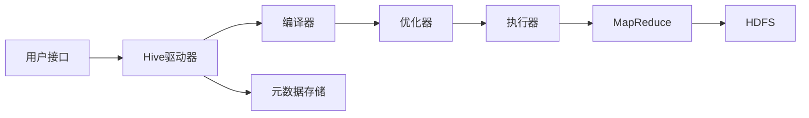

# Hive原理与代码实例讲解

## 1.背景介绍

### 1.1 大数据处理的挑战
在当今大数据时代,企业每天都会产生海量的数据。如何高效地存储、管理和分析这些数据,成为了企业面临的重大挑战。传统的关系型数据库已经无法满足大数据处理的需求,因此诞生了一系列大数据处理技术和框架。

### 1.2 Hadoop生态系统
Hadoop作为开源的分布式计算平台,为大数据处理提供了可靠的基础设施。Hadoop生态系统包含了多个组件,如HDFS分布式文件系统、MapReduce分布式计算框架等。然而,直接使用Hadoop进行数据分析仍然存在一定的挑战,需要开发人员掌握Java等编程语言,并了解MapReduce编程模型。

### 1.3 Hive的诞生
为了简化大数据分析的过程,Facebook开发了Hive项目。Hive提供了一种类SQL的查询语言HiveQL,允许用户以声明式的方式进行数据查询和分析。Hive将HiveQL查询转换为MapReduce作业,在Hadoop集群上执行,从而实现了大数据的高效处理。

## 2.核心概念与联系

### 2.1 Hive与Hadoop的关系
Hive构建在Hadoop之上,利用HDFS存储数据,使用MapReduce执行查询。Hive为Hadoop生态系统提供了数据仓库的功能,使得数据分析变得更加简单和高效。

### 2.2 HiveQL与SQL的区别
HiveQL是Hive提供的类SQL查询语言,语法与标准SQL类似。然而,HiveQL还支持一些特有的语法和数据类型,如分区表、桶表、数组、映射等。HiveQL查询会被Hive编译器转换为一系列的MapReduce作业。

### 2.3 Hive的元数据存储
Hive使用关系型数据库(如MySQL、Derby)存储元数据信息,包括表的定义、分区、字段类型等。元数据存储为Hive提供了表和数据的管理功能,方便用户进行数据查询和操作。

### 2.4 Hive架构概览
Hive的整体架构可以分为以下几个组件:
- 用户接口:CLI命令行、Beeline、Hive Server2等
- 元数据存储:存储Hive表和分区等元数据信息 
- Hive驱动器:解析HiveQL查询,生成执行计划
- 执行引擎:将HiveQL转换为MapReduce任务提交到Hadoop集群运行



## 3.核心算法原理具体操作步骤

### 3.1 HiveQL查询处理流程
Hive处理HiveQL查询的主要步骤如下:

1. 语法解析:Antlr定义HiveQL的语法规则,完成词法和语法解析,生成抽象语法树AST
2. 语义分析:遍历AST,检查表和字段是否存在,生成查询块QB
3. 逻辑计划生成:遍历QB,翻译为内部的操作符OperatorTree
4. 优化逻辑计划:逻辑层优化器进行逻辑优化,如列剪枝、谓词下推等
5. 物理计划生成:将逻辑计划转换为物理计划,生成MapReduce任务
6. 优化物理计划:物理层优化器进行MapReduce任务的优化
7. 执行任务:将优化后的MapReduce任务提交到Hadoop集群运行

### 3.2 查询优化技术
Hive采用了一系列查询优化技术来提升查询性能,主要包括:

- 列剪枝:分析查询中使用的列,过滤掉不需要的列,减少数据读取和网络传输
- 分区剪枝:根据查询中的分区条件,过滤掉不需要扫描的分区,减少MapReduce任务数量 
- 谓词下推:将过滤条件尽可能下推到数据源,减少处理的数据量
- 连接优化:选择合适的连接算法,如Map Join、SMB Join等,提高连接效率
- 矢量化执行:批量处理数据,减少虚拟函数调用,提高执行效率

### 3.3 数据存储与压缩
Hive支持多种数据存储格式,如TextFile、SequenceFile、ORC、Parquet等。不同的存储格式在存储效率、查询性能等方面各有优势。此外,Hive还支持多种压缩编码,如Gzip、Snappy、Zlib等,可以显著减少数据存储空间和I/O开销。

## 4.数学模型和公式详细讲解举例说明

### 4.1 Hive中的数据模型
Hive使用类似于关系型数据库的表结构来组织和存储数据。一个Hive表可以形式化定义为一个五元组:

$$Table = (TableName, Columns, PartitionKeys, Buckets, StorageDescriptor)$$

其中:
- $TableName$: 表名
- $Columns$: 表的字段定义,包括字段名和数据类型
- $PartitionKeys$: 分区字段列表
- $Buckets$: 分桶数量
- $StorageDescriptor$: 存储描述信息,如存储格式、压缩编码等

### 4.2 Hive的数据类型系统
Hive支持丰富的数据类型,包括基本数据类型和复杂数据类型。基本数据类型包括:
- TINYINT、SMALLINT、INT、BIGINT
- FLOAT、DOUBLE  
- BOOLEAN
- STRING、VARCHAR、CHAR
- TIMESTAMP、DATE

复杂数据类型包括:
- ARRAY: 有序的同类型元素集合,如 `ARRAY<INT>`
- MAP: 键值对集合,如 `MAP<STRING, INT>` 
- STRUCT: 字段集合,可以包含不同类型的字段,如 `STRUCT<name:STRING, age:INT>`

### 4.3 Hive的内存计算公式
Hive在执行MapReduce任务时,需要为Map和Reduce任务分配适当的内存资源。Hive提供了一些配置参数来控制内存的分配,主要包括:

- `mapreduce.map.memory.mb`: 单个Map任务的内存上限,默认为1024MB
- `mapreduce.reduce.memory.mb`: 单个Reduce任务的内存上限,默认为1024MB
- `mapreduce.map.java.opts`: Map任务的JVM参数,用于设置堆内存大小等
- `mapreduce.reduce.java.opts`: Reduce任务的JVM参数

Map和Reduce任务的实际可用内存可以用以下公式估算:

$MapMemory = mapreduce.map.memory.mb - MapOverhead$
$ReduceMemory = mapreduce.reduce.memory.mb - ReduceOverhead$

其中,`MapOverhead`和`ReduceOverhead`表示Map和Reduce任务的内存开销,包括JVM元数据、线程栈等。一般建议将`MapMemory`和`ReduceMemory`的80%作为JVM堆内存的大小。

## 5.项目实践：代码实例和详细解释说明

### 5.1 创建Hive表
下面的代码演示了如何在Hive中创建一个用户访问日志表:

```sql
CREATE TABLE user_logs (
  user_id STRING,
  visit_time TIMESTAMP, 
  page_url STRING
)
PARTITIONED BY (dt STRING)
ROW FORMAT DELIMITED
FIELDS TERMINATED BY ','
STORED AS TEXTFILE;
```

说明:
- 使用`CREATE TABLE`语句创建一个名为`user_logs`的表
- 表有三个字段:`user_id`、`visit_time`、`page_url`,分别表示用户ID、访问时间、页面URL
- 使用`PARTITIONED BY`子句指定按照日期`dt`字段进行分区
- 使用`ROW FORMAT`子句指定字段之间使用逗号分隔
- 使用`STORED AS`子句指定以文本格式存储数据

### 5.2 加载数据到Hive表
可以使用`LOAD DATA`语句将数据文件加载到Hive表中:

```sql
LOAD DATA INPATH '/path/to/user_logs.txt' 
INTO TABLE user_logs
PARTITION (dt='2023-05-01');
```

说明:
- 使用`LOAD DATA INPATH`语句从HDFS路径`/path/to/user_logs.txt`加载数据文件
- 使用`INTO TABLE`子句指定加载数据到`user_logs`表中
- 使用`PARTITION`子句指定数据文件对应的分区`dt='2023-05-01'`

### 5.3 HiveQL查询示例
下面是一些常见的HiveQL查询示例:

1. 统计每个用户的访问次数:
```sql
SELECT user_id, COUNT(*) AS visit_count 
FROM user_logs
WHERE dt = '2023-05-01'
GROUP BY user_id;
```

2. 查询访问次数最多的Top10用户:
```sql
SELECT user_id, COUNT(*) AS visit_count
FROM user_logs 
WHERE dt = '2023-05-01'
GROUP BY user_id
ORDER BY visit_count DESC
LIMIT 10;
```

3. 按照小时统计页面访问量:
```sql
SELECT 
  FROM_UNIXTIME(UNIX_TIMESTAMP(visit_time), 'yyyy-MM-dd HH') AS hour,
  page_url,
  COUNT(*) AS pv
FROM user_logs
WHERE dt = '2023-05-01' 
GROUP BY hour, page_url;
```

## 6.实际应用场景

Hive在许多实际场景中得到广泛应用,主要包括:

### 6.1 数据仓库
Hive是构建数据仓库的理想工具。企业可以将来自不同来源的数据(如日志、业务数据库、爬虫数据等)导入到Hive表中,建立数据仓库。Hive提供了灵活的数据组织方式(如分区、分桶),以及强大的HiveQL支持各种复杂的分析查询。

### 6.2 数据分析
Hive可以用于各种数据分析任务,如用户行为分析、流量分析、业务指标统计等。分析人员可以使用HiveQL进行交互式查询和数据探索,快速从海量数据中挖掘有价值的信息和洞察。

### 6.3 数据挖掘
Hive可以与机器学习和数据挖掘算法结合,实现大规模的数据挖掘。例如,可以使用Hive进行特征工程,然后将结果输出到其他机器学习平台(如Spark MLlib)进行模型训练和预测。

### 6.4 数据ETL
Hive可以作为ETL(数据提取、转换、加载)工具,完成数据的清洗、转换和集成。通过HiveQL,可以方便地进行数据过滤、聚合、连接等操作,将原始数据转换为适合分析的结构化数据。

## 7.工具和资源推荐

### 7.1 Hive相关工具
- Beeline:基于JDBC的Hive命令行客户端,提供交互式查询功能
- Hue:基于Web的Hadoop用户界面,提供了Hive编辑器和查询功能
- Zeppelin:基于Web的交互式数据分析笔记本,支持Hive查询和可视化

### 7.2 Hive学习资源
- 官方文档:https://cwiki.apache.org/confluence/display/Hive 
- Hive官方教程:https://cwiki.apache.org/confluence/display/Hive/Tutorial
- 《Programming Hive》:详细介绍了Hive编程和优化的书籍
- 《Hive编程指南》:国内Hive专家编写的Hive实战指南

### 7.3 Hive社区与讨论
- Hive官方邮件列表:用户可以通过订阅邮件列表参与Hive相关的讨论和问题解答
- Stack Overflow:提出Hive相关的问题,Hive专家和爱好者会提供解答和建议
- Hive JIRA:提交Hive相关的bug报告和改进建议,参与Hive的开发和维护

## 8.总结：未来发展趋势与挑战

### 8.1 Hive的发展趋势
- 更好的交互式查询支持:Hive社区正在持续优化Hive的交互式查询能力,如Hive on Tez、Hive on Spark等
- 更丰富的SQL语义支持:Hive不断完善对标准SQL的支持,提供更加灵活和强大的分析功能
- 更好的存储格式支持:Hive将支持更多高效的列式存储格式,如ORC、Parquet等,进一步提升查询性能
- 更智能的查询优化:Hive优化器将变得更加智能,自动选择最优的查询执行计划,减少用户的优化工作