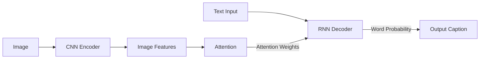

# Image Captioning原理与代码实例讲解

## 1.背景介绍

### 1.1 什么是Image Captioning?

Image Captioning是一种机器学习任务,旨在根据给定的图像自动生成相关的文本描述。它融合了计算机视觉和自然语言处理两大领域,是人工智能领域的一个热门研究方向。

Image Captioning的应用场景非常广泛,例如:

- 辅助视障人士理解图像内容
- 为图像添加描述性标题和元数据,提高图像可检索性
- 自动为社交媒体上传的图片生成描述
- 辅助自动化图像理解和分析

### 1.2 Image Captioning的挑战

尽管Image Captioning看似简单,但实际上是一个极具挑战的任务:

- 需要同时理解图像中的对象、属性、场景和语义关系
- 需要将视觉信息映射到自然语言描述
- 需要处理语言的多样性和模糊性

### 1.3 发展历程

早期的Image Captioning系统主要基于规则和模板,效果有限。近年来,受益于深度学习的发展,Image Captioning取得了长足进步。主要技术路线包括:

- 使用卷积神经网络(CNN)提取图像特征
- 使用循环神经网络(RNN)生成文本描述 
- 结合注意力机制提高描述质量
- 引入高级知识库和常识推理

## 2.核心概念与联系

### 2.1 CNN与图像特征提取

卷积神经网络(CNN)在计算机视觉任务中表现出色,能够从图像中提取出丰富的视觉特征。常用的CNN模型包括VGGNet、ResNet、Inception等。

CNN将输入图像经过多层卷积、池化等操作,最终输出一个特征向量,捕捉图像的语义内容。这个特征向量将作为Image Captioning模型的输入。

### 2.2 RNN与序列建模

循环神经网络(RNN)擅长对序列数据建模,可用于生成文本描述。RNN每个时刻的输出不仅取决于当前输入,还与前一状态有关,从而能捕捉上下文信息。

常用的RNN变体包括LSTM和GRU,能有效缓解梯度消失/爆炸问题。Image Captioning中,RNN将图像特征作为初始输入,然后逐步生成文本序列。

### 2.3 注意力机制

传统的Image Captioning模型将整个图像编码为一个固定长度的特征向量,然后解码生成描述。这种做法丢失了图像的细节信息。

注意力机制允许模型在生成每个单词时,自适应地关注图像的不同区域。这种选择性关注有助于产生更准确、更丰富的描述。

### 2.4 多模态融合

Image Captioning需要将视觉和语言两种模态融合。主要的融合策略有:

1. **Early Fusion**: 在输入时将图像特征和文本特征拼接
2. **Late Fusion**: 分别编码图像和文本,在高层融合
3. **Parallel Co-Attention**: 在注意力层实现跨模态的交互

不同融合策略的优劣取决于具体任务和模型架构。

### 2.5 评估指标

常用的Image Captioning评估指标包括:

- **BLEU**: 基于n-gram的精确度指标
- **METEOR**: 基于词语匹配的评分
- **CIDEr**: 考虑n-gram的新颖性
- **SPICE**: 基于语义推理的评估

这些自动评估指标并不完美,需要结合人工评估来全面衡量描述质量。

## 3.核心算法原理具体操作步骤  

现代Image Captioning系统通常采用编码器-解码器(Encoder-Decoder)架构,结合注意力机制。我们以一种典型的模型架构为例,介绍其核心算法原理和操作步骤。



### 3.1 CNN编码器

1) 将输入图像 $I$ 输入到预训练的CNN中,例如ResNet
2) 在CNN的某一层(如res5c)提取特征张量 $V \in \mathbb{R}^{D \times H \times W}$, 其中$D$是特征通道数,$H,W$是特征图的高度和宽度
3) $V$编码了图像中不同区域的语义特征,将用于后续的注意力机制

### 3.2 RNN解码器

1) 初始化RNN(如LSTM)的隐藏状态和单元状态
2) 将起始符号`<start>`作为第一个输入,输入到RNN
3) 在每个时间步:
    a. 通过注意力机制计算上下文向量(详见3.3)
    b. 将上下文向量与RNN的输出拼接
    c. 通过全连接层和softmax,预测下一个单词的概率分布
    d. 从概率分布中采样一个单词,作为下一时间步的输入
4) 重复步骤3,直到生成终止符号`<end>`或达到最大长度

### 3.3 注意力机制

1) 对图像特征张量$V$的每个位置$(i,j)$,计算其注意力权重 $\alpha_{ij}$:

$$\alpha_{ij} = \text{softmax}(f(V_{ij}, h_t))$$

其中$f$是一个评分函数,可以是简单的向量点乘或多层感知机。$h_t$是RNN在时间步$t$的隐藏状态。

2) 计算加权平均的上下文向量 $c_t$:

$$c_t = \sum_{i=1}^H \sum_{j=1}^W \alpha_{ij} V_{ij}$$

3) 将上下文向量$c_t$与RNN的输出$h_t$拼接,作为预测单词概率的输入。

通过注意力机制,模型能够自适应地关注图像的不同区域,从而生成更准确、更丰富的描述。

## 4.数学模型和公式详细讲解举例说明

Image Captioning模型中涉及到多个数学模型和公式,我们对其中的关键部分进行详细讲解和举例说明。

### 4.1 CNN特征提取

卷积神经网络(CNN)是Image Captioning中提取图像特征的核心模块。我们以VGG16网络为例,介绍其基本原理。

VGG16由13个卷积层和3个全连接层组成。卷积层的作用是提取图像的局部特征,例如边缘、纹理等。全连接层则将这些局部特征组合,形成全局的图像表示。

卷积层的数学表达式为:

$$
V_{ij}^{l} = f\left(\sum_{m} \sum_{n} W_{mn}^{l} \cdot V_{i+m,j+n}^{l-1} + b^l\right)
$$

其中:
- $V_{ij}^l$是第$l$层的特征图在$(i,j)$位置的值
- $W_{mn}^l$是第$l$层的卷积核权重
- $b^l$是第$l$层的偏置项
- $f$是非线性激活函数,如ReLU

通过多层卷积和池化操作,CNN能够学习到图像的分层次特征表示,捕捉不同级别的视觉模式。

例如,对于下图,VGG16网络能够检测到图中的狗、草地等元素,并将其编码到最终的特征向量中。


### 4.2 RNN语言模型

在Image Captioning中,RNN(如LSTM)被用于建模文本序列,生成自然语言描述。我们以LSTM为例,介绍其数学原理。

LSTM的核心思想是使用门控机制来控制信息的流动,从而缓解传统RNN的梯度消失/爆炸问题。LSTM的更新公式为:

$$
\begin{aligned}
f_t &= \sigma(W_f \cdot [h_{t-1}, x_t] + b_f) &\text{(Forget Gate)}\\
i_t &= \sigma(W_i \cdot [h_{t-1}, x_t] + b_i) &\text{(Input Gate)}\\
\tilde{C}_t &= \tanh(W_C \cdot [h_{t-1}, x_t] + b_C) &\text{(Candidate)}\\
C_t &= f_t \odot C_{t-1} + i_t \odot \tilde{C}_t &\text{(Cell State)}\\
o_t &= \sigma(W_o \cdot [h_{t-1}, x_t] + b_o) &\text{(Output Gate)}\\
h_t &= o_t \odot \tanh(C_t) &\text{(Hidden State)}
\end{aligned}
$$

其中:
- $f_t, i_t, o_t$分别是遗忘门、输入门和输出门,控制信息的流动
- $C_t$是细胞状态,用于传递长期依赖信息
- $h_t$是隐藏状态,作为LSTM的输出
- $\sigma$是sigmoid激活函数,控制门的开合程度
- $\odot$表示元素级别的向量乘积

通过门控机制,LSTM能够有效地捕捉长期依赖关系,从而更好地建模自然语言序列。

例如,对于句子"A brown dog is playing on the grass",LSTM能够利用上下文信息正确生成每个单词,而不会受到句子长度的影响。

### 4.3 注意力机制

注意力机制是Image Captioning中的关键创新,允许模型在生成每个单词时,自适应地关注图像的不同区域。我们对其数学原理进行详细说明。

假设图像特征张量为$V \in \mathbb{R}^{D \times H \times W}$,RNN在时间步$t$的隐藏状态为$h_t$。注意力权重的计算公式为:

$$\alpha_{ij}^t = \frac{\exp(e_{ij}^t)}{\sum_{i'=1}^H \sum_{j'=1}^W \exp(e_{i'j'}^t)}$$

$$e_{ij}^t = f(V_{ij}, h_t)$$

其中$f$是一个评分函数,用于衡量图像位置$(i,j)$与当前隐藏状态$h_t$的相关性。常用的评分函数包括:

1. **点乘评分**:
   $$f(V_{ij}, h_t) = V_{ij}^\top W_v h_t$$
   其中$W_v$是一个可学习的权重矩阵。

2. **多层感知机评分**:
   $$f(V_{ij}, h_t) = w^\top \tanh(W_v V_{ij} + W_h h_t + b)$$
   其中$W_v, W_h, w, b$都是可学习的参数。

通过注意力权重$\alpha_{ij}^t$,我们可以计算加权平均的上下文向量$c_t$:

$$c_t = \sum_{i=1}^H \sum_{j=1}^W \alpha_{ij}^t V_{ij}$$

$c_t$编码了图像中与当前隐藏状态最相关的视觉信息,将与RNN的输出$h_t$拼接,用于预测下一个单词。

例如,在生成"A brown dog"时,注意力机制会关注图像中狗所在的区域;而生成"is playing on the grass"时,则会关注草地区域。这种自适应关注有助于生成更准确的描述。

## 5.项目实践:代码实例和详细解释说明

为了加深对Image Captioning原理的理解,我们提供一个基于PyTorch的代码实例,并对关键部分进行详细解释。完整代码可在GitHub上获取。

### 5.1 数据预处理

我们使用广为人知的COCO数据集进行训练和评估。COCO数据集包含超过20万张图像,每张图像都有5个人工标注的描述。

```python
# 加载COCO数据集
train_loader = get_coco_loader(mode='train')
val_loader = get_coco_loader(mode='val')

# 构建词典
vocab = build_vocab(train_loader)
```

我们首先加载训练集和验证集,然后基于训练集构建词典`vocab`。`vocab`将单词映射为唯一的索引,用于模型的输入和输出。

### 5.2 CNN编码器

我们使用预训练的ResNet-101作为CNN编码器,从图像中提取特征张量。

```python
import torchvision.models as models

# 加载预训练的ResNet-101
encoder = models.resnet101(pretrained=True)

# 删除最后一层的全连接层
modules = list(encoder.children())[:-1]
encoder = nn.Sequential(*modules)

# 冻结