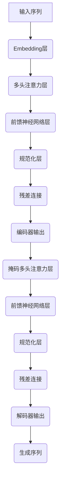

# InstructGPT原理与代码实例讲解

## 1.背景介绍

### 1.1 人工智能的发展历程

人工智能(Artificial Intelligence, AI)是一个旨在使机器能够模仿人类智能行为的研究领域。自20世纪50年代诞生以来,AI经历了几个重要的发展阶段。

#### 1.1.1 早期阶段

早期的AI系统主要集中在特定领域的专家系统和基于规则的系统上。这些系统依赖于人工编写的规则和知识库,能够解决特定问题,但缺乏通用性和学习能力。

#### 1.1.2 机器学习时代

20世纪80年代,机器学习(Machine Learning, ML)的兴起标志着AI进入了新的阶段。机器学习算法能够从数据中自动学习模式和规律,不再完全依赖人工编写的规则。这极大提高了AI系统的泛化能力和适应性。

#### 1.1.3 深度学习浪潮

21世纪初,深度学习(Deep Learning)技术的兴起,使得AI在计算机视觉、自然语言处理等领域取得了突破性进展。深度神经网络能够自动从大量数据中学习特征表示,显著提高了AI系统的性能。

### 1.2 大语言模型的兴起

随着计算能力和数据量的不断增长,大型神经网络在自然语言处理任务上展现出了惊人的能力。2018年,OpenAI推出了GPT(Generative Pre-trained Transformer)语言模型,能够生成看似人类写作的连贯文本。2020年,GPT-3进一步扩大了模型规模,展现出更强大的语言生成能力。

然而,这些大型语言模型存在着"言无旨"的问题,即它们虽然能生成流畅的语言,但缺乏对语境和任务的理解。为了解决这一问题,InstructGPT应运而生。

### 1.3 InstructGPT的产生

InstructGPT是一种新型的大语言模型,旨在通过指令学习(Instruction Learning)来赋予语言模型更强的任务理解和执行能力。与传统语言模型不同,InstructGPT在训练过程中接受了大量的任务指令和人类反馈,使其能够更好地理解和执行各种指令。

InstructGPT的出现标志着大语言模型向通用人工智能(Artificial General Intelligence, AGI)迈进了一步。它不仅能够生成流畅的自然语言,还能够根据指令完成特定任务,展现出更高层次的理解和推理能力。

## 2.核心概念与联系

### 2.1 自然语言处理(Natural Language Processing, NLP)

自然语言处理是人工智能的一个重要分支,旨在使计算机能够理解和生成人类语言。InstructGPT作为一种大型语言模型,其核心就是基于NLP技术。

#### 2.1.1 语言表示

要让计算机理解自然语言,首先需要将语言转换为计算机可以处理的数值表示形式。常见的语言表示方法包括one-hot编码、词嵌入(Word Embedding)和子词嵌入(Subword Embedding)等。

#### 2.1.2 语言模型

语言模型是NLP的基础,它旨在预测下一个词或字符的概率。传统的语言模型包括N-gram模型和神经网络语言模型等。InstructGPT则是一种基于Transformer的大型神经网络语言模型。

#### 2.1.3 预训练与微调

为了提高语言模型的性能,通常需要在大量无标注数据上进行预训练,获得良好的初始参数。之后,可以在有标注的任务数据上进行微调(Fine-tuning),使模型适应特定任务。InstructGPT就是通过这种方式在大量指令数据上训练而来。

### 2.2 Transformer架构

Transformer是一种全新的基于注意力机制(Attention Mechanism)的神经网络架构,它彻底改变了序列数据(如自然语言)的处理方式。



#### 2.2.1 自注意力机制

自注意力机制允许每个位置的输出与输入序列的其他位置相关联,捕获长距离依赖关系。这种全局关注机制是Transformer的核心创新。

#### 2.2.2 多头注意力

多头注意力将注意力机制扩展到多个不同的"注视方向",从不同的表示子空间捕获不同的相关性,提高了模型的表达能力。

#### 2.2.3 编码器-解码器架构

Transformer采用了编码器-解码器架构,编码器对输入序列进行编码,解码器则根据编码器的输出生成目标序列。InstructGPT主要使用了解码器部分。

### 2.3 指令学习(Instruction Learning)

指令学习是InstructGPT的核心创新,它旨在赋予语言模型更强的任务理解和执行能力。

#### 2.3.1 指令数据集

指令数据集包含了大量的任务指令及其对应的输出示例。例如,"将以下句子翻译成中文: ..."、"对以下代码进行错误修复: ..."等。

#### 2.3.2 指令条件语言模型

InstructGPT是一种指令条件语言模型,它在生成过程中不仅考虑上下文,还考虑了给定的任务指令。模型的目标是最大化给定指令下的输出序列概率。

#### 2.3.3 人类反馈

在训练过程中,InstructGPT会收集人类对其输出的反馈,并将这些反馈纳入训练过程,不断优化模型的指令理解和执行能力。这种人类反馈机制是指令学习的关键。

## 3.核心算法原理具体操作步骤

InstructGPT的核心算法原理基于Transformer解码器和指令条件语言模型,具体操作步骤如下:

1. **输入处理**:将任务指令和上下文输入序列转换为token embeddings。

2. **指令编码**:使用Transformer编码器对任务指令进行编码,获得指令表示。

3. **上下文编码**:使用掩码的Transformer解码器对上下文输入序列进行编码,获得上下文表示。

4. **交叉注意力**:在解码器的每一层,上下文表示会通过交叉注意力机制与指令表示进行融合。

5. **生成过程**:基于融合后的表示,解码器逐步生成输出序列的token。在每一步,模型会根据已生成的token、上下文表示和指令表示,预测下一个token的概率分布。

6. **损失计算**:将模型生成的输出序列与真实标签序列进行比较,计算交叉熵损失。

7. **模型优化**:使用优化算法(如Adam)根据损失值更新模型参数。

8. **人类反馈**(可选):收集人类对模型输出的反馈,并将这些反馈纳入训练过程,进一步优化模型。

上述过程在大量指令数据上反复迭代,最终得到能够理解和执行各种指令的InstructGPT模型。

## 4.数学模型和公式详细讲解举例说明

### 4.1 Transformer模型

Transformer模型的核心是自注意力(Self-Attention)机制,它能够捕捉输入序列中任意两个位置之间的依赖关系。给定一个长度为n的输入序列 $X = (x_1, x_2, \dots, x_n)$,自注意力机制首先计算出查询(Query)、键(Key)和值(Value)向量:

$$
\begin{aligned}
Q &= XW^Q\\
K &= XW^K\\
V &= XW^V
\end{aligned}
$$

其中 $W^Q$、$W^K$ 和 $W^V$ 分别是可学习的查询、键和值的线性投影矩阵。

然后,计算查询和所有键之间的点积,对其进行缩放并应用软最大值函数,得到注意力权重:

$$
\text{Attention}(Q, K, V) = \text{softmax}\left(\frac{QK^T}{\sqrt{d_k}}\right)V
$$

其中 $d_k$ 是键的维度,用于防止较大的点积导致梯度饱和。

多头注意力(Multi-Head Attention)机制则是将自注意力机制扩展到多个不同的"注视方向",捕捉不同的相关性:

$$
\text{MultiHead}(Q, K, V) = \text{Concat}(head_1, \dots, head_h)W^O
$$

$$
\text{where } head_i = \text{Attention}(QW_i^Q, KW_i^K, VW_i^V)
$$

其中 $W_i^Q$、$W_i^K$、$W_i^V$ 和 $W^O$ 都是可学习的线性投影矩阵。

基于自注意力和多头注意力机制,Transformer模型能够有效地捕捉输入序列中的长距离依赖关系,为序列建模任务提供了强大的表示能力。

### 4.2 指令条件语言模型

InstructGPT是一种指令条件语言模型,它在生成过程中不仅考虑上下文,还考虑了给定的任务指令。给定一个任务指令 $I$ 和上下文输入 $X$,模型的目标是最大化条件概率 $P(Y|X, I)$,其中 $Y$ 是期望的输出序列。

根据链式法则,我们可以将条件概率分解为:

$$
P(Y|X, I) = \prod_{t=1}^{|Y|} P(y_t|y_{<t}, X, I)
$$

其中 $y_t$ 是输出序列的第 $t$ 个token, $y_{<t}$ 表示前 $t-1$ 个token。

在Transformer解码器的每一层,上下文表示 $H_X$ 会通过交叉注意力机制与指令表示 $H_I$ 进行融合:

$$
\tilde{H}_X = \text{CrossAttention}(H_X, H_I, H_I)
$$

融合后的表示 $\tilde{H}_X$ 会被用于预测下一个token的概率分布:

$$
P(y_t|y_{<t}, X, I) = \text{softmax}(W_o\tilde{H}_X[:, t] + b_o)
$$

其中 $W_o$ 和 $b_o$ 是可学习的线性投影参数。

通过上述方式,InstructGPT能够基于任务指令和上下文生成相应的输出序列。在训练过程中,模型会最小化真实标签序列与生成序列之间的交叉熵损失,不断优化参数。

## 5.项目实践:代码实例和详细解释说明

以下是一个使用PyTorch实现的简化版InstructGPT模型示例,用于说明其核心代码结构和流程。

```python
import torch
import torch.nn as nn

# 定义Transformer编码器和解码器
class TransformerEncoder(nn.Module):
    ...

class TransformerDecoder(nn.Module):
    ...

# 定义InstructGPT模型
class InstructGPT(nn.Module):
    def __init__(self, vocab_size, d_model, nhead, num_layers, max_len=512):
        super().__init__()
        self.token_emb = nn.Embedding(vocab_size, d_model)
        self.pos_emb = nn.Embedding(max_len, d_model)
        self.encoder = TransformerEncoder(d_model, nhead, num_layers)
        self.decoder = TransformerDecoder(d_model, nhead, num_layers)
        self.out_proj = nn.Linear(d_model, vocab_size)

    def forward(self, input_ids, inst_ids, labels=None):
        # 编码输入
        input_emb = self.token_emb(input_ids) + self.pos_emb(torch.arange(input_ids.size(1)).repeat(input_ids.size(0), 1))
        inst_emb = self.token_emb(inst_ids) + self.pos_emb(torch.arange(inst_ids.size(1)).repeat(inst_ids.size(0), 1))

        # 编码指令
        inst_enc = self.encoder(inst_emb)

        # 解码输入
        dec_out = self.decoder(input_emb, inst_enc)
        logits = self.out_proj(dec_out)

        # 计算损失
        if labels is not None:
            loss_fct = nn.CrossEntropyLoss()
            loss = loss_fct(logits.view