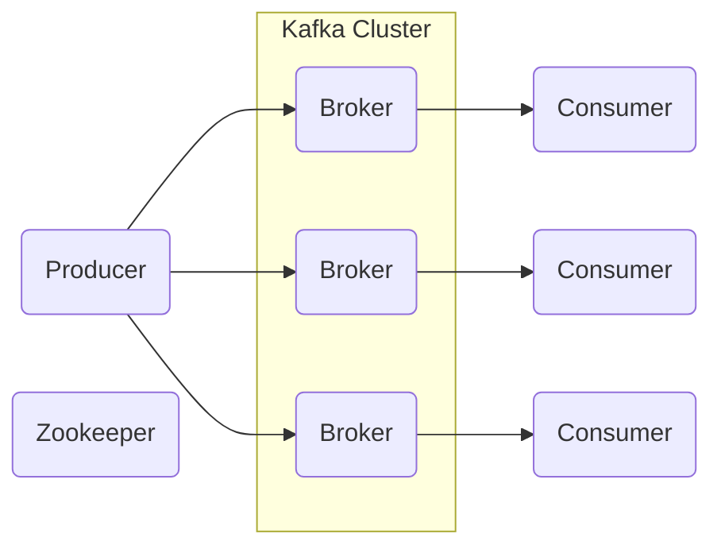
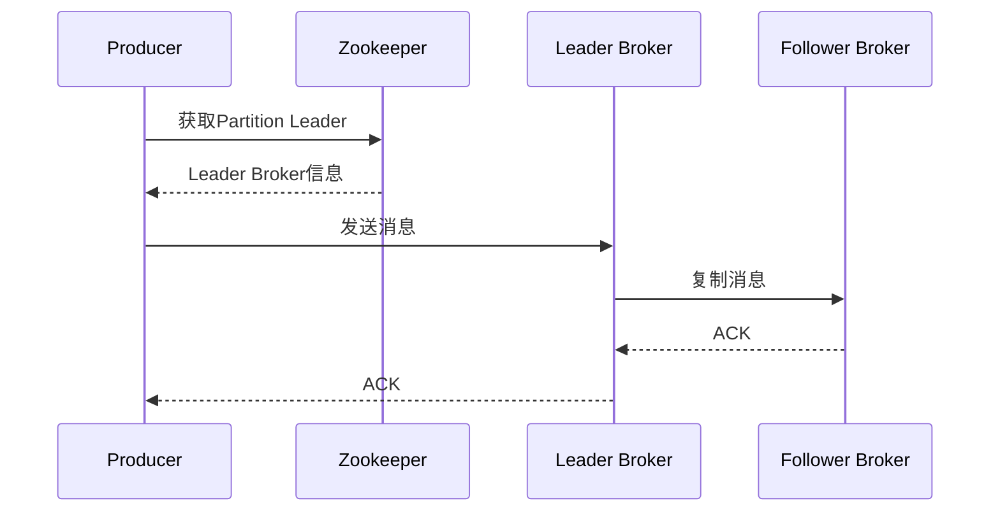
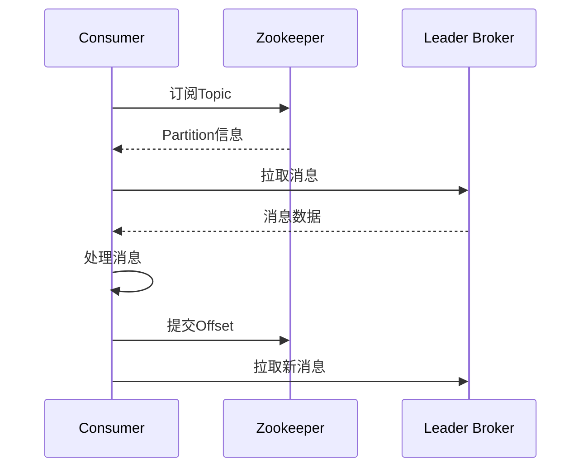
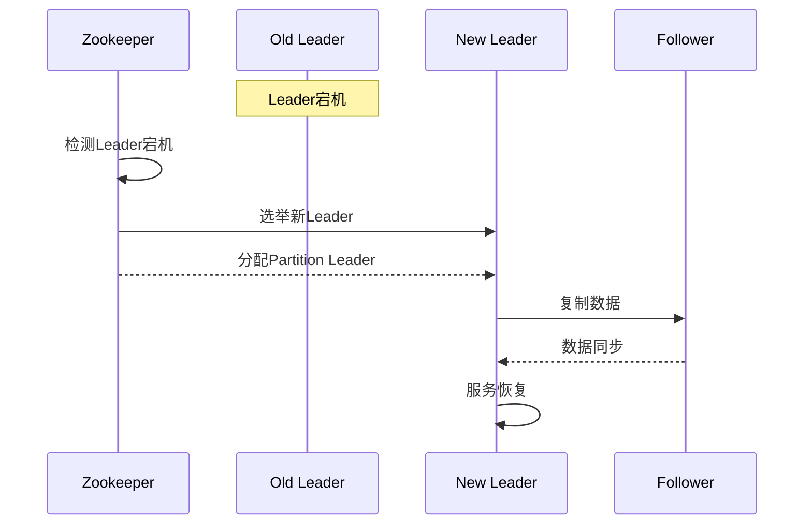

# Kafka Broker原理与代码实例讲解

## 1.背景介绍

### 1.1 什么是Kafka

Apache Kafka是一个分布式流处理平台。它是一个可扩展、高吞吐量、容错的发布-订阅消息系统。Kafka被广泛应用于大数据领域,用于构建实时数据管道和流应用程序。它能够实时处理大量数据,并支持多种编程语言。

### 1.2 Kafka的应用场景

Kafka常用于以下场景:

- **消息队列**: Kafka可用作传统消息队列的替代品,用于解耦生产者和消费者,提高系统的可靠性和可扩展性。
- **日志收集**: Kafka可以收集分布式系统中的日志数据,用于后续的数据处理和分析。
- **流处理**: Kafka可以作为流处理应用的数据源,支持实时数据处理和分析。
- **事件源(Event Sourcing)**: Kafka可以存储事件数据,支持事件驱动架构。

### 1.3 Kafka的优势

Kafka相比传统消息队列具有以下优势:

- **高吞吐量**: Kafka能够以TB/小时的速率处理海量数据。
- **可扩展性**: Kafka集群可以通过添加更多broker节点来线性扩展。
- **持久性**: Kafka会将消息持久化到磁盘,保证数据不会丢失。
- **容错性**: Kafka支持自动故障转移和数据复制,确保高可用性。
- **低延迟**: Kafka的延迟通常在毫秒级别。

## 2.核心概念与联系

### 2.1 Kafka架构

Kafka的架构由以下几个核心组件组成:

- **Producer(生产者)**: 向Kafka集群发送消息的客户端。
- **Consumer(消费者)**: 从Kafka集群读取消息的客户端。
- **Broker**: Kafka集群中的节点,用于存储和处理消息。
- **Topic**: 消息的逻辑分类,类似于数据库中的表。
- **Partition**: Topic被分割为多个Partition,每个Partition在集群中有多个副本。
- **Replication(复制)**: 为了容错,Partition会在集群中复制多个副本。
- **Zookeeper**: 用于管理和协调Kafka集群。



### 2.2 核心概念解释

- **Topic和Partition**

Topic是消息的逻辑分类,类似于数据库中的表。为了提高吞吐量和容错性,Topic被分割为多个Partition,每个Partition在集群中有多个副本。消息按照指定的分区策略(如按Key哈希)被发送到不同的Partition。

- **Producer和Consumer**

Producer是向Kafka集群发送消息的客户端,Consumer是从Kafka集群读取消息的客户端。Producer可以选择发送消息到指定的Partition,或由Kafka自动分配Partition。Consumer会订阅一个或多个Topic,并从相应的Partition中读取消息。

- **Broker和Replication**

Broker是Kafka集群中的节点,用于存储和处理消息。每个Broker会存储一部分Partition的数据。为了容错,Partition会在集群中复制多个副本,这些副本分布在不同的Broker上。当某个Broker宕机时,其他Broker上的副本可以接管工作,确保数据不丢失。

- **Zookeeper**

Zookeeper是Kafka集群的协调者,用于管理和监控整个集群。它负责存储Broker、Topic、Partition等元数据信息,并协调Leader选举和故障转移等操作。

## 3.核心算法原理具体操作步骤

### 3.1 消息发送流程

Producer发送消息到Kafka集群的流程如下:

1. **选择Partition**

Producer根据指定的分区策略(如按Key哈希)选择将消息发送到哪个Partition。如果未指定分区策略,Kafka会自动平衡消息到不同的Partition。

2. **查找Partition Leader**

Producer从Zookeeper获取该Partition的Leader Broker信息。

3. **发送消息到Leader Broker**

Producer将消息发送到Leader Broker。Leader Broker会将消息写入本地磁盘,并将消息复制到其他Follower Broker。

4. **等待ACK**

Producer等待Leader Broker的ACK响应。ACK策略有以下几种:
   - `0`: 不等待ACK,最快但最不安全。
   - `1`: 等待Leader Broker的ACK,中等延迟和可靠性。
   - `-1`(all): 等待Leader Broker和所有Follower Broker的ACK,最慢但最安全。

5. **发送成功或失败**

收到ACK后,Producer认为消息发送成功。如果超时未收到ACK,Producer会重试发送或返回错误。



### 3.2 消息消费流程

Consumer从Kafka集群消费消息的流程如下:

1. **订阅Topic**

Consumer向Zookeeper发送订阅请求,订阅一个或多个Topic。

2. **获取Partition信息**

Zookeeper返回Topic的Partition信息,包括每个Partition的Leader Broker。

3. **向Leader Broker拉取消息**

Consumer根据Partition信息,向相应的Leader Broker拉取消息。

4. **处理消息**

Consumer处理拉取到的消息,并将消费位移(Offset)提交给Kafka。

5. **重新拉取**

Consumer周期性地向Leader Broker拉取新的消息。



### 3.3 故障转移

当Leader Broker宕机时,Kafka会自动进行故障转移,选举一个新的Leader:

1. **Leader Broker宕机**

Zookeeper检测到Leader Broker宕机。

2. **选举新Leader**

Zookeeper从该Partition的Follower Broker中选举一个新的Leader。

3. **分配Partition**

Zookeeper将该Partition的Leader权限分配给新Leader。

4. **复制数据**

新Leader从其他Follower Broker复制数据,确保数据一致性。

5. **恢复服务**

新Leader开始接收Producer的请求和Consumer的拉取,服务恢复正常。



## 4.数学模型和公式详细讲解举例说明

### 4.1 分区策略

Kafka提供了多种分区策略,用于将消息均匀分布到不同的Partition。常用的分区策略包括:

- **按Key哈希**

$$hash(key) \% numPartitions$$

根据消息Key的哈希值对Partition数量取模,将消息分配到不同的Partition。这种策略可以保证具有相同Key的消息被发送到同一个Partition,有利于消息的顺序性。

- **按值范围**

$$\frac{value - minValue}{maxValue - minValue} \times numPartitions$$

根据消息值在指定范围内的比例,将消息分配到不同的Partition。这种策略常用于基于数值的分区,如按时间范围分区。

- **随机分区**

$$random(0, numPartitions - 1)$$

随机将消息分配到不同的Partition。这种策略可以实现最大程度的负载均衡,但无法保证消息的顺序性。

### 4.2 复制因子

Kafka使用复制因子(Replication Factor)来确保数据的可靠性和容错性。复制因子表示每个Partition应该有多少个副本。

假设一个Topic有N个Partition,复制因子为R,那么总的副本数量为:

$$totalReplicas = N \times R$$

这些副本会均匀分布在Kafka集群的不同Broker上。当某个Broker宕机时,只要有一个副本存活,就可以继续提供服务,从而实现高可用性。

通常情况下,复制因子应该设置为一个较小的奇数值(如3),以避免"脑裂"(Brain Split)问题。当复制因子为偶数时,可能出现两个相等的多数派,导致数据不一致。

## 5.项目实践:代码实例和详细解释说明

### 5.1 Producer示例

以下是一个使用Java编写的Kafka Producer示例:

```java
Properties props = new Properties();
props.put("bootstrap.servers", "localhost:9092");
props.put("key.serializer", "org.apache.kafka.common.serialization.StringSerializer");
props.put("value.serializer", "org.apache.kafka.common.serialization.StringSerializer");

Producer<String, String> producer = new KafkaProducer<>(props);

for (int i = 0; i < 100; i++) {
    String message = "Message " + i;
    ProducerRecord<String, String> record = new ProducerRecord<>("topic1", message);
    producer.send(record);
}

producer.flush();
producer.close();
```

1. 首先创建一个`Properties`对象,配置Kafka Broker地址和序列化器。
2. 创建一个`KafkaProducer`实例,传入配置参数。
3. 使用循环发送100条消息到"topic1"。每条消息使用`ProducerRecord`封装,并通过`send`方法发送。
4. 调用`flush`方法确保所有消息被发送。
5. 最后关闭Producer。

### 5.2 Consumer示例

以下是一个使用Java编写的Kafka Consumer示例:

```java
Properties props = new Properties();
props.put("bootstrap.servers", "localhost:9092");
props.put("group.id", "group1");
props.put("key.deserializer", "org.apache.kafka.common.serialization.StringDeserializer");
props.put("value.deserializer", "org.apache.kafka.common.serialization.StringDeserializer");

KafkaConsumer<String, String> consumer = new KafkaConsumer<>(props);
consumer.subscribe(Collections.singletonList("topic1"));

while (true) {
    ConsumerRecords<String, String> records = consumer.poll(Duration.ofMillis(100));
    for (ConsumerRecord<String, String> record : records) {
        System.out.println("Received message: " + record.value());
    }
}
```

1. 创建一个`Properties`对象,配置Kafka Broker地址、消费者组ID和反序列化器。
2. 创建一个`KafkaConsumer`实例,传入配置参数。
3. 调用`subscribe`方法订阅"topic1"。
4. 使用无限循环不断拉取消息。每次调用`poll`方法从Kafka拉取新的消息批次。
5. 遍历消息批次,打印每条消息的内容。

## 6.实际应用场景

Kafka在实际应用中有广泛的应用场景,例如:

### 6.1 实时数据管道

Kafka可以作为实时数据管道,将数据从各种来源(如日志文件、数据库、传感器等)收集并传输到下游系统进行处理和分析。例如,Kafka可以将网站日志实时传输到Hadoop或Spark进行离线分析,或传输到流处理系统(如Apache Storm或Apache Flink)进行实时分析。

### 6.2 消息队列

Kafka可以作为高性能、可扩展的消息队列,用于解耦生产者和消费者。生产者将消息发送到Kafka,消费者从Kafka拉取消息进行处理。这种架构可以提高系统的可靠性和灵活性,并支持异步通信和负载均衡。

### 6.3 事件源(Event Sourcing)

在事件源架构中,应用程序的状态是通过一系列不可变事件来捕获和持久化的。Kafka可以作为事件存储,持久化所有应用程序事件。应用程序可以从Kafka读取事件流,重建状态或执行其他操作。

### 6.4 物联网(IoT)

在物联网领域,大量的传感器和设备会产生海量的数据流。Kafka可以作为物联网数据管道,实时收集和处理来自各种设备的数据,并将数据