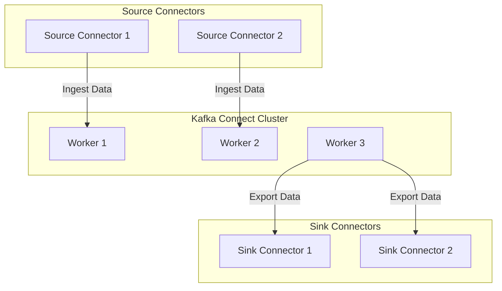
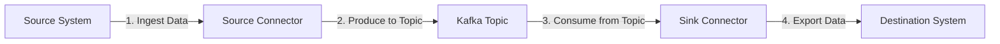
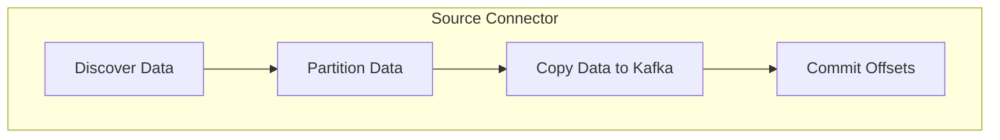
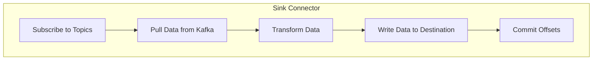
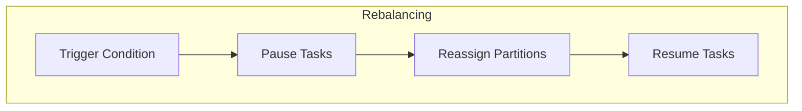

# Kafka Connect 原理与代码实例讲解

## 1. 背景介绍

### 1.1 数据集成的挑战

在当今的数据驱动世界中,企业需要从各种异构数据源(如数据库、消息队列、文件系统等)中获取数据,并将其集成到数据湖或数据仓库中进行分析和处理。然而,这种数据集成过程通常是一项艰巨的任务,需要开发人员编写大量的定制代码来处理不同数据源的特殊要求和格式。

### 1.2 Kafka Connect 的作用

Apache Kafka Connect 旨在简化这一过程,提供了一种可插拔的框架,允许开发人员创建和运行可重用的连接器(Connectors),用于在 Kafka 和其他数据系统之间移动大量数据。Connect 可以无缝地将数据从各种源系统复制到 Kafka 主题(Source Connectors),或者从 Kafka 主题导出数据到外部系统(Sink Connectors)。

### 1.3 Kafka Connect 的优势

使用 Kafka Connect 可以带来以下优势:

- **可扩展性**: 可以轻松地扩展和分布式运行连接器,以满足不断增长的数据量需求。
- **容错性**: 连接器可以自动从错误中恢复,并在必要时重新启动,确保数据传输的可靠性。
- **集中管理**: 通过 REST API 或 UI,可以集中管理和监控所有连接器的运行状态。
- **可插拔架构**: 开发人员可以轻松地开发和部署自定义连接器,以满足特定的数据集成需求。

## 2. 核心概念与联系

### 2.1 Kafka Connect 架构

Kafka Connect 由两个核心组件组成:

1. **Worker**: 运行实际连接器实例的进程。每个 Worker 都由一个或多个任务(Task)组成,每个任务负责执行连接器的一部分工作。
2. **Connector**: 定义了如何从特定数据源或目标系统获取或发送数据的逻辑。每个连接器由一个或多个任务(Task)组成。



### 2.2 Kafka Connect 工作流程

Kafka Connect 的工作流程如下:

1. **Source Connectors** 从外部系统读取数据,并将其发送到 Kafka 主题。
2. **Kafka 主题**充当一个可靠的数据缓冲区,存储从各种源系统收集的数据。
3. **Sink Connectors** 从 Kafka 主题消费数据,并将其写入到目标系统(如数据库、文件系统等)。



### 2.3 Kafka Connect 配置

Kafka Connect 的配置主要包括以下几个部分:

- **Worker 配置**: 定义 Worker 进程的行为,如内部主题名称、偏移量存储位置等。
- **Connector 配置**: 指定连接器的属性,如数据源或目标系统的连接信息、转换规则等。
- **Converter 配置**: 控制数据在 Kafka 主题中的序列化和反序列化格式。

这些配置可以通过属性文件或 REST API 进行管理和更新。

## 3. 核心算法原理具体操作步骤 

### 3.1 Source Connector 工作原理

Source Connector 的工作原理如下:

1. **发现数据**: 连接器任务(Task)与外部数据源建立连接,并发现需要复制的数据。
2. **分区数据**: 将发现的数据划分为一个或多个分区(Partition),每个分区由一个任务处理。
3. **复制数据**: 每个任务从分配给它的分区中读取数据,并将其发送到 Kafka 主题的特定分区。
4. **提交偏移量**: 任务定期将它们的位置(偏移量)提交到一个特殊的 Kafka 主题,以便在出现故障时可以恢复。



### 3.2 Sink Connector 工作原理

Sink Connector 的工作原理如下:

1. **订阅主题**: 连接器任务订阅 Kafka 主题的一个或多个分区。
2. **拉取数据**: 每个任务从分配给它的分区中拉取数据。
3. **转换数据**: 根据配置,任务可以对数据进行转换或过滤。
4. **写入目标**: 任务将转换后的数据写入到目标系统。
5. **提交偏移量**: 任务定期将它们的位置(偏移量)提交到一个特殊的 Kafka 主题,以便在出现故障时可以恢复。



### 3.3 Rebalancing 机制

当 Kafka Connect 集群中的 Worker 实例数量发生变化时,需要对任务进行重新分配,这个过程称为 Rebalancing。Rebalancing 的过程如下:

1. **触发条件**: 当有新的 Worker 加入或离开集群时,会触发 Rebalancing。
2. **暂停任务**: 所有正在运行的任务都会被暂停。
3. **重新分配分区**: 基于新的 Worker 实例数量,重新计算每个任务应该处理的分区。
4. **恢复任务**: 根据新的分区分配,恢复任务的执行,从上次提交的偏移量继续处理数据。



## 4. 数学模型和公式详细讲解举例说明

在 Kafka Connect 中,为了实现高效的数据复制和负载均衡,引入了一些数学模型和公式。

### 4.1 分区分配算法

Kafka Connect 使用一种基于一致性哈希的分区分配算法,将主题分区均匀地分配给 Worker 实例。该算法可以确保在 Worker 实例数量发生变化时,只有一小部分分区需要被重新分配,从而最小化了数据移动和重新平衡的开销。

假设有 $N$ 个 Worker 实例和 $P$ 个主题分区,我们需要将这些分区均匀地分配给每个 Worker。首先,我们将 Worker 实例和主题分区都映射到一个环形哈希空间中。然后,按顺时针方向遍历哈希环,将每个分区分配给第一个遇到的 Worker 实例。

具体来说,对于每个主题分区 $p$,我们计算它的哈希值 $h(p)$。同样,对于每个 Worker 实例 $w$,我们计算它的哈希值 $h(w)$。然后,我们找到距离 $h(p)$ 最近且大于 $h(p)$ 的 $h(w)$,将分区 $p$ 分配给对应的 Worker 实例 $w$。

这种分配方式可以保证,当 Worker 实例数量发生变化时,只有一小部分分区需要被重新分配。例如,如果一个新的 Worker 实例加入集群,只有那些位于新 Worker 哈希值和下一个 Worker 哈希值之间的分区需要被重新分配。

### 4.2 任务并行度计算

Kafka Connect 允许为每个连接器配置任务并行度(Task Count),即每个连接器可以运行多少个并行任务。合理配置任务并行度可以提高数据复制的吞吐量和效率。

任务并行度的计算公式如下:

$$
\text{Task Count} = \max\left\{\min\left(\text{max_tasks}, \left\lceil\frac{\text{data_volume}}{\text{target_data_per_task}}\right\rceil\right), 1\right\}
$$

其中:

- $\text{max_tasks}$ 是连接器配置中指定的最大任务数。
- $\text{data_volume}$ 是需要复制的数据量(例如,主题分区数量或表行数)。
- $\text{target_data_per_task}$ 是每个任务期望处理的数据量。

这个公式确保任务并行度不会超过 $\text{max_tasks}$ 的限制,同时也不会小于 1。当数据量较大时,任务并行度会相应增加,以提高处理效率。

例如,如果我们有一个 Kafka 主题包含 100 个分区,并且配置了 $\text{max_tasks}=10$、$\text{target_data_per_task}=8$,那么计算得到的任务并行度为:

$$
\text{Task Count} = \max\left\{\min\left(10, \left\lceil\frac{100}{8}\right\rceil\right), 1\right\} = \max\{10, 13\} = 13
$$

在这种情况下,连接器将启动 10 个并行任务,每个任务处理 10 个分区。

## 5. 项目实践: 代码实例和详细解释说明

在本节中,我们将通过一个具体的示例项目,展示如何使用 Kafka Connect 从 MySQL 数据库中读取数据,并将其写入到 Elasticsearch 中进行全文搜索。

### 5.1 环境准备

首先,我们需要准备以下环境:

- Kafka 集群
- MySQL 数据库
- Elasticsearch 集群

为了简化操作,我们可以使用 Docker Compose 来快速启动这些服务。以下是一个示例 `docker-compose.yml` 文件:

```yaml
version: '3'
services:
  zookeeper:
    image: confluentinc/cp-zookeeper:6.2.0
    hostname: zookeeper
    ports:
      - "2181:2181"
    environment:
      ZOOKEEPER_CLIENT_PORT: 2181
      ZOOKEEPER_TICK_TIME: 2000

  kafka:
    image: confluentinc/cp-kafka:6.2.0
    hostname: kafka
    ports:
      - "9092:9092"
    depends_on:
      - zookeeper
    environment:
      KAFKA_BROKER_ID: 1
      KAFKA_ZOOKEEPER_CONNECT: zookeeper:2181
      KAFKA_ADVERTISED_LISTENERS: PLAINTEXT://kafka:9092
      KAFKA_OFFSETS_TOPIC_REPLICATION_FACTOR: 1

  mysql:
    image: mysql:8.0
    hostname: mysql
    ports:
      - "3306:3306"
    environment:
      MYSQL_ROOT_PASSWORD: mysqlpw

  elasticsearch:
    image: elasticsearch:7.17.3
    hostname: elasticsearch
    ports:
      - "9200:9200"
      - "9300:9300"
    environment:
      discovery.type: single-node
      ES_JAVA_OPTS: "-Xms512m -Xmx512m"

  connect:
    image: confluentinc/cp-kafka-connect:6.2.0
    hostname: connect
    ports:
      - "8083:8083"
    depends_on:
      - kafka
      - mysql
      - elasticsearch
    environment:
      CONNECT_BOOTSTRAP_SERVERS: "kafka:9092"
      CONNECT_REST_ADVERTISED_HOST_NAME: connect
      CONNECT_GROUP_ID: compose-connect-group
      CONNECT_CONFIG_STORAGE_TOPIC: docker-connect-configs
      CONNECT_OFFSET_STORAGE_TOPIC: docker-connect-offsets
      CONNECT_STATUS_STORAGE_TOPIC: docker-connect-status
      CONNECT_KEY_CONVERTER: org.apache.kafka.connect.json.JsonConverter
      CONNECT_VALUE_CONVERTER: org.apache.kafka.connect.json.JsonConverter
      CONNECT_INTERNAL_KEY_CONVERTER: "org.apache.kafka.connect.json.JsonConverter"
      CONNECT_INTERNAL_VALUE_CONVERTER: "org.apache.kafka.connect.json.JsonConverter"
      