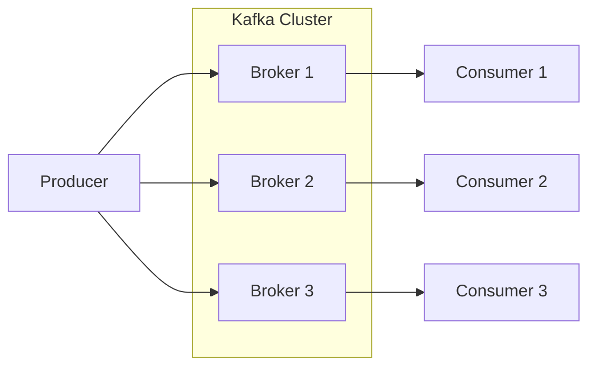
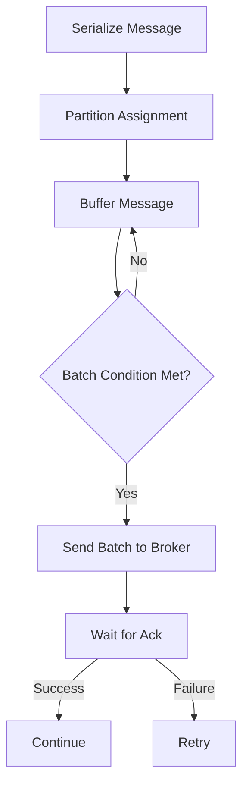

# Kafka Producer原理与代码实例讲解

## 1.背景介绍

Apache Kafka是一个分布式流处理平台,它提供了一个统一、高吞吐、低延迟的平台,用于处理实时数据源。Kafka被广泛应用于日志收集、消息系统、数据管道、流式处理、事件源等场景。作为Kafka的核心组件之一,Producer(生产者)负责将数据发送到Kafka集群中。本文将深入探讨Kafka Producer的工作原理,并通过代码示例帮助读者更好地理解其内部机制。

### 1.1 Kafka架构概览

在深入探讨Kafka Producer之前,让我们先简单了解一下Kafka的整体架构。Kafka集群由一个或多个Broker组成,每个Broker存储一部分分区(Partition)。Topic是Kafka中的逻辑概念,表示一个数据流,它由多个分区组成。Producer将消息发送到指定的Topic,而Consumer则从Topic中消费消息。



### 1.2 Kafka Producer的作用

Kafka Producer的主要作用是将数据发送到Kafka集群中。它负责将消息分发到指定的Topic,并确保消息被成功写入到Broker中的日志文件中。Producer还提供了一些高级功能,如批量发送、压缩、分区策略等,以提高性能和可靠性。

## 2.核心概念与联系

### 2.1 Producer配置

在创建Kafka Producer之前,需要进行一些配置。常用的配置选项包括:

- `bootstrap.servers`: Kafka集群的Broker地址列表。
- `key.serializer`: 用于序列化消息键的序列化器。
- `value.serializer`: 用于序列化消息值的序列化器。
- `acks`: 指定Producer需要等待的确认数量,以确保消息被成功写入。
- `batch.size`: 批量发送消息的大小。
- `linger.ms`: 延迟发送消息的时间,以便进行批量发送。
- `compression.type`: 指定消息压缩类型。

### 2.2 发送消息流程

Kafka Producer发送消息的基本流程如下:

1. 将消息键和值序列化为字节数组。
2. 根据分区策略确定消息应该发送到哪个分区。
3. 将消息缓存到内存缓冲区中。
4. 当达到批量发送条件(如批量大小或延迟时间)时,将消息批量发送到Broker。
5. 根据配置的`acks`值,等待Broker的确认响应。
6. 如果发送成功,则继续发送下一批消息;否则,根据重试策略进行重试。



### 2.3 分区策略

Kafka Producer需要决定将消息发送到哪个分区。默认情况下,Kafka提供了以下几种分区策略:

- 随机分区策略: 随机选择一个分区。
- 键分区策略: 根据消息键的哈希值选择分区。
- 轮询分区策略: 按顺序依次选择分区。

除了默认策略外,用户还可以自定义分区策略,以满足特定的需求。

### 2.4 消息确认机制

为了确保消息被成功写入,Kafka提供了三种确认级别(`acks`):

- `acks=0`: 生产者不等待任何来自Broker的确认,这种模式具有最高的吞吐量,但存在数据丢失的风险。
- `acks=1`: 生产者只需要等待Leader副本的确认,这种模式提供了较好的吞吐量和数据可靠性的平衡。
- `acks=all`: 生产者需要等待所有副本的确认,这种模式提供了最高的数据可靠性,但吞吐量较低。

## 3.核心算法原理具体操作步骤

### 3.1 消息发送流程

Kafka Producer发送消息的核心算法流程如下:

1. **序列化消息**

   Producer首先需要将消息键和值序列化为字节数组。Kafka提供了多种内置的序列化器,如`StringSerializer`、`ByteArraySerializer`等。用户也可以自定义序列化器以满足特定的需求。

2. **选择分区**

   根据配置的分区策略,Producer需要决定将消息发送到哪个分区。如果使用键分区策略,Producer会计算消息键的哈希值,并将其映射到特定的分区。如果没有提供键,则使用其他策略,如随机或轮询策略。

3. **缓存消息**

   序列化后的消息将被缓存到内存缓冲区中。Producer会根据配置的`batch.size`和`linger.ms`参数,确定何时将缓冲区中的消息批量发送。

4. **获取元数据**

   在发送消息之前,Producer需要获取Topic的元数据信息,包括分区数量、Leader副本所在的Broker等。如果元数据不存在或过期,Producer会从Broker获取最新的元数据。

5. **发送消息批次**

   当达到批量发送条件时,Producer会将缓冲区中的消息批次发送到Leader副本所在的Broker。

6. **等待确认**

   根据配置的`acks`值,Producer会等待Broker的确认响应。如果在指定的超时时间内没有收到确认,Producer会根据重试策略进行重试。

7. **处理响应**

   如果收到成功的确认响应,Producer会继续发送下一批消息。如果收到失败的响应,Producer会根据错误类型和重试策略决定是否进行重试。

### 3.2 核心算法伪代码

以下是Kafka Producer发送消息的核心算法伪代码:

```
function sendMessage(message):
    serializedMessage = serializeMessage(message)
    partitionId = selectPartition(message)
    appendToBuffer(serializedMessage, partitionId)

    if batchConditionMet():
        batch = getBatchFromBuffer()
        metadata = getMetadata(batch.topic)
        leaderBroker = metadata.getLeaderBroker(batch.partitionId)
        sendBatchToLeader(batch, leaderBroker)
        waitForAcks(batch, acks)

        if ackSuccess:
            commitBatch(batch)
        else:
            handleFailure(batch)

function sendBatchToLeader(batch, leaderBroker):
    while True:
        try:
            sendBatchOverNetwork(batch, leaderBroker)
            return
        except RetriableException:
            refreshMetadata()
            leaderBroker = getLeaderBroker(batch.topic, batch.partitionId)

function waitForAcks(batch, acks):
    if acks == 0:
        return

    while True:
        try:
            response = waitForAcksResponse(batch, timeout)
            if response.error == NoError:
                return
            else:
                handleFailure(batch, response.error)
        except RetriableException:
            refreshMetadata()
```

上述伪代码展示了Kafka Producer发送消息的核心步骤,包括序列化消息、选择分区、缓存消息、获取元数据、发送消息批次、等待确认以及处理响应等。

## 4.数学模型和公式详细讲解举例说明

在Kafka Producer中,有一些重要的数学模型和公式,它们对于理解Producer的性能和行为至关重要。

### 4.1 分区选择

如果使用键分区策略,Producer需要根据消息键计算哈希值,并将其映射到特定的分区。常用的哈希函数是murmur2哈希,它具有良好的分布性和计算效率。

murmur2哈希函数的公式如下:

$$
\begin{align*}
h &= \text{seed} \\
m &= 0x5bd1e995 \\
r &= 24 \\

\qquad\text{for each } x_i \text{ in the key:} \\
k &= x_i \\
k &= k * m \\
k &= k \operatorname{rotl} r \\
k &= k \oplus h \\
h &= h \operatorname{rotl} 13 \\
h &= h * 5 + 0xe6546b64 \\

\qquad\text{return } h
\end{align*}
$$

其中,`seed`是一个初始化种子值,`m`和`r`是常量。`rotl`表示位左移操作,`^`表示按位异或操作。

对于一个给定的消息键,murmur2哈希函数会计算出一个哈希值。然后,Producer会将这个哈希值对分区数量取模,得到目标分区的索引:

$$
\text{partitionId} = \text{murmur2Hash}(key) \bmod \text{numPartitions}
$$

### 4.2 批量发送

为了提高吞吐量,Kafka Producer会将多条消息批量发送。批量发送的大小受`batch.size`和`linger.ms`参数的影响。

假设Producer每秒接收到`n`条消息,每条消息的平均大小为`m`字节。如果`batch.size`设置为`b`字节,`linger.ms`设置为`t`毫秒,则Producer每秒发送的批次数量可以估计为:

$$
\text{batchesPerSecond} = \frac{n \times m}{b} + \frac{1000}{t}
$$

第一项表示由于达到`batch.size`而触发的批次发送,第二项表示由于达到`linger.ms`而触发的批次发送。

如果Producer的发送速率超过了Broker的处理能力,那么Producer会积累更多的消息,从而增加内存使用和延迟。因此,需要根据实际情况调整`batch.size`和`linger.ms`参数,以达到合理的吞吐量和延迟平衡。

## 5.项目实践:代码实例和详细解释说明

为了更好地理解Kafka Producer的工作原理,我们将通过一个简单的Java代码示例来演示如何创建和使用Kafka Producer。

### 5.1 Maven依赖

首先,我们需要在项目中添加Kafka的Maven依赖:

```xml
<dependency>
    <groupId>org.apache.kafka</groupId>
    <artifactId>kafka-clients</artifactId>
    <version>3.3.1</version>
</dependency>
```

### 5.2 创建Kafka Producer

下面是创建Kafka Producer的代码示例:

```java
import org.apache.kafka.clients.producer.KafkaProducer;
import org.apache.kafka.clients.producer.ProducerConfig;
import org.apache.kafka.clients.producer.ProducerRecord;
import org.apache.kafka.common.serialization.StringSerializer;

import java.util.Properties;

public class KafkaProducerExample {
    public static void main(String[] args) {
        // 配置Kafka Producer
        Properties props = new Properties();
        props.put(ProducerConfig.BOOTSTRAP_SERVERS_CONFIG, "localhost:9092");
        props.put(ProducerConfig.KEY_SERIALIZER_CLASS_CONFIG, StringSerializer.class.getName());
        props.put(ProducerConfig.VALUE_SERIALIZER_CLASS_CONFIG, StringSerializer.class.getName());

        // 创建Kafka Producer实例
        KafkaProducer<String, String> producer = new KafkaProducer<>(props);

        // 发送消息
        String topic = "my-topic";
        String key = "key-1";
        String value = "Hello, Kafka!";
        ProducerRecord<String, String> record = new ProducerRecord<>(topic, key, value);
        producer.send(record);

        // 关闭Kafka Producer
        producer.flush();
        producer.close();
    }
}
```

在这个示例中,我们首先配置了Kafka Producer,包括`bootstrap.servers`、`key.serializer`和`value.serializer`。然后,我们创建了一个`KafkaProducer`实例。

接下来,我们构建了一个`ProducerRecord`对象,指定了Topic、消息键和消息值。然后,我们调用`producer.send(record)`方法将消息发送到Kafka集群。

最后,我们调用`producer.flush()`方法确保所有待发送的消息都被发送出去,并调用`producer.close()`方法关闭Kafka Producer。

### 5.3 发送消息并等待确认

在上面的示例中,我们只是简单地发送了一条消息,并没有等待Broker的确认响应。下面的代码示例展示了如何等待确认响应:

```java
import org.apache.kafka.clients.producer.Callback;
import org.apache.kafka.clients.producer.RecordMetadata;

public class KafkaProducerExample {
    public static void main(String[] args) {
        // 配置和创建Kafka Producer...

        // 发送消息并等待确认
        String topic = "my-topic";
        String key = "key-1";
        String value = "Hello, Kafka!";
        ProducerRecord<String, String