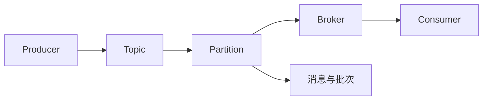

# Kafka原理与代码实例讲解

## 1.背景介绍
### 1.1 Kafka的诞生
在当今大数据时代,数据的实时处理和分析变得越来越重要。Kafka作为一个分布式的流处理平台,诞生于LinkedIn,用于解决海量数据的实时处理问题。它以高吞吐、低延迟、高可靠等特性,成为了流处理领域的佼佼者。

### 1.2 Kafka在业界的地位
Kafka凭借其优秀的性能,已经被广泛应用于各大互联网公司,如LinkedIn、Netflix、Uber等。很多开源项目如Apache Storm、Spark Streaming也将Kafka作为默认的数据源。可以说,Kafka已经成为了流处理领域的事实标准。

### 1.3 Kafka的应用场景
Kafka主要应用于以下几个场景:

- 日志收集:将分布式系统的日志收集起来,便于后续的分析和监控。
- 消息系统:解耦生产者和消费者,缓存消息并保证消息的可靠传输。  
- 流处理:将数据以流的形式发布到Kafka中,然后由流处理框架如Spark Streaming消费并进行实时计算。
- 事件溯源:将应用程序的状态变化作为一系列事件记录在Kafka中,可以方便地重现问题和回滚状态。

## 2.核心概念与联系
### 2.1 Producer与Consumer
在Kafka的生态中,Producer负责生产消息并发布到Kafka中,而Consumer负责从Kafka中消费消息并进行下游处理。Producer和Consumer是完全解耦的,它们之间只通过Kafka进行间接通信。

### 2.2 Topic与Partition
Topic可以看作是一个消息的分类,每个Topic可以被分为多个Partition。Partition是Kafka实现水平扩展的基础,每个Partition可以放在不同的服务器上,从而实现负载均衡。

### 2.3 Broker与集群
一个Kafka集群由多个Broker组成,每个Broker是一个Kafka实例,负责消息的存储和转发。Producer和Consumer只需要连接到任意一个Broker即可,Kafka会自动将请求路由到对应的Broker上。

### 2.4 消息与批次
Kafka的消息是一个键值对,其中Key是可选的。为了提高网络和磁盘效率,Kafka鼓励以批次的方式发送消息。批次就是一组消息的集合,在生产者端,是指一次发送的多条消息;在Broker端,是指一次写入磁盘的多条消息。

### 2.5 概念之间的关系



## 3.核心算法原理具体操作步骤
### 3.1 生产者发送消息的过程
1. 生产者先将消息序列化成字节数组,并指定目标Topic和Partition(如果没指定Partition,则会根据Key进行散列得到一个Partition)
2. 生产者将消息放入一个批次中,当批次满了或者达到了发送时间,就会将批次发送出去  
3. 生产者将批次发送到Kafka集群的某个Broker上,Broker收到后会将消息写入到磁盘上
4. Broker在返回响应前,会等待消息被复制到其他副本上(根据配置的副本数)
5. 生产者收到响应后,会将发送成功的消息从内存中移除,发送失败的消息会重试发送

### 3.2 消费者消费消息的过程
1. 消费者连接到任意一个Broker,并请求关注的Topic和Partition
2. Broker返回该消费者负责的Partition列表,以及每个Partition的起始偏移量  
3. 消费者根据起始偏移量,开始消费每个Partition的消息
4. 消费者在消费完一批消息后,会向Broker发送位移提交请求
5. Broker收到位移提交请求后,会将位移信息记录下来,作为下一次消费的起点

### 3.3 消息的存储与索引
1. Kafka将每个Partition的消息存储在磁盘上,形成一个个Segment文件
2. 每个Segment文件包含了一定数量的消息,当Segment达到一定大小后,会关闭并创建一个新的Segment  
3. Kafka为每个Partition维护了一个索引文件,记录了每个Segment的起始偏移量,以及每个消息的偏移量和大小
4. 当要消费某个偏移量的消息时,Kafka先通过索引文件找到对应的Segment,然后再从Segment中查找具体的消息

## 4.数学模型和公式详细讲解举例说明
### 4.1 生产者吞吐量估算
假设每条消息的大小为 $m$ bytes,批次大小为 $b$ bytes,生产者发送一个批次的延迟为 $d$ ms,则生产者的吞吐量 $T$ 可以估算为:

$$
T = \frac{b}{d} \times \frac{1000}{m} 
$$

例如,如果 $m=1KB$, $b=1MB$, $d=10ms$,则:

$$
T = \frac{1MB}{10ms} \times \frac{1000}{1KB} = 100000 条/秒
$$  

### 4.2 消费者延迟估算
假设消费者每次拉取 $n$ 条消息,每次拉取的延迟为 $d$ ms,消费一条消息的时间为 $t$ ms,则消费者的延迟 $L$ 可以估算为:

$$
L = d + n \times t
$$

例如,如果 $n=1000$, $d=50ms$, $t=1ms$,则:  

$$
L = 50ms + 1000 \times 1ms = 1050ms
$$

## 5.项目实践：代码实例和详细解释说明
下面通过一个简单的Kafka生产者和消费者的Java代码实例,来说明Kafka的基本用法。

### 5.1 生产者代码实例

```java
public class ProducerExample {
    public static void main(String[] args) {
        Properties props = new Properties();
        props.put("bootstrap.servers", "localhost:9092");
        props.put("key.serializer", "org.apache.kafka.common.serialization.StringSerializer");
        props.put("value.serializer", "org.apache.kafka.common.serialization.StringSerializer");
        
        Producer<String, String> producer = new KafkaProducer<>(props);
        
        for (int i = 0; i < 10; i++) {
            producer.send(new ProducerRecord<>("my-topic", "key-" + i, "value-" + i));
        }
        
        producer.close();
    }
}
```

这个例子创建了一个Kafka生产者,并发送了10条消息到名为"my-topic"的Topic中。其中:

- bootstrap.servers指定了连接的Kafka Broker的地址
- key.serializer和value.serializer指定了消息的键和值的序列化方式
- 使用send方法发送ProducerRecord,第一个参数是Topic名称,第二个参数是消息的Key,第三个参数是消息的Value
- 最后要调用close方法关闭生产者,释放资源

### 5.2 消费者代码实例

```java
public class ConsumerExample {
    public static void main(String[] args) {
        Properties props = new Properties();
        props.put("bootstrap.servers", "localhost:9092");
        props.put("group.id", "my-group");
        props.put("key.deserializer", "org.apache.kafka.common.serialization.StringDeserializer");
        props.put("value.deserializer", "org.apache.kafka.common.serialization.StringDeserializer");
        
        Consumer<String, String> consumer = new KafkaConsumer<>(props);
        consumer.subscribe(Arrays.asList("my-topic"));
        
        while (true) {
            ConsumerRecords<String, String> records = consumer.poll(Duration.ofMillis(100));
            for (ConsumerRecord<String, String> record : records) {
                System.out.println("Received message: (" + record.key() + ", " + record.value() + ") at offset " + record.offset());
            }
        }
    }
}
```

这个例子创建了一个Kafka消费者,并订阅了名为"my-topic"的Topic。其中:

- group.id指定了消费者所属的消费组,同一个组的消费者会负载均衡消费
- key.deserializer和value.deserializer指定了消息的键和值的反序列化方式
- 使用subscribe方法订阅Topic,参数是一个Topic的列表
- 在一个无限循环中,使用poll方法拉取消息,参数是一个超时时间
- 遍历拉取到的消息,并打印出消息的偏移量、键和值

## 6.实际应用场景
Kafka在实际项目中有非常广泛的应用,这里举几个典型的例子:

### 6.1 日志收集与监控
Web服务器、应用服务器的日志可以通过Kafka收集起来,然后通过ELK等工具进行分析和监控,及时发现系统问题。

### 6.2 流量监控与实时推荐
电商网站的用户浏览、购买行为可以通过Kafka收集,然后用Spark Streaming等工具进行实时统计和分析,并基于用户画像实时推荐商品。

### 6.3 数据管道与ETL
Kafka可以作为数据在不同系统之间的管道和缓冲,实现数据的解耦和异步处理。比如将数据库的变更事件发送到Kafka中,然后由下游的系统订阅消费,并更新缓存、搜索引擎、数据仓库等。

## 7.工具和资源推荐
### 7.1 Kafka官方文档
Kafka的官方文档是学习和使用Kafka的权威资料,包含了设计原理、使用指南、API文档等。
网址: https://kafka.apache.org/documentation/

### 7.2 Kafka Tool
Kafka Tool是一个Kafka的GUI管理工具,可以查看Topic、Partition、消息,管理Broker、Consumer Group等。
网址: https://www.kafkatool.com/

### 7.3 Kafka Manager
Kafka Manager是Yahoo开源的一个Kafka管理平台,可以管理多个集群,监控Broker状态,查看Topic与Consumer Group等。
网址: https://github.com/yahoo/CMAK

### 7.4 Confluent
Confluent是Kafka的商业化公司,提供了Kafka的收费版本和周边生态工具,如KSQL、Schema Registry等。
网址: https://www.confluent.io/

## 8.总结：未来发展趋势与挑战
### 8.1 云原生化
随着云计算的发展,Kafka也开始向云原生化方向发展。各大云厂商如AWS、阿里云等都推出了托管的Kafka服务。未来Kafka将更多地与Kubernetes等云原生技术结合,实现自动化运维和弹性伸缩。

### 8.2 流批一体化
传统的流处理和批处理是割裂的,导致数据延迟和系统复杂度。未来Kafka将与Flink、Spark等计算引擎深度集成,实现流批一体化处理,简化架构的同时实现端到端的实时性。

### 8.3 数据治理与安全
随着数据规模的增长和数据价值的提升,对Kafka的数据治理与安全提出了更高的要求。未来Kafka将在数据血缘、元数据管理、权限控制、数据加密等方面加强,以满足企业级应用的需求。

### 8.4 机器学习平台化
Kafka作为企业数据中枢,将成为机器学习平台的重要组件。通过Kafka收集数据,并与TensorFlow、PyTorch等机器学习框架集成,可以实现模型的实时训练和推理,赋能智能业务。

## 9.附录：常见问题与解答
### 9.1 Kafka的数据可靠性是如何保证的?
Kafka通过多副本机制保证数据可靠性。每个Partition可以配置多个副本,分布在不同的Broker上。生产者发送消息时,只有当消息被同步到多个副本上后,才认为发送成功。

### 9.2 Kafka的消息是否会丢失?
理论上Kafka可以做到消息不丢失,但是这需要生产者和消费者配合。生产者需要配置acks=-1,确保消息同步到所有副本后再返回。消费者需要关闭自动提交位移,在消息处理成功后再手动提交位移。

### 9.3 Kafka Broker如何实现负载均衡?
Kafka的负载均衡是以Partition为单位的。每个Topic的Partition会均匀分布在集群的各个Broker上,并且每个Partition还可以配置多个副本,进一步分散负载。生产者和消费者只需要连接到任意一个Broker,Kafka会自动路由请求。

### 9.4 Kafka如何实现消息的有序性?
Kafka只能保证同一个Partition内的消息是有序的。生产者发送消息时,可以指定Partition,或者通过Key散列到某个Partition,从而实现局部有序。消费者消费消息时